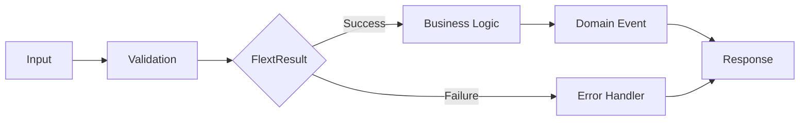

# flext-core

**Foundation library providing railway-oriented programming, dependency injection, and domain-driven design patterns for the FLEXT ecosystem.**

## Overview

FLEXT Core is the architectural foundation for FLEXT data integration ecosystem projects. It provides type-safe error handling, practical patterns, and clean architecture principles that eliminate common boilerplate and ensure consistency across ecosystem projects.

> **Note**: For verified capabilities and API examples, see [ACTUAL_CAPABILITIES.md](docs/ACTUAL_CAPABILITIES.md)

### Key Features

- 🚂 **Railway-Oriented Programming** - Type-safe error handling with `FlextResult[T]` pattern
- 💉 **Dependency Injection** - DI container with singleton management
- 🏛️ **Domain-Driven Design** - Basic entities, value objects, and aggregates
- 🎯 **Clean Architecture** - Clear separation between layers and concerns
- 🔒 **Type Safety** - MyPy strict mode with proper type hints
- 📊 **Structured Logging** - Built-in logging with structlog
- 🧩 **Extensible** - Foundation for ecosystem projects

## Quick Start

### Installation

```bash
# Clone repository
git clone https://github.com/flext-sh/flext-core.git
cd flext-core

# Setup development environment
make setup

# Verify installation
python -c "from flext_core import FlextResult; print('✅ Working')"
```

### Basic Usage

#### Railway-Oriented Error Handling

```python
from flext_core import FlextResult

def process_user(user_id: str) -> FlextResult[User]:
    """All operations return FlextResult for composability."""
    if not user_id:
        return FlextResult[User].fail("Invalid user ID")

    user = User(id=user_id, name="John Doe")
    return FlextResult[User].ok(user)

# Chain operations safely
result = (
    process_user("123")
    .flat_map(lambda u: validate_user(u))
    .map(lambda u: enrich_user_data(u))
    .filter(lambda u: u.is_active, "User not active")
)

if result.success:
    user = result.unwrap()
    print(f"Processed user: {user.name}")
else:
    print(f"Error: {result.error}")
```

#### Dependency Injection Container

```python
from flext_core import FlextContainer

# Get global container instance
container = FlextContainer.get_global()

# Register services
container.register("database", DatabaseService())
container.register_factory("logger", lambda: create_logger())

# Retrieve services with type safety
db_result = container.get("database")
if db_result.success:
    db = db_result.unwrap()
    db.connect()
```

#### Domain-Driven Design

```python
from flext_core import FlextModels

class Email(FlextModels.Value):
    """Immutable value object with built-in validation."""
    address: str

    def validate(self) -> FlextResult[None]:
        if "@" not in self.address:
            return FlextResult[None].fail("Invalid email format")
        return FlextResult[None].ok(None)

class User(FlextModels.Entity):
    """Entity with identity and business logic."""
    name: str
    email: Email
    is_active: bool = False

    def activate(self) -> FlextResult[None]:
        """Business operations return FlextResult."""
        if self.is_active:
            return FlextResult[None].fail("User already active")

        self.is_active = True
        self.add_domain_event("UserActivated", {"user_id": self.id})
        return FlextResult[None].ok(None)

class Account(FlextModels.AggregateRoot):
    """Aggregate root managing consistency boundaries."""
    owner: User
    balance: Decimal

    def withdraw(self, amount: Decimal) -> FlextResult[None]:
        if amount > self.balance:
            return FlextResult[None].fail("Insufficient funds")

        self.balance -= amount
        self.add_domain_event("MoneyWithdrawn", {
            "account_id": self.id,
            "amount": str(amount)
        })
        return FlextResult[None].ok(None)
```

## Architecture

### Layer Organization

```
flext-core/
├── Foundation Layer              # Core patterns and primitives
│   ├── result.py                # FlextResult railway pattern
│   ├── container.py             # Dependency injection
│   ├── exceptions.py            # Exception hierarchy
│   └── constants.py             # Enums and constants
│
├── Domain Layer                  # Business logic patterns
│   ├── models.py                # DDD entities, values, aggregates
│   └── domain_services.py       # Domain services
│
├── Application Layer             # Use case orchestration
│   ├── commands.py              # CQRS commands
│   ├── processing.py            # Command/query processing
│   ├── validations.py           # Business validation
│   └── protocols.py             # Port interfaces
│
└── Infrastructure Layer          # External concerns
    ├── config.py                # Configuration management
    ├── loggings.py              # Structured logging
    ├── context.py               # Context management
    └── adapters.py              # Type adapters
```

### Pattern Flow



## Development

### Quality Gates

All code must pass these checks before commit:

```bash
# Run all quality checks (MANDATORY)
make validate

# Individual checks
make lint        # Code style (ruff)
make type-check
make test        # Tests with 83% coverage
make security    # Security scanning
```

### Testing

```bash
# Run full test suite
make test

# Run specific test categories
poetry run pytest -m unit         # Unit tests only
poetry run pytest -m integration  # Integration tests
poetry run pytest -m "not slow"   # Fast tests only

# Run specific test file
poetry run pytest tests/unit/test_result.py -v

# Generate coverage report
make coverage-html
```

### Code Style

- **Line Length**: 79 characters (PEP8 strict)
- **Type Hints**: Required for all public APIs
- **Docstrings**: Google style for all public functions
- **Naming**: `FlextXxx` prefix for all exports

## Ecosystem Integration

FLEXT Core is the foundation for the FLEXT ecosystem projects. Current ecosystem includes infrastructure libraries, data integration taps and targets, and transformation services.

> **Note**: For current ecosystem status and verified project count, see [ACTUAL_CAPABILITIES.md](docs/ACTUAL_CAPABILITIES.md)

### Breaking Changes Policy

As a foundation library for multiple dependent projects:

1. **Semantic Versioning**: Strict adherence to semver
2. **Deprecation Warnings**: 2 version cycles before removal
3. **Migration Guides**: Provided for all breaking changes
4. **Compatibility Testing**: Against dependent projects

## Documentation

- [Getting Started](docs/getting-started/quickstart.md) - Quick introduction
- [Architecture Guide](docs/architecture/overview.md) - System design
- [API Reference](docs/api/core.md) - API documentation
- [Examples](examples/) - Working code examples
- [Contributing](CONTRIBUTING.md) - Development guidelines

## Requirements

- Python 3.13+
- Poetry 1.8+
- Make (for development commands)

## Dependencies

Minimal runtime dependencies for maximum portability:

- `pydantic>=2.11.7` - Data validation and settings
- `pydantic-settings>=2.10.1` - Configuration management
- `structlog>=25.4.0` - Structured logging

## Contributing

We welcome contributions! Please see [CONTRIBUTING.md](CONTRIBUTING.md) for guidelines.

### Development Setup

```bash
# Clone and setup
git clone https://github.com/flext-sh/flext-core.git
cd flext-core
make setup

# Create feature branch
git checkout -b feature/your-feature

# Make changes and test
make validate

# Submit pull request
```

## License

MIT License - see [LICENSE](LICENSE) file for details.

## Support

- **Issues**: [GitHub Issues](https://github.com/flext-sh/flext-core/issues)
- **Documentation**: [Full Documentation](https://flext-sh.github.io/flext-core/)
- **Examples**: [Working Examples](examples/)

---

**FLEXT Core** - Foundation for data integration ecosystem
