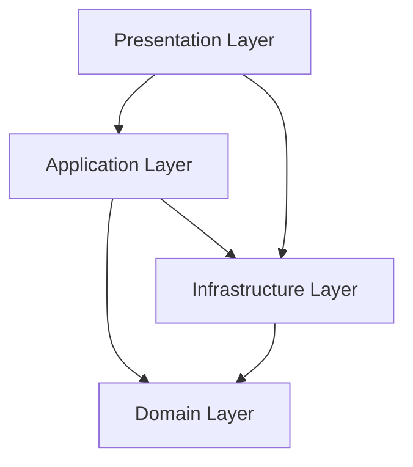

# FLEXT Core

[](https://www.python.org/downloads/)
[](https://opensource.org/licenses/MIT)
[](https://github.com/flext-sh/flext)

Enterprise foundation framework for Python applications built on Clean Architecture and Domain-Driven Design principles.

## Overview

FLEXT Core is a pure Python library that provides the architectural foundation for enterprise applications. It implements type-safe error handling, dependency injection, configuration management, and domain modeling patterns.

## Features

- **Type-Safe Error Handling**: FlextResult[T] pattern eliminates exceptions
- **Dependency Injection**: Enterprise-grade IoC container with FlextContainer  
- **Configuration Management**: Environment-aware settings with Pydantic validation
- **Domain Modeling**: Rich domain entities, value objects, and aggregates
- **CQRS & Event Sourcing**: Command/query separation with domain events
- **Clean Architecture**: Proper dependency inversion and layer separation

## Installation

```bash
pip install flext-core
```

## Quick Start

### Basic Usage

```python
from flext_core import FlextResult, FlextContainer, FlextCoreSettings

# Type-safe error handling
def divide(a: int, b: int) -> FlextResult[float]:
    if b == 0:
        return FlextResult.fail("Division by zero")
    return FlextResult.ok(a / b)

result = divide(10, 2)
if result.is_success:
    print(f"Result: {result.data}")  # Result: 5.0
else:
    print(f"Error: {result.error}")

# Dependency injection
container = FlextContainer()
container.register("calculator", CalculatorService())

calculator = container.get("calculator")
if calculator.is_success:
    calc_result = calculator.data.calculate(10, 2)

# Configuration management
class AppSettings(FlextCoreSettings):
    database_url: str = "sqlite:///app.db"
    api_port: int = 8000
    debug: bool = False

settings = AppSettings()
print(f"Database: {settings.database_url}")
```

## Architecture

FLEXT Core follows Clean Architecture principles with four main layers:

1. **Presentation Layer**: Type-safe public APIs
2. **Application Layer**: Business workflow orchestration
3. **Domain Layer**: Core business logic and rules
4. **Infrastructure Layer**: Technical implementations



## Core Components

### FlextResult[T]

Type-safe error handling without exceptions:

```python
from flext_core import FlextResult

def process_data(data: str) -> FlextResult[ProcessedData]:
    return (
        validate_input(data)
        .flat_map(transform_data)
        .flat_map(save_data)
        .map(format_output)
    )
```

### FlextContainer

Enterprise dependency injection container:

```python
from flext_core import get_flext_container

container = get_flext_container()

# Register services
container.register("user_service", UserService())
container.register("email_service", EmailService())

# Retrieve services
user_service = container.get("user_service").unwrap()
```

### FlextCoreSettings

Environment-aware configuration management:

```python
from flext_core.config import FlextCoreSettings
from pydantic import Field

class DatabaseSettings(FlextCoreSettings):
    host: str = Field("localhost", description="Database host")
    port: int = Field(5432, description="Database port")
    password: SecretStr = Field(..., description="Database password")

settings = DatabaseSettings()
```

### Domain Modeling

Rich domain entities and value objects:

```python
from flext_core import FlextEntity, FlextValueObject, FlextDomainEvent

class User(FlextEntity):
    name: str
    email: str
    
    def activate(self) -> FlextResult[None]:
        if self.is_active:
            return FlextResult.fail("User already active")
        
        self.is_active = True
        self.add_domain_event(UserActivatedEvent(user_id=self.id))
        return FlextResult.ok(None)

class Email(FlextValueObject):
    address: str
    
    @field_validator("address")
    @classmethod
    def validate_email(cls, v: str) -> str:
        if "@" not in v:
            raise ValueError("Invalid email format")
        return v
```

## Requirements

- Python 3.13+
- Zero external runtime dependencies (pure foundation)
- Development dependencies: Pydantic, pytest, ruff, mypy

## Development

### Setup

```bash
git clone <repository-url>
cd flext-core
make setup
```

### Quality Gates

```bash
make validate    # Full validation (lint + type-check + test)
make lint       # Code linting with ruff
make type-check # Type checking with mypy
make test       # Run test suite
make format     # Code formatting
```

### Testing

```bash
make test           # Full test suite
make test-unit      # Unit tests only
make test-integration # Integration tests only
make coverage      # Coverage report
```

## Documentation

- [Architecture Guide](docs/architecture/overview.md)
- [API Reference](docs/api/core.md)
- [Getting Started](docs/getting-started/quickstart.md)
- [Best Practices](docs/development/best-practices.md)
- [Configuration Guide](docs/configuration/overview.md)
- [Migration Guide](docs/migration/compatibility-guide.md)

## Examples

See the [examples directory](docs/examples/) for complete working applications demonstrating:

- User management system
- E-commerce domain model  
- Event-driven microservices
- Configuration management patterns

## Contributing

1. Fork the repository
2. Create a feature branch
3. Make changes following our coding standards
4. Run quality gates: `make validate`
5. Submit a pull request

## License

MIT License - see [LICENSE](LICENSE) for details.

## Support

- Documentation: [docs/](docs/)
- Issues: GitHub Issues
- Discussions: GitHub Discussions

FLEXT Core is the foundational library for the entire FLEXT ecosystem, providing enterprise-grade patterns and practices for Python applications.
