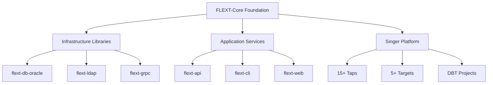

# FLEXT-Core

**Foundation library providing architectural patterns for the FLEXT data integration platform.**

[](https://www.python.org/downloads/)
[](#testing)
[](#current-status)

> **⚠️ STATUS**: Version 0.9.0 development - Partial foundation with implementation gaps

---

## 🎯 Purpose and Role in FLEXT Ecosystem

### **For the FLEXT Ecosystem**

FLEXT-Core provides architectural patterns for FLEXT data integration platform. Used by 29 ecosystem projects for error handling and dependency injection patterns.

### **Core Components**

1. **Railway-Oriented Programming** - FlextResult[T] pattern for error handling
2. **Dependency Injection** - FlextContainer singleton pattern
3. **Domain Modeling** - Entity, Value Object, and Aggregate Root patterns
4. **Configuration Management** - FlextConfig with environment variable integration

### **Integration Points**

- **FLEXT Projects** → Import core patterns from flext-core
- **Infrastructure Libraries** → 8 projects use core patterns
- **Application Services** → 5 projects extend core services
- **Data Integration** → Multiple ETL projects use error handling

---

## 🏗️ Architecture and Implementation Status

### **Component Implementation Status**

| Component           | Lines | Status         | Notes             |
| ------------------- | ----- | -------------- | ----------------- |
| **FlextResult**     | 676   | Complete | Railway pattern with map/flat_map |
| **FlextContainer**  | 884   | Complete | Dependency injection container |
| **FlextConfig**     | 1,250 | Complete | Configuration management |
| **FlextAdapters**   | 20    | Incomplete | 98% commented code |
| **FlextFields**     | 27    | Thin wrapper | Delegates to validations |
| **FlextGuards**     | 74    | Thin wrapper | Backward compatibility layer |

> **Status**: Mixed implementation (95% test coverage on implemented code)

### **Architecture Overview**



---

## 🚀 Quick Start

### **Installation**

```bash
git clone https://github.com/flext-sh/flext-core.git
cd flext-core
make setup

# Verify installation
python -c "from flext_core import FlextResult; print('FLEXT-Core ready')"
```

### **Basic Usage**

```python
from flext_core import FlextResult, FlextContainer, FlextModels

# Railway-oriented error handling
def process_data(data: str) -> FlextResult[str]:
    if not data:
        return FlextResult.fail("Empty data")
    return FlextResult.ok(data.upper())

result = process_data("hello")
if result.success:
    print(result.unwrap())  # HELLO

# Dependency injection
container = FlextContainer.get_global()
container.register("service", MyService())

# Domain modeling
class User(FlextModels.Entity):
    name: str
    email: str

    def activate(self) -> FlextResult[None]:
        if self.is_active:
            return FlextResult.fail("Already active")
        self.is_active = True
        return FlextResult.ok(None)
```

---

## 🔧 Development

### **Essential Commands**

```bash
make setup              # Complete development environment setup
make validate           # All quality checks (lint + type + test)
make test              # Run test suite
make lint              # Code linting with Ruff
make type-check        # MyPy type checking
make format            # Auto-format code
```

### **Quality Gates**

- **Type Safety**: MyPy strict mode enabled
- **Code Quality**: Ruff linting enabled
- **Test Coverage**: 95% on implemented code
- **API Compatibility**: Maintains .data/.value dual access

---

## 🧪 Testing

### **Test Structure**

```
tests/
├── unit/              # Unit tests (fast, isolated)
├── integration/       # Integration tests
├── performance/       # Performance benchmarks
└── conftest.py        # Shared fixtures and utilities
```

### **Testing Commands**

```bash
pytest tests/unit/                    # Unit tests only
pytest tests/ --cov=src --cov-report=term-missing
pytest -m "not slow" -v             # Skip slow tests
```

---

## 📊 Status and Metrics

### **Implementation Metrics (September 17, 2025)**

- **Modules**: 23 Python modules in src/flext_core/
- **Implementation range**: 20 lines (adapters.py actual) to 1,250 lines (config.py actual)
- **Test coverage**: 95% on implemented code
- **Major gap**: adapters.py (98% commented code)
- **Lines of Code**: 11,996 total lines
- **Test Cases**: 2,271 test cases

### **Quality Standards**

- **Coverage**: 95% on implemented code
- **Type Safety**: Python 3.13+ annotations
- **Dependencies**: Pydantic 2.11.7+, Structlog 25.4.0+

### **Ecosystem Integration**

- **FLEXT projects**: 29 projects in workspace
- **Integration patterns**: Error handling, dependency injection
- **Usage**: FlextResult, FlextContainer, FlextConfig used across projects

---

## 🗺️ Current Status

### **Implementation Status (v0.9.0)**

- Core components (FlextResult, FlextContainer, FlextConfig) implemented
- Several thin wrapper modules
- Major gap: adapters.py needs implementation
- Test coverage at 95% on implemented code

### **Development Priorities**

- Complete adapters.py implementation (replace 1,407 lines of comments)
- Document thin wrapper vs substantial module strategy
- Establish performance baselines
- Verify ecosystem usage patterns

---

## 📚 Documentation

Project-specific documentation:

- **[Configuration](docs/configuration/)** - Configuration management
- **[Examples](docs/examples/)** - Code examples
- **[Troubleshooting](docs/troubleshooting/)** - Debug guides

*Note: Workspace documentation moved to .bak to prevent overlap*

---

## 🤝 Contributing

### **Development Areas**

- Complete adapters.py implementation
- Validate ecosystem claims against actual usage
- Document gaps and limitations
- Remove promotional language from docstrings

### **Quality Requirements**

- All changes must pass `make validate`
- Test coverage must not decrease
- API compatibility must be maintained
- Type safety must be complete

---

## 📄 License

MIT License - see [LICENSE](LICENSE) for details.

---

## 🆘 Support

- **Documentation**: [docs/](docs/)
- **Issues**: [GitHub Issues](https://github.com/flext-sh/flext-core/issues)
- **Security**: Report security issues privately to maintainers

---

**FLEXT-Core v0.9.0** - Foundation library enabling consistent architectural patterns across the FLEXT data integration ecosystem.

**Mission**: Provide reliable, type-safe foundation patterns that enable rapid development of data integration solutions while maintaining code quality and consistency across all ecosystem projects.