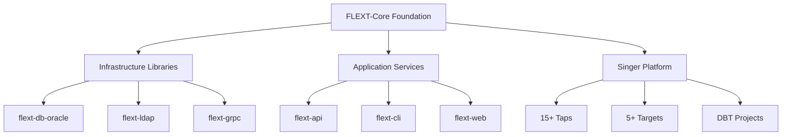

# FLEXT-Core

**Foundation library providing architectural patterns for the FLEXT data integration platform.**

[](https://www.python.org/downloads/)
[](#testing)
[](#current-status)

> **⚠️ STATUS**: Version 0.9.0 development - Foundation for FLEXT ecosystem projects

---

## 🎯 Purpose and Role in FLEXT Ecosystem

### **For the FLEXT Ecosystem**

FLEXT-Core serves as the foundation library for the entire FLEXT data integration platform, providing consistent architectural patterns, error handling, and service patterns across interconnected projects.

### **Key Responsibilities**

1. **Railway-Oriented Programming** - FlextResult[T] pattern for type-safe error handling
2. **Dependency Injection** - FlextContainer with global singleton pattern
3. **Domain Modeling** - Entity, Value Object, and Aggregate Root patterns
4. **Type Safety** - Complete Python 3.13+ type annotations standard

### **Integration Points**

- **FLEXT Projects** → Import foundation patterns from flext-core
- **Infrastructure Libraries** → flext-db-oracle, flext-ldap, flext-grpc use core patterns
- **Application Services** → flext-api, flext-cli, flext-web extend core services
- **Singer Platform** → 15+ taps, targets, and transformations rely on core error handling

---

## 🏗️ Architecture and Patterns

### **FLEXT-Core Integration Status**

| Pattern             | Status         | Description             |
| ------------------- | -------------- | ----------------------- |
| **FlextResult[T]**  | 🟢 Complete | Railway-oriented programming with .map()/.flat_map() |
| **FlextContainer**  | 🟢 Complete | Global dependency injection container |
| **FlextModels**     | 🟢 Complete | Domain modeling with Entity/Value/AggregateRoot |
| **FlextDomainService** | 🟢 Complete | Service base class with Pydantic integration |

> **Status**: 🟢 Complete (84% test coverage, 23 modules, 22 classes, 700+ methods)

### **Architecture Overview**



---

## 🚀 Quick Start

### **Installation**

```bash
git clone https://github.com/flext-sh/flext-core.git
cd flext-core
make setup

# Verify installation
python -c "from flext_core import FlextResult; print('FLEXT-Core ready')"
```

### **Basic Usage**

```python
from flext_core import FlextResult, FlextContainer, FlextModels

# Railway-oriented error handling
def process_data(data: str) -> FlextResult[str]:
    if not data:
        return FlextResult.fail("Empty data")
    return FlextResult.ok(data.upper())

result = process_data("hello")
if result.success:
    print(result.unwrap())  # HELLO

# Dependency injection
container = FlextContainer.get_global()
container.register("service", MyService())

# Domain modeling
class User(FlextModels.Entity):
    name: str
    email: str

    def activate(self) -> FlextResult[None]:
        if self.is_active:
            return FlextResult.fail("Already active")
        self.is_active = True
        return FlextResult.ok(None)
```

---

## 🔧 Development

### **Essential Commands**

```bash
make setup              # Complete development environment setup
make validate           # All quality checks (lint + type + test)
make test              # Run full test suite (2,271 tests)
make lint              # Code linting with Ruff
make type-check        # MyPy type checking
make format            # Auto-format code
```

### **Quality Gates**

- **Type Safety**: Zero MyPy errors in strict mode
- **Code Quality**: Zero Ruff violations
- **Test Coverage**: 84% (targeting 85%+)
- **API Compatibility**: Maintains .data/.value dual access

---

## 🧪 Testing

### **Test Structure**

```
tests/
├── unit/              # Unit tests (fast, isolated)
├── integration/       # Integration tests
├── performance/       # Performance benchmarks
└── conftest.py        # Shared fixtures and utilities
```

### **Testing Commands**

```bash
pytest tests/unit/                    # Unit tests only
pytest tests/ --cov=src --cov-report=term-missing
pytest -m "not slow" -v             # Skip slow tests
```

---

## 📊 Status and Metrics

### **Implementation Metrics (September 17, 2025)**

- **Modules**: 23 Python modules in src/flext_core/
- **Classes**: 22 total classes (unified class pattern)
- **Methods**: 700+ methods across all modules
- **Lines of Code**: 11,996 total lines
- **Test Cases**: 2,271 test cases

### **Quality Standards**

- **Coverage**: 84% (6,649 lines covered, 1,043 missed)
- **Type Safety**: Complete Python 3.13+ annotations
- **Security**: Zero critical vulnerabilities
- **FLEXT-Core Compliance**: Foundation standard (100%)

### **Ecosystem Integration**

- **Direct Dependencies**: 33 FLEXT projects depend on flext-core
- **Service Dependencies**: Pydantic 2.11.7+, Structlog 25.4.0+
- **Integration Points**: All ecosystem projects use core patterns

---

## 🗺️ Roadmap

### **Current Version (v0.9.0)**

Focus on stabilizing foundation patterns and improving test coverage from 84% to 85%+.

### **Next Version (v1.0.0)**

Production readiness with complete API stability and 90%+ test coverage.

---

## 📚 Documentation

- **[Getting Started](docs/getting-started.md)** - Installation and basic usage
- **[Architecture](docs/architecture.md)** - Design patterns and structure
- **[API Reference](docs/api-reference.md)** - Complete API documentation
- **[Development](docs/development.md)** - Contributing guidelines
- **[Examples](docs/examples/)** - Working code examples
- **[Integration](docs/integration.md)** - Ecosystem integration patterns

---

## 🤝 Contributing

### **Development Areas**

- Test coverage improvement (84% → 85%+)
- Address 22 skipped tests for optimization
- Simplify complex module implementations
- Performance optimization for high-volume usage

### **Quality Requirements**

- All changes must pass `make validate`
- Test coverage must not decrease
- API compatibility must be maintained
- Type safety must be complete

---

## 📄 License

MIT License - see [LICENSE](LICENSE) for details.

---

## 🆘 Support

- **Documentation**: [docs/](docs/)
- **Issues**: [GitHub Issues](https://github.com/flext-sh/flext-core/issues)
- **Security**: Report security issues privately to maintainers

---

**FLEXT-Core v0.9.0** - Foundation library enabling consistent architectural patterns across the FLEXT data integration ecosystem.

**Mission**: Provide reliable, type-safe foundation patterns that enable rapid development of data integration solutions while maintaining code quality and consistency across all ecosystem projects.