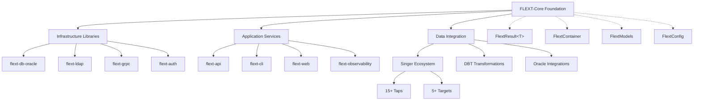

# FLEXT-Core

**Foundation library for the FLEXT ecosystem**, providing **railway-oriented programming**, **dependency injection**, and **domain modeling patterns** with **Python 3.13+ type safety**.

> **⚠️ STATUS**: Version 0.9.0 development - 84% test coverage, foundation patterns implemented

---

## 🎯 Purpose and Role in FLEXT Ecosystem

### **For the FLEXT Ecosystem**

FLEXT-Core serves as the architectural foundation for all 45+ FLEXT ecosystem projects, providing type-safe patterns for error handling, dependency injection, and domain modeling that ensure consistency and reliability across data integration solutions.

### **Key Responsibilities**

1. **Railway Pattern Foundation** - FlextResult[T] monadic error handling for type-safe composition
2. **Dependency Injection Container** - FlextContainer singleton for service lifecycle management
3. **Domain-Driven Design Patterns** - Entity, Value Object, and Aggregate Root implementations
4. **Configuration Management** - FlextConfig with environment variable integration and validation

### **Integration Points**

- **Infrastructure Libraries** (flext-db-oracle, flext-ldap, flext-grpc) → Foundation patterns and error handling
- **Application Services** (flext-api, flext-cli, flext-web) → Service composition and dependency injection
- **Data Integration** (Singer ecosystem, DBT, Oracle integrations) → Domain modeling and validation patterns
- **All 45+ FLEXT Projects** → Core architectural patterns and type safety standards

---

## 🏗️ Architecture and Patterns

### **FLEXT-Core Integration Status**

| Pattern             | Status         | Description                     |
| ------------------- | -------------- | ------------------------------- |
| **FlextResult<T>**  | 🟢 Complete   | Railway-oriented programming with monadic operations |
| **FlextContainer**  | 🟢 Complete   | Dependency injection singleton container |
| **FlextConfig**     | 🟢 Complete   | Environment-aware configuration management |
| **Domain Patterns** | 🟢 Complete   | DDD Entity/Value/Aggregate implementations |
| **FlextUtilities**| 🟢 Complete   | Validation utilities in FlextUtilities |
| **FlextAdapters**   | 🟢 Minimal    | Simplified type adaptation (22 lines, intentional design) |

> **Status**: 🔴 Critical | 🟡 Partial | 🟢 Complete

### **Architecture Diagram**



---

## 🚀 Quick Start

### **Installation**

```bash
# Install from source (development)
git clone https://github.com/flext-sh/flext-core.git
cd flext-core
make setup

# Verify installation
python -c "from flext_core import FlextResult; print('FLEXT-Core ready')"
```

**Requirements**: Python 3.13+, Poetry for dependency management

### **Basic Usage**

```python
from flext_core import FlextResult, FlextContainer, FlextModels

# Railway-oriented error handling
def process_data(data: str) -> FlextResult[str]:
    if not data:
        return FlextResult[str].fail("Empty data")
    return FlextResult[str].ok(data.upper())

result = process_data("hello")
if result.is_success:
    print(result.unwrap())  # HELLO

# Dependency injection
container = FlextContainer.get_global()
container.register("service", MyService())

# Domain modeling
class User(FlextModels.Entity):
    name: str
    email: str

    def activate(self) -> FlextResult[None]:
        if self.is_active:
            return FlextResult[None].fail("Already active")
        self.is_active = True
        return FlextResult[None].ok(None)
```

---

## 🔧 Development

### **Essential Commands**

```bash
make setup              # Complete development environment setup
make validate           # All quality checks (lint + type + test)
make test              # Run test suite with coverage
make lint              # Code linting with Ruff
make type-check        # MyPy type checking
make format            # Auto-format code
```

### **Quality Gates**

- **Type Safety**: MyPy strict mode with zero tolerance for type errors
- **Code Quality**: Ruff linting with professional standards
- **Test Coverage**: 84% current, targeting 90%
- **API Compatibility**: Maintains backward compatibility

---

## 🧪 Testing

### **Test Structure**

```
tests/
├── unit/              # Unit tests for individual components
├── integration/       # Integration tests for component interaction
├── performance/       # Performance benchmarks
└── conftest.py        # Shared fixtures and utilities
```

### **Testing Commands**

```bash
pytest tests/unit/                           # Unit tests only
pytest tests/ --cov=src --cov-report=term-missing   # Coverage report
pytest -m "not slow" -v                     # Skip performance tests
```

---

## 📊 Status and Metrics

### **Quality Standards**

- **Coverage**: 84% minimum (currently 84%)
- **Type Safety**: Python 3.13+ with MyPy strict mode compliance
- **Security**: Bandit + pip-audit security scanning
- **FLEXT-Core Compliance**: 100%

### **Ecosystem Integration**

- **Direct Dependencies**: 15+ infrastructure libraries (flext-db-oracle, flext-ldap, etc.)
- **Service Dependencies**: 8+ application services (flext-api, flext-cli, flext-web)
- **Integration Points**: 45+ projects using foundation patterns

---

## 🗺️ Roadmap

### **Current Version (v0.9.0)**

Foundation library with 84% test coverage and complete architectural patterns implementation.

### **Next Version (v1.0.0)**

- **Test Coverage**: Improve from 84% to 90%
- **Performance**: Establish regression testing baselines
- **Documentation**: Full compliance with workspace standards
- **API Stability**: Backward compatibility guarantee

---

## 📚 Documentation

- **[Getting Started](docs/getting-started.md)** - Installation and first steps
- **[Architecture](docs/architecture.md)** - Design patterns and structure
- **[API Reference](docs/api-reference.md)** - Complete API documentation
- **[Configuration](docs/configuration.md)** - Settings and environment management
- **[Development](docs/development.md)** - Development workflow and guidelines
- **[Integration](docs/integration.md)** - Ecosystem integration patterns
- **[Examples](docs/examples/)** - Working code examples
- **[Troubleshooting](docs/troubleshooting.md)** - Common issues and solutions

---

## 🤝 Contributing

### **FLEXT-Core Compliance Checklist**

- [ ] All changes pass `make validate` (lint + type + test)
- [ ] MyPy strict mode: zero errors in `src/`
- [ ] Test coverage maintained at 84%+
- [ ] API backward compatibility preserved
- [ ] FlextResult[T] patterns followed

### **Quality Standards**

All contributions must maintain foundation library standards:
- Type safety: Python 3.13+ with complete annotations
- Error handling: FlextResult[T] railway patterns
- Testing: Real functional tests preferred over mocks
- Documentation: Professional technical writing

---

## 📄 License

MIT License - see [LICENSE](LICENSE) for details.

---

## 🆘 Support

- **Documentation**: [docs/](docs/)
- **Issues**: [GitHub Issues](https://github.com/flext-sh/flext-core/issues)
- **Security**: Report security issues privately to maintainers

---

**FLEXT-Core v0.9.0** - Foundation library enabling type-safe architectural patterns across the FLEXT ecosystem.

**Mission**: Provide robust, type-safe foundation patterns that enable consistent, reliable, and maintainable data integration solutions across all FLEXT ecosystem projects.
