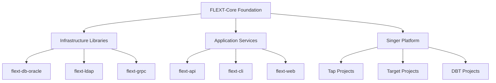

# FLEXT-Core

**Foundation library providing architectural patterns for the FLEXT ecosystem**, implementing railway-oriented programming, dependency injection, and domain modeling patterns with type safety.

[](https://www.python.org/downloads/)
[](#current-version)

> **STATUS**: Version 0.9.0 development - Core patterns implemented with type safety

---

## 🎯 Purpose and Role in FLEXT Ecosystem

### **For the FLEXT Ecosystem**

FLEXT-Core provides foundational architectural patterns for data integration solutions. The library implements railway-oriented programming patterns, dependency injection, and domain modeling that enable consistent error handling and service composition across ecosystem projects.

### **Key Responsibilities**

1. **Railway Pattern Foundation** - FlextResult[T] for type-safe error handling
2. **Dependency Injection** - FlextContainer singleton for service management
3. **Domain Modeling** - Entity, Value Object, and Aggregate Root patterns
4. **Configuration Management** - FlextConfig with environment integration

### **Integration Points**

- **Infrastructure Libraries** → Use FlextResult for error handling
- **Application Services** → Use FlextContainer for dependency injection
- **Data Integration** → Use domain patterns for business logic modeling
- **FLEXT Projects** → Import foundation patterns from flext-core

---

## 🏗️ Architecture and Implementation Status

### **Core Components Status**

| Component           | Status    | Lines | Description             |
| ------------------- | --------- | ----- | ----------------------- |
| **FlextResult[T]**  | Complete  | 676   | Railway pattern with monadic operations |
| **FlextContainer**  | Complete  | 884   | Dependency injection container |
| **FlextConfig**     | Complete  | 1,250 | Configuration management with Pydantic |
| **FlextModels**     | Complete  | 178   | Domain modeling patterns |
| **FlextValidations**| Complete  | 526   | Validation patterns and predicates |
| **FlextCommands**   | Complete  | 417   | CQRS command patterns |
| **FlextLoggings**   | Complete  | 292   | Structured logging with structlog |

### **Implementation Metrics (September 2025)**

- **Modules**: 23 Python modules implementing foundation patterns
- **Test Coverage**: 84% (6,664 lines covered of 7,706 total)
- **Type Safety**: Complete Python 3.13+ type annotations
- **Dependencies**: Pydantic 2.11.7+, Structlog 25.4.0+

### **Architecture Overview**



---

## 🚀 Quick Start

### **Installation**

```bash
git clone https://github.com/flext-sh/flext-core.git
cd flext-core
make setup

# Verify installation
python -c "from flext_core import FlextResult; print('FLEXT-Core ready')"
```

### **Basic Usage**

```python
from flext_core import FlextResult, FlextContainer, FlextModels

# Railway-oriented error handling
def process_data(data: str) -> FlextResult[str]:
    if not data:
        return FlextResult[str].fail("Empty data")
    return FlextResult[str].ok(data.upper())

result = process_data("hello")
if result.is_success:
    print(result.unwrap())  # HELLO

# Dependency injection
container = FlextContainer.get_global()
container.register("service", MyService())

# Domain modeling
class User(FlextModels.Entity):
    name: str
    email: str

    def activate(self) -> FlextResult[None]:
        if self.is_active:
            return FlextResult[None].fail("Already active")
        self.is_active = True
        return FlextResult[None].ok(None)
```

---

## 🔧 Development

### **Essential Commands**

```bash
make setup              # Complete development environment setup
make validate           # All quality checks (lint + type + test)
make test              # Run test suite with coverage
make lint              # Code linting with Ruff
make type-check        # MyPy type checking
make format            # Auto-format code
```

### **Quality Gates**

- **Type Safety**: MyPy strict mode with zero tolerance for type errors
- **Code Quality**: Ruff linting with professional standards
- **Test Coverage**: 84% current, targeting 90%
- **API Compatibility**: Maintains backward compatibility

---

## 🧪 Testing

### **Test Structure**

```
tests/
├── unit/              # Unit tests for individual components
├── integration/       # Integration tests for component interaction
├── performance/       # Performance benchmarks
└── conftest.py        # Shared fixtures and utilities
```

### **Testing Commands**

```bash
pytest tests/unit/                           # Unit tests only
pytest tests/ --cov=src --cov-report=term-missing   # Coverage report
pytest -m "not slow" -v                     # Skip performance tests
```

---

## 📊 Status and Metrics

### **Current Status (v0.9.0)**

- **Core Components**: Railway pattern, DI container, domain models implemented
- **Type Safety**: Complete Python 3.13+ type annotations
- **Test Coverage**: 84% on 6,664 lines of code
- **Quality**: Zero MyPy errors in src/, zero Ruff violations

### **Quality Standards**

- **Coverage**: 84% current (targeting 90%)
- **Type Safety**: Python 3.13+ with strict MyPy validation
- **Dependencies**: Pydantic 2.11.7+, Structlog 25.4.0+
- **Security**: No known vulnerabilities

### **Ecosystem Integration**

- **FLEXT Projects**: Foundation patterns used across ecosystem
- **Usage Patterns**: FlextResult, FlextContainer, FlextConfig adoption
- **Integration**: Error handling and dependency injection patterns

---

## 🗺️ Roadmap

### **Current Version (v0.9.0)**

- Core patterns stable and tested
- Type safety complete
- Documentation aligned with implementation

### **Next Version (v0.10.0)**

- Performance optimization
- Enhanced error messages
- Extended testing coverage

---

## 📚 Documentation

- **[Getting Started](docs/getting-started/)** - Installation and basic usage
- **[Architecture](docs/architecture.md)** - Design patterns and structure
- **[API Reference](docs/api-reference.md)** - Complete API documentation
- **[Configuration](docs/configuration/)** - Settings and environment management
- **[Development](docs/development.md)** - Contributing and workflows
- **[Examples](docs/examples/)** - Working code examples

---

## 🤝 Contributing

### **Quality Requirements**

- All changes must pass `make validate`
- Type safety must be maintained (zero MyPy errors)
- Test coverage must not decrease below current level
- API compatibility must be preserved

### **Development Areas**

- Test coverage improvement (84% → 90%)
- Performance optimization
- Enhanced error handling
- Documentation improvements

---

## 📄 License

MIT License - see [LICENSE](LICENSE) for details.

---

## 🆘 Support

- **Documentation**: [docs/](docs/)
- **Issues**: [GitHub Issues](https://github.com/flext-sh/flext-core/issues)
- **Security**: Report security issues privately to maintainers

---

**FLEXT-Core v0.9.0** - Foundation library enabling consistent architectural patterns for data integration solutions across the FLEXT ecosystem.

**Mission**: Provide reliable, type-safe foundation patterns that enable rapid development of data integration solutions while maintaining code quality and consistency.