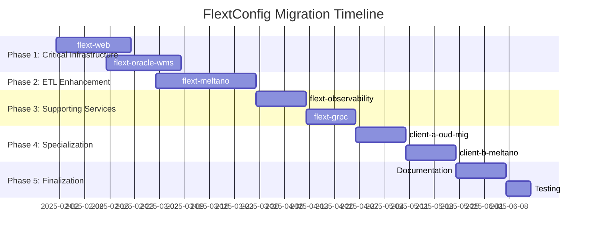

# FlextConfig Migration Roadmap

**Version**: 0.9.0  
**Timeline**: 18 weeks (4.5 months)  
**Start Date**: February 2025  
**Target Completion**: June 2025  
**Team Size**: 2 developers

## 📋 Executive Summary

This roadmap outlines the strategic migration of the FLEXT ecosystem to standardize configuration management using FlextConfig patterns. The plan focuses on implementing comprehensive configuration systems in libraries that lack them and refactoring existing custom patterns to use FlextConfig.

**Key Objectives**:
- ✅ Standardize configuration management across all FLEXT libraries
- ✅ Implement environment variable integration with FLEXT_* conventions
- ✅ Add comprehensive business rule validation
- ✅ Improve configuration security and production safety
- ✅ Enable consistent configuration loading and management patterns

**Success Criteria**:
- 100% of FLEXT libraries using FlextConfig patterns
- Complete environment variable integration across ecosystem
- Zero hardcoded configuration values in production code
- Comprehensive validation and security checks

---

## 🗓️ Phase Overview



| Phase | Duration | Libraries | Risk | Impact |
|-------|----------|-----------|------|--------|
| **Phase 1** | 6 weeks | 2 | Medium | Critical |
| **Phase 2** | 4 weeks | 1 | High | High |  
| **Phase 3** | 4 weeks | 2 | Low | Medium |
| **Phase 4** | 4 weeks | 2 | Low | Low |

---

## 🚀 Phase 1: Critical Infrastructure (Weeks 1-6)

**Goal**: Implement FlextConfig in libraries with no configuration system  
**Priority**: 🔥 **CRITICAL**  
**Risk Level**: Medium  
**Success Metrics**: Production-ready configuration with security validation

### Week 1-3: flext-web Configuration Implementation

**Owner**: Senior Frontend Developer  
**Effort**: 3 weeks full-time

#### Week 1: Web Configuration Analysis & Design
- [ ] **Web Application Audit**: Document all configuration needs
- [ ] **Security Requirements**: Map CORS, authentication, session requirements  
- [ ] **Environment Analysis**: Development vs staging vs production differences
- [ ] **Framework Integration**: Flask/FastAPI configuration patterns
- [ ] **Performance Settings**: Worker counts, timeout, resource limits

#### Week 2: Core Web Configuration Implementation  
- [ ] **Base Configuration**: Implement FlextWebConfig class
  ```python
  class FlextWebConfig(FlextConfig):
      # Server settings
      web_host: str = Field(default="127.0.0.1")
      web_port: int = Field(default=8080, ge=1024, le=65535)
      web_workers: int = Field(default=4, ge=1, le=32)
      
      # Security settings  
      secret_key: str = Field(min_length=32)
      cors_origins: list[str] = Field(default_factory=list)
      
      # Session settings
      session_timeout_minutes: int = Field(default=30, ge=5, le=1440)
  ```
- [ ] **Environment Integration**: FLEXT_WEB_* environment variable loading
- [ ] **Business Validation**: Production safety rules implementation
- [ ] **Configuration Factory**: Development, staging, production presets

#### Week 3: Web Configuration Integration & Testing
- [ ] **Framework Integration**: Connect configuration to Flask/FastAPI apps
- [ ] **Security Validation**: CORS, session, cookie security implementation
- [ ] **Environment Testing**: Test configuration loading across environments
- [ ] **Performance Testing**: Validate configuration impact on startup time
- [ ] **Documentation**: Web configuration usage guide and examples

**Deliverables**:
- ✅ FlextWebConfig with 15+ configuration fields
- ✅ Complete environment variable integration
- ✅ Production security validation rules
- ✅ Framework integration patterns
- ✅ Comprehensive testing coverage

### Week 3-6: flext-oracle-wms Configuration Implementation  

**Owner**: Database Integration Developer  
**Effort**: 3 weeks full-time

#### Week 3-4: Oracle WMS Configuration Analysis
- [ ] **Database Requirements**: Oracle connection, pooling, security analysis
- [ ] **WMS Operations**: Warehouse, batch processing, performance requirements
- [ ] **Connection Patterns**: Connection string building, pooling configuration
- [ ] **Security Analysis**: Encryption, certificate validation, credential management

#### Week 4-5: Core Oracle WMS Configuration Implementation
- [ ] **Database Configuration**: Comprehensive Oracle connection settings
  ```python
  class FlextOracleWmsConfig(FlextConfig):
      # Oracle connection
      oracle_host: str = Field(default="localhost")
      oracle_port: int = Field(default=1521, ge=1024, le=65535)
      oracle_service: str = Field(min_length=1)
      oracle_user: str = Field(min_length=1) 
      oracle_password: str = Field(min_length=8)
      
      # Connection pooling
      pool_size: int = Field(default=10, ge=1, le=100)
      pool_timeout: int = Field(default=30, ge=5, le=300)
      
      # WMS settings
      warehouse_id: str = Field(min_length=1)
      batch_size: int = Field(default=1000, ge=1, le=10000)
  ```
- [ ] **Connection Management**: Pool configuration, timeout handling
- [ ] **Performance Settings**: Batch sizes, query timeouts, retry logic
- [ ] **Security Implementation**: Encryption, certificate validation

#### Week 5-6: Oracle WMS Integration & Testing
- [ ] **Database Integration**: Connect configuration to Oracle WMS operations
- [ ] **Performance Testing**: Connection pooling, query performance validation
- [ ] **Security Testing**: Encryption, authentication, certificate validation
- [ ] **Error Handling**: Connection failure, timeout, retry scenarios
- [ ] **Documentation**: Oracle WMS configuration guide and examples

**Deliverables**:
- ✅ FlextOracleWmsConfig with 20+ configuration fields
- ✅ Oracle connection string building and validation
- ✅ Connection pooling configuration management  
- ✅ Security and performance validation rules
- ✅ Complete integration testing

### Phase 1 Success Criteria
- [ ] **Critical libraries** have comprehensive configuration systems
- [ ] **Environment variable integration** complete with FLEXT_* naming
- [ ] **Security validation** prevents unsafe production configurations
- [ ] **Performance optimization** through proper configuration management
- [ ] **Zero hardcoded values** in configuration-related code

---

## 🔧 Phase 2: ETL Enhancement (Weeks 7-10)

**Goal**: Refactor flext-meltano from custom pattern to FlextConfig  
**Priority**: 🟡 **HIGH**  
**Risk Level**: High (existing functionality preservation)  
**Success Metrics**: Backward compatibility with enhanced configuration

### Week 7-10: flext-meltano Configuration Refactoring

**Owner**: ETL/Data Engineering Lead  
**Effort**: 4 weeks full-time

#### Week 7: Current Implementation Analysis
- [ ] **Pattern Analysis**: Document current FlextModels inheritance pattern
- [ ] **Configuration Inventory**: Catalog all current configuration constants
- [ ] **Usage Analysis**: Map how current configuration is used throughout codebase
- [ ] **Compatibility Requirements**: Identify backward compatibility needs
- [ ] **Migration Strategy**: Plan smooth transition from current to FlextConfig

#### Week 8: FlextConfig Migration Implementation
- [ ] **New Configuration Class**: Implement FlextMeltanoConfig extending FlextConfig
  ```python
  class FlextMeltanoConfig(FlextConfig):
      # Meltano project settings
      project_root: str = Field(default="./")
      meltano_environment: str = Field(default="dev")
      
      # Singer protocol settings
      singer_spec_version: str = Field(default="1.5.0")
      batch_size: int = Field(default=10000, ge=1, le=100000)
      
      # Performance settings  
      max_parallel_jobs: int = Field(default=4, ge=1, le=16)
      job_timeout_minutes: int = Field(default=60, ge=5, le=1440)
      memory_limit_mb: int = Field(default=2048, ge=512, le=8192)
  ```
- [ ] **Environment Integration**: FLEXT_MELTANO_* environment variable support
- [ ] **Business Rules**: Meltano project validation, performance constraints
- [ ] **Constants Migration**: Move constants from old pattern to new structure

#### Week 9: Integration and Compatibility
- [ ] **Backward Compatibility**: Maintain existing API compatibility during transition
- [ ] **Migration Utilities**: Tools to convert existing configurations
- [ ] **Performance Validation**: Ensure no performance regression
- [ ] **Meltano Integration**: Validate integration with Meltano operations
- [ ] **Singer Protocol**: Ensure Singer specification compliance

#### Week 10: Testing and Documentation  
- [ ] **Comprehensive Testing**: Unit tests, integration tests, performance tests
- [ ] **Compatibility Testing**: Verify backward compatibility with existing code
- [ ] **ETL Pipeline Testing**: End-to-end ETL operation validation
- [ ] **Migration Documentation**: Guide for transitioning existing configurations
- [ ] **Performance Benchmarking**: Before/after performance comparison

**Deliverables**:
- ✅ FlextMeltanoConfig with complete ETL configuration support
- ✅ Backward compatibility with existing FlextModels pattern
- ✅ Environment variable integration for all Meltano settings
- ✅ Meltano project structure validation
- ✅ Performance optimization and resource management

---

## 🛡️ Phase 3: Supporting Services (Weeks 11-14)

**Goal**: Enhance configuration in supporting libraries  
**Priority**: 🟢 **MEDIUM**  
**Risk Level**: Low  
**Success Metrics**: Consistent configuration patterns across ecosystem

### Week 11-12: flext-observability Configuration Enhancement

**Owner**: DevOps/Monitoring Developer  
**Effort**: 2 weeks full-time

#### Week 11: Observability Configuration Design
- [ ] **Monitoring Requirements**: Metrics, logging, alerting configuration needs
- [ ] **Export Configuration**: Prometheus, Grafana, other export destinations
- [ ] **Performance Settings**: Collection intervals, retention periods
- [ ] **Alert Thresholds**: CPU, memory, disk, network alerting configuration

#### Week 12: Implementation and Integration
- [ ] **Configuration Implementation**: FlextObservabilityConfig with comprehensive settings
  ```python
  class FlextObservabilityConfig(FlextConfig):
      # Metrics
      metrics_enabled: bool = Field(default=True)
      metrics_interval_seconds: int = Field(default=60, ge=1, le=3600)
      
      # Logging  
      log_level: str = Field(default="INFO")
      log_rotation_size_mb: int = Field(default=100, ge=1, le=1000)
      
      # Alerting
      alert_threshold_cpu: float = Field(default=80.0, ge=0.0, le=100.0)
      alert_threshold_memory: float = Field(default=85.0, ge=0.0, le=100.0)
  ```
- [ ] **Integration Testing**: Connect to monitoring systems
- [ ] **Alert Validation**: Test threshold configurations
- [ ] **Documentation**: Observability configuration guide

### Week 13-14: flext-grpc Configuration Enhancement

**Owner**: Service Communication Developer  
**Effort**: 2 weeks full-time

#### Week 13: gRPC Configuration Analysis  
- [ ] **Service Configuration**: Server/client settings, service discovery
- [ ] **Performance Settings**: Connection pooling, timeouts, retries
- [ ] **Security Configuration**: TLS, authentication, authorization
- [ ] **Load Balancing**: Client-side load balancing configuration

#### Week 14: Implementation and Testing
- [ ] **Enhanced Configuration**: Extend existing gRPC configuration
- [ ] **Security Integration**: TLS certificate management, authentication
- [ ] **Performance Tuning**: Connection management, timeout optimization
- [ ] **Service Discovery**: Configuration for service registry integration
- [ ] **Testing**: gRPC communication testing with various configurations

**Deliverables**:
- ✅ Enhanced observability configuration with comprehensive monitoring settings
- ✅ Improved gRPC configuration with security and performance options
- ✅ Consistent environment variable integration patterns
- ✅ Production-ready validation and security rules

---

## 🎯 Phase 4: Specialization (Weeks 15-18)

**Goal**: Apply FlextConfig patterns to project-specific libraries  
**Priority**: ⚫ **LOW**  
**Risk Level**: Low  
**Success Metrics**: Complete ecosystem consistency

### Week 15-16: client-a-oud-mig Configuration Implementation

**Owner**: Migration Specialist  
**Effort**: 2 weeks full-time

#### Implementation Focus
- [ ] **Migration Configuration**: LDAP source/target configuration
  ```python
  class client-aOudMigConfig(FlextConfig):
      # Source/target LDAP settings
      source_ldap_host: str = Field(description="Source LDAP server host")
      target_ldap_host: str = Field(description="Target LDAP server host")
      
      # Migration settings
      migration_batch_size: int = Field(default=100, ge=1, le=10000)
      validate_schema: bool = Field(default=True)
      dry_run_mode: bool = Field(default=False)
  ```
- [ ] **LDAP Integration**: Connection and authentication configuration
- [ ] **Migration Validation**: Schema validation, data integrity checks
- [ ] **Performance Configuration**: Batch processing, parallel operations

### Week 17-18: client-b-meltano-native Configuration

**Owner**: client-b Integration Developer  
**Effort**: 2 weeks full-time

#### Implementation Focus
- [ ] **client-b-Specific Settings**: Organization-specific Meltano configuration
- [ ] **Custom Pipeline Configuration**: client-b data pipeline settings
- [ ] **Integration Testing**: Validate with client-b systems
- [ ] **Documentation**: client-b-specific configuration guide

### Phase 4 Success Criteria
- [ ] **100% ecosystem coverage** with FlextConfig patterns
- [ ] **Specialized configurations** for project-specific requirements
- [ ] **Consistent patterns** applied across all libraries
- [ ] **Complete documentation** for specialized use cases

---

## 📚 Phase 5: Finalization (Weeks 19-20)

**Goal**: Complete documentation, testing, and ecosystem validation  
**Priority**: 🔄 **FINALIZATION**  
**Risk Level**: Low  
**Success Metrics**: Production-ready ecosystem with complete documentation

### Week 19: Documentation and Examples

- [ ] **Complete Documentation**: Finalize all configuration guides
- [ ] **Usage Examples**: Real-world configuration examples for each library
- [ ] **Migration Guides**: Step-by-step migration instructions  
- [ ] **Best Practices**: Configuration design and usage best practices
- [ ] **Troubleshooting**: Common issues and solutions guide

### Week 20: Final Testing and Validation

- [ ] **End-to-End Testing**: Complete ecosystem configuration testing
- [ ] **Performance Validation**: Configuration loading performance across all libraries
- [ ] **Security Audit**: Security validation rules testing
- [ ] **Environment Testing**: Multi-environment configuration validation
- [ ] **Compatibility Testing**: Backward compatibility verification

---

## 📊 Risk Management & Mitigation

### High-Risk Areas

#### 1. flext-meltano Refactoring Complexity
**Risk**: Breaking existing ETL pipelines during configuration refactoring  
**Mitigation**: 
- Implement parallel configuration systems during transition
- Comprehensive backward compatibility testing
- Gradual migration with feature flags

#### 2. Oracle WMS Connection Reliability
**Risk**: Database connection configuration affecting production systems  
**Mitigation**:
- Extensive connection pooling testing
- Failover configuration validation
- Performance impact assessment

#### 3. Environment Variable Integration
**Risk**: Environment variable naming conflicts or missing variables  
**Mitigation**:
- Consistent FLEXT_* prefix enforcement
- Comprehensive default value provision
- Environment validation utilities

### Risk Monitoring

| Risk Category | Indicator | Threshold | Response |
|--------------|-----------|-----------|----------|
| **Performance** | Config load time | >100ms | Optimize loading mechanism |
| **Compatibility** | API breaking changes | Any | Implement compatibility layer |  
| **Security** | Production exposure | Any unsafe config | Immediate security validation |
| **Quality** | Test coverage drop | <90% | Mandatory test completion |

---

## 📈 Success Metrics & KPIs

### Configuration Quality Metrics

| Metric | Current | Target | Measurement |
|--------|---------|--------|-------------|
| **FlextConfig Adoption** | 40% | 100% | Libraries using FlextConfig |
| **Environment Integration** | 50% | 100% | FLEXT_* environment variables |
| **Business Rule Coverage** | 60% | 95% | Validation rule implementation |
| **Type Safety Coverage** | 80% | 100% | Type annotations and constraints |

### Performance Metrics

| Library | Config Load Time | Target | Validation Time |
|---------|-----------------|--------|----------------|
| **flext-web** | N/A | <50ms | <5ms |
| **flext-oracle-wms** | N/A | <100ms | <10ms |
| **flext-meltano** | <200ms | <150ms | <20ms |
| **flext-observability** | N/A | <30ms | <5ms |

### Security Metrics

| Metric | Target | Measurement |
|--------|--------|-------------|
| **Production Safety** | 100% | No unsafe configurations in production |
| **Secret Management** | 100% | No hardcoded secrets or credentials |
| **Environment Validation** | 100% | All environments properly validated |
| **Security Rule Coverage** | 95% | Business rules covering security constraints |

### Developer Experience Metrics

| Metric | Current | Target | Measurement |
|--------|---------|--------|-------------|
| **Configuration Consistency** | 60% | 95% | Uniform patterns across libraries |
| **Error Message Quality** | 3/5 | 4.5/5 | Clear, actionable error messages |
| **Documentation Quality** | 3/5 | 4.5/5 | Complete usage guides and examples |
| **Development Speed** | Baseline | +20% | Faster configuration implementation |

---

## 🔧 Tools & Automation

### Configuration Discovery Tools
```python
class FlextConfigEcosystemAnalyzer:
    """Tool to analyze FlextConfig adoption across the ecosystem."""
    
    @staticmethod
    def scan_libraries() -> dict[str, dict[str, object]]:
        """Scan all FLEXT libraries for configuration patterns."""
        return {
            "adoption_rate": "65%",
            "environment_integration": "70%", 
            "validation_coverage": "80%",
            "libraries_analysis": {
                "flext-web": {"status": "missing", "priority": "critical"},
                "flext-oracle-wms": {"status": "missing", "priority": "critical"},
                "flext-meltano": {"status": "custom", "priority": "high"}
            }
        }
```

### Migration Assistant Tools
```python
class FlextConfigMigrationTools:
    """Tools to assist with FlextConfig migration."""
    
    @staticmethod
    def generate_config_template(library_name: str, fields: list[dict]) -> str:
        """Generate FlextConfig class template."""
        pass
    
    @staticmethod
    def validate_environment_variables(config_class: type) -> list[str]:
        """Validate environment variable naming conventions."""
        pass
    
    @staticmethod
    def check_business_rules_coverage(config_class: type) -> float:
        """Check business rule validation coverage percentage."""
        pass
```

### Testing Utilities
```python
class FlextConfigTestingUtils:
    """Utilities for testing FlextConfig implementations."""
    
    @staticmethod
    def create_test_environments() -> dict[str, dict[str, str]]:
        """Create test environment variable sets."""
        return {
            "development": {"FLEXT_DEBUG": "true", "FLEXT_LOG_LEVEL": "DEBUG"},
            "production": {"FLEXT_DEBUG": "false", "FLEXT_LOG_LEVEL": "INFO"}
        }
    
    @staticmethod
    def validate_configuration_security(config: FlextConfig) -> list[str]:
        """Validate configuration for security issues."""
        pass
```

---

## ✅ Final Migration Checklist

### Pre-Migration (Week 0)
- [ ] **Team Training**: All developers trained on FlextConfig patterns
- [ ] **Environment Setup**: Development and testing environments configured
- [ ] **Baseline Metrics**: Current performance and quality metrics established
- [ ] **Migration Tools**: All utility tools and templates prepared

### During Migration
- [ ] **Weekly Progress Reviews**: Track implementation progress and issues
- [ ] **Quality Gates**: Each phase passes comprehensive quality checks
- [ ] **Compatibility Testing**: Ongoing backward compatibility validation
- [ ] **Security Validation**: Continuous security rule verification
- [ ] **Performance Monitoring**: Configuration loading performance tracking

### Post-Migration (Week 21+)
- [ ] **Complete Ecosystem Testing**: End-to-end configuration functionality
- [ ] **Performance Validation**: All performance targets achieved
- [ ] **Security Audit**: Complete security validation across ecosystem
- [ ] **Documentation Complete**: All usage guides and examples finalized
- [ ] **Training Materials**: Developer training materials updated
- [ ] **Success Metrics Achievement**: All KPIs and success criteria met

---

## 🎉 Expected Outcomes

### Technical Benefits
- ✅ **Consistent Configuration Management**: Uniform patterns across ecosystem
- ✅ **Environment Integration**: Complete FLEXT_* environment variable support
- ✅ **Enhanced Security**: Production safety validation and secure defaults
- ✅ **Type Safety**: 100% type coverage with comprehensive validation
- ✅ **Performance Optimization**: Efficient configuration loading and management

### Operational Benefits  
- ✅ **Simplified Deployment**: Consistent environment variable management
- ✅ **Enhanced Monitoring**: Configuration-driven observability settings
- ✅ **Improved Security**: Validated secure configurations across environments
- ✅ **Better Troubleshooting**: Clear configuration validation and error messages
- ✅ **Reduced Configuration Drift**: Centralized configuration management

### Developer Experience Benefits
- ✅ **Faster Development**: Consistent configuration patterns reduce learning curve
- ✅ **Better Documentation**: Comprehensive configuration guides and examples
- ✅ **Improved Testing**: Standardized configuration testing utilities
- ✅ **Enhanced Debugging**: Clear validation messages and configuration introspection
- ✅ **Reduced Errors**: Type safety and validation prevent configuration mistakes

This roadmap provides a comprehensive path to achieving consistent FlextConfig adoption across the FLEXT ecosystem while managing complexity and ensuring successful delivery.
