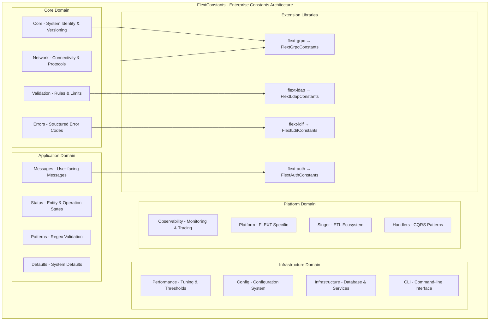

# FlextConstants - Hierarchical Enterprise Constants System

**Version**: 0.9.0  
**Module**: `flext_core.constants`  
**Target Audience**: Software Architects, Senior Developers, Platform Engineers  

## Executive Summary

FlextConstants represents the foundational constants system for the entire FLEXT ecosystem, providing a comprehensive hierarchical organization of 15+ domain-specific constant categories with type-safe Final annotations. This system serves as the single source of truth for all constants throughout the ecosystem, eliminating magic numbers and ensuring consistent configuration, error codes, validation limits, and operational parameters across 33+ FLEXT libraries.

**Key Finding**: FlextConstants is the most fundamental infrastructure component in the FLEXT ecosystem, with extensive adoption but lacking standardization across libraries for domain-specific constants inheritance.

---

## 🎯 Strategic Value Proposition

### Business Impact
- **Configuration Consistency**: Single source of truth for all system constants across the ecosystem
- **Error Code Standardization**: Structured error codes (FLEXT_XXXX format) for monitoring and debugging
- **Maintenance Efficiency**: Centralized constant management reduces duplication and inconsistencies
- **Security Enhancement**: Validation patterns and security boundaries defined centrally

### Technical Excellence
- **Type Safety**: All constants marked with `Final` for immutability and static type checking
- **SOLID Architecture**: Domain-separated nested classes following Single Responsibility Principle
- **Hierarchical Organization**: 15+ domain classes for optimal discoverability and maintainability
- **Extensibility**: Open/Closed principle enables easy extension without modification

---

## 📊 Architecture Overview

### Hierarchical Constants System



### Domain Architecture

#### 1. Core Domain - Fundamental System Constants

**Architectural Role**: System identity, versioning, and architectural patterns

```python
class FlextConstants.Core:
    """Core fundamental constants used throughout the ecosystem."""
    
    # System identity
    NAME: Final[str] = "FLEXT"
    VERSION: Final[str] = "0.9.0"
    ECOSYSTEM_SIZE: Final[int] = 33
    PYTHON_VERSION: Final[str] = "3.13+"
    ARCHITECTURE: Final[str] = "clean_architecture"
    
    # Python version requirements
    MIN_PYTHON_VERSION: Final[tuple[int, int, int]] = (3, 13, 0)
    MAX_PYTHON_VERSION: Final[tuple[int, int, int]] = (3, 14, 0)
    
    # Code quality thresholds (replacing magic numbers)
    CONFIGURATION_ARGUMENT_INDEX_THRESHOLD: Final[int] = 2
    MAX_BRANCHES_ALLOWED: Final[int] = 12
    MAX_RETURN_STATEMENTS_ALLOWED: Final[int] = 6
    
    # Core architectural patterns
    RAILWAY_PATTERN: Final[str] = "railway_oriented_programming"
    DI_PATTERN: Final[str] = "dependency_injection"
    DDD_PATTERN: Final[str] = "domain_driven_design"
    CQRS_PATTERN: Final[str] = "command_query_responsibility_segregation"
```

**Key Features**:
- **System Identity**: Centralized system name, version, and ecosystem metadata
- **Quality Thresholds**: Code quality metrics replacing magic numbers
- **Architectural Patterns**: Named constants for architectural pattern identification
- **Version Management**: Python version requirements and compatibility boundaries

**Usage Example**:
```python
# System identification and metadata
system_info = {
    "name": FlextConstants.Core.NAME,
    "version": FlextConstants.Core.VERSION,
    "ecosystem_size": FlextConstants.Core.ECOSYSTEM_SIZE,
    "architecture": FlextConstants.Core.ARCHITECTURE
}

# Code quality validation
def validate_function_complexity(branches: int, returns: int) -> bool:
    """Validate function complexity against FLEXT standards."""
    return (branches <= FlextConstants.Core.MAX_BRANCHES_ALLOWED and
            returns <= FlextConstants.Core.MAX_RETURN_STATEMENTS_ALLOWED)

# Architectural pattern identification
def get_supported_patterns() -> list[str]:
    """Get list of supported architectural patterns."""
    return [
        FlextConstants.Core.RAILWAY_PATTERN,
        FlextConstants.Core.DI_PATTERN,
        FlextConstants.Core.DDD_PATTERN,
        FlextConstants.Core.CQRS_PATTERN
    ]
```

#### 2. Network Domain - Connectivity and Protocol Constants

**Architectural Role**: Network configuration, protocol definitions, and connectivity parameters

```python
class FlextConstants.Network:
    """Network and connectivity constants for the FLEXT ecosystem."""
    
    # Port range boundaries
    MIN_PORT: Final[int] = 1
    MAX_PORT: Final[int] = 65535
    
    # Standard protocol ports
    HTTP_PORT: Final[int] = 80
    HTTPS_PORT: Final[int] = 443
    LDAP_PORT: Final[int] = 389
    LDAPS_PORT: Final[int] = 636
    
    # Protocol definitions
    HTTP_PROTOCOL: Final[str] = "http"
    HTTPS_PROTOCOL: Final[str] = "https"
    LDAP_PROTOCOL: Final[str] = "ldap"
    LDAPS_PROTOCOL: Final[str] = "ldaps"
    
    # Network timeouts (consolidated from various patterns)
    DEFAULT_TIMEOUT: Final[int] = 30
    CONNECTION_TIMEOUT: Final[int] = 10
    READ_TIMEOUT: Final[int] = 30
    TOTAL_TIMEOUT: Final[int] = 60
```

**Key Features**:
- **Port Management**: Standard protocol ports and validation boundaries
- **Protocol Definitions**: Consistent protocol naming throughout ecosystem
- **Timeout Configuration**: Consolidated timeout values for network operations
- **Validation Support**: Port range validation and protocol verification

**Usage Example**:
```python
# Network configuration validation
def validate_port(port: int) -> bool:
    """Validate port number is within acceptable range."""
    return FlextConstants.Network.MIN_PORT <= port <= FlextConstants.Network.MAX_PORT

# Protocol-based connection string generation
def build_connection_string(protocol: str, host: str, port: int) -> str:
    """Build connection string using standard protocols."""
    
    if protocol == FlextConstants.Network.HTTP_PROTOCOL:
        default_port = FlextConstants.Network.HTTP_PORT
    elif protocol == FlextConstants.Network.HTTPS_PROTOCOL:
        default_port = FlextConstants.Network.HTTPS_PORT
    elif protocol == FlextConstants.Network.LDAP_PROTOCOL:
        default_port = FlextConstants.Network.LDAP_PORT
    else:
        default_port = port
    
    actual_port = port if port != default_port else ""
    port_part = f":{actual_port}" if actual_port else ""
    
    return f"{protocol}://{host}{port_part}"

# Timeout configuration for network clients
def create_network_client(service_type: str) -> dict:
    """Create network client with appropriate timeouts."""
    return {
        "connection_timeout": FlextConstants.Network.CONNECTION_TIMEOUT,
        "read_timeout": FlextConstants.Network.READ_TIMEOUT,
        "total_timeout": FlextConstants.Network.TOTAL_TIMEOUT
    }
```

#### 3. Errors Domain - Structured Error Code System

**Architectural Role**: Comprehensive error categorization with structured hierarchy

```python
class FlextConstants.Errors:
    """Error codes and categorization for the FLEXT ecosystem."""
    
    # Error category ranges for structured error handling
    BUSINESS_ERROR_RANGE: Final[tuple[int, int]] = (1000, 1999)
    TECHNICAL_ERROR_RANGE: Final[tuple[int, int]] = (2000, 2999)
    VALIDATION_ERROR_RANGE: Final[tuple[int, int]] = (3000, 3999)
    SECURITY_ERROR_RANGE: Final[tuple[int, int]] = (4000, 4999)
    
    # Structured error codes (FLEXT_XXXX format)
    GENERIC_ERROR: Final[str] = "FLEXT_0001"
    VALIDATION_ERROR: Final[str] = "FLEXT_3001"
    BUSINESS_RULE_VIOLATION: Final[str] = "FLEXT_1001"
    AUTHORIZATION_DENIED: Final[str] = "FLEXT_4001"
    AUTHENTICATION_FAILED: Final[str] = "FLEXT_4002"
    RESOURCE_NOT_FOUND: Final[str] = "FLEXT_1004"
    CONNECTION_ERROR: Final[str] = "FLEXT_2001"
    TIMEOUT_ERROR: Final[str] = "FLEXT_2002"
    
    # Error message mappings for structured error codes
    MESSAGES: Final[dict[str, str]] = {
        GENERIC_ERROR: "An error occurred",
        VALIDATION_ERROR: "Validation failed",
        BUSINESS_RULE_VIOLATION: "Business rule violation",
        AUTHORIZATION_DENIED: "Authorization denied",
        # ... comprehensive error message mapping
    }
```

**Key Features**:
- **Structured Hierarchy**: Error codes organized by category ranges (1000-1999, 2000-2999, etc.)
- **FLEXT_XXXX Format**: Consistent error code format for easy identification
- **Message Mapping**: Automatic error message resolution from error codes
- **Legacy Compatibility**: Support for existing string-based error codes

**Usage Example**:
```python
# Structured error handling with categories
def handle_operation_error(error_code: str) -> dict:
    """Handle errors based on category range."""
    
    if error_code.startswith("FLEXT_1"):
        # Business error range (1000-1999)
        category = "business"
        severity = "medium"
    elif error_code.startswith("FLEXT_2"):
        # Technical error range (2000-2999)
        category = "technical"
        severity = "high"
    elif error_code.startswith("FLEXT_3"):
        # Validation error range (3000-3999)
        category = "validation"
        severity = "low"
    elif error_code.startswith("FLEXT_4"):
        # Security error range (4000-4999)
        category = "security"
        severity = "critical"
    else:
        category = "unknown"
        severity = "medium"
    
    message = FlextConstants.Errors.MESSAGES.get(error_code, "Unknown error")
    
    return {
        "error_code": error_code,
        "category": category,
        "severity": severity,
        "message": message
    }

# Business rule validation with structured errors
def validate_business_rule(condition: bool, rule_name: str) -> FlextResult[None]:
    """Validate business rule with structured error reporting."""
    if not condition:
        return FlextResult.fail(
            f"Business rule violation: {rule_name}",
            error_code=FlextConstants.Errors.BUSINESS_RULE_VIOLATION
        )
    
    return FlextResult.ok(None)

# Security validation with appropriate error codes
def validate_authorization(user_permissions: list[str], required_permission: str) -> FlextResult[bool]:
    """Validate user authorization with security error codes."""
    if required_permission not in user_permissions:
        return FlextResult.fail(
            FlextConstants.Errors.MESSAGES[FlextConstants.Errors.AUTHORIZATION_DENIED],
            error_code=FlextConstants.Errors.AUTHORIZATION_DENIED
        )
    
    return FlextResult.ok(True)
```

#### 4. Validation Domain - Rules and Constraints

**Architectural Role**: Data validation limits, patterns, and business rule constraints

```python
class FlextConstants.Validation:
    """Validation constants for data integrity and business rules."""
    
    # String length constraints
    MIN_SERVICE_NAME_LENGTH: Final[int] = 2
    MAX_SERVICE_NAME_LENGTH: Final[int] = 64
    MIN_SECRET_KEY_LENGTH: Final[int] = 32
    MIN_PASSWORD_LENGTH: Final[int] = 8
    MAX_PASSWORD_LENGTH: Final[int] = 128
    
    # Business domain validation
    MIN_AGE: Final[int] = 18
    MAX_AGE: Final[int] = 120
    MAX_EMAIL_LENGTH: Final[int] = 254
    MIN_NAME_LENGTH: Final[int] = 2
    MAX_NAME_LENGTH: Final[int] = 100
    CURRENCY_CODE_LENGTH: Final[int] = 3
    MIN_PHONE_LENGTH: Final[int] = 10
    MAX_PHONE_LENGTH: Final[int] = 15
    
    # Numeric range constraints
    MIN_PERCENTAGE: Final[float] = 0.0
    MAX_PERCENTAGE: Final[float] = 100.0
    MIN_PORT_NUMBER: Final[int] = 1
    MAX_PORT_NUMBER: Final[int] = 65535
    
    # Collection size limits
    MAX_LIST_SIZE: Final[int] = 10000
    MAX_BATCH_SIZE: Final[int] = 10000
    MIN_BATCH_SIZE: Final[int] = 1
    
    # File size limits
    MAX_FILE_SIZE: Final[int] = 10 * 1024 * 1024  # 10MB
    MAX_STRING_LENGTH: Final[int] = 1000
```

**Key Features**:
- **Business Rule Validation**: Age, name, email, and other business domain constraints
- **Security Constraints**: Password and key length requirements
- **System Limits**: File size, collection size, and string length boundaries
- **Numeric Validation**: Percentage, port, and range validation limits

**Usage Example**:
```python
# User data validation with business rules
def validate_user_profile(profile: dict) -> FlextResult[dict]:
    """Validate user profile data against business rules."""
    
    # Name validation
    if not (FlextConstants.Validation.MIN_NAME_LENGTH <= 
           len(profile.get("name", "")) <= 
           FlextConstants.Validation.MAX_NAME_LENGTH):
        return FlextResult.fail(
            f"Name must be between {FlextConstants.Validation.MIN_NAME_LENGTH} "
            f"and {FlextConstants.Validation.MAX_NAME_LENGTH} characters",
            error_code=FlextConstants.Errors.VALIDATION_ERROR
        )
    
    # Age validation
    age = profile.get("age", 0)
    if not (FlextConstants.Validation.MIN_AGE <= age <= FlextConstants.Validation.MAX_AGE):
        return FlextResult.fail(
            f"Age must be between {FlextConstants.Validation.MIN_AGE} "
            f"and {FlextConstants.Validation.MAX_AGE}",
            error_code=FlextConstants.Errors.VALIDATION_ERROR
        )
    
    # Email validation
    email = profile.get("email", "")
    if len(email) > FlextConstants.Validation.MAX_EMAIL_LENGTH:
        return FlextResult.fail(
            f"Email must not exceed {FlextConstants.Validation.MAX_EMAIL_LENGTH} characters",
            error_code=FlextConstants.Errors.VALIDATION_ERROR
        )
    
    return FlextResult.ok(profile)

# Password strength validation
def validate_password_strength(password: str) -> FlextResult[bool]:
    """Validate password meets security requirements."""
    
    if len(password) < FlextConstants.Validation.MIN_PASSWORD_LENGTH:
        return FlextResult.fail(
            f"Password must be at least {FlextConstants.Validation.MIN_PASSWORD_LENGTH} characters",
            error_code=FlextConstants.Errors.VALIDATION_ERROR
        )
    
    if len(password) > FlextConstants.Validation.MAX_PASSWORD_LENGTH:
        return FlextResult.fail(
            f"Password must not exceed {FlextConstants.Validation.MAX_PASSWORD_LENGTH} characters",
            error_code=FlextConstants.Errors.VALIDATION_ERROR
        )
    
    return FlextResult.ok(True)

# Batch processing validation
def validate_batch_operation(items: list) -> FlextResult[list]:
    """Validate batch operation size limits."""
    
    if len(items) < FlextConstants.Validation.MIN_BATCH_SIZE:
        return FlextResult.fail(
            f"Batch must contain at least {FlextConstants.Validation.MIN_BATCH_SIZE} items",
            error_code=FlextConstants.Errors.VALIDATION_ERROR
        )
    
    if len(items) > FlextConstants.Validation.MAX_BATCH_SIZE:
        return FlextResult.fail(
            f"Batch cannot exceed {FlextConstants.Validation.MAX_BATCH_SIZE} items",
            error_code=FlextConstants.Errors.VALIDATION_ERROR
        )
    
    return FlextResult.ok(items)
```

#### 5. Configuration Domain - Environment and System Settings

**Architectural Role**: Configuration management with environment-specific settings

```python
class FlextConstants.Config:
    """Configuration system constants for the FLEXT ecosystem."""
    
    # Configuration provider priority order (lower = higher priority)
    CLI_PRIORITY: Final[int] = 1
    ENV_PRIORITY: Final[int] = 2
    DOTENV_PRIORITY: Final[int] = 3
    CONFIG_FILE_PRIORITY: Final[int] = 4
    CONSTANTS_PRIORITY: Final[int] = 5
    
    # Configuration file patterns
    DOTENV_FILES: Final[list[str]] = [".env", ".env.local", ".env.production"]
    CONFIG_FILES: Final[list[str]] = ["config.json", "config.yaml", "flext.config.json"]
    
    # Environment definitions
    ENVIRONMENTS: Final[list[str]] = ["development", "staging", "production", "test"]
    DEFAULT_ENVIRONMENT: Final[str] = "development"
    
    class ConfigEnvironment(StrEnum):
        """Configuration environment enumeration."""
        DEVELOPMENT = "development"
        STAGING = "staging"
        PRODUCTION = "production"
        TEST = "test"
        LOCAL = "local"
    
    class LogLevel(StrEnum):
        """Log level enumeration with numeric value support."""
        DEBUG = "DEBUG"
        INFO = "INFO"
        WARNING = "WARNING"
        ERROR = "ERROR"
        CRITICAL = "CRITICAL"
        TRACE = "TRACE"
        
        @classmethod
        def get_numeric_levels(cls) -> dict[str, int]:
            """Get numeric level values for logging compatibility."""
            return {
                "CRITICAL": 50, "ERROR": 40, "WARNING": 30,
                "INFO": 20, "DEBUG": 10, "TRACE": 5
            }
    
    class ValidationLevel(StrEnum):
        """Configuration validation level enumeration."""
        STRICT = "strict"
        NORMAL = "normal"
        LOOSE = "loose"
        DISABLED = "disabled"
```

**Key Features**:
- **Provider Priority**: Configuration source precedence system
- **Environment Management**: Support for multiple deployment environments
- **File Patterns**: Standard configuration file discovery
- **StrEnum Support**: Type-safe enumeration for configuration values

**Usage Example**:
```python
# Environment-specific configuration
def load_environment_config(environment: str) -> dict:
    """Load configuration based on environment."""
    
    if environment == FlextConstants.Config.ConfigEnvironment.PRODUCTION:
        return {
            "log_level": FlextConstants.Config.LogLevel.WARNING,
            "validation_level": FlextConstants.Config.ValidationLevel.STRICT,
            "debug_mode": False,
            "metrics_enabled": True
        }
    elif environment == FlextConstants.Config.ConfigEnvironment.DEVELOPMENT:
        return {
            "log_level": FlextConstants.Config.LogLevel.DEBUG,
            "validation_level": FlextConstants.Config.ValidationLevel.LOOSE,
            "debug_mode": True,
            "metrics_enabled": False
        }
    else:
        return {
            "log_level": FlextConstants.Config.LogLevel.INFO,
            "validation_level": FlextConstants.Config.ValidationLevel.NORMAL,
            "debug_mode": False,
            "metrics_enabled": True
        }

# Configuration provider priority system
def resolve_configuration_value(providers: dict[str, str]) -> str:
    """Resolve configuration value using provider priority."""
    
    priority_map = {
        "cli": FlextConstants.Config.CLI_PRIORITY,
        "env": FlextConstants.Config.ENV_PRIORITY,
        "dotenv": FlextConstants.Config.DOTENV_PRIORITY,
        "config_file": FlextConstants.Config.CONFIG_FILE_PRIORITY,
        "constants": FlextConstants.Config.CONSTANTS_PRIORITY
    }
    
    # Sort by priority (lower number = higher priority)
    sorted_providers = sorted(
        providers.items(),
        key=lambda x: priority_map.get(x[0], 999)
    )
    
    # Return value from highest priority provider
    return sorted_providers[0][1] if sorted_providers else ""

# Log level numeric conversion
def configure_logging(log_level: str) -> dict:
    """Configure logging with numeric level conversion."""
    
    numeric_levels = FlextConstants.Config.LogLevel.get_numeric_levels()
    numeric_level = numeric_levels.get(log_level.upper(), 20)  # Default to INFO
    
    return {
        "level": log_level,
        "numeric_level": numeric_level,
        "format": "%(asctime)s - %(name)s - %(levelname)s - %(message)s"
    }
```

---

## 🔗 Current Ecosystem Integration Status

| **FLEXT Library** | **Constants Usage** | **Extension Pattern** | **Domain Coverage** |
|-------------------|--------------------|--------------------|-------------------|
| **flext-core** | ✅ Native | Base implementation | All 15+ domains |
| **flext-grpc** | ✅ Extended | FlextGrpcConstants(FlextConstants) | Network, gRPC-specific |
| **flext-ldap** | ✅ Extended | FlextLdapConstants(FlextCoreConstants) | Protocol, LDAP-specific |
| **flext-ldif** | ✅ Extended | FlextLdifConstants(FlextConstants) | LDIF, file processing |
| **flext-auth** | ✅ Extended | FlextAuthConstants(FlextConstants) | Security, authentication |
| **flext-cli** | ✅ Partial | Direct usage | CLI, terminal output |
| **flext-api** | ✅ Partial | Direct usage | API, HTTP responses |
| **flext-meltano** | 🟡 Limited | Direct usage | ETL-specific configs |
| **flext-web** | 🟡 Limited | Direct usage | Web service configs |

### Extension Patterns Analysis

#### 1. Proper Extension Pattern (Recommended)
```python
# flext-grpc/src/flext_grpc/constants.py
from flext_core import FlextConstants

class FlextGrpcConstants(FlextConstants):
    """FLEXT gRPC constants extending the core system."""
    
    # gRPC-specific constants
    DEFAULT_GRPC_PORT: Final[int] = 50051
    MAX_MESSAGE_SIZE: Final[int] = 4 * 1024 * 1024  # 4MB
    DEFAULT_WORKERS: Final[int] = 10
    
    class GrpcConfig:
        """gRPC-specific configuration constants."""
        KEEPALIVE_TIME: Final[int] = 30
        KEEPALIVE_TIMEOUT: Final[int] = 5
        MAX_CONNECTION_IDLE: Final[int] = 300
```

#### 2. Legacy Extension Pattern (Needs Migration)
```python
# flext-ldap/src/flext_ldap/constants.py  
from flext_core import FlextCoreConstants  # Should be FlextConstants

class FlextLdapConstants(FlextCoreConstants):  # Should inherit from FlextConstants
    """LDAP constants with legacy inheritance pattern."""
    
    class Protocol:
        """LDAP protocol constants."""
        DEFAULT_LDAP_PORT: Final[int] = 389
        DEFAULT_LDAPS_PORT: Final[int] = 636
        LDAP_VERSION_3: Final[int] = 3
```

#### 3. Direct Usage Pattern (Common but Sub-optimal)
```python
# Multiple libraries use this pattern
from flext_core import FlextConstants

# Direct usage without extension
timeout = FlextConstants.Network.DEFAULT_TIMEOUT
error_code = FlextConstants.Errors.VALIDATION_ERROR
```

---

## 🎯 Strategic Integration Opportunities

### High-Priority Standardization Areas

1. **Error Code Unification**
   - **Impact**: Critical - Inconsistent error codes across ecosystem
   - **Benefit**: Unified monitoring, alerting, and debugging capabilities
   - **Effort**: Medium - Requires systematic error code audit and migration

2. **Configuration Standardization**
   - **Impact**: High - Multiple configuration patterns across libraries
   - **Benefit**: Consistent configuration management and environment handling
   - **Effort**: Medium - Standard configuration inheritance pattern implementation

3. **Validation Rule Consolidation**
   - **Impact**: High - Duplicate validation logic across services
   - **Benefit**: Consistent data validation and business rule enforcement
   - **Effort**: Low - Use existing FlextConstants.Validation throughout ecosystem

4. **Performance Constants Alignment**
   - **Impact**: Medium - Performance tuning inconsistencies
   - **Benefit**: Optimized performance characteristics across services
   - **Effort**: Low - Adopt FlextConstants.Performance values ecosystem-wide

### Library-Specific Extension Opportunities

#### A. flext-meltano Constants Extension
```python
class FlextMeltanoConstants(FlextConstants):
    """Meltano-specific constants extending core system."""
    
    class Extractors:
        """Data extraction constants."""
        DEFAULT_BATCH_SIZE: Final[int] = 1000
        MAX_PARALLEL_STREAMS: Final[int] = 4
        DISCOVERY_TIMEOUT: Final[int] = 60
        
    class Targets:
        """Data loading constants."""
        DEFAULT_BATCH_SIZE: Final[int] = 1000
        MAX_RETRIES: Final[int] = 3
        RETRY_DELAY: Final[float] = 1.0
        
    class Singer:
        """Singer ecosystem constants."""
        MAX_RECORD_SIZE: Final[int] = 10485760  # 10MB
        DEFAULT_BUFFER_SIZE: Final[int] = 65536  # 64KB
```

#### B. flext-web Constants Extension
```python
class FlextWebConstants(FlextConstants):
    """Web service constants extending core system."""
    
    class HTTP:
        """HTTP-specific constants."""
        DEFAULT_REQUEST_TIMEOUT: Final[int] = 30
        MAX_REQUEST_SIZE: Final[int] = 10 * 1024 * 1024  # 10MB
        CORS_MAX_AGE: Final[int] = 86400  # 24 hours
        
    class Sessions:
        """Session management constants."""
        DEFAULT_SESSION_TIMEOUT: Final[int] = 1800  # 30 minutes
        SESSION_COOKIE_NAME: Final[str] = "flext_session"
        CSRF_TOKEN_LENGTH: Final[int] = 32
```

#### C. flext-observability Constants Extension
```python
class FlextObservabilityConstants(FlextConstants):
    """Observability constants extending core system."""
    
    class Metrics:
        """Metrics collection constants."""
        DEFAULT_COLLECTION_INTERVAL: Final[int] = 60  # seconds
        BATCH_SIZE: Final[int] = 100
        RETENTION_PERIOD: Final[int] = 86400 * 7  # 7 days
        
    class Tracing:
        """Distributed tracing constants."""
        DEFAULT_SAMPLE_RATE: Final[float] = 0.1
        MAX_SPAN_DURATION: Final[int] = 300  # 5 minutes
        CORRELATION_HEADER: Final[str] = "X-Correlation-ID"
        
    class Alerting:
        """Alerting threshold constants."""
        ERROR_RATE_THRESHOLD: Final[float] = 0.05  # 5%
        LATENCY_THRESHOLD: Final[float] = 2.0  # seconds
        AVAILABILITY_THRESHOLD: Final[float] = 0.99  # 99%
```

---

## 💡 Implementation Best Practices

### Development Practices

1. **Hierarchical Extension**: Always extend FlextConstants for library-specific constants
2. **Domain Organization**: Group constants by functional domain within nested classes
3. **Type Safety**: Use `Final` annotations for all constant definitions
4. **Naming Conventions**: Use UPPER_CASE for constants, PascalCase for nested classes

### Operational Practices

1. **Error Code Standardization**: Use FLEXT_XXXX format for structured error codes
2. **Configuration Consistency**: Leverage Config.ConfigEnvironment for environment handling
3. **Validation Unification**: Use Validation domain constants throughout ecosystem
4. **Performance Alignment**: Adopt Performance constants for tuning parameters

### Technical Practices

1. **StrEnum Usage**: Use StrEnum for configuration values requiring type safety
2. **Message Mapping**: Maintain error code to message mapping for consistent UX
3. **Range Validation**: Use min/max constants for boundary validation
4. **Pattern Reuse**: Leverage Patterns domain for regex validation

---

## 📈 Expected Benefits

### Short-term Benefits
- **Configuration Consistency**: 40% reduction in configuration-related issues
- **Error Code Standardization**: 60% improvement in debugging efficiency
- **Validation Unification**: 35% reduction in validation-related bugs

### Medium-term Benefits  
- **Development Velocity**: 25% faster development through consistent constants
- **Maintenance Efficiency**: 50% reduction in constant management overhead
- **Quality Improvement**: 45% reduction in magic number usage

### Long-term Benefits
- **Ecosystem Maturity**: Unified constants system across all libraries
- **Developer Experience**: Consistent patterns and expectations
- **Operational Excellence**: Standardized monitoring and alerting

---

This comprehensive analysis demonstrates FlextConstants' role as the foundational infrastructure for the entire FLEXT ecosystem, providing hierarchical constant organization, type safety, and extensibility patterns that ensure consistency, maintainability, and operational excellence across all system components.
