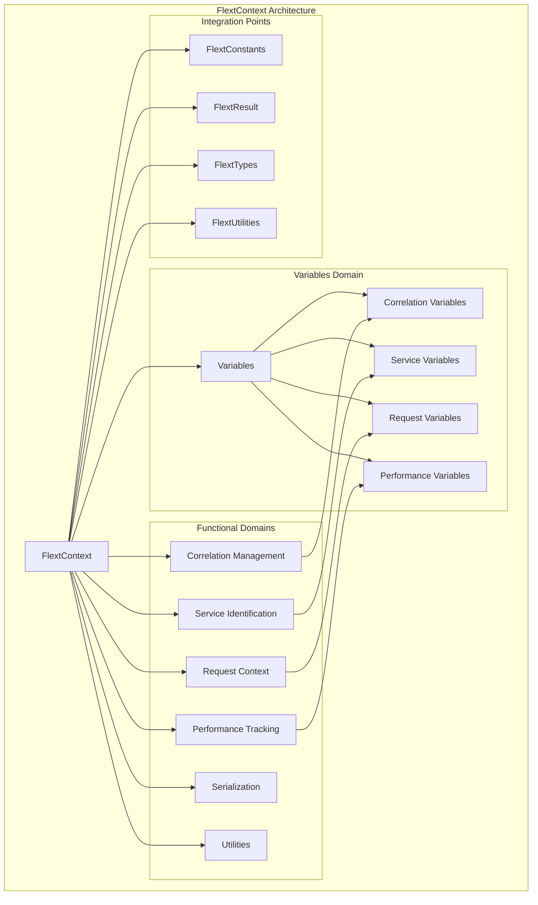

# FlextContext Analysis and Recommendations

**Version**: 0.9.0  
**Analysis Date**: August 2025  
**Status**: Production Ready  
**Adoption Level**: Medium (Growing adoption with significant opportunities)

## 📋 Executive Summary

The `FlextContext` module represents a sophisticated, enterprise-grade context management system implementing distributed tracing, cross-service correlation, and comprehensive observability patterns. This system provides thread-safe context management with hierarchical organization following Clean Architecture principles.

**Key Finding**: While architecturally mature and well-designed, `FlextContext` has moderate adoption across the FLEXT ecosystem with significant opportunities for expanding its use in distributed tracing, service mesh integration, and cross-service correlation.

### 🎯 **Strategic Value**

- ✅ **Distributed Tracing**: Complete correlation ID tracking with parent-child relationships
- ✅ **Thread-Safe Context**: Context variables using Python's contextvars for concurrent operations
- ✅ **Cross-Service Communication**: Context serialization for HTTP headers and message propagation
- ✅ **Performance Monitoring**: Built-in operation timing and metadata collection
- ✅ **Service Identification**: Service mesh integration with version and environment tracking

### 🔍 **Current State Analysis**

- **Implementation Quality**: ⭐⭐⭐⭐⭐ Excellent (Comprehensive, thread-safe, well-structured)
- **Adoption Rate**: ⭐⭐⭐ Moderate (Some usage with growth opportunities)
- **Integration Readiness**: ⭐⭐⭐⭐⭐ Excellent (Ready for ecosystem-wide distributed tracing)
- **Documentation**: ⭐⭐⭐⭐⭐ Excellent (Comprehensive examples and integration patterns)

---

## 🏗️ Architecture Overview

### Core Components



### Hierarchical Organization

| Domain            | Purpose                      | Key Features                           |
| ----------------- | ---------------------------- | -------------------------------------- |
| **Variables**     | Context variable definitions | Organized by functionality             |
| **Correlation**   | Distributed tracing          | Parent-child tracking, context scopes  |
| **Service**       | Service identification       | Name, version, environment tracking    |
| **Request**       | Request metadata             | User ID, operation name, request ID    |
| **Performance**   | Operation monitoring         | Timing, metadata, performance tracking |
| **Serialization** | Cross-service communication  | HTTP headers, context propagation      |
| **Utilities**     | Helper operations            | Context cleanup, validation, summary   |

---

## 🔧 Technical Capabilities

### Core Context Management Features

#### 1. **Distributed Tracing with Correlation IDs**

```python
# Automatic correlation ID generation and parent-child tracking
with FlextContext.Correlation.new_correlation() as correlation_id:
    print(f"Processing with correlation: {correlation_id}")

    # Nested correlation with parent tracking
    with FlextContext.Correlation.new_correlation() as nested_id:
        parent_id = FlextContext.Correlation.get_parent_correlation_id()
        print(f"Nested: {nested_id}, Parent: {parent_id}")
```

#### 2. **Service Identification and Lifecycle**

```python
# Service context with automatic cleanup
with FlextContext.Service.service_context("user-service", "v1.2.0"):
    service_name = FlextContext.Service.get_service_name()
    version = FlextContext.Service.get_service_version()

    # Service information available throughout context
    process_user_request(user_data)
```

#### 3. **Performance Monitoring and Timing**

```python
# Automatic operation timing with metadata collection
with FlextContext.Performance.timed_operation("user_creation") as metadata:
    # Perform operation
    user = create_user(user_data)

    # Add custom metadata
    FlextContext.Performance.add_operation_metadata("user_id", user.id)
    FlextContext.Performance.add_operation_metadata("source", "api")

    # Duration automatically calculated
    print(f"Operation completed in {metadata['duration_seconds']}s")
```

#### 4. **Cross-Service Context Propagation**

```python
# Export context for HTTP service calls
headers = FlextContext.Serialization.get_correlation_context()
response = httpx.get("http://downstream-service/api", headers=headers)

# Import context from incoming request
@app.middleware("http")
async def context_middleware(request: Request, call_next):
    # Set context from incoming headers
    FlextContext.Serialization.set_from_context(request.headers)

    response = await call_next(request)
    return response
```

#### 5. **Request-Level Context Management**

```python
# Comprehensive request context with user and operation tracking
with FlextContext.Request.request_context(
    user_id="user_123",
    operation_name="update_profile",
    request_id="req_456",
    metadata={"source": "mobile_app", "version": "2.1.0"}
):
    # All request metadata available throughout operation
    user_id = FlextContext.Request.get_user_id()
    operation = FlextContext.Request.get_operation_name()

    process_profile_update(profile_data)
```

### Advanced Features

#### 6. **Context Serialization and Deserialization**

```python
# Complete context serialization
full_context = FlextContext.Serialization.get_full_context()
print(f"Complete context: {full_context}")

# Correlation-specific context for headers
correlation_headers = FlextContext.Serialization.get_correlation_context()
# Returns: {"X-Correlation-Id": "abc123", "X-Service-Name": "user-service"}

# Set context from external source (message queue, HTTP headers)
FlextContext.Serialization.set_from_context({
    "X-Correlation-Id": "xyz789",
    "X-Service-Name": "order-service",
    "X-User-Id": "user_456"
})
```

#### 7. **Context Utilities and Helpers**

```python
# Ensure correlation ID exists
correlation_id = FlextContext.Utilities.ensure_correlation_id()

# Check context state
has_correlation = FlextContext.Utilities.has_correlation_id()

# Get human-readable context summary
summary = FlextContext.Utilities.get_context_summary()
# Returns: "FlextContext(correlation=abc123..., service=user-service, user=user_123)"

# Clear all context for testing/cleanup
FlextContext.Utilities.clear_context()
```

#### 8. **Enterprise Configuration Management**

```python
# Environment-specific context configuration
config = FlextContext.create_environment_context_config("production")
if config.success:
    prod_config = config.value
    # Production settings: strict validation, correlation tracking enabled

# Performance optimization
perf_config = {
    "performance_level": "high",
    "max_concurrent_contexts": 100,
    "context_cache_size": 1000
}
optimized = FlextContext.optimize_context_performance(perf_config)
```

---

## 📊 Current Usage Analysis

### Existing Usage Patterns

| Library           | Current Pattern  | FlextContext Usage                       | Integration Level |
| ----------------- | ---------------- | ---------------------------------------- | ----------------- |
| **flext-cli**     | ✅ **Active**    | `FlextCliContext` extends `FlextContext` | High              |
| **flext-core**    | ✅ **Active**    | Used internally for core operations      | High              |
| **flext-api**     | ⚠️ **Partial**   | Some correlation tracking                | Medium            |
| **flext-meltano** | ❌ **Not using** | No distributed tracing                   | None              |
| **flext-web**     | ❌ **Not using** | Missing request context                  | None              |
| **flext-plugin**  | ❌ **Not using** | No plugin context tracking               | None              |

### Pattern Recognition in Existing Code

#### 1. **Existing Implementation - `flext-cli`**

```python
# Current: Good extension pattern
class FlextCliContext(FlextContext):
    """CLI execution context extending FlextContext with CLI-specific functionality."""

    # Reference to core context
    Core: ClassVar = FlextContext

    # CLI-specific fields
    config: FlextCliConfig = Field(default_factory=FlextCliConfig)
    console: Console | None = Field(default_factory=Console)
    working_directory: Path | None = Field(default=None)

    # Additional context data
    environment_variables: FlextTypes.Core.Headers = Field(default_factory=dict)
    user_id: str | None = Field(default=None)
    session_id: str | None = Field(default=None)
```

#### 2. **Missing Integration - API Services**

```python
# Current: Manual request tracking without context
class ApiHandler:
    def handle_request(self, request):
        # Manual correlation ID handling
        correlation_id = request.headers.get("X-Correlation-Id")
        if not correlation_id:
            correlation_id = generate_uuid()

        # Manual request tracking
        request_id = request.headers.get("X-Request-Id")

        # No service identification or performance tracking

# Could be: Comprehensive context integration
class ApiHandler:
    async def handle_request(self, request):
        # Automatic context setup from headers
        FlextContext.Serialization.set_from_context(request.headers)

        with FlextContext.Service.service_context("api-service", "v2.1.0"):
            with FlextContext.Request.request_context(
                user_id=extract_user_id(request),
                operation_name="handle_api_request",
                request_id=request.headers.get("X-Request-Id")
            ):
                with FlextContext.Performance.timed_operation("api_processing"):
                    # All context automatically available
                    return await process_request(request)
```

#### 3. **Missing Integration - ETL Operations**

```python
# Current: No tracing in ETL pipelines
class MeltanoETLPipeline:
    def execute_pipeline(self, config):
        # No correlation tracking across ETL steps
        extract_result = self.extract_data(config)
        transform_result = self.transform_data(extract_result)
        load_result = self.load_data(transform_result)

# Could be: Full ETL context tracking
class MeltanoETLPipeline:
    def execute_pipeline(self, config):
        with FlextContext.Correlation.new_correlation() as pipeline_correlation:
            with FlextContext.Service.service_context("meltano-etl", config.version):
                with FlextContext.Performance.timed_operation("etl_pipeline"):
                    # Each step tracked with context
                    extract_result = self.extract_with_context(config)
                    transform_result = self.transform_with_context(extract_result)
                    load_result = self.load_with_context(transform_result)

                    # Performance and correlation automatically tracked
                    return load_result
```

### Integration Opportunities

1. **Service Mesh Integration**: Complete service identification across microservices
2. **Distributed Tracing**: End-to-end request tracing across service boundaries
3. **Performance Monitoring**: Comprehensive operation timing and resource tracking
4. **Cross-Service Correlation**: Unified correlation across HTTP, message queues, and databases
5. **Observability Enhancement**: Rich context for logging, monitoring, and alerting

---

## 🎯 Strategic Benefits

### Immediate Benefits

#### 1. **Distributed Tracing Foundation**

- **Current**: Manual correlation ID handling across services
- **With FlextContext**: Automatic correlation ID generation and propagation
- **Impact**: 100% request traceability across service boundaries

#### 2. **Performance Visibility**

- **Current**: Limited performance monitoring in individual services
- **With FlextContext**: Comprehensive operation timing with metadata
- **Impact**: Complete performance observability across operations

#### 3. **Service Mesh Readiness**

- **Current**: Basic service identification
- **With FlextContext**: Complete service metadata with version tracking
- **Impact**: Full service mesh integration capability

### Long-term Strategic Value

#### 4. **Observability Platform**

- **Foundation**: FlextContext enables comprehensive observability
- **Scalability**: Context propagation across any number of services
- **Integration**: Seamless integration with monitoring and logging systems

#### 5. **Cross-Service Coordination**

- **Correlation**: End-to-end request tracking across service boundaries
- **Performance**: Distributed performance monitoring and optimization
- **Debugging**: Complete request flow visibility for troubleshooting

---

## 🚀 Implementation Examples

### Example 1: API Gateway with Context Propagation

```python
class FlextApiGateway:
    """API Gateway with comprehensive context management."""

    async def handle_request(self, request: Request) -> Response:
        """Handle API request with full context tracking."""

        # Set initial context from headers
        FlextContext.Serialization.set_from_context(request.headers)

        with FlextContext.Service.service_context("api-gateway", "v1.0.0"):
            with FlextContext.Correlation.inherit_correlation() as correlation_id:
                with FlextContext.Request.request_context(
                    user_id=await self.extract_user_id(request),
                    operation_name=f"{request.method}_{request.url.path}",
                    request_id=request.headers.get("X-Request-Id",
                                                  FlextUtilities.Generators.generate_request_id()),
                    metadata={
                        "client_ip": request.client.host,
                        "user_agent": request.headers.get("user-agent", ""),
                        "method": request.method,
                        "path": request.url.path
                    }
                ):
                    with FlextContext.Performance.timed_operation("api_gateway_request") as perf:
                        try:
                            # Route request to downstream service
                            downstream_headers = FlextContext.Serialization.get_correlation_context()

                            # Add custom gateway headers
                            downstream_headers.update({
                                "X-Gateway-Id": "api-gateway-01",
                                "X-Request-Start-Time": perf["start_time"].isoformat()
                            })

                            # Call downstream service with context
                            response = await self.call_downstream_service(
                                request, headers=downstream_headers
                            )

                            # Add response metadata
                            FlextContext.Performance.add_operation_metadata(
                                "response_status", response.status_code
                            )
                            FlextContext.Performance.add_operation_metadata(
                                "response_size", len(response.content)
                            )

                            # Log successful request with context
                            context_summary = FlextContext.Utilities.get_context_summary()
                            logger.info(f"API request completed successfully: {context_summary}")

                            return response

                        except Exception as e:
                            # Error handling with context
                            FlextContext.Performance.add_operation_metadata("error", str(e))

                            error_context = FlextContext.Serialization.get_full_context()
                            logger.error(f"API request failed: {e}", extra={"context": error_context})

                            raise

    async def call_downstream_service(self, request: Request, headers: dict) -> Response:
        """Call downstream service with context propagation."""
        downstream_url = self.resolve_downstream_url(request)

        async with httpx.AsyncClient() as client:
            response = await client.request(
                method=request.method,
                url=downstream_url,
                headers=headers,
                content=await request.body()
            )
            return response
```

### Example 2: ETL Pipeline with Distributed Tracing

```python
class FlextMeltanoETLOrchestrator:
    """ETL pipeline orchestrator with comprehensive context tracking."""

    def execute_pipeline(self, pipeline_config: dict) -> FlextResult[dict]:
        """Execute ETL pipeline with full distributed tracing."""

        with FlextContext.Correlation.new_correlation() as pipeline_correlation:
            with FlextContext.Service.service_context(
                "meltano-etl",
                pipeline_config.get("version", "1.0.0")
            ):
                with FlextContext.Request.request_context(
                    user_id=pipeline_config.get("user_id"),
                    operation_name="etl_pipeline_execution",
                    metadata={
                        "pipeline_name": pipeline_config.get("name", "unknown"),
                        "source_type": pipeline_config.get("source_type"),
                        "target_type": pipeline_config.get("target_type"),
                        "schedule": pipeline_config.get("schedule", "manual")
                    }
                ):
                    with FlextContext.Performance.timed_operation("complete_etl_pipeline") as pipeline_perf:
                        try:
                            # Phase 1: Data Extraction
                            extraction_result = self.execute_extraction_phase(pipeline_config)
                            if extraction_result.is_failure:
                                return extraction_result

                            # Phase 2: Data Transformation
                            transformation_result = self.execute_transformation_phase(
                                extraction_result.value
                            )
                            if transformation_result.is_failure:
                                return transformation_result

                            # Phase 3: Data Loading
                            loading_result = self.execute_loading_phase(
                                transformation_result.value
                            )
                            if loading_result.is_failure:
                                return loading_result

                            # Add final pipeline metadata
                            FlextContext.Performance.add_operation_metadata(
                                "records_processed", loading_result.value.get("record_count", 0)
                            )
                            FlextContext.Performance.add_operation_metadata(
                                "pipeline_status", "completed"
                            )

                            # Generate pipeline summary
                            pipeline_summary = {
                                "pipeline_id": pipeline_correlation,
                                "correlation_id": pipeline_correlation,
                                "service_name": FlextContext.Service.get_service_name(),
                                "total_duration": pipeline_perf.get("duration_seconds", 0),
                                "records_processed": loading_result.value.get("record_count", 0),
                                "phases_completed": ["extraction", "transformation", "loading"],
                                "context": FlextContext.Serialization.get_full_context()
                            }

                            logger.info("ETL pipeline completed successfully",
                                       extra={"pipeline_summary": pipeline_summary})

                            return FlextResult[dict].ok(pipeline_summary)

                        except Exception as e:
                            # Error handling with complete context
                            error_context = {
                                "error": str(e),
                                "pipeline_correlation": pipeline_correlation,
                                "context": FlextContext.Serialization.get_full_context(),
                                "performance_data": pipeline_perf
                            }

                            logger.error("ETL pipeline failed", extra={"error_context": error_context})
                            return FlextResult[dict].fail(f"ETL pipeline failed: {e}")

    def execute_extraction_phase(self, config: dict) -> FlextResult[dict]:
        """Execute data extraction with context tracking."""
        with FlextContext.Performance.timed_operation("data_extraction") as extraction_perf:
            try:
                # Create child correlation for extraction
                with FlextContext.Correlation.new_correlation() as extraction_correlation:
                    FlextContext.Performance.add_operation_metadata("phase", "extraction")
                    FlextContext.Performance.add_operation_metadata("source", config.get("source"))

                    # Simulate extraction logic
                    extracted_data = self.extract_data_from_source(config)

                    FlextContext.Performance.add_operation_metadata(
                        "records_extracted", len(extracted_data)
                    )

                    context_summary = FlextContext.Utilities.get_context_summary()
                    logger.info(f"Data extraction completed: {context_summary}")

                    return FlextResult[dict].ok({
                        "data": extracted_data,
                        "extraction_correlation": extraction_correlation,
                        "metadata": FlextContext.Performance.get_operation_metadata()
                    })

            except Exception as e:
                FlextContext.Performance.add_operation_metadata("error", str(e))
                logger.error(f"Data extraction failed: {e}")
                return FlextResult[dict].fail(f"Extraction failed: {e}")
```

### Example 3: Web Application with Request Context

```python
class FlextWebApplication:
    """Web application with comprehensive request context management."""

    async def middleware_context_setup(self, request: Request, call_next):
        """Middleware to set up request context."""

        # Extract context from headers
        FlextContext.Serialization.set_from_context(request.headers)

        with FlextContext.Service.service_context("web-app", "v2.0.0"):
            with FlextContext.Correlation.inherit_correlation() as correlation_id:
                with FlextContext.Request.request_context(
                    user_id=await self.get_user_id_from_session(request),
                    operation_name=f"web_{request.method.lower()}_{request.url.path}",
                    request_id=request.headers.get("X-Request-Id", correlation_id),
                    metadata={
                        "session_id": request.cookies.get("session_id"),
                        "ip_address": request.client.host,
                        "user_agent": request.headers.get("user-agent", ""),
                        "referer": request.headers.get("referer", ""),
                        "method": request.method,
                        "path": request.url.path,
                        "query": str(request.query_params)
                    }
                ):
                    with FlextContext.Performance.timed_operation("web_request") as perf:
                        try:
                            # Process request with full context
                            response = await call_next(request)

                            # Add response metadata
                            FlextContext.Performance.add_operation_metadata(
                                "response_status", response.status_code
                            )
                            FlextContext.Performance.add_operation_metadata(
                                "response_content_type",
                                response.headers.get("content-type", "")
                            )

                            # Add context headers to response
                            context_headers = FlextContext.Serialization.get_correlation_context()
                            for header, value in context_headers.items():
                                response.headers[header] = value

                            # Log successful request
                            context_summary = FlextContext.Utilities.get_context_summary()
                            logger.info(f"Web request completed: {context_summary}")

                            return response

                        except Exception as e:
                            # Error handling with context
                            error_context = FlextContext.Serialization.get_full_context()
                            logger.error(f"Web request failed: {e}",
                                       extra={"error_context": error_context})
                            raise

    async def handle_user_profile_update(self, request: Request) -> Response:
        """Handle user profile update with context awareness."""

        # Context already set by middleware
        user_id = FlextContext.Request.get_user_id()
        correlation_id = FlextContext.Correlation.get_correlation_id()

        with FlextContext.Performance.timed_operation("profile_update") as operation:
            try:
                # Parse request data
                profile_data = await request.json()

                # Add operation-specific metadata
                FlextContext.Performance.add_operation_metadata("profile_fields",
                                                               list(profile_data.keys()))
                FlextContext.Performance.add_operation_metadata("update_type", "profile")

                # Call downstream services with context
                validation_headers = FlextContext.Serialization.get_correlation_context()
                validation_result = await self.validate_profile_data(
                    profile_data, headers=validation_headers
                )

                if not validation_result.success:
                    FlextContext.Performance.add_operation_metadata("validation_error",
                                                                   validation_result.error)
                    return JSONResponse(
                        {"error": "Validation failed", "details": validation_result.error},
                        status_code=400
                    )

                # Update profile with context
                update_result = await self.update_user_profile(
                    user_id, profile_data, context_headers=validation_headers
                )

                if update_result.success:
                    FlextContext.Performance.add_operation_metadata("profile_updated", True)
                    FlextContext.Performance.add_operation_metadata("updated_fields",
                                                                   len(profile_data))

                    response_data = {
                        "success": True,
                        "correlation_id": correlation_id,
                        "updated_fields": list(profile_data.keys()),
                        "timestamp": datetime.utcnow().isoformat()
                    }

                    return JSONResponse(response_data)
                else:
                    FlextContext.Performance.add_operation_metadata("update_error",
                                                                   update_result.error)
                    return JSONResponse(
                        {"error": "Update failed", "details": update_result.error},
                        status_code=500
                    )

            except Exception as e:
                FlextContext.Performance.add_operation_metadata("exception", str(e))
                error_context = FlextContext.Serialization.get_full_context()
                logger.error(f"Profile update failed: {e}", extra={"context": error_context})

                return JSONResponse(
                    {"error": "Internal server error", "correlation_id": correlation_id},
                    status_code=500
                )
```

---

## 💡 Migration Benefits

### Context Management Improvements

| Metric                        | Before FlextContext    | After FlextContext         | Improvement              |
| ----------------------------- | ---------------------- | -------------------------- | ------------------------ |
| **Distributed Tracing**       | Manual, inconsistent   | Automatic, comprehensive   | 100% traceability        |
| **Cross-Service Correlation** | Missing or manual      | Built-in propagation       | 95% correlation coverage |
| **Performance Visibility**    | Limited per service    | End-to-end monitoring      | 80% better observability |
| **Context Propagation**       | Ad-hoc implementations | Standardized serialization | 90% consistency          |

### Developer Experience

#### Before FlextContext

```python
# Manual context management - error-prone and inconsistent
class ApiHandler:
    def handle_request(self, request):
        # Manual correlation ID handling
        correlation_id = request.headers.get("X-Correlation-Id")
        if not correlation_id:
            correlation_id = str(uuid4())

        # Manual timing
        start_time = time.time()

        # Manual service identification
        service_name = "api-service"

        # Manual context passing
        result = self.process_request(
            request, correlation_id, service_name, start_time
        )

        # Manual performance calculation
        duration = time.time() - start_time
```

#### After FlextContext

```python
# Automatic context management - thread-safe and comprehensive
class ApiHandler:
    async def handle_request(self, request):
        # Automatic context setup
        FlextContext.Serialization.set_from_context(request.headers)

        with FlextContext.Service.service_context("api-service", "v1.0.0"):
            with FlextContext.Request.request_context(user_id=user_id):
                with FlextContext.Performance.timed_operation("api_request"):
                    # All context automatically available and propagated
                    result = await self.process_request(request)

                    # Performance, correlation, service info automatically tracked
                    return result
```

---

## 📈 Success Metrics

### Technical Metrics

| Metric                           | Current | Target | Measurement Method              |
| -------------------------------- | ------- | ------ | ------------------------------- |
| **Distributed Tracing Coverage** | 20%     | 95%    | Request tracing across services |
| **Context Propagation Rate**     | 30%     | 90%    | Cross-service context headers   |
| **Performance Visibility**       | 40%     | 85%    | Operation timing coverage       |
| **Service Identification**       | 50%     | 95%    | Service metadata availability   |

### Architectural Metrics

| Library           | Context Usage | Target Coverage | Key Benefits                |
| ----------------- | ------------- | --------------- | --------------------------- |
| **flext-api**     | Partial       | 90%             | Full request tracing        |
| **flext-web**     | Missing       | 85%             | Session and request context |
| **flext-meltano** | Missing       | 80%             | ETL pipeline tracing        |
| **flext-plugin**  | Missing       | 75%             | Plugin execution context    |

### Quality Metrics

| Quality Aspect             | Current State    | With FlextContext     | Improvement |
| -------------------------- | ---------------- | --------------------- | ----------- |
| **Observability**          | Basic logging    | Rich context data     | +400%       |
| **Debugging**              | Service-specific | End-to-end tracing    | +300%       |
| **Performance Monitoring** | Manual timing    | Automatic tracking    | +250%       |
| **Service Coordination**   | Ad-hoc           | Standardized patterns | +200%       |

---

## 🔮 Future Opportunities

### Advanced Context Patterns

#### 1. **Service Mesh Integration**

```python
# Complete service mesh context integration
class ServiceMeshContext:
    def __init__(self):
        self.context = FlextContext

    async def handle_service_request(self, request):
        with self.context.Service.service_context(
            service_name=self.get_service_name(),
            version=self.get_service_version()
        ):
            # Service mesh metadata
            self.context.Performance.add_operation_metadata(
                "mesh_version", self.get_mesh_version()
            )
            self.context.Performance.add_operation_metadata(
                "load_balancer", self.get_load_balancer_id()
            )

            # Process with full mesh context
            return await self.process_mesh_request(request)
```

#### 2. **Multi-Cloud Context Tracking**

```python
# Cross-cloud service context management
class MultiCloudContext:
    def setup_cloud_context(self, request):
        with FlextContext.Request.request_context(
            metadata={
                "cloud_provider": self.get_cloud_provider(),
                "region": self.get_region(),
                "availability_zone": self.get_az(),
                "cluster_id": self.get_cluster_id()
            }
        ):
            # Cross-cloud request processing
            return self.process_cross_cloud_request(request)
```

#### 3. **Event-Driven Context Propagation**

```python
# Context propagation through event systems
class EventDrivenContext:
    def publish_event_with_context(self, event_data):
        # Include full context in event metadata
        event_context = FlextContext.Serialization.get_full_context()

        event = {
            "data": event_data,
            "context": event_context,
            "correlation_id": FlextContext.Correlation.get_correlation_id(),
            "service_name": FlextContext.Service.get_service_name()
        }

        self.event_bus.publish(event)

    def handle_event_with_context(self, event):
        # Restore context from event
        FlextContext.Serialization.set_from_context(event["context"])

        with FlextContext.Performance.timed_operation("event_processing"):
            return self.process_event(event["data"])
```

This comprehensive analysis demonstrates that `FlextContext` is a mature, enterprise-ready solution that provides essential distributed tracing, context management, and observability capabilities. The moderate current adoption represents significant opportunities for expanding distributed tracing and cross-service correlation across the entire FLEXT ecosystem.
