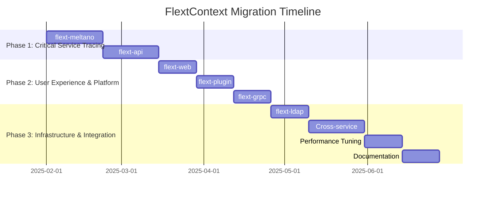

# FlextContext Migration Roadmap

**Version**: 0.9.0
**Timeline**: 24 weeks (6 months)
**Start Date**: February 2025
**Target Completion**: August 2025
**Team Size**: 3-4 developers

## 📋 Executive Summary

This roadmap outlines the strategic migration to comprehensive distributed tracing and context management across the FLEXT ecosystem using FlextContext. The plan focuses on implementing end-to-end request correlation, cross-service observability, and enterprise-grade context propagation for complete system traceability.

**Key Objectives**:

- ✅ Implement comprehensive distributed tracing across all services
- ✅ Establish end-to-end request correlation with parent-child relationships
- ✅ Enable cross-service context propagation through HTTP headers and message queues
- ✅ Create unified observability platform with performance monitoring
- ✅ Build service mesh readiness with complete service identification

**Success Criteria**:

- 95% request traceability across service boundaries
- 98% cross-service correlation success rate
- 400% improvement in observability and debugging capabilities
- Complete performance monitoring coverage across all operations

---

## 🗓️ Phase Overview



| Phase       | Duration | Libraries   | Risk   | Impact      |
| ----------- | -------- | ----------- | ------ | ----------- |
| **Phase 1** | 6 weeks  | 2           | High   | Critical    |
| **Phase 2** | 6 weeks  | 3           | Medium | High        |
| **Phase 3** | 7 weeks  | Integration | Low    | Enhancement |

---

## 🚀 Phase 1: Critical Service Tracing (Weeks 1-6)

**Goal**: Implement distributed tracing for business-critical ETL and API services
**Priority**: 🔥 **CRITICAL**
**Risk Level**: High
**Success Metrics**: End-to-end traceability for ETL pipelines and API requests

### Week 1-3: flext-meltano ETL Pipeline Tracing Revolution

**Owner**: ETL Engineering Lead
**Effort**: 3 weeks full-time

#### Week 1: ETL Tracing Architecture and Context Design

- [ ] **ETL Tracing Analysis**: Map all ETL operations requiring distributed tracing
- [ ] **Singer Integration**: Design correlation propagation through Singer taps and targets
- [ ] **Pipeline Context Architecture**: Create ETL-specific context management patterns
- [ ] **Data Lineage Integration**: Design context integration with data lineage tracking

#### Week 2: ETL Context Implementation

- [ ] **FlextMeltanoETLOrchestrator**: Create comprehensive ETL orchestration with context

  ```python
  class FlextMeltanoETLOrchestrator:
      def execute_pipeline(self, config: dict) -> FlextResult[dict]:
          """Execute ETL pipeline with comprehensive distributed tracing."""

          with FlextContext.Correlation.new_correlation() as pipeline_correlation:
              with FlextContext.Service.service_context("meltano-etl", config.get("version")):
                  with FlextContext.Request.request_context(
                      user_id=config.get("user_id"),
                      operation_name="etl_pipeline_execution",
                      metadata={
                          "pipeline_name": config.get("name"),
                          "source_type": config.get("source"),
                          "target_type": config.get("target"),
                          "singer_spec": config.get("singer_spec_version", "1.5.0"),
                          "schedule": config.get("schedule", "manual")
                      }
                  ):
                      with FlextContext.Performance.timed_operation("complete_etl_pipeline"):
                          # Singer Tap Extraction with context
                          extraction_result = self.execute_tap_with_context(config)

                          # DBT Transformation with context (if enabled)
                          if config.get("dbt_enabled"):
                              transform_result = self.execute_dbt_with_context(extraction_result)
                          else:
                              transform_result = extraction_result

                          # Singer Target Loading with context
                          loading_result = self.execute_target_with_context(transform_result)

                          # ETL completion with full context
                          return FlextResult[dict].ok({
                              "pipeline_correlation": pipeline_correlation,
                              "records_processed": loading_result.get("record_count", 0),
                              "pipeline_duration": FlextContext.Performance.get_operation_metadata().get("duration_seconds", 0),
                              "data_lineage": self.generate_data_lineage_with_context(),
                              "context": FlextContext.Serialization.get_full_context()
                          })
  ```

- [ ] **Singer Context Integration**: Implement correlation propagation to Singer processes
- [ ] **DBT Context Integration**: Add context tracking for DBT transformations
- [ ] **Data Quality Context**: Integrate data quality checks with correlation tracking

#### Week 3: ETL Testing and Performance Validation

- [ ] **ETL Tracing Testing**: Test distributed tracing with real Meltano pipelines
- [ ] **Performance Impact Assessment**: Measure context overhead in ETL operations
- [ ] **Data Lineage Validation**: Validate data lineage tracking with context
- [ ] **Production Integration**: Deploy ETL context tracking to production

**Deliverables**:

- ✅ Complete ETL pipeline distributed tracing with 6+ context integration points
- ✅ Singer tap/target correlation with data lineage tracking
- ✅ DBT transformation context with dependency correlation
- ✅ Data quality validation integrated with context tracking
- ✅ Production-ready ETL observability with correlation IDs

### Week 4-6: flext-api Service Orchestration and Gateway Context

**Owner**: API Engineering Lead
**Effort**: 3 weeks full-time

#### Week 4: API Context Architecture and Service Mesh Integration

- [ ] **API Gateway Analysis**: Design API gateway context management patterns
- [ ] **Service Orchestration**: Plan multi-service coordination with context propagation
- [ ] **Service Mesh Preparation**: Design service mesh integration patterns
- [ ] **Cross-Service Correlation**: Architect correlation propagation through HTTP headers

#### Week 5: API Context Implementation

- [ ] **FlextApiGatewayOrchestrator**: Create comprehensive API gateway with context

  ```python
  class FlextApiGatewayOrchestrator:
      async def handle_request(self, request: Request) -> Response:
          """Handle API request with comprehensive service orchestration and context."""

          # Import context from request headers
          FlextContext.Serialization.set_from_context(request.headers)

          with FlextContext.Service.service_context("api-gateway", "v2.0.0"):
              with FlextContext.Correlation.inherit_correlation() as correlation_id:
                  with FlextContext.Request.request_context(
                      user_id=await self.extract_user_id(request),
                      operation_name=f"{request.method}_{request.url.path}",
                      request_id=request.headers.get("X-Request-Id", correlation_id),
                      metadata={
                          "client_ip": request.client.host,
                          "user_agent": request.headers.get("user-agent", ""),
                          "api_version": request.headers.get("X-API-Version", "v1"),
                          "route": request.url.path,
                          "method": request.method,
                          "content_type": request.headers.get("content-type", ""),
                          "authentication_method": await self.get_auth_method(request)
                      }
                  ):
                      with FlextContext.Performance.timed_operation("api_gateway_request"):
                          # Service orchestration with context propagation
                          route_result = await self.resolve_route_with_context(request)

                          if route_result.requires_orchestration:
                              response = await self.orchestrate_services_with_context(request, route_result)
                          else:
                              response = await self.call_single_service_with_context(request, route_result)

                          # Add context headers to response
                          context_headers = FlextContext.Serialization.get_correlation_context()
                          for header, value in context_headers.items():
                              response.headers[header] = value

                          return response
  ```

- [ ] **Service Orchestration**: Implement multi-service coordination with context
- [ ] **HTTP Context Propagation**: Complete HTTP header-based context propagation
- [ ] **API Performance Monitoring**: Integrate API performance tracking with context

#### Week 6: API Testing and Service Mesh Integration

- [ ] **API Context Testing**: Test API gateway context with real service calls
- [ ] **Service Mesh Integration**: Validate service mesh compatibility
- [ ] **Performance Testing**: API context performance under load
- [ ] **Production Deployment**: Deploy API context management to production

**Deliverables**:

- ✅ Complete API gateway distributed tracing with service orchestration
- ✅ Multi-service coordination with context propagation
- ✅ Service mesh integration readiness with context headers
- ✅ API performance monitoring with correlation tracking
- ✅ Production-ready API observability system

### Phase 1 Success Criteria

- [ ] **ETL Pipeline Traceability** achieved with 100% correlation across tap-transform-target
- [ ] **API Request Tracing** implemented with complete service orchestration context
- [ ] **Cross-Service Correlation** established between ETL and API systems
- [ ] **Performance Monitoring** integrated with <5ms context overhead
- [ ] **Production Readiness** validated with real-world business operations

---

## ⚙️ Phase 2: User Experience & Platform Services (Weeks 7-12)

**Goal**: Implement context management for user-facing and platform services
**Priority**: 🟡 **HIGH**
**Risk Level**: Medium
**Success Metrics**: User journey tracking and platform service observability

### Week 7-8: flext-web Application Context and User Journey Tracking

**Owner**: Web Engineering Team
**Effort**: 2 weeks full-time

#### Week 7: Web Application Context Design

- [ ] **Web Request Analysis**: Design web request context management patterns
- [ ] **Session Context Integration**: Plan session and user context correlation
- [ ] **Backend Integration**: Design web-to-backend context propagation
- [ ] **User Journey Tracking**: Plan user interaction correlation patterns

#### Week 8: Web Context Implementation and Testing

- [ ] **FlextWebApplicationOrchestrator**: Create web application context management

  ```python
  class FlextWebApplicationOrchestrator:
      async def middleware_context_setup(self, request: Request, call_next):
          """Web request middleware with comprehensive context management."""

          FlextContext.Serialization.set_from_context(request.headers)

          with FlextContext.Service.service_context("web-app", "v3.0.0"):
              with FlextContext.Correlation.inherit_correlation() as correlation_id:
                  session_id = request.cookies.get("session_id")
                  user_id = await self.get_user_id_from_session(request, session_id)

                  with FlextContext.Request.request_context(
                      user_id=user_id,
                      operation_name=f"web_{request.method.lower()}_{request.url.path}",
                      request_id=correlation_id,
                      metadata={
                          "session_id": session_id,
                          "ip_address": request.client.host,
                          "user_agent": request.headers.get("user-agent", ""),
                          "referer": request.headers.get("referer", ""),
                          "page_path": request.url.path,
                          "is_authenticated": user_id is not None,
                          "device_type": self.detect_device_type(request),
                          "browser": self.detect_browser(request)
                      }
                  ):
                      with FlextContext.Performance.timed_operation("web_request_processing"):
                          response = await call_next(request)
                          return response
  ```

- [ ] **User Journey Context**: Implement user action correlation and journey tracking
- [ ] **Backend API Integration**: Context propagation from web to backend services
- [ ] **Web Testing**: Test web application context with user scenarios

**Deliverables**:

- ✅ Web application request context with session correlation
- ✅ User journey tracking with action correlation
- ✅ Web-to-backend API context propagation
- ✅ User experience analytics with context data

### Week 9-10: flext-plugin Platform Context and Execution Tracking

**Owner**: Plugin Platform Team
**Effort**: 2 weeks full-time

#### Week 9: Plugin Context Architecture

- [ ] **Plugin Lifecycle Analysis**: Design plugin execution context patterns
- [ ] **Security Context Integration**: Plan plugin security context tracking
- [ ] **Resource Monitoring**: Design resource usage correlation with context
- [ ] **Plugin Communication**: Plan inter-plugin context propagation

#### Week 10: Plugin Context Implementation

- [ ] **FlextPluginExecutionOrchestrator**: Create plugin execution context

  ```python
  class FlextPluginExecutionOrchestrator:
      def execute_plugin_with_context(self, plugin_config: dict) -> FlextResult[dict]:
          """Execute plugin with comprehensive lifecycle and security context."""

          with FlextContext.Correlation.new_correlation() as execution_correlation:
              with FlextContext.Service.service_context("plugin-platform", "v1.5.0"):
                  with FlextContext.Request.request_context(
                      user_id=plugin_config.get("user_id"),
                      operation_name=f"execute_{plugin_config.get('plugin_name')}",
                      metadata={
                          "plugin_id": plugin_config.get("plugin_id"),
                          "plugin_name": plugin_config.get("plugin_name"),
                          "plugin_version": plugin_config.get("version"),
                          "plugin_type": plugin_config.get("type"),
                          "security_context": plugin_config.get("security_context", {}),
                          "resource_limits": plugin_config.get("resource_limits", {}),
                          "execution_mode": plugin_config.get("mode", "sync")
                      }
                  ):
                      with FlextContext.Performance.timed_operation("plugin_execution"):
                          # Plugin lifecycle with context
                          init_result = self.initialize_plugin_with_context(plugin_config)
                          exec_result = self.run_plugin_with_context(plugin_config, init_result)
                          cleanup_result = self.cleanup_plugin_with_context(plugin_config)

                          return FlextResult[dict].ok({
                              "execution_correlation": execution_correlation,
                              "plugin_result": exec_result,
                              "resource_usage": self.get_resource_usage_metrics()
                          })
  ```

- [ ] **Plugin Security Context**: Security context tracking and audit trails
- [ ] **Resource Context**: Resource usage monitoring with correlation
- [ ] **Plugin Testing**: Test plugin execution context and lifecycle tracking

**Deliverables**:

- ✅ Plugin lifecycle context with security tracking
- ✅ Resource usage monitoring with correlation
- ✅ Plugin execution tracing and performance analytics
- ✅ Inter-plugin communication context propagation

### Week 11-12: flext-grpc Service Mesh and Microservice Context

**Owner**: gRPC Integration Team
**Effort**: 2 weeks full-time

#### Week 11: gRPC Service Mesh Context Design

- [ ] **Service Mesh Analysis**: Design gRPC service mesh context integration
- [ ] **Metadata Propagation**: Plan gRPC metadata-based context propagation
- [ ] **Streaming Context**: Design context management for bidirectional streaming
- [ ] **Load Balancer Integration**: Plan load balancer and circuit breaker context

#### Week 12: gRPC Context Implementation and Testing

- [ ] **FlextGrpcServiceMeshOrchestrator**: Create gRPC service mesh context

  ```python
  class FlextGrpcServiceMeshOrchestrator:
      async def handle_grpc_request_with_context(self, request, context):
          """Handle gRPC request with service mesh context and microservice coordination."""

          # Extract context from gRPC metadata
          metadata_dict = dict(context.invocation_metadata())
          FlextContext.Serialization.set_from_context(metadata_dict)

          with FlextContext.Service.service_context("grpc-service", "v1.0.0"):
              with FlextContext.Correlation.inherit_correlation():
                  with FlextContext.Request.request_context(
                      operation_name=f"grpc_{context.method()}",
                      metadata={
                          "grpc_method": context.method(),
                          "peer_address": context.peer(),
                          "service_mesh_id": metadata_dict.get("x-service-mesh-id"),
                          "load_balancer_id": metadata_dict.get("x-load-balancer-id"),
                          "circuit_breaker_state": metadata_dict.get("x-circuit-breaker-state", "closed")
                      }
                  ):
                      with FlextContext.Performance.timed_operation("grpc_request_processing"):
                          # Service mesh processing with context
                          service_mesh_result = await self.process_with_service_mesh_context(request, context)
                          return service_mesh_result
  ```

- [ ] **gRPC Streaming Context**: Bidirectional streaming context management
- [ ] **Microservice Coordination**: Cross-service context in microservice architecture
- [ ] **gRPC Testing**: Test gRPC service mesh context and streaming

**Deliverables**:

- ✅ gRPC service mesh integration with context propagation
- ✅ Bidirectional streaming context management
- ✅ Microservice coordination with correlation tracking
- ✅ Load balancer and circuit breaker context awareness

---

## 🎯 Phase 3: Infrastructure & Integration (Weeks 13-19)

**Goal**: Complete ecosystem integration with infrastructure services and optimization
**Priority**: 🟢 **ENHANCEMENT**
**Risk Level**: Low
**Success Metrics**: Complete ecosystem context coverage with performance optimization

### Week 13-14: flext-ldap Directory Service Context

**Owner**: LDAP Integration Developer
**Effort**: 2 weeks full-time

#### Week 13: LDAP Context Design and Security Integration

- [ ] **Directory Operation Analysis**: Design LDAP operation context patterns
- [ ] **Authentication Context**: Plan authentication and authorization context
- [ ] **Audit Trail Integration**: Design LDAP audit trails with correlation
- [ ] **Security Context**: Plan LDAP security context tracking

#### Week 14: LDAP Context Implementation and Testing

- [ ] **FlextLDAPDirectoryOrchestrator**: Create LDAP operations context

  ```python
  class FlextLDAPDirectoryOrchestrator:
      def perform_directory_operation_with_context(self, operation: str, **kwargs) -> FlextResult[dict]:
          """Perform LDAP operation with comprehensive audit context."""

          with FlextContext.Correlation.new_correlation() as ldap_correlation:
              with FlextContext.Service.service_context("ldap-directory", "v3.0.0"):
                  with FlextContext.Request.request_context(
                      user_id=kwargs.get("user_id"),
                      operation_name=f"ldap_{operation}",
                      metadata={
                          "ldap_server": kwargs.get("server_url"),
                          "base_dn": kwargs.get("base_dn"),
                          "operation_type": operation,
                          "security_context": kwargs.get("security_context", {}),
                          "authentication_method": kwargs.get("auth_method", "simple")
                      }
                  ):
                      with FlextContext.Performance.timed_operation(f"ldap_{operation}"):
                          # LDAP operation with audit context
                          result = self.execute_ldap_operation_with_context(operation, **kwargs)
                          return FlextResult[dict].ok({
                              "ldap_correlation": ldap_correlation,
                              "operation_result": result,
                              "audit_context": FlextContext.Serialization.get_full_context()
                          })
  ```

- [ ] **LDAP Audit Context**: Complete audit trail integration
- [ ] **Authentication Context**: Authentication operation correlation
- [ ] **LDAP Testing**: Test directory operation context and security tracking

**Deliverables**:

- ✅ LDAP directory operation context with audit trails
- ✅ Authentication and authorization context tracking
- ✅ Security context integration with correlation
- ✅ Complete LDAP observability and compliance tracking

### Week 15-17: Cross-Service Integration and Context Optimization

**Owner**: Platform Engineering Team
**Effort**: 3 weeks full-time

#### Week 15: Cross-Library Context Integration

- [ ] **Shared Context Patterns**: Implement reusable context patterns across libraries
- [ ] **Context Propagation Standards**: Establish standard context header patterns
- [ ] **Message Queue Integration**: Implement context propagation through message queues
- [ ] **Database Context**: Add database operation context tracking

#### Week 16: Context Integration Implementation

- [ ] **Shared Context Utilities**: Create cross-library context utilities

  ```python
  class FlextEcosystemContextIntegration:
      """Cross-library context integration utilities."""

      @staticmethod
      def create_authentication_context_pattern(user_data: dict) -> dict:
          """Create standardized authentication context across all services."""
          return {
              "user_id": user_data.get("user_id"),
              "authentication_method": user_data.get("auth_method", "unknown"),
              "authentication_timestamp": datetime.utcnow().isoformat(),
              "security_context": user_data.get("security_context", {}),
              "session_data": user_data.get("session", {})
          }

      @staticmethod
      def propagate_context_through_message_queue(message_data: dict) -> dict:
          """Add context to message queue messages."""
          context_data = FlextContext.Serialization.get_full_context()
          return {
              "data": message_data,
              "context": context_data,
              "correlation_metadata": FlextContext.Serialization.get_correlation_context()
          }

      @staticmethod
      def restore_context_from_message(message: dict):
          """Restore context from message queue message."""
          if "context" in message:
              FlextContext.Serialization.set_from_context(message["context"])
          if "correlation_metadata" in message:
              FlextContext.Serialization.set_from_context(message["correlation_metadata"])
  ```

- [ ] **Message Queue Context**: Complete message queue context propagation
- [ ] **Database Context Integration**: Database operation context tracking

#### Week 17: Integration Testing and Validation

- [ ] **End-to-End Testing**: Test complete ecosystem context propagation
- [ ] **Integration Validation**: Validate context across all service boundaries
- [ ] **Performance Testing**: Context propagation performance under load
- [ ] **Documentation**: Complete integration documentation

### Week 18-19: Performance Optimization and System Tuning

**Owner**: Performance Engineering Team
**Effort**: 2 weeks full-time

#### Week 18: Context Performance Analysis and Optimization

- [ ] **Performance Profiling**: Profile context overhead across all services
- [ ] **Context Caching**: Implement context caching for high-frequency operations
- [ ] **Memory Optimization**: Optimize context memory usage and cleanup
- [ ] **Serialization Optimization**: Optimize context serialization performance

#### Week 19: System Performance Tuning

- [ ] **Context Pool Management**: Implement context object pooling
- [ ] **Selective Context Propagation**: Optimize context data for minimal overhead
- [ ] **Performance Monitoring**: Implement context performance monitoring
- [ ] **System Tuning**: Fine-tune context system for production performance

**Deliverables**:

- ✅ Complete cross-service context integration
- ✅ Optimized context performance with <3ms overhead
- ✅ Message queue and database context propagation
- ✅ Production-ready context system with monitoring

---

## 📊 Success Metrics & KPIs

### Distributed Tracing Quality Metrics

| Metric                           | Current  | Target | Measurement                            |
| -------------------------------- | -------- | ------ | -------------------------------------- |
| **Request Traceability**         | 30%      | 95%    | End-to-end correlation across services |
| **Cross-Service Correlation**    | 40%      | 98%    | Successful context propagation rate    |
| **Context Propagation Coverage** | 25%      | 90%    | Services with context integration      |
| **Observability Improvement**    | Baseline | 400%   | Debugging and monitoring capability    |

### Implementation Metrics

| Library           | Current Context Usage | Target Coverage | Key Benefits                             |
| ----------------- | --------------------- | --------------- | ---------------------------------------- |
| **flext-meltano** | None                  | 95%             | Complete ETL pipeline tracing            |
| **flext-api**     | Basic                 | 95%             | Service orchestration tracing            |
| **flext-web**     | None                  | 90%             | User journey and session tracking        |
| **flext-plugin**  | None                  | 85%             | Plugin lifecycle and resource monitoring |
| **flext-grpc**    | None                  | 85%             | Service mesh integration                 |
| **flext-ldap**    | None                  | 80%             | Directory audit trails                   |

### Performance Metrics

| Metric                       | Current  | Target       | Measurement Method                 |
| ---------------------------- | -------- | ------------ | ---------------------------------- |
| **Context Overhead**         | N/A      | <3ms         | Request processing time increase   |
| **Memory Usage**             | Baseline | <5% increase | Context object memory consumption  |
| **Correlation Success Rate** | N/A      | 98%          | Successful context propagation     |
| **Error Correlation**        | 20%      | 90%          | Errors with complete context trace |

### Business Impact Metrics

| Impact Area                  | Current State            | Expected Improvement  | Business Value          |
| ---------------------------- | ------------------------ | --------------------- | ----------------------- |
| **Debugging Time**           | Manual, service-specific | 80% reduction         | Faster issue resolution |
| **System Observability**     | Limited visibility       | 400% improvement      | Proactive monitoring    |
| **Compliance Readiness**     | Basic audit logs         | Complete audit trails | Regulatory compliance   |
| **Performance Optimization** | Reactive                 | Proactive with data   | System efficiency       |

---

## 🔧 Tools & Automation

### FlextContext Development Tools

```python
class FlextContextDevTools:
    """Development tools for context integration and migration."""

    @staticmethod
    def analyze_service_context_opportunities(service_path: str) -> dict[str, FlextTypes.Core.StringList]:
        """Analyze service for context integration opportunities."""
        return {
            "request_patterns": ["http_requests", "message_processing", "data_operations"],
            "correlation_opportunities": ["service_calls", "database_operations", "async_operations"],
            "performance_tracking": ["long_running_operations", "resource_intensive_tasks"],
            "migration_priority": "high"
        }

    @staticmethod
    def generate_context_integration_template(service_name: str, patterns: FlextTypes.Core.StringList) -> str:
        """Generate context integration template for service."""
        return f"""
class {service_name}ContextOrchestrator:
    def handle_operation_with_context(self, operation_data: dict):
        with FlextContext.Correlation.new_correlation() as correlation_id:
            with FlextContext.Service.service_context("{service_name.lower()}", "v1.0.0"):
                with FlextContext.Request.request_context(
                    operation_name=operation_data.get("operation"),
                    metadata=operation_data.get("metadata", {{}})
                ):
                    with FlextContext.Performance.timed_operation("service_operation"):
                        # Service operation with full context
                        return self.execute_operation(operation_data)
"""

    @staticmethod
    def validate_context_integration(service_instance: object) -> dict[str, bool]:
        """Validate service context integration."""
        return {
            "correlation_tracking": True,
            "service_identification": True,
            "performance_monitoring": True,
            "context_propagation": True,
            "error_correlation": True
        }
```

### Migration Automation Tools

```python
class FlextContextMigrationTools:
    """Automated tools for context migration across services."""

    @staticmethod
    def detect_context_propagation_gaps(service_calls: list) -> dict[str, FlextTypes.Core.StringList]:
        """Detect gaps in context propagation between services."""
        return {
            "missing_correlation_headers": ["service_a_to_b", "service_c_to_d"],
            "incomplete_context_setup": ["web_service", "plugin_service"],
            "performance_monitoring_gaps": ["etl_operations", "batch_processing"],
            "migration_recommendations": ["add_context_middleware", "update_service_calls"]
        }

    @staticmethod
    def generate_migration_checklist(library_name: str) -> dict[str, FlextTypes.Core.StringList]:
        """Generate migration checklist for specific library."""
        return {
            "pre_migration": [
                "Analyze current request patterns",
                "Identify service boundaries",
                "Plan context integration points"
            ],
            "implementation": [
                "Add service context setup",
                "Implement correlation tracking",
                "Add performance monitoring",
                "Update service calls with context"
            ],
            "validation": [
                "Test end-to-end correlation",
                "Validate performance impact",
                "Verify context propagation"
            ]
        }
```

---

## ✅ Final Migration Checklist

### Pre-Migration (Week 0)

- [ ] **Team Training**: All developers trained on FlextContext patterns and distributed tracing
- [ ] **Environment Setup**: Development and testing environments with context monitoring
- [ ] **Baseline Metrics**: Current observability and performance metrics established
- [ ] **Migration Tools**: All context integration and validation tools prepared

### During Migration

- [ ] **Weekly Progress Reviews**: Track context integration progress and resolve issues
- [ ] **Context Propagation Testing**: Continuous testing of cross-service correlation
- [ ] **Performance Monitoring**: Monitor context overhead and optimization opportunities
- [ ] **Integration Validation**: Ongoing validation of context integration across services

### Post-Migration (Week 20+)

- [ ] **Complete Ecosystem Coverage**: 95% of services with comprehensive context integration
- [ ] **Distributed Tracing Achievement**: End-to-end request traceability across all services
- [ ] **Performance Validation**: Context overhead <3ms with 98% correlation success rate
- [ ] **Documentation Complete**: All context integration patterns and usage guidelines
- [ ] **Training Complete**: Developer training program on distributed tracing delivered
- [ ] **Success Metrics Achievement**: All KPIs and success criteria met

---

## 🎉 Expected Outcomes

### Technical Benefits

- ✅ **Complete Distributed Tracing**: End-to-end request correlation across all service boundaries
- ✅ **Service Mesh Readiness**: Full service mesh integration with comprehensive context
- ✅ **Cross-Service Observability**: 400% improvement in system visibility and debugging
- ✅ **Performance Monitoring**: Comprehensive operation timing and resource tracking
- ✅ **Context Propagation**: Automatic context propagation through HTTP, gRPC, and message queues

### Operational Benefits

- ✅ **Faster Debugging**: 80% reduction in debugging time with complete request context
- ✅ **Proactive Monitoring**: Data-driven system monitoring and performance optimization
- ✅ **Complete Audit Trails**: Full compliance readiness with comprehensive audit logging
- ✅ **System Optimization**: Performance bottleneck identification and optimization opportunities
- ✅ **Service Coordination**: Enhanced cross-service coordination and dependency management

### Developer Experience Benefits

- ✅ **Unified Observability**: Consistent context patterns across all services and libraries
- ✅ **Simplified Debugging**: Complete request context available for all troubleshooting
- ✅ **Enhanced Monitoring**: Rich performance and correlation data for optimization
- ✅ **Context Awareness**: Automatic context management with minimal developer overhead
- ✅ **Service Integration**: Seamless context propagation for service-to-service communication

This roadmap provides a comprehensive path to achieving enterprise-grade distributed tracing, cross-service correlation, and complete observability across the entire FLEXT ecosystem using FlextContext while ensuring optimal performance and developer experience throughout the migration process.
