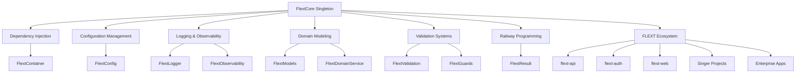

# FlextCore - Enterprise Orchestration Hub

**Comprehensive facade providing unified access to the complete FLEXT ecosystem through a thread-safe singleton interface with railway-oriented programming.**

---

## Executive Summary

`FlextCore` serves as the **central orchestration hub** for all 32+ projects in the FLEXT ecosystem, providing a single point of entry for dependency injection, domain modeling, validation, logging, observability, and architectural patterns. This comprehensive facade implements enterprise-grade patterns through a thread-safe singleton interface, enabling consistent system management across all FLEXT components.

### Key Statistics
- **Module Size**: 28,361 tokens (2,662 lines)
- **Core Functionality**: 80+ methods across 15+ functional areas
- **Integration Scope**: All 32+ FLEXT ecosystem projects
- **Architecture Pattern**: Singleton Facade with Lazy Loading
- **Thread Safety**: Full concurrent access support

---

## Architecture Overview

### Core Design Principles

FlextCore implements several critical architectural patterns:

1. **Singleton Pattern**: Thread-safe single instance across application lifecycle
2. **Facade Pattern**: Unified interface to complex subsystems
3. **Lazy Loading**: On-demand initialization of resource-intensive components
4. **Railway-Oriented Programming**: Composable error handling with FlextResult
5. **Dependency Injection**: Enterprise container management with factory patterns

### System Integration



---

## Core Functionality

### 1. System Management

```python
from flext_core.core import FlextCore

# Thread-safe singleton access
core = FlextCore.get_instance()

# System health and information
health = core.health_check()  # FlextResult[dict]
system_info = core.get_system_info()  # dict
cache_reset = core.reset_all_caches()  # FlextResult[None]
```

### 2. Dependency Injection

```python
# Service registration
registration = core.register_service("database", DatabaseService())
factory_reg = core.register_factory("cache", lambda: RedisCache())

# Service retrieval
db_service = core.get_service("database")  # FlextResult[DatabaseService]

# Bulk service setup with validation
services = {
    "database": DatabaseService,
    "cache": CacheService,
    "metrics": MetricsCollector
}
container_result = core.setup_container_with_services(
    services, 
    validator=core.validate_service_name
)
```

### 3. Configuration Management

```python
# Environment-specific configuration
dev_config = core.create_environment_core_config("development")
prod_config = core.create_environment_core_config("production")

# Performance optimization
optimized = core.optimize_core_performance(config)

# Environment variable loading
env_config = core.load_config_from_env(prefix="FLEXT_")

# Configuration merging and validation
merged = core.merge_configs(config1, config2, config3)
validation = core.validate_config_with_types(config, required_keys)
```

### 4. Logging and Observability

```python
# Global logging configuration
core.configure_logging(log_level="INFO", _json_output=True)

# Contextual logging
logger = core.create_log_context(user_id="123", operation="create")
core.log_info("Operation completed", result="success")
core.log_error("Validation failed", error_code="INVALID_EMAIL")

# Performance tracking
@core.track_performance("user_creation")
def create_user(data):
    return process_user_data(data)
```

### 5. Railway-Oriented Programming

```python
# Result creation and composition
success_result = core.ok(user_data)
failure_result = core.fail("Validation error")
exception_result = core.from_exception(ValueError("Invalid input"))

# Result sequence processing
results = [validate_name(name), validate_email(email), validate_age(age)]
combined = core.sequence(results)  # FlextResult[list]

# Function composition
pipeline = core.pipe(
    validate_input,
    transform_data,
    save_to_database,
    send_notification
)
result = pipeline(user_data)
```

### 6. Domain Modeling

```python
# Entity creation
user_result = core.create_entity(
    User,
    id="user123",
    name="John Doe",
    email="john@example.com"
)

# Value object creation
money_result = core.create_value_object(
    Money,
    amount=100.50,
    currency="USD"
)

# Aggregate root creation
order_result = core.create_aggregate_root(
    Order,
    customer_id="cust123",
    items=[item1, item2]
)

# Domain event creation
event_result = core.create_domain_event(
    "UserCreated",
    {"user_id": "123", "timestamp": datetime.now()}
)
```

### 7. Validation and Guards

```python
# String validation
name_result = core.validate_string(
    user_input,
    min_length=2,
    max_length=100
)

# Numeric validation
age_result = core.validate_numeric(
    age_value,
    min_value=0,
    max_value=150
)

# Specialized validation
email_result = core.validate_email("user@example.com")
service_result = core.validate_service_name("user_service")

# Guard assertions
core.require_not_none(value, "Value cannot be None")
core.require_non_empty(text, "Text cannot be empty")
core.require_positive(number, "Number must be positive")
```

### 8. Dynamic Class Generation

```python
# Dynamic entity with validators
UserEntity = core.create_entity_with_validators(
    "User",
    fields={
        "name": (str, {"min_length": 2, "max_length": 100}),
        "email": (str, {"pattern": r"^[^@]+@[^@]+\.[^@]+$"}),
        "age": (int, {"ge": 18, "le": 120})
    },
    validators={
        "name": name_validator,
        "email": email_validator,
        "age": age_validator
    }
)

# Dynamic service processor
ServiceProcessor = core.create_service_processor(
    "OrderProcessor",
    process_func=process_order,
    validation_rules=["required", "positive_amount"]
)

# Dynamic validator class
EmailValidator = core.create_validator_class(
    "EmailValidator",
    validation_func=validate_email_format
)
```

---

## Property Access to Subsystems

FlextCore provides direct access to all FLEXT subsystems through properties:

### Instance-based Components (Lazy-loaded)
- `core.container` → FlextContainer (Dependency injection)
- `core.config` → FlextConfig (Configuration management)
- `core.context` → FlextContext (Request context)
- `core.logger` → FlextLogger (Structured logging)
- `core.observability` → FlextObservability (Monitoring)

### Static Class Access
- `core.commands` → FlextCommands (CQRS commands)
- `core.decorators` → FlextDecorators (Cross-cutting concerns)
- `core.domain_services` → FlextDomainService (Domain services)
- `core.exceptions` → FlextExceptions (Exception handling)
- `core.fields` → FlextFields (Field validation)
- `core.guards` → FlextGuards (Type guards and assertions)
- `core.handlers` → FlextHandlers (Enterprise handlers)
- `core.mixins` → FlextMixins (Behavioral patterns)
- `core.models` → FlextModels (Domain modeling)
- `core.processors` → FlextProcessors (Data processing)
- `core.services` → FlextServices (Service layer)
- `core.utilities` → FlextUtilities (Helper functions)
- `core.validation` → FlextValidation (Validation systems)

---

## Utility Functions

### ID Generation
```python
uuid_id = core.generate_uuid()  # UUID
correlation_id = core.generate_correlation_id()  # Identifier
entity_id = core.generate_entity_id()  # Identifier
```

### Safe Operations
```python
# Safe function calls with fallbacks
result = core.safe_call(risky_function, default_value)

# Text truncation
truncated = core.truncate(long_text, max_length=100)

# Batch processing
batches = core.batch_process(large_list, batch_size=100)
```

### Factory Methods
```python
# Generic factory creation
factory_result = core.create_factory("database", **db_config)

# Message creation for cross-service communication
message_result = core.create_message(
    "UserCreated",
    user_id="123",
    correlation_id=correlation_id
)
```

---

## Thread Safety and Performance

### Concurrent Access
- **Thread-safe singleton**: Multiple threads can safely access `get_instance()`
- **Lazy loading**: Heavy subsystems initialized only when needed
- **Resource optimization**: Configurable performance settings
- **Memory management**: Efficient caching and cleanup

### Performance Features
```python
# Performance monitoring
@core.track_performance("critical_operation")
def critical_operation(data):
    return process_data(data)

# Cache management
cache_reset = core.reset_all_caches()

# System optimization
optimized_config = core.optimize_core_performance({
    "performance_level": "high",
    "memory_limit_mb": 1024,
    "cpu_cores": 8
})
```

---

## Integration Patterns

### FLEXT Ecosystem Integration

FlextCore serves as the foundation for all FLEXT libraries:

1. **flext-api**: HTTP services with FlextResult responses
2. **flext-auth**: Authentication with FlextModels entities
3. **flext-web**: Web applications with dependency injection
4. **flext-db-oracle**: Database operations with railway patterns
5. **Singer ecosystem**: Data pipelines with validation
6. **Go services**: Cross-language integration via Python bridge

### Cross-Service Communication
```python
# Service discovery and communication
api_service = core.get_service("api_gateway")
auth_result = core.get_service("auth_service")

# Cross-service messaging
message = core.create_message(
    "ProcessOrder",
    order_id="order123",
    customer_id="cust456"
)
```

---

## Configuration Examples

### Development Environment
```python
core = FlextCore.get_instance()

# Development-specific configuration
dev_config = core.create_environment_core_config("development")
if dev_config.success:
    core.configure_core_system(dev_config.value)
    core.configure_logging(log_level="DEBUG", _json_output=False)
```

### Production Environment
```python
# Production optimization
prod_config = core.create_environment_core_config("production")
optimized = core.optimize_core_performance({
    "performance_level": "high",
    "memory_limit_mb": 2048,
    "cpu_cores": 16
})

if prod_config.success and optimized.success:
    merged_config = core.merge_configs(prod_config.value, optimized.value)
    core.configure_core_system(merged_config.value)
    core.configure_logging(log_level="INFO", _json_output=True)
```

---

## Error Handling

FlextCore implements comprehensive error handling through railway-oriented programming:

```python
# Composable error handling
user_creation_result = (
    core.validate_string(user_data.get("name"), min_length=2)
    .flat_map(lambda _: core.validate_email(user_data.get("email")))
    .flat_map(lambda _: core.create_entity(User, **user_data))
    .map(lambda user: core.log_info(f"User created: {user.id}"))
    .map_error(lambda error: core.log_error(f"User creation failed: {error}"))
)

if user_creation_result.success:
    user = user_creation_result.value
    print(f"Created user: {user.name}")
else:
    print(f"Error: {user_creation_result.error}")
```

---

## Best Practices

### 1. Singleton Usage
```python
# ✅ Correct - Use get_instance()
core = FlextCore.get_instance()

# ❌ Incorrect - Don't instantiate directly
# core = FlextCore()  # This will not work as expected
```

### 2. Service Registration
```python
# ✅ Correct - With validation
services = {"database": DatabaseService, "cache": CacheService}
result = core.setup_container_with_services(
    services, 
    validator=core.validate_service_name
)

# ✅ Correct - Individual registration
core.register_service("user_service", UserService())
core.register_factory("temp_service", lambda: TemporaryService())
```

### 3. Railway Programming
```python
# ✅ Correct - Composable operations
result = (
    core.validate_input(data)
    .flat_map(lambda d: core.process_data(d))
    .map(lambda processed: core.save_data(processed))
    .tap(lambda saved: core.log_info("Data saved successfully"))
)

# ✅ Correct - Error handling
if result.success:
    return result.value
else:
    core.log_error("Operation failed", error=result.error)
    return default_value
```

### 4. Configuration Management
```python
# ✅ Correct - Environment-aware configuration
config = core.create_environment_core_config("production")
if config.success:
    optimized = core.optimize_core_performance(config.value)
    if optimized.success:
        core.configure_core_system(optimized.value)
```

---

## See Also

- **[FlextContainer](../container/README.md)**: Dependency injection implementation
- **[FlextResult](../result/README.md)**: Railway-oriented programming patterns  
- **[FlextConfig](../config/README.md)**: Configuration management system
- **[FlextObservability](../observability/README.md)**: Monitoring and observability
- **[FlextValidation](../validation/README.md)**: Comprehensive validation system
- **[FlextModels](../models/README.md)**: Domain modeling patterns
- **[FlextHandlers](../handlers/README.md)**: Enterprise handler patterns

---

*This documentation reflects FlextCore as the central orchestration hub for the entire FLEXT ecosystem, providing unified access to all architectural patterns and enterprise functionality through a thread-safe singleton interface.*
