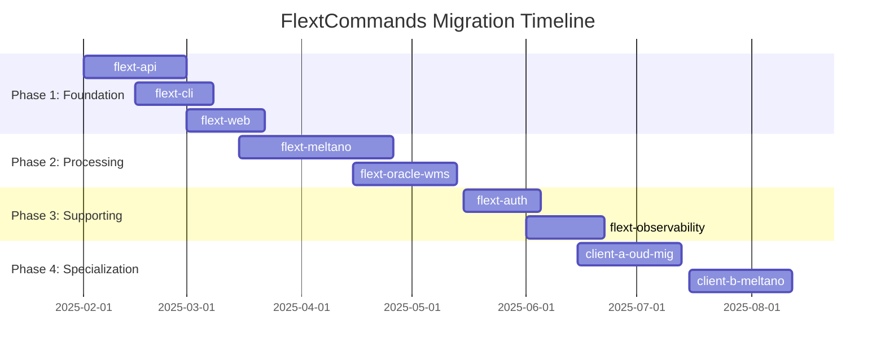

# FlextCommands Migration Roadmap

**Version**: 1.0  
**Timeline**: 36 weeks (9 months)  
**Start Date**: February 2025  
**Target Completion**: October 2025  
**Team Size**: 2-3 developers

## 📋 Executive Summary

This roadmap outlines the strategic migration of the FLEXT ecosystem to adopt FlextCommands CQRS patterns. The plan is structured in 4 phases, prioritizing high-impact libraries first while minimizing risk and maintaining business continuity.

**Key Objectives**:
- ✅ Establish consistent CQRS patterns across ecosystem
- ✅ Improve code quality, testability, and maintainability  
- ✅ Enable better audit trails and monitoring
- ✅ Reduce architectural debt and inconsistencies

**Success Criteria**:
- 100% of critical libraries using FlextCommands
- >90% test coverage for new command/query implementations
- Zero regression in existing functionality
- Improved developer productivity metrics

---

## 🗓️ Phase Overview



| Phase | Duration | Libraries | Risk | Impact |
|-------|----------|-----------|------|--------|
| **Phase 1** | 8 weeks | 3 | Medium | Critical |
| **Phase 2** | 10 weeks | 2 | High | High |  
| **Phase 3** | 6 weeks | 2 | Low | Medium |
| **Phase 4** | 12 weeks | 2+ | Low | Low |

---

## 🚀 Phase 1: Foundation (Weeks 1-8)

**Goal**: Establish CQRS patterns in user-facing libraries  
**Priority**: 🔥 **CRITICAL**  
**Risk Level**: Medium  
**Success Metrics**: API consistency, improved validation, better error handling

### Week 1-4: flext-api Migration

**Owner**: Senior Backend Developer  
**Effort**: 4 weeks full-time

#### Week 1: Analysis & Design
- [ ] **API Audit**: Document all existing endpoints
- [ ] **Command Identification**: Map write operations to commands
- [ ] **Query Identification**: Map read operations to queries  
- [ ] **Validation Analysis**: Document current validation rules
- [ ] **Error Mapping**: Catalog existing error responses

#### Week 2: Core Implementation
- [ ] **Command Models**: Implement 5 core commands
  ```python
  CreateUserCommand, UpdateUserCommand, DeleteUserCommand
  CreateConfigCommand, UpdateConfigCommand
  ```
- [ ] **Query Models**: Implement 5 core queries
  ```python
  GetUserQuery, ListUsersQuery, SearchUsersQuery
  GetConfigQuery, ValidateConfigQuery
  ```
- [ ] **Handler Base Classes**: Create reusable handler patterns
- [ ] **Command Bus Setup**: Configure central command routing

#### Week 3: Handler Implementation  
- [ ] **Command Handlers**: Implement business logic handlers
- [ ] **Query Handlers**: Implement data retrieval handlers
- [ ] **Validation Integration**: Ensure comprehensive validation
- [ ] **Error Handling**: Standardize error responses
- [ ] **Unit Tests**: Achieve >90% test coverage

#### Week 4: Integration & Testing
- [ ] **API Integration**: Update FastAPI/Flask endpoints
- [ ] **Response Formatting**: Standardize API responses
- [ ] **Integration Tests**: End-to-end testing
- [ ] **Performance Testing**: Ensure no regression
- [ ] **Documentation**: API documentation updates

**Deliverables**:
- ✅ 10+ commands/queries implemented
- ✅ Complete handler implementations
- ✅ Updated API endpoints  
- ✅ Test coverage >90%
- ✅ Updated documentation

### Week 3-6: flext-cli Migration

**Owner**: CLI/DevTools Developer  
**Effort**: 3 weeks full-time

#### Week 3: CLI Analysis
- [ ] **Command Audit**: Document all CLI commands
- [ ] **Parameter Analysis**: Map current parameter handling
- [ ] **Validation Review**: Document validation logic
- [ ] **Error Analysis**: Review error handling patterns

#### Week 4: Command Implementation
- [ ] **CLI Commands**: Implement structured commands
  ```python
  ExecutePipelineCommand, CreateProjectCommand, DeployServiceCommand
  InitializeCommand, ConfigureCommand
  ```
- [ ] **CLI Queries**: Implement information queries
  ```python
  GetStatusQuery, ListResourcesQuery, GetConfigQuery
  GetLogsQuery, GetMetricsQuery
  ```

#### Week 5: Integration
- [ ] **Click Integration**: Update CLI decorators
- [ ] **Command Bus**: Integrate with CLI execution
- [ ] **Error Handling**: Improve CLI error messages
- [ ] **Testing**: CLI integration testing

#### Week 6: Polish & Documentation
- [ ] **User Experience**: Refine CLI interactions
- [ ] **Help System**: Update help documentation
- [ ] **Examples**: Create usage examples
- [ ] **Migration Guide**: Document CLI changes

**Deliverables**:
- ✅ Structured CLI commands implemented
- ✅ Improved validation and error handling
- ✅ Updated CLI interface
- ✅ Complete testing coverage
- ✅ User documentation

### Week 5-8: flext-web Migration

**Owner**: Frontend/Web Developer  
**Effort**: 3 weeks full-time

#### Week 5: Web Interface Analysis
- [ ] **Handler Review**: Analyze current web handlers
- [ ] **Form Processing**: Map form submissions to commands
- [ ] **Data Display**: Map views to queries
- [ ] **Validation Audit**: Document form validation

#### Week 6: Implementation
- [ ] **Web Commands**: Implement form-based commands
  ```python
  CreateWebAppCommand, UpdateWebAppCommand, ConfigureWebAppCommand
  ```
- [ ] **Web Queries**: Implement data display queries  
  ```python
  GetDashboardDataQuery, GetApplicationStatusQuery, GetMetricsQuery
  ```

#### Week 7: Integration
- [ ] **Flask Integration**: Update route handlers
- [ ] **Form Handling**: Integrate command processing
- [ ] **Error Display**: Improve error presentation
- [ ] **AJAX Support**: Update asynchronous operations

#### Week 8: Testing & Polish
- [ ] **UI Testing**: Automated UI tests
- [ ] **User Testing**: Manual testing scenarios
- [ ] **Performance**: Ensure responsive UI
- [ ] **Documentation**: Web interface docs

**Deliverables**:
- ✅ Web command/query implementation
- ✅ Improved form handling and validation
- ✅ Better error presentation
- ✅ Complete testing coverage
- ✅ Updated user interface

### Phase 1 Success Criteria
- [ ] **All critical APIs** using CQRS patterns
- [ ] **Consistent validation** across all user interfaces
- [ ] **Standardized error handling** with clear messages
- [ ] **>90% test coverage** for new implementations
- [ ] **Zero functionality regression** in existing features
- [ ] **Improved developer experience** with better documentation

---

## 🔧 Phase 2: Processing (Weeks 9-18)

**Goal**: Migrate complex processing libraries to CQRS  
**Priority**: 🟡 **HIGH**  
**Risk Level**: High (complex business logic)  
**Success Metrics**: Better testability, clearer separation of concerns

### Week 9-14: flext-meltano Migration

**Owner**: Data Engineering Lead  
**Effort**: 6 weeks full-time

#### Week 9-10: Analysis & Decomposition
- [ ] **Executor Analysis**: Break down monolithic executors
- [ ] **Operation Mapping**: Map operations to commands/queries
- [ ] **Dependency Analysis**: Identify service dependencies
- [ ] **Data Flow Mapping**: Document ETL data flows

#### Week 11-12: Core Command Implementation
- [ ] **Pipeline Commands**: 
  ```python
  RunMeltanoPipelineCommand, StopMeltanoPipelineCommand
  InstallPluginCommand, ConfigurePluginCommand, UpgradePluginCommand
  ```
- [ ] **Data Commands**:
  ```python
  ExtractDataCommand, ValidateDataCommand, TransformDataCommand, LoadDataCommand
  ```

#### Week 13: Query Implementation
- [ ] **Status Queries**:
  ```python
  GetPipelineStatusQuery, GetExecutionLogsQuery, GetMetricsQuery
  ```
- [ ] **Configuration Queries**:
  ```python
  ListPluginsQuery, GetPluginConfigQuery, ValidateConfigQuery
  ```

#### Week 14: Integration & Testing
- [ ] **Service Integration**: Connect handlers to Meltano services
- [ ] **Error Handling**: Comprehensive error scenarios
- [ ] **Performance Testing**: ETL performance validation
- [ ] **Integration Testing**: End-to-end pipeline testing

**Deliverables**:
- ✅ Decomposed monolithic executors
- ✅ 15+ commands/queries for ETL operations  
- ✅ Improved testability and maintainability
- ✅ Better error handling and logging
- ✅ Performance benchmarks maintained

### Week 15-18: flext-oracle-wms Migration

**Owner**: Database/Integration Developer  
**Effort**: 4 weeks full-time

#### Week 15: Database Operation Analysis
- [ ] **Query Analysis**: Catalog database operations  
- [ ] **Transaction Mapping**: Map operations to commands
- [ ] **Read Operation Mapping**: Map queries to query objects
- [ ] **Performance Analysis**: Current performance baseline

#### Week 16-17: Implementation
- [ ] **WMS Commands**:
  ```python
  CreateShipmentCommand, UpdateInventoryCommand, ProcessReceiptCommand
  ```
- [ ] **WMS Queries**:
  ```python
  GetInventoryQuery, GetShipmentStatusQuery, SearchOrdersQuery
  ```

#### Week 18: Integration & Optimization
- [ ] **Database Integration**: Optimize query performance
- [ ] **Transaction Handling**: Ensure data consistency
- [ ] **Testing**: Database integration testing  
- [ ] **Performance Validation**: Maintain query performance

**Deliverables**:
- ✅ Structured database operations
- ✅ Improved query organization and performance
- ✅ Better transaction handling
- ✅ Comprehensive testing coverage

### Phase 2 Success Criteria
- [ ] **Complex processing libraries** successfully migrated
- [ ] **Improved maintainability** through better separation
- [ ] **Enhanced testing capabilities** for business logic
- [ ] **Performance maintained** or improved
- [ ] **Better error handling** in processing operations

---

## 🛡️ Phase 3: Supporting (Weeks 19-24)

**Goal**: Migrate supporting infrastructure libraries  
**Priority**: 🟢 **MEDIUM**  
**Risk Level**: Low  
**Success Metrics**: Consistent patterns, improved security operations

### Week 19-21: flext-auth Migration

**Owner**: Security/Auth Developer  
**Effort**: 3 weeks full-time

#### Week 19: Security Analysis
- [ ] **Auth Flow Mapping**: Document authentication flows
- [ ] **Permission Analysis**: Map authorization operations
- [ ] **Security Requirements**: Validate security constraints

#### Week 20: Implementation
- [ ] **Auth Commands**:
  ```python
  AuthenticateUserCommand, RefreshTokenCommand, RevokeTokenCommand
  GrantPermissionCommand, UpdateUserRoleCommand
  ```
- [ ] **Auth Queries**:
  ```python
  ValidateTokenQuery, GetUserPermissionsQuery, CheckPermissionQuery
  ```

#### Week 21: Security Testing
- [ ] **Security Testing**: Validate auth operations
- [ ] **Performance Testing**: Auth performance validation
- [ ] **Integration Testing**: Cross-system auth testing

### Week 22-24: flext-observability Migration

**Owner**: DevOps/Monitoring Developer  
**Effort**: 3 weeks full-time

#### Week 22: Monitoring Analysis
- [ ] **Metrics Mapping**: Map monitoring operations
- [ ] **Alert Analysis**: Document alerting workflows
- [ ] **Dashboard Analysis**: Map dashboard operations

#### Week 23: Implementation  
- [ ] **Monitoring Commands**:
  ```python
  RecordMetricCommand, CreateAlertCommand, UpdateDashboardCommand
  ```
- [ ] **Monitoring Queries**:
  ```python
  GetMetricsQuery, GetAlertsQuery, GetSystemHealthQuery
  ```

#### Week 24: Integration
- [ ] **Monitoring Integration**: Connect to monitoring systems
- [ ] **Dashboard Updates**: Update monitoring dashboards
- [ ] **Testing**: Monitoring system testing

### Phase 3 Success Criteria
- [ ] **Supporting systems** following CQRS patterns
- [ ] **Improved security operations** with better audit trails
- [ ] **Enhanced monitoring capabilities** with structured operations
- [ ] **Consistent patterns** across all infrastructure

---

## 🎯 Phase 4: Specialization (Weeks 25-36)

**Goal**: Apply CQRS patterns to project-specific libraries  
**Priority**: ⚫ **LOW**  
**Risk Level**: Low  
**Success Metrics**: Complete ecosystem consistency

### Week 25-28: client-a-oud-mig Migration

**Owner**: Migration Specialist  
**Effort**: 4 weeks full-time

#### Implementation Focus
- [ ] **Migration Commands**:
  ```python
  MigrateOUDDataCommand, ValidateSchemaCommand, TransformLDIFCommand
  ```
- [ ] **Migration Queries**:
  ```python
  GetMigrationStatusQuery, ValidateDataQuery, GetReportQuery
  ```

### Week 29-36: Additional Projects

**Focus**: Apply patterns to remaining project-specific libraries
- client-b-meltano-native
- Future project libraries

### Phase 4 Success Criteria
- [ ] **100% ecosystem adoption** of CQRS patterns
- [ ] **Complete architectural consistency** across all libraries
- [ ] **Enhanced maintainability** for specialized projects

---

## 📊 Risk Management & Mitigation

### High-Risk Areas

#### 1. flext-meltano Complexity
**Risk**: Complex ETL logic difficult to decompose  
**Mitigation**: 
- Incremental migration approach
- Extensive testing at each step
- Parallel old/new implementation during transition

#### 2. API Backward Compatibility
**Risk**: Breaking changes in public APIs  
**Mitigation**:
- Version API endpoints during transition
- Comprehensive integration testing
- Gradual rollout with monitoring

#### 3. Performance Regression
**Risk**: CQRS overhead impacts performance  
**Mitigation**:
- Performance benchmarks before/after
- Optimization opportunities identification
- Load testing throughout migration

### Risk Monitoring

| Risk Category | Indicator | Threshold | Response |
|--------------|-----------|-----------|----------|
| **Performance** | Response time increase | >20% | Optimize handler implementation |
| **Quality** | Test coverage drop | <90% | Mandatory test completion |  
| **Stability** | Error rate increase | >5% | Rollback and investigate |
| **Timeline** | Phase delay | >1 week | Resource reallocation |

---

## 📈 Success Metrics & KPIs

### Code Quality Metrics

| Metric | Baseline | Target | Measurement |
|--------|----------|--------|-------------|
| **Type Coverage** | 75% | 100% | mypy analysis |
| **Test Coverage** | 65% | >90% | pytest-cov |
| **Documentation Coverage** | 40% | 100% | API docs |
| **Linting Score** | 7.5/10 | 9.5/10 | ruff/pylint |

### Architectural Metrics

| Metric | Target | Measurement |
|--------|--------|-------------|
| **CQRS Compliance** | 100% | Command/query separation |
| **Error Consistency** | 100% | FlextResult usage |
| **Validation Coverage** | 100% | Business rule implementation |
| **Handler Coverage** | 100% | All operations have handlers |

### Performance Metrics

| Library | Current Avg | Target | Measurement |
|---------|------------|--------|-------------|
| **flext-api** | 150ms | <100ms | API response time |
| **flext-cli** | 800ms | <500ms | Command execution |
| **flext-web** | 300ms | <200ms | Page load time |
| **flext-meltano** | 2.5s | <3s | Pipeline start time |

### Developer Experience Metrics

| Metric | Current | Target | Measurement |
|--------|---------|--------|-------------|
| **API Consistency** | 60% | 95% | Pattern compliance |
| **Error Message Quality** | 3/5 | 4.5/5 | Developer feedback |
| **Documentation Quality** | 3/5 | 4.5/5 | User survey |
| **Onboarding Time** | 2 days | 1 day | New developer feedback |

---

## 🔧 Tools & Infrastructure

### Development Tools
- **IDE Integration**: VS Code extensions for FlextCommands
- **Code Generation**: Templates for commands/queries/handlers
- **Testing Tools**: Specialized test fixtures for CQRS patterns
- **Documentation**: Automated API documentation generation

### CI/CD Pipeline Updates
- **Type Checking**: Enhanced mypy configuration
- **Test Coverage**: Coverage requirements per library
- **Performance Testing**: Automated performance regression testing
- **Migration Validation**: Automated before/after comparisons

### Monitoring & Observability
- **Command Metrics**: Track command execution patterns
- **Error Monitoring**: Enhanced error tracking and alerting
- **Performance Monitoring**: Real-time performance dashboards
- **Usage Analytics**: Command/query usage patterns

---

## 📚 Training & Documentation

### Team Training Plan
- **Week 0**: FlextCommands overview session (4 hours)
- **Week 2**: Hands-on workshop (8 hours)
- **Week 4**: Best practices session (2 hours)
- **Week 8**: Lessons learned retrospective (2 hours)

### Documentation Deliverables
- [ ] **Migration Playbook**: Step-by-step migration guide
- [ ] **Best Practices Guide**: CQRS implementation patterns
- [ ] **Troubleshooting Guide**: Common issues and solutions
- [ ] **API Documentation**: Updated API references
- [ ] **Training Materials**: Slides and hands-on exercises

---

## ✅ Final Migration Checklist

### Pre-Migration (Week -1)
- [ ] **Team Training**: All developers trained on FlextCommands
- [ ] **Tooling Setup**: Development environment configured
- [ ] **Baseline Metrics**: Performance and quality baselines established
- [ ] **Test Infrastructure**: Testing frameworks ready

### During Migration
- [ ] **Weekly Reviews**: Progress tracking and issue resolution
- [ ] **Quality Gates**: Each phase passes quality checks
- [ ] **Documentation**: Continuous documentation updates
- [ ] **Stakeholder Communication**: Regular progress updates

### Post-Migration (Week 37+)
- [ ] **Final Testing**: Comprehensive end-to-end testing
- [ ] **Performance Validation**: All performance targets met
- [ ] **Documentation Complete**: All documentation updated
- [ ] **Team Retrospective**: Lessons learned documented
- [ ] **Success Metrics**: All KPIs achieved
- [ ] **Knowledge Transfer**: Complete team knowledge transfer

---

## 🎉 Expected Outcomes

### Technical Benefits
- ✅ **Architectural Consistency**: Uniform CQRS patterns across ecosystem
- ✅ **Improved Maintainability**: Better separation of concerns
- ✅ **Enhanced Testability**: Focused, testable components  
- ✅ **Better Error Handling**: Consistent, structured error responses
- ✅ **Type Safety**: 100% type coverage across all operations

### Business Benefits  
- ✅ **Reduced Development Time**: Consistent patterns speed development
- ✅ **Better Audit Trails**: Complete operation tracking
- ✅ **Improved Reliability**: Better error handling and validation
- ✅ **Enhanced Security**: Structured validation and authorization
- ✅ **Easier Onboarding**: Consistent patterns reduce learning curve

### Operational Benefits
- ✅ **Better Monitoring**: Structured operations enable better observability
- ✅ **Faster Debugging**: Clear separation makes issues easier to isolate
- ✅ **Simplified Testing**: Focused components are easier to test
- ✅ **Reduced Technical Debt**: Clean architecture patterns reduce debt

This roadmap provides a comprehensive path to achieving CQRS consistency across the FLEXT ecosystem while managing risk and ensuring successful delivery.
