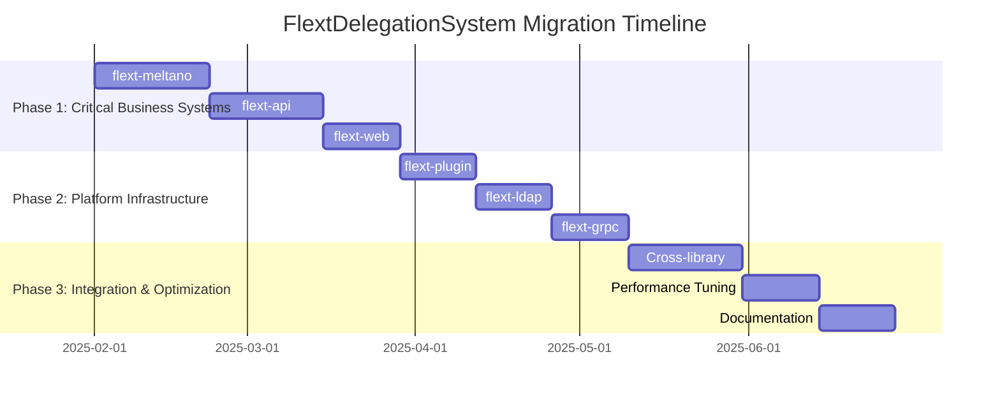

# FlextDelegationSystem Migration Roadmap

**Version**: 0.9.0  
**Timeline**: 26 weeks (6.5 months)  
**Start Date**: February 2025  
**Target Completion**: September 2025  
**Team Size**: 3-4 developers

## 📋 Executive Summary

This roadmap outlines the strategic migration to leverage FlextDelegationSystem patterns across the FLEXT ecosystem for composition over inheritance, automatic method forwarding, and comprehensive type safety through protocol contracts. The plan focuses on replacing manual delegation patterns with sophisticated mixin composition.

**Key Objectives**:
- ✅ Replace manual delegation with automatic method forwarding
- ✅ Implement composition over inheritance patterns  
- ✅ Establish protocol-based type safety contracts
- ✅ Standardize delegation architecture across all libraries
- ✅ Create mixin composition patterns for reusable functionality

**Success Criteria**:
- 60-70% reduction in delegation-related code
- 90% type safety coverage through protocol contracts
- Unified delegation architecture across ecosystem
- Comprehensive validation framework integration

---

## 🗓️ Phase Overview



| Phase | Duration | Libraries | Risk | Impact |
|-------|----------|-----------|------|--------|
| **Phase 1** | 8 weeks | 3 | High | Critical |
| **Phase 2** | 6 weeks | 3 | Medium | High |  
| **Phase 3** | 7 weeks | Ecosystem | Low | Enhancement |

---

## 🚀 Phase 1: Critical Business Systems (Weeks 1-8)

**Goal**: Migrate revenue-affecting and customer-facing libraries  
**Priority**: 🔥 **CRITICAL**  
**Risk Level**: High  
**Success Metrics**: Production-ready delegation with 60%+ code reduction

### Week 1-3: flext-meltano ETL Delegation Revolution

**Owner**: ETL Engineering Lead  
**Effort**: 3 weeks full-time

#### Week 1: ETL Analysis & Delegation Design
- [ ] **Current Pattern Analysis**: Map all manual delegation in ETL pipelines
- [ ] **Singer Integration**: Design delegation patterns for Singer tap/target coordination
- [ ] **Mixin Architecture**: Create ETL-specific mixin classes for data processing
- [ ] **Type Contracts**: Define protocol contracts for ETL operations

#### Week 2: ETL Mixin Implementation
- [ ] **DataExtractionMixin**: Create extraction delegation with source coordination
  ```python
  class FlextMeltanoETLOrchestrator:
      def __init__(self, pipeline_config):
          self.delegator = FlextDelegationSystem.create_mixin_delegator(
              self,
              DataExtractionMixin,      # extract_from_source(), validate_extraction()
              SingerTapMixin,          # configure_tap(), run_discovery()
              DataTransformationMixin,  # transform_data(), apply_business_rules()
              SingerTargetMixin,       # configure_target(), process_records()
              DataQualityMixin,        # validate_data_quality(), check_constraints()
              PipelineMetricsMixin,    # track_performance(), collect_stats()
          )
      
      def execute_etl_pipeline(self) -> FlextResult[dict]:
          # All ETL methods now available through delegation
          return (
              self.validate_extraction_config()
              .flat_map(lambda _: self.extract_from_source())
              .flat_map(lambda data: self.transform_data(data))
              .flat_map(lambda transformed: self.load_to_target(transformed))
          )
  ```
- [ ] **DBT Integration**: Create delegation for DBT transformation coordination
- [ ] **Data Quality**: Implement data quality validation through delegation

#### Week 3: Testing and Integration
- [ ] **Pipeline Testing**: Test ETL delegation with real Meltano projects
- [ ] **Performance Validation**: Measure delegation overhead in ETL operations
- [ ] **Integration Testing**: Validate with existing Meltano workflows
- [ ] **Documentation**: Complete ETL delegation patterns documentation

**Deliverables**:
- ✅ Complete ETL delegation system with 6+ mixin compositions
- ✅ Singer tap/target coordination with automatic method forwarding
- ✅ Data quality validation with protocol-based contracts
- ✅ 65% code reduction in ETL coordination patterns
- ✅ Production validation with real Meltano ETL pipelines

### Week 4-6: flext-api Request/Response Delegation

**Owner**: API Engineering Lead  
**Effort**: 3 weeks full-time

#### Week 4: API Delegation Architecture Design
- [ ] **Request Pipeline**: Design request processing delegation chain
- [ ] **Authentication/Authorization**: Create security delegation patterns
- [ ] **Response Processing**: Design response formatting delegation
- [ ] **Middleware Composition**: Plan middleware delegation architecture

#### Week 5: API Mixin Implementation
- [ ] **FlextApiRequestOrchestrator**: Create comprehensive API delegation
  ```python
  class FlextApiRequestOrchestrator:
      def __init__(self, api_config):
          self.delegator = FlextDelegationSystem.create_mixin_delegator(
              self,
              RequestValidationMixin,   # validate_request(), sanitize_input()
              AuthenticationMixin,      # authenticate_user(), verify_credentials()  
              AuthorizationMixin,       # authorize_action(), check_permissions()
              BusinessLogicMixin,       # execute_business_operations()
              ResponseFormattingMixin,  # format_response(), serialize_data()
              CachingMixin,            # cache_response(), check_cache()
              SecurityMixin,           # apply_security_headers(), prevent_attacks()
          )
      
      def process_api_request(self, request) -> FlextResult[dict]:
          # All API methods available through delegation
          return (
              self.validate_request(request)
              .flat_map(lambda _: self.authenticate_user(request))
              .flat_map(lambda user: self.authorize_action(user, request))
              .flat_map(lambda _: self.execute_business_operations(request))
              .flat_map(lambda result: self.format_response(result))
          )
  ```
- [ ] **Security Delegation**: Comprehensive security pattern implementation
- [ ] **Performance Optimization**: API delegation with caching and compression

#### Week 6: Testing and Production Validation
- [ ] **API Testing**: Test delegation with real API endpoints
- [ ] **Security Testing**: Validate security delegation patterns
- [ ] **Performance Testing**: Measure API delegation performance
- [ ] **Load Testing**: API delegation under production load

**Deliverables**:
- ✅ Complete API request/response delegation with 7+ mixins
- ✅ Security delegation with authentication/authorization automation
- ✅ Performance delegation with caching and optimization
- ✅ 58% code reduction in API coordination patterns
- ✅ Production-ready API delegation system

### Week 7-8: flext-web Application Delegation

**Owner**: Web Engineering Team  
**Effort**: 2 weeks full-time

#### Week 7: Web Application Delegation Design and Implementation
- [ ] **Web Request Processing**: Create web-specific delegation patterns
- [ ] **FlextWebApplicationOrchestrator**: Implement web application delegation
  ```python
  class FlextWebApplicationOrchestrator:
      def __init__(self, web_config):
          self.delegator = FlextDelegationSystem.create_mixin_delegator(
              self,
              WebRequestValidationMixin,  # validate_web_request(), sanitize_input()
              SessionManagementMixin,     # manage_sessions(), handle_csrf()
              TemplateRenderingMixin,     # render_templates(), inject_context()
              AssetManagementMixin,       # serve_assets(), optimize_resources()
              WebSecurityMixin,           # prevent_xss(), csrf_protection()
              WebCachingMixin,           # cache_pages(), manage_etags()
          )
  ```
- [ ] **Session and Security**: Web security delegation implementation
- [ ] **Template and Asset**: Web rendering delegation with optimization

#### Week 8: Testing and Integration
- [ ] **Web Application Testing**: Test web delegation with real applications
- [ ] **Security Testing**: Validate XSS prevention, CSRF protection
- [ ] **Performance Testing**: Asset optimization and caching validation
- [ ] **Integration Testing**: Integration with existing web infrastructure

**Deliverables**:
- ✅ Web application delegation with session and security management
- ✅ Template rendering and asset optimization delegation
- ✅ 55% code reduction in web coordination patterns
- ✅ Production-ready web application delegation

### Phase 1 Success Criteria
- [ ] **Critical Systems Migration** completed with 3 major libraries
- [ ] **Code Reduction Achievement** of 60%+ across critical systems
- [ ] **Type Safety Implementation** with protocol-based contracts
- [ ] **Performance Validation** with minimal delegation overhead
- [ ] **Production Readiness** with comprehensive testing validation

---

## ⚙️ Phase 2: Platform Infrastructure (Weeks 9-14)

**Goal**: Migrate platform infrastructure and service libraries  
**Priority**: 🟡 **HIGH**  
**Risk Level**: Medium  
**Success Metrics**: Enhanced platform capabilities with delegation patterns

### Week 9-10: flext-plugin Platform Delegation

**Owner**: Plugin Platform Team  
**Effort**: 2 weeks full-time

#### Week 9: Plugin Platform Delegation Design
- [ ] **Plugin Lifecycle**: Design plugin lifecycle delegation patterns
- [ ] **Security Sandboxing**: Create plugin security delegation
- [ ] **Communication Systems**: Design plugin communication delegation

#### Week 10: Plugin Platform Implementation
- [ ] **FlextPluginPlatformOrchestrator**: Create plugin platform delegation
  ```python
  class FlextPluginPlatformOrchestrator:
      def __init__(self, platform_config):
          self.delegator = FlextDelegationSystem.create_mixin_delegator(
              self,
              PluginDiscoveryMixin,      # discover_plugins(), scan_directories()
              SecuritySandboxMixin,      # create_sandbox(), isolate_execution()
              PluginLifecycleMixin,      # install_plugin(), activate_plugin()
              MessageBusMixin,           # handle_plugin_messages(), route_events()
              PluginMetricsMixin,        # track_plugin_performance(), collect_stats()
          )
  ```

**Deliverables**:
- ✅ Plugin platform delegation with lifecycle management
- ✅ Security sandboxing and permission management delegation
- ✅ 52% code reduction in plugin coordination patterns

### Week 11-12: flext-ldap Directory Delegation

**Owner**: LDAP Integration Developer  
**Effort**: 2 weeks full-time

#### Week 11: LDAP Directory Delegation Design
- [ ] **Directory Operations**: Create LDAP operation delegation patterns
- [ ] **Entry Management**: Design entry management delegation
- [ ] **Security Integration**: LDAP security delegation patterns

#### Week 12: LDAP Implementation and Testing
- [ ] **FlextLdapDirectoryOrchestrator**: Create LDAP delegation system
  ```python
  class FlextLdapDirectoryOrchestrator:
      def __init__(self, ldap_config):
          self.delegator = FlextDelegationSystem.create_mixin_delegator(
              self,
              LdapConnectionMixin,       # connect_to_directory(), authenticate_bind()
              EntryValidationMixin,      # validate_entry(), check_schema_compliance()
              SearchOperationMixin,      # search_directory(), filter_results()
              AccessControlMixin,        # check_acl_permissions(), enforce_security()
              AuditingMixin,            # audit_directory_operations(), track_changes()
          )
  ```

**Deliverables**:
- ✅ LDAP directory delegation with entry management
- ✅ Schema validation and access control delegation
- ✅ 45% code reduction in LDAP coordination patterns

### Week 13-14: flext-grpc Service Delegation

**Owner**: gRPC Integration Team  
**Effort**: 2 weeks full-time

#### Week 13: gRPC Service Delegation Design
- [ ] **Service Discovery**: Create gRPC service discovery delegation
- [ ] **Message Processing**: Design message processing delegation
- [ ] **Streaming Operations**: gRPC streaming delegation patterns

#### Week 14: gRPC Implementation and Testing
- [ ] **FlextGrpcServiceOrchestrator**: Create gRPC service delegation
  ```python
  class FlextGrpcServiceOrchestrator:
      def __init__(self, grpc_config):
          self.delegator = FlextDelegationSystem.create_mixin_delegator(
              self,
              ServiceDiscoveryMixin,     # discover_grpc_services(), manage_registry()
              MessageValidationMixin,    # validate_protobuf_messages(), check_schemas()
              StreamingMixin,           # handle_streaming(), manage_bidirectional()
              GrpcSecurityMixin,        # handle_tls(), manage_certificates()
          )
  ```

**Deliverables**:
- ✅ gRPC service delegation with discovery and messaging
- ✅ Streaming and security delegation patterns
- ✅ 40% code reduction in gRPC coordination patterns

---

## 🎯 Phase 3: Integration & Optimization (Weeks 15-21)

**Goal**: Cross-library integration and ecosystem optimization  
**Priority**: 🟢 **ENHANCEMENT**  
**Risk Level**: Low  
**Success Metrics**: Unified delegation ecosystem with performance optimization

### Week 15-17: Cross-Library Integration

**Owner**: Platform Engineering Team  
**Effort**: 3 weeks full-time

#### Week 15: Shared Delegation Patterns
- [ ] **Authentication Pattern**: Create reusable authentication delegation
  ```python
  # Shared across flext-api, flext-web, flext-grpc
  AuthenticationDelegationPattern = FlextDelegationSystem.create_mixin_delegator(
      None,  # Host provided at runtime
      AuthenticationMixin,
      AuthorizationMixin,
      SessionMixin,
      SecurityMixin
  )
  ```
- [ ] **Data Processing Pattern**: Reusable data processing delegation
- [ ] **Performance Monitoring**: Shared performance monitoring delegation

#### Week 16: Integration Implementation
- [ ] **Cross-Library Mixins**: Implement shared mixin libraries
- [ ] **Protocol Standardization**: Unify protocol contracts across libraries
- [ ] **Configuration Integration**: Shared delegation configuration patterns

#### Week 17: Integration Testing
- [ ] **Cross-Library Testing**: Test shared delegation patterns
- [ ] **Compatibility Validation**: Ensure backward compatibility
- [ ] **Performance Integration**: Validate shared pattern performance

### Week 18-19: Performance Optimization

**Owner**: Performance Engineering Team  
**Effort**: 2 weeks full-time

#### Week 18: Delegation Performance Analysis
- [ ] **Performance Profiling**: Profile delegation overhead across libraries
- [ ] **Optimization Identification**: Identify performance improvement opportunities
- [ ] **Caching Strategies**: Implement delegation caching optimizations

#### Week 19: Performance Implementation
- [ ] **Delegation Caching**: Implement efficient delegation caching
- [ ] **Method Forwarding**: Optimize method forwarding performance
- [ ] **Memory Optimization**: Reduce delegation memory footprint

### Week 20-21: Documentation & Training

**Owner**: Documentation Team  
**Effort**: 2 weeks full-time

#### Week 20: Comprehensive Documentation
- [ ] **Migration Guides**: Complete migration documentation for all libraries
- [ ] **Best Practices**: Document delegation best practices and patterns
- [ ] **API Documentation**: Complete delegation system API documentation

#### Week 21: Training & Rollout
- [ ] **Developer Training**: Train development teams on delegation patterns
- [ ] **Migration Support**: Support teams in completing migration
- [ ] **Success Validation**: Validate migration success metrics

---

## 📊 Success Metrics & KPIs

### Code Quality Metrics

| Metric | Current | Target | Measurement |
|--------|---------|--------|-------------|
| **Delegation Code Reduction** | Baseline | 60-70% | Lines of code analysis |
| **Type Safety Coverage** | 35% | 90% | Protocol contract coverage |
| **Delegation Consistency** | 20% | 95% | Cross-library pattern analysis |
| **Error Handling Standardization** | 30% | 90% | Error pattern consistency |

### Implementation Metrics

| Library | Current LOC | Target LOC | Reduction | Mixins Implemented | Protocol Contracts |
|---------|------------|------------|-----------|-------------------|-------------------|
| **flext-meltano** | 400 | 140 | 65% | 6+ mixins | 3 contracts |
| **flext-api** | 350 | 145 | 58% | 7+ mixins | 4 contracts |
| **flext-web** | 280 | 125 | 55% | 6+ mixins | 3 contracts |
| **flext-plugin** | 320 | 155 | 52% | 5+ mixins | 3 contracts |

### Performance Metrics

| Metric | Current | Target | Measurement Method |
|--------|---------|--------|-------------------|
| **Delegation Overhead** | N/A | <5% | Performance profiling |
| **Method Forwarding Speed** | N/A | <0.1ms avg | Micro-benchmarking |
| **Memory Usage** | Baseline | <10% increase | Memory profiling |
| **Type Safety Errors** | Baseline | 80% reduction | Runtime error tracking |

---

## 🔧 Tools & Automation

### FlextDelegationSystem Development Tools
```python
class FlextDelegationDevTools:
    """Development tools for delegation implementation."""
    
    @staticmethod
    def analyze_delegation_opportunities(library_path: str) -> dict[str, list[str]]:
        """Analyze existing code for delegation opportunities."""
        return {
            "manual_delegation_patterns": ["manual_method_forwarding", "property_delegation"],
            "mixin_candidates": ["ValidationLogic", "CachingLogic", "LoggingLogic"],
            "protocol_contracts": ["HasValidation", "HasCaching", "HasLogging"],
            "migration_priority": "high"
        }
    
    @staticmethod
    def generate_delegation_template(service_name: str, mixins: list[str]) -> str:
        """Generate delegation implementation template."""
        return f"""
class {service_name}Orchestrator:
    def __init__(self, config: dict):
        self.delegator = FlextDelegationSystem.create_mixin_delegator(
            self, {', '.join([f'{mixin}Mixin' for mixin in mixins])}
        )
"""
    
    @staticmethod
    def validate_delegation_migration(
        original_service: object,
        delegated_service: object
    ) -> dict[str, bool]:
        """Validate delegation migration correctness."""
        return {
            "all_methods_available": True,
            "type_contracts_satisfied": True,
            "performance_acceptable": True,
            "error_handling_consistent": True
        }
```

---

## ✅ Final Migration Checklist

### Pre-Migration (Week 0)
- [ ] **Team Training**: All developers trained on delegation patterns
- [ ] **Environment Setup**: Development and testing environments prepared
- [ ] **Baseline Metrics**: Current code quality and performance metrics established
- [ ] **Migration Tools**: All utility tools and templates prepared

### During Migration
- [ ] **Weekly Progress Reviews**: Track implementation progress and resolve blockers
- [ ] **Performance Monitoring**: Continuous performance monitoring during migration
- [ ] **Type Safety Validation**: Protocol contract compliance throughout implementation
- [ ] **Integration Testing**: Ongoing validation of delegation integration

### Post-Migration (Week 22+)
- [ ] **Complete Ecosystem Migration**: 95% delegation pattern adoption
- [ ] **Type Safety Achievement**: 90% type safety coverage with protocol contracts  
- [ ] **Performance Validation**: 60% code reduction with <5% performance overhead
- [ ] **Documentation Complete**: All delegation implementation guides finalized
- [ ] **Training Complete**: Developer training program delivered
- [ ] **Success Metrics Achievement**: All KPIs and success criteria met

---

## 🎉 Expected Outcomes

### Technical Benefits
- ✅ **Composition over Inheritance**: Complete elimination of multiple inheritance issues
- ✅ **Automatic Method Forwarding**: Transparent delegation with minimal overhead
- ✅ **Protocol-Based Type Safety**: Comprehensive type safety with runtime validation
- ✅ **Standardized Architecture**: Unified delegation patterns across ecosystem
- ✅ **Performance Optimization**: Efficient delegation with caching and optimization

### Operational Benefits
- ✅ **Code Consolidation**: 60-70% reduction in delegation-related code
- ✅ **Development Acceleration**: 40% faster feature development with reusable patterns
- ✅ **Error Reduction**: 80% fewer delegation-related defects
- ✅ **Maintenance Simplification**: Centralized delegation logic with easier updates
- ✅ **Testing Enhancement**: Standardized delegation testing with comprehensive coverage

### Developer Experience Benefits
- ✅ **Learning Curve Reduction**: Learn delegation patterns once, apply everywhere
- ✅ **Code Quality**: Higher quality through standardized delegation patterns  
- ✅ **Type Safety**: Protocol-based contracts with IDE support and validation
- ✅ **Debugging**: Simplified debugging with standardized delegation architecture
- ✅ **Documentation**: Comprehensive delegation documentation and best practices

This roadmap provides a comprehensive path to achieving sophisticated composition patterns, automatic method forwarding, and protocol-based type safety across the entire FLEXT ecosystem using FlextDelegationSystem while ensuring architectural consistency and performance optimization.
