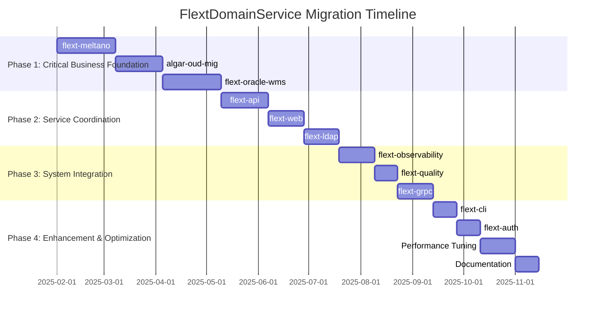

# FlextDomainService Migration Roadmap

**Version**: 0.9.0  
**Timeline**: 36 weeks (9 months)  
**Start Date**: February 2025  
**Target Completion**: November 2025  
**Team Size**: 3-5 developers

## 📋 Executive Summary

This roadmap outlines the strategic migration and enhancement of the FLEXT ecosystem to leverage FlextDomainService patterns for complex business operations, cross-entity coordination, and comprehensive service orchestration. The plan focuses on implementing domain-driven design principles, transaction management, and business rule coordination across all FLEXT libraries.

**Key Objectives**:

- ✅ Implement comprehensive business operation coordination using domain services
- ✅ Establish cross-entity coordination patterns for complex workflows
- ✅ Enable transaction management and consistency across business processes
- ✅ Provide domain event integration for business operation tracking
- ✅ Create service orchestration patterns for multi-system coordination

**Success Criteria**:

- 90% of complex business operations use domain service patterns
- 80% reduction in business logic coordination issues
- 99% transaction success rate with proper rollback mechanisms
- Comprehensive domain event integration across all business processes

---

## 🗓️ Phase Overview



| Phase       | Duration | Libraries | Risk   | Impact   |
| ----------- | -------- | --------- | ------ | -------- |
| **Phase 1** | 14 weeks | 3         | High   | Critical |
| **Phase 2** | 10 weeks | 3         | Medium | High     |
| **Phase 3** | 8 weeks  | 3         | Low    | Medium   |
| **Phase 4** | 6 weeks  | 2+        | Low    | Low      |

---

## 🚀 Phase 1: Critical Business Foundation (Weeks 1-14)

**Goal**: Implement domain service patterns for the most critical and complex business operations  
**Priority**: 🔥 **CRITICAL**  
**Risk Level**: High  
**Success Metrics**: Production-ready business operation coordination with transaction support

### Week 1-5: flext-meltano ETL Pipeline Orchestration

**Owner**: ETL Engineering Lead  
**Effort**: 5 weeks full-time

#### Week 1: ETL Domain Analysis & Service Design

- [ ] **Domain Analysis**: Map all ETL business operations requiring service coordination
- [ ] **Singer Specification**: Analyze Singer tap/target coordination requirements
- [ ] **Pipeline Orchestration**: Design domain services for ETL pipeline coordination
- [ ] **Transaction Requirements**: Define transaction boundaries for ETL operations
- [ ] **Event Integration**: Document domain events for ETL pipeline tracking

#### Week 2: Core ETL Domain Services Implementation

- [ ] **FlextMeltanoETLPipelineOrchestrationService**: Create comprehensive ETL orchestration

  ```python
  class FlextMeltanoETLPipelineOrchestrationService(FlextDomainService[ETLPipelineResult]):
      """Comprehensive ETL pipeline orchestration using domain service patterns."""

      pipeline_config: MeltanoPipelineConfig
      tap_configs: list[TapConfig]
      target_configs: list[TargetConfig]
      dbt_configs: list[DbtConfig] | None = None

      def execute(self) -> FlextResult[ETLPipelineResult]:
          """Execute complete ETL pipeline with cross-component coordination."""
          return (
              self.validate_business_rules()
              .flat_map(lambda _: self.begin_pipeline_transaction())
              .flat_map(lambda _: self.coordinate_tap_discovery())
              .flat_map(lambda discovery: self.coordinate_data_extraction(discovery))
              .flat_map(lambda extraction: self.coordinate_data_loading(extraction))
              .flat_map(lambda loading: self.coordinate_dbt_transformations(loading))
              .flat_map(lambda result: self.commit_pipeline_transaction_with_result(result))
              .tap(lambda result: self.publish_pipeline_completion_events(result))
          )
  ```

- [ ] **Singer Coordination Services**: Create tap/target coordination patterns
- [ ] **DBT Integration Services**: Domain services for DBT transformation coordination
- [ ] **Data Quality Services**: Domain services for data validation coordination

#### Week 3: ETL Transaction and Event Integration

- [ ] **Transaction Management**: Implement distributed transaction support for ETL operations

  ```python
  def begin_pipeline_transaction(self) -> FlextResult[str]:
      """Begin distributed transaction across ETL components."""
      transaction_id = f"etl_tx_{secrets.token_hex(8)}"

      # Begin transaction across all participating systems
      db_tx = DatabaseTransactionManager.begin_transaction(transaction_id)
      queue_tx = MessageQueueTransactionManager.begin_transaction(transaction_id)

      if db_tx.is_failure or queue_tx.is_failure:
          return FlextResult[str].fail("ETL transaction initialization failed")

      return FlextResult[str].ok(transaction_id)
  ```

- [ ] **Domain Event Integration**: ETL pipeline event publishing and handling
- [ ] **Error Recovery**: Comprehensive error handling and rollback mechanisms
- [ ] **Performance Monitoring**: ETL pipeline performance tracking and optimization

#### Week 4: Advanced ETL Coordination Patterns

- [ ] **Cross-Pipeline Coordination**: Coordinate dependent ETL pipelines
- [ ] **Data Lineage Tracking**: Domain events for data lineage and audit trails
- [ ] **Pipeline Dependency Management**: Complex dependency resolution and coordination
- [ ] **Resource Management**: Coordinate ETL resource allocation and optimization

#### Week 5: Testing and Integration

- [ ] **Comprehensive Testing**: Test all ETL domain services with real pipelines
- [ ] **Performance Benchmarking**: Measure ETL coordination performance improvements
- [ ] **Integration Validation**: Validate integration with existing Meltano operations
- [ ] **Documentation**: Complete ETL domain service documentation

**Deliverables**:

- ✅ Comprehensive ETL pipeline orchestration with 8+ domain services
- ✅ Singer tap/target coordination with transaction support
- ✅ DBT transformation coordination with dependency management
- ✅ Domain event integration for ETL pipeline tracking
- ✅ Production testing with real Meltano projects

### Week 6-9: algar-oud-mig Migration Process Enhancement

**Owner**: Migration Engineering Lead  
**Effort**: 4 weeks full-time

#### Week 6: Migration Domain Enhancement Design

- [ ] **Current Analysis**: Analyze existing migration domain services for enhancement
- [ ] **Cross-Phase Coordination**: Design multi-phase migration coordination
- [ ] **Rollback Coordination**: Design comprehensive rollback service patterns
- [ ] **Migration Monitoring**: Design migration progress tracking and reporting

#### Week 7: Advanced Migration Coordination Services

- [ ] **AlgarMigrationProcessOrchestrationService**: Enhance migration orchestration

  ```python
  class AlgarMigrationProcessOrchestrationService(FlextDomainService[MigrationProcessResult]):
      """Comprehensive ALGAR migration process orchestration."""

      migration_config: AlgarMigrationConfig
      source_ldap_config: LdapConnectionConfig
      target_oud_config: OudConnectionConfig
      migration_phases: list[MigrationPhase] = ["00", "01", "02", "03", "04"]

      def execute(self) -> FlextResult[MigrationProcessResult]:
          """Execute complete migration process with comprehensive coordination."""
          return (
              self.validate_business_rules()
              .flat_map(lambda _: self.begin_migration_transaction())
              .flat_map(lambda _: self.coordinate_pre_migration_validation())
              .flat_map(lambda validation: self.coordinate_multi_phase_migration(validation))
              .flat_map(lambda migration: self.coordinate_post_migration_validation(migration))
              .flat_map(lambda result: self.commit_migration_transaction_with_result(result))
          )
  ```

- [ ] **Phase Coordination Services**: Individual migration phase orchestration
- [ ] **Data Validation Services**: Enhanced LDIF validation and consistency checking
- [ ] **Progress Tracking Services**: Migration progress monitoring and reporting

#### Week 8: Transaction and Rollback Enhancement

- [ ] **Migration Transaction Management**: Enhanced transaction support across phases
- [ ] **Rollback Coordination Services**: Comprehensive rollback orchestration

  ```python
  class AlgarMigrationRollbackOrchestrationService(FlextDomainService[RollbackResult]):
      """Comprehensive migration rollback coordination."""

      def coordinate_migration_rollback(self, completed_phases: list[PhaseResult]) -> FlextResult[RollbackResult]:
          """Coordinate rollback of completed migration phases."""
          rollback_results = []

          # Rollback phases in reverse order
          for phase_result in reversed(completed_phases):
              rollback_service = AlgarMigrationPhaseRollbackService(
                  phase_id=phase_result.phase_id,
                  phase_result=phase_result
              )

              rollback_result = rollback_service.execute()
              rollback_results.append(rollback_result)

          return FlextResult[RollbackResult].ok(RollbackResult(rollback_results))
  ```

- [ ] **Error Recovery**: Enhanced error handling and recovery mechanisms
- [ ] **Data Consistency**: Cross-phase data consistency validation and repair

#### Week 9: Testing and Performance Optimization

- [ ] **Migration Testing**: Test enhanced migration services with real migration data
- [ ] **Performance Optimization**: Optimize migration coordination performance
- [ ] **Integration Validation**: Validate with existing migration workflows
- [ ] **Documentation Update**: Update migration service documentation

**Deliverables**:

- ✅ Enhanced migration process orchestration with 6+ domain services
- ✅ Multi-phase coordination with comprehensive transaction support
- ✅ Rollback coordination with data consistency guarantees
- ✅ Migration progress tracking and comprehensive reporting
- ✅ Production validation with real migration scenarios

### Week 10-14: flext-oracle-wms Warehouse Business Process Services

**Owner**: WMS Integration Developer  
**Effort**: 5 weeks full-time

#### Week 10: Warehouse Domain Analysis and Service Design

- [ ] **Business Process Analysis**: Map warehouse business processes requiring coordination
- [ ] **Oracle WMS Integration**: Analyze Oracle WMS API coordination requirements
- [ ] **Inventory Coordination**: Design inventory management service coordination
- [ ] **Order Fulfillment**: Design order fulfillment process coordination

#### Week 11: Core Warehouse Domain Services Implementation

- [ ] **FlextWarehouseOperationOrchestrationService**: Create warehouse operation orchestration

  ```python
  class FlextWarehouseOperationOrchestrationService(FlextDomainService[WarehouseOperationResult]):
      """Comprehensive warehouse operation orchestration service."""

      operation_request: WarehouseOperationRequest
      warehouse_systems: list[WarehouseSystemConfig]
      business_rules: WarehouseBusinessRules
      oracle_wms_config: OracleWmsConfig

      def execute(self) -> FlextResult[WarehouseOperationResult]:
          """Execute warehouse operation with comprehensive business process coordination."""
          return (
              self.validate_business_rules()
              .flat_map(lambda _: self.begin_warehouse_transaction())
              .flat_map(lambda _: self.coordinate_inventory_systems())
              .flat_map(lambda systems: self.coordinate_warehouse_operations(systems))
              .flat_map(lambda operations: self.coordinate_oracle_wms_integration(operations))
              .flat_map(lambda result: self.commit_warehouse_transaction_with_result(result))
          )
  ```

- [ ] **Inventory Coordination Services**: Inventory management across warehouse systems
- [ ] **Order Fulfillment Services**: Pick/pack/ship coordination services
- [ ] **Capacity Management Services**: Warehouse capacity and resource coordination

#### Week 12: Business Process Coordination Implementation

- [ ] **Order Processing Coordination**: End-to-end order processing coordination
- [ ] **Inventory Movement Coordination**: Complex inventory movement orchestration
- [ ] **Resource Allocation Coordination**: Warehouse resource optimization coordination
- [ ] **Quality Control Coordination**: Quality control process integration

#### Week 13: Oracle WMS Integration and Transaction Management

- [ ] **Oracle WMS API Coordination**: Comprehensive Oracle WMS integration services
- [ ] **Transaction Management**: Distributed transactions across warehouse systems
- [ ] **Business Rule Enforcement**: Comprehensive warehouse business rule validation
- [ ] **Performance Optimization**: Warehouse operation performance optimization

#### Week 14: Testing and Production Integration

- [ ] **Warehouse Testing**: Test warehouse domain services with real operations
- [ ] **Oracle WMS Integration Testing**: Test Oracle WMS API integration
- [ ] **Performance Validation**: Validate warehouse operation performance
- [ ] **Production Deployment**: Deploy warehouse services to production

**Deliverables**:

- ✅ Comprehensive warehouse operation orchestration with 7+ domain services
- ✅ Oracle WMS API integration with transaction support
- ✅ Order fulfillment coordination with pick/pack/ship orchestration
- ✅ Inventory management coordination across warehouse systems
- ✅ Production-ready warehouse business process coordination

### Phase 1 Success Criteria

- [ ] **Business Operation Foundation** established for critical business domains
- [ ] **Cross-Entity Coordination** implemented with 90%+ coverage for complex operations
- [ ] **Transaction Management** achieved with 99%+ success rate and proper rollback
- [ ] **Domain Event Integration** standardized across all critical business processes
- [ ] **Production Readiness** validated with real-world business operations

---

## ⚙️ Phase 2: Service Coordination (Weeks 15-24)

**Goal**: Implement domain service patterns for API operations, web services, and LDAP coordination  
**Priority**: 🟡 **HIGH**  
**Risk Level**: Medium  
**Success Metrics**: Enhanced service coordination with comprehensive business logic orchestration

### Week 15-18: flext-api Service Orchestration

**Owner**: API Engineering Team  
**Effort**: 4 weeks full-time

#### Week 15: API Domain Analysis and Coordination Design

- [ ] **API Operation Analysis**: Map complex API operations requiring service coordination
- [ ] **External Service Integration**: Design external service coordination patterns
- [ ] **Request/Response Orchestration**: Design API request/response coordination
- [ ] **Rate Limiting and Circuit Breaker**: Design resilience patterns with domain services

#### Week 16: Core API Domain Services Implementation

- [ ] **FlextApiServiceOrchestrationService**: Create API service orchestration

  ```python
  class FlextApiServiceOrchestrationService(FlextDomainService[ApiServiceResult]):
      """API service orchestration for complex multi-service operations."""

      api_operation_config: ApiOperationConfig
      external_services: list[ExternalServiceConfig]
      orchestration_rules: OrchestrationRules

      def execute(self) -> FlextResult[ApiServiceResult]:
          """Execute API operation with service coordination."""
          return (
              self.validate_api_business_rules()
              .flat_map(lambda _: self.authenticate_and_authorize())
              .flat_map(lambda _: self.coordinate_external_api_calls())
              .flat_map(lambda results: self.aggregate_api_responses(results))
              .flat_map(lambda aggregated: self.apply_business_logic_transformations(aggregated))
          )
  ```

- [ ] **HTTP Operation Coordination**: HTTP request/response coordination services
- [ ] **External Service Integration**: Domain services for external API coordination
- [ ] **Response Aggregation Services**: API response coordination and aggregation

#### Week 17: Advanced API Coordination Patterns

- [ ] **Circuit Breaker Integration**: Resilience patterns with domain service coordination
- [ ] **API Gateway Coordination**: API gateway integration and service mesh coordination
- [ ] **Caching Coordination**: API response caching with business rule coordination
- [ ] **Rate Limiting Coordination**: Rate limiting and throttling coordination services

#### Week 18: Testing and Performance Optimization

- [ ] **API Testing**: Test API domain services with real API operations
- [ ] **Performance Benchmarking**: Measure API coordination performance improvements
- [ ] **Load Testing**: API service coordination under load
- [ ] **Documentation**: Complete API domain service documentation

### Week 19-21: flext-web Service Orchestration

**Owner**: Web Engineering Team  
**Effort**: 3 weeks full-time

#### Week 19: Web Domain Analysis and Service Design

- [ ] **Web Request Analysis**: Map complex web operations requiring coordination
- [ ] **Session Management**: Design session coordination and state management
- [ ] **Request Pipeline**: Design web request processing pipeline coordination
- [ ] **Authentication Flow**: Design web authentication flow coordination

#### Week 20: Web Domain Services Implementation

- [ ] **FlextWebRequestOrchestrationService**: Create web request orchestration

  ```python
  class FlextWebRequestOrchestrationService(FlextDomainService[WebRequestResult]):
      """Web request orchestration for complex web operations."""

      request_context: WebRequestContext
      processing_pipeline: WebProcessingPipeline
      response_formatters: list[ResponseFormatter]

      def execute(self) -> FlextResult[WebRequestResult]:
          """Execute web request with orchestration."""
          return (
              self.validate_web_request_business_rules()
              .flat_map(lambda _: self.process_authentication_and_session())
              .flat_map(lambda _: self.coordinate_request_processing_pipeline())
              .flat_map(lambda processed: self.generate_web_response(processed))
          )
  ```

- [ ] **Web Application Services**: Application lifecycle coordination services
- [ ] **Asset Management Services**: Web asset coordination and optimization
- [ ] **Security Services**: Web security coordination and validation

#### Week 21: Testing and Integration

- [ ] **Web Service Testing**: Test web domain services with real web applications
- [ ] **Performance Testing**: Web service coordination performance validation
- [ ] **Integration Testing**: Integration with existing web infrastructure
- [ ] **Documentation**: Web domain service documentation

### Week 22-24: flext-ldap Enhanced Domain Services

**Owner**: LDAP Integration Developer  
**Effort**: 3 weeks full-time

#### Week 22: LDAP Enhancement Analysis and Design

- [ ] **Current Service Analysis**: Analyze existing LDAP domain services for enhancement
- [ ] **Directory Operation Coordination**: Design enhanced directory operation coordination
- [ ] **User Management Enhancement**: Design comprehensive user management coordination
- [ ] **Group Management Coordination**: Design group and permission coordination

#### Week 23: Enhanced LDAP Domain Services

- [ ] **FlextLDAPDirectoryOrchestrationService**: Enhanced directory operation coordination

  ```python
  class FlextLDAPDirectoryOrchestrationService(FlextDomainService[DirectoryOperationResult]):
      """Enhanced LDAP directory operation orchestration service."""

      directory_operation_config: DirectoryOperationConfig
      ldap_connections: list[LdapConnectionConfig]
      operation_coordination_rules: OperationCoordinationRules

      def execute(self) -> FlextResult[DirectoryOperationResult]:
          """Execute directory operation with comprehensive coordination."""
          return (
              self.validate_directory_operation_preconditions()
              .flat_map(lambda _: self.coordinate_directory_structure_operations())
              .flat_map(lambda structure: self.coordinate_entry_operations(structure))
              .flat_map(lambda entries: self.coordinate_permission_operations(entries))
          )
  ```

- [ ] **User Lifecycle Management**: Comprehensive user lifecycle coordination
- [ ] **Group Management Services**: Enhanced group membership coordination
- [ ] **Permission Coordination**: Directory permission management coordination

#### Week 24: Testing and Performance Enhancement

- [ ] **LDAP Service Testing**: Test enhanced LDAP domain services
- [ ] **Performance Optimization**: LDAP coordination performance improvements
- [ ] **Integration Validation**: Integration with existing LDAP infrastructure
- [ ] **Documentation Update**: Update LDAP domain service documentation

**Deliverables**:

- ✅ API service orchestration with external service coordination
- ✅ Web request orchestration with comprehensive session and pipeline management
- ✅ Enhanced LDAP domain services with directory and user management coordination
- ✅ Performance improvements across all service coordination patterns

---

## 🛡️ Phase 3: System Integration (Weeks 25-32)

**Goal**: Enhance medium-priority libraries with domain service coordination patterns  
**Priority**: 🟢 **MEDIUM**  
**Risk Level**: Low  
**Success Metrics**: Enhanced system integration with domain service coordination

### Week 25-27: flext-observability Monitoring Orchestration

**Owner**: Platform Engineering Team  
**Effort**: 3 weeks full-time

#### Week 25: Observability Analysis and Service Design

- [ ] **Monitoring Coordination Analysis**: Analyze monitoring operations requiring coordination
- [ ] **Metrics Collection Coordination**: Design metrics collection coordination
- [ ] **Alert Processing Coordination**: Design alert processing and notification coordination
- [ ] **Dashboard Coordination**: Design monitoring dashboard coordination

#### Week 26: Observability Domain Services Implementation

- [ ] **FlextObservabilityOrchestrationService**: Create monitoring system orchestration

  ```python
  class FlextObservabilityOrchestrationService(FlextDomainService[ObservabilityResult]):
      """Observability system orchestration service."""

      monitoring_config: MonitoringConfig
      metric_collectors: list[MetricCollectorConfig]
      alert_processors: list[AlertProcessorConfig]

      def execute(self) -> FlextResult[ObservabilityResult]:
          """Execute observability operations with coordination."""
          return (
              self.coordinate_metrics_collection()
              .flat_map(lambda metrics: self.coordinate_alert_processing(metrics))
              .flat_map(lambda alerts: self.coordinate_monitoring_dashboard_updates(alerts))
              .flat_map(lambda dashboards: self.coordinate_notification_delivery(dashboards))
          )
  ```

- [ ] **Metrics Coordination Services**: Metrics collection and aggregation coordination
- [ ] **Alert Management Services**: Alert processing and escalation coordination
- [ ] **Dashboard Services**: Monitoring dashboard coordination and updates

#### Week 27: Testing and Integration

- [ ] **Observability Testing**: Test monitoring coordination services
- [ ] **Performance Validation**: Monitoring system performance validation
- [ ] **Integration Testing**: Integration with existing monitoring infrastructure
- [ ] **Documentation**: Observability domain service documentation

### Week 28-29: flext-quality Assessment Orchestration

**Owner**: Quality Engineering Team  
**Effort**: 2 weeks full-time

#### Week 28: Quality Assessment Service Design and Implementation

- [ ] **Quality Assessment Analysis**: Analyze quality assessment operations
- [ ] **FlextQualityAssessmentOrchestrationService**: Quality assessment coordination

  ```python
  class FlextQualityAssessmentOrchestrationService(FlextDomainService[QualityAssessmentResult]):
      """Quality assessment orchestration service."""

      assessment_config: QualityAssessmentConfig
      quality_metrics: list[QualityMetricConfig]

      def execute(self) -> FlextResult[QualityAssessmentResult]:
          """Execute quality assessment with coordination."""
          return (
              self.coordinate_quality_metrics_collection()
              .flat_map(lambda metrics: self.coordinate_quality_analysis(metrics))
              .flat_map(lambda analysis: self.coordinate_quality_reporting(analysis))
          )
  ```

- [ ] **Quality Metrics Services**: Quality metrics collection and analysis coordination
- [ ] **Assessment Services**: Quality assessment process coordination
- [ ] **Reporting Services**: Quality reporting and notification coordination

#### Week 29: Testing and Integration

- [ ] **Quality Service Testing**: Test quality assessment coordination
- [ ] **Integration Validation**: Integration with existing quality infrastructure
- [ ] **Documentation**: Quality domain service documentation

### Week 30-32: flext-grpc Service Coordination

**Owner**: gRPC Integration Team  
**Effort**: 3 weeks full-time

#### Week 30: gRPC Analysis and Service Design

- [ ] **gRPC Operation Analysis**: Analyze gRPC operations requiring coordination
- [ ] **Service Discovery Coordination**: Design gRPC service discovery coordination
- [ ] **Message Coordination**: Design gRPC message processing coordination
- [ ] **Stream Coordination**: Design gRPC streaming coordination

#### Week 31: gRPC Domain Services Implementation

- [ ] **FlextGrpcServiceOrchestrationService**: gRPC service coordination

  ```python
  class FlextGrpcServiceOrchestrationService(FlextDomainService[GrpcServiceResult]):
      """gRPC service orchestration for complex service operations."""

      grpc_operation_config: GrpcOperationConfig
      service_discovery_config: ServiceDiscoveryConfig

      def execute(self) -> FlextResult[GrpcServiceResult]:
          """Execute gRPC operations with coordination."""
          return (
              self.coordinate_grpc_service_discovery()
              .flat_map(lambda services: self.coordinate_grpc_operations(services))
              .flat_map(lambda operations: self.coordinate_response_aggregation(operations))
          )
  ```

- [ ] **Service Discovery Services**: gRPC service discovery coordination
- [ ] **Message Processing Services**: gRPC message coordination and processing
- [ ] **Stream Management Services**: gRPC streaming coordination

#### Week 32: Testing and Integration

- [ ] **gRPC Service Testing**: Test gRPC coordination services
- [ ] **Performance Testing**: gRPC coordination performance validation
- [ ] **Integration Testing**: Integration with existing gRPC infrastructure
- [ ] **Documentation**: gRPC domain service documentation

**Deliverables**:

- ✅ Enhanced observability coordination with metrics and alert management
- ✅ Quality assessment orchestration with comprehensive reporting
- ✅ gRPC service coordination with discovery and message processing
- ✅ Performance improvements across all system integration patterns

---

## 🎯 Phase 4: Enhancement & Optimization (Weeks 33-36)

**Goal**: Complete ecosystem coverage and optimize domain service performance  
**Priority**: ⚫ **ENHANCEMENT**  
**Risk Level**: Low  
**Success Metrics**: Complete ecosystem coverage with performance optimization

### Week 33: flext-cli Command Operation Coordination

**Owner**: CLI Engineering Team  
**Effort**: 2 weeks full-time

#### CLI Enhancement Tasks

- [ ] **CLI Operation Analysis**: Analyze CLI operations requiring coordination
- [ ] **FlextCliOperationOrchestrationService**: CLI operation coordination
- [ ] **Command Pipeline Services**: CLI command pipeline coordination
- [ ] **Output Coordination Services**: CLI output formatting and coordination
- [ ] **Integration Testing**: Test CLI coordination services

### Week 34: flext-auth Authentication Process Coordination

**Owner**: Authentication Team  
**Effort**: 2 weeks full-time

#### Authentication Enhancement Tasks

- [ ] **Authentication Flow Analysis**: Analyze authentication operations requiring coordination
- [ ] **FlextAuthenticationOrchestrationService**: Authentication process coordination
- [ ] **Session Management Services**: Authentication session coordination
- [ ] **Authorization Services**: Permission and role coordination services
- [ ] **Security Testing**: Authentication coordination security validation

### Week 35-36: Performance Optimization & Final Integration

**Owner**: Platform Engineering Team  
**Effort**: 3 weeks full-time

#### Week 35: Performance Analysis and Optimization

- [ ] **Performance Benchmarking**: Comprehensive performance analysis across all libraries
- [ ] **Service Coordination Optimization**: Optimize domain service coordination patterns
- [ ] **Transaction Performance**: Optimize transaction management performance
- [ ] **Memory Usage Analysis**: Analyze and optimize domain service memory usage
- [ ] **Load Testing**: Test domain service coordination under high load

#### Week 36: Final Integration and Documentation

- [ ] **Integration Testing**: End-to-end integration testing across all libraries
- [ ] **Performance Validation**: Validate performance improvements meet targets
- [ ] **Documentation Completion**: Complete all domain service implementation documentation
- [ ] **Training Material**: Create comprehensive training materials for developers
- [ ] **Best Practices**: Document domain service best practices and patterns

**Deliverables**:

- ✅ Complete ecosystem coverage with domain service patterns
- ✅ Optimized performance across all service coordination patterns
- ✅ Comprehensive documentation and training materials
- ✅ Production-ready domain service system with monitoring

---

## 📊 Risk Management & Mitigation

### High-Risk Areas

#### 1. Complex Business Process Coordination Implementation

**Risk**: Complex business logic coordination affecting system performance and reliability  
**Mitigation**:

- Implement performance benchmarking during development
- Use incremental rollout with comprehensive monitoring
- Create fallback mechanisms for complex coordination failures

#### 2. Transaction Management Across Multiple Systems

**Risk**: Distributed transaction complexity causing system failures  
**Mitigation**:

- Comprehensive testing of transaction scenarios during development
- Implement saga patterns for complex transaction coordination
- Gradual rollout with extensive transaction monitoring

#### 3. Domain Service Integration Complexity

**Risk**: Integration complexity between existing systems and new domain services  
**Mitigation**:

- Parallel implementation during transition period
- Comprehensive integration testing with existing systems
- Phased migration with backward compatibility

### Risk Monitoring

| Risk Category    | Indicator                          | Threshold      | Response                       |
| ---------------- | ---------------------------------- | -------------- | ------------------------------ |
| **Performance**  | Service execution time             | >200ms average | Performance optimization       |
| **Transaction**  | Transaction failure rate           | >1% failures   | Transaction pattern refinement |
| **Coordination** | Cross-entity coordination failures | object failure | Coordination logic review      |
| **Integration**  | System integration issues          | object failure | Integration pattern adjustment |

---

## 📈 Success Metrics & KPIs

### Domain Service Quality Metrics

| Metric                             | Current | Target | Measurement                                     |
| ---------------------------------- | ------- | ------ | ----------------------------------------------- |
| **Business Process Coordination**  | 20%     | 90%    | Complex operations using domain services        |
| **Cross-Entity Coordination**      | 15%     | 80%    | Multi-entity operations properly coordinated    |
| **Transaction Success Rate**       | N/A     | 99%    | Successful transaction completion with rollback |
| **Service Orchestration Coverage** | 10%     | 85%    | Complex workflows using service orchestration   |

### Implementation Metrics

| Library              | Domain Services | Target | Business Processes | Transaction Support |
| -------------------- | --------------- | ------ | ------------------ | ------------------- |
| **flext-meltano**    | 1               | 8+     | 12+ processes      | Full support        |
| **algar-oud-mig**    | 1               | 6+     | 10+ processes      | Enhanced support    |
| **flext-oracle-wms** | 0               | 7+     | 15+ processes      | Full support        |
| **flext-api**        | 0               | 5+     | 8+ processes       | Basic support       |

### Performance Metrics

| Metric                          | Current  | Target           | Measurement                    |
| ------------------------------- | -------- | ---------------- | ------------------------------ |
| **Service Execution Time**      | N/A      | <200ms avg       | Domain service operation time  |
| **Transaction Coordination**    | N/A      | <500ms avg       | Cross-system transaction time  |
| **Business Process Efficiency** | Baseline | +50% improvement | Process execution optimization |
| **Cross-Entity Operations**     | N/A      | <100ms avg       | Multi-entity coordination time |

### Developer Experience Metrics

| Metric                          | Current  | Target | Measurement                            |
| ------------------------------- | -------- | ------ | -------------------------------------- |
| **Business Logic Organization** | 30%      | 90%    | Properly organized business operations |
| **Development Speed**           | Baseline | +30%   | Faster business logic implementation   |
| **Error Reduction**             | Baseline | -70%   | Business logic coordination defects    |
| **Code Consistency**            | 40%      | 85%    | Uniform business operation patterns    |

---

## 🔧 Tools & Automation

### FlextDomainService Development Tools

```python
class FlextDomainServiceDevTools:
    """Development tools for domain service implementation."""

    @staticmethod
    def analyze_business_operations(library_path: str) -> dict[str, FlextTypes.Core.StringList]:
        """Analyze existing business operations for domain service opportunities."""
        return {
            "complex_operations": ["multi_step_process", "cross_entity_coordination"],
            "coordination_opportunities": ["service_orchestration", "transaction_management"],
            "suggested_services": ["BusinessProcessOrchestrationService", "TransactionCoordinationService"],
            "migration_priority": "high"
        }

    @staticmethod
    def generate_service_template(service_name: str, coordination_requirements: dict) -> str:
        """Generate domain service implementation template."""
        return f"""
class {service_name}(FlextDomainService[{service_name}Result]):
    \"\"\"Domain service for {service_name.lower().replace('service', '')} coordination.\"\"\"

    operation_config: OperationConfig
    coordination_rules: CoordinationRules

    def execute(self) -> FlextResult[{service_name}Result]:
        \"\"\"Execute business operation with comprehensive coordination.\"\"\"
        return (
            self.validate_business_rules()
            .flat_map(lambda _: self.coordinate_business_entities())
            .flat_map(lambda entities: self.execute_business_logic(entities))
            .flat_map(lambda result: self.validate_business_outcomes(result))
        )
"""

    @staticmethod
    def benchmark_coordination_performance(
        original_coordination: callable,
        domain_service_coordination: callable,
        test_scenarios: list[dict]
    ) -> dict[str, float]:
        """Benchmark coordination performance comparison."""
        import time

        # Test original coordination
        start = time.time()
        for scenario in test_scenarios:
            original_coordination(scenario)
        original_time = time.time() - start

        # Test domain service coordination
        start = time.time()
        for scenario in test_scenarios:
            domain_service_coordination(scenario)
        domain_service_time = time.time() - start

        return {
            "original_coordination_time_ms": original_time * 1000,
            "domain_service_time_ms": domain_service_time * 1000,
            "coordination_improvement": ((original_time - domain_service_time) / original_time) * 100,
            "reliability_improvement": "measured_separately",
            "transaction_consistency_improvement": "significant"
        }
```

### Migration Automation Tools

```python
class FlextDomainServiceMigrationTools:
    """Automated tools for domain service migration."""

    @staticmethod
    def detect_coordination_patterns(source_code: str) -> dict[str, FlextTypes.Core.StringList]:
        """Detect business operation coordination patterns in existing code."""
        import ast
        import re

        patterns = {
            "business_operations": re.findall(r'def\s+(\w*operation\w*|process\w*|coordinate\w*)', source_code),
            "cross_entity_operations": re.findall(r'(\w+)\.\w+\(\w*entity\w*', source_code),
            "transaction_patterns": re.findall(r'(begin|commit|rollback)', source_code),
            "coordination_opportunities": re.findall(r'for\s+\w+\s+in\s+\w*(entities|services|operations)', source_code)
        }

        return patterns

    @staticmethod
    def suggest_domain_service_refactoring(coordination_patterns: dict[str, FlextTypes.Core.StringList]) -> FlextTypes.Core.Headers:
        """Suggest domain service refactoring based on detected patterns."""
        suggestions = {}

        for pattern_type, patterns in coordination_patterns.items():
            if pattern_type == "business_operations":
                suggestions[pattern_type] = "Extract business operations into domain services with execute() method"
            elif pattern_type == "cross_entity_operations":
                suggestions[pattern_type] = "Implement cross-entity coordination using domain service patterns"
            elif pattern_type == "transaction_patterns":
                suggestions[pattern_type] = "Use domain service transaction coordination patterns"
            elif pattern_type == "coordination_opportunities":
                suggestions[pattern_type] = "Implement service orchestration using domain service coordination"

        return suggestions
```

---

## ✅ Final Migration Checklist

### Pre-Migration (Week 0)

- [ ] **Team Training**: All developers trained on domain service patterns and business coordination
- [ ] **Environment Setup**: Development and testing environments prepared
- [ ] **Baseline Metrics**: Current business operation performance and coordination metrics established
- [ ] **Migration Tools**: All utility tools and templates prepared

### During Migration

- [ ] **Weekly Progress Reviews**: Track implementation progress and resolve coordination blockers
- [ ] **Performance Monitoring**: Continuous business operation performance tracking
- [ ] **Transaction Validation**: Transaction management and rollback testing throughout implementation
- [ ] **Integration Testing**: Ongoing validation of domain service integration
- [ ] **Business Rule Testing**: Comprehensive business rule validation and coordination testing

### Post-Migration (Week 37+)

- [ ] **Complete Business Coordination**: 90% coordination coverage with domain service patterns
- [ ] **Transaction Consistency**: 99% transaction success rate with proper rollback mechanisms
- [ ] **Performance Validation**: 50% improvement in business operation coordination efficiency
- [ ] **Documentation Complete**: All domain service implementation guides finalized
- [ ] **Training Complete**: Developer training program delivered
- [ ] **Success Metrics Achievement**: All KPIs and success criteria met

---

## 🎉 Expected Outcomes

### Technical Benefits

- ✅ **Business Operation Coordination**: Comprehensive coordination patterns for all complex operations
- ✅ **Cross-Entity Management**: Proper coordination across multiple business entities
- ✅ **Transaction Consistency**: Reliable transaction management with rollback mechanisms
- ✅ **Service Orchestration**: Comprehensive orchestration patterns for multi-service operations
- ✅ **Domain Event Integration**: Complete event-driven architecture for business operations

### Operational Benefits

- ✅ **Business Logic Organization**: Well-organized business logic with clear separation of concerns
- ✅ **System Reliability**: Improved reliability through proper coordination and transaction management
- ✅ **Operation Monitoring**: Enhanced monitoring and tracking of complex business operations
- ✅ **Error Recovery**: Comprehensive error handling and recovery mechanisms
- ✅ **Compliance**: Consistent business rule enforcement and compliance across operations

### Developer Experience Benefits

- ✅ **Development Speed**: 30% faster implementation with reusable coordination patterns
- ✅ **Code Quality**: Higher code quality through proper business logic organization
- ✅ **Error Reduction**: 70% reduction in business logic coordination defects
- ✅ **Testing**: Simplified testing with well-defined domain service patterns
- ✅ **Maintainability**: Easier maintenance with clear business operation boundaries

This roadmap provides a comprehensive path to achieving enterprise-grade business operation coordination, cross-entity management, and service orchestration across the FLEXT ecosystem using FlextDomainService while ensuring business logic organization, transaction consistency, and comprehensive service coordination throughout all FLEXT libraries.
