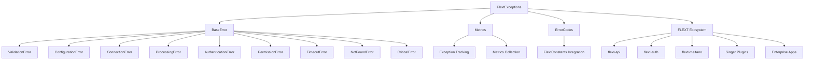

# FlextExceptions - Enterprise Exception System

**Hierarchical exception container with structured error handling, automatic metrics collection, and distributed tracing support for the FLEXT ecosystem.**

---

## Executive Summary

`FlextExceptions` serves as the **comprehensive exception foundation** for all 32+ FLEXT ecosystem projects, providing structured error handling, automatic metrics collection, distributed tracing support, and enterprise-grade monitoring capabilities. This hierarchical system ensures consistent error handling patterns across all libraries while providing detailed context for debugging and observability.

### Key Statistics
- **Module Size**: 1,306 lines with comprehensive exception hierarchy
- **Exception Types**: 15 specialized exception classes for different error scenarios
- **Integration Scope**: 102+ files across all FLEXT libraries use FlextExceptions
- **Architecture Pattern**: Hierarchical container with specialized exceptions
- **Monitoring Features**: Automatic metrics collection and correlation ID generation

---

## Architecture Overview

### Core Design Principles

FlextExceptions implements several critical architectural patterns:

1. **Hierarchical Organization**: All exceptions inherit from common BaseError
2. **Structured Error Codes**: Integration with FlextConstants for consistent error codes
3. **Context Tracking**: Rich metadata preservation for debugging
4. **Metrics Collection**: Automatic tracking of exception occurrences  
5. **Distributed Tracing**: Correlation IDs for cross-service error tracking
6. **Multiple Inheritance**: Proper inheritance from Python builtin exceptions

### System Integration



---

## Core Functionality

### 1. Exception Hierarchy

#### Base Exception with Rich Context
```python
from flext_core import FlextExceptions

# Base exception with structured context
try:
    risky_operation()
except Exception as e:
    raise FlextExceptions.BaseError(
        "Operation failed during user creation",
        code="FLEXT_2001",
        context={
            "user_id": "12345",
            "operation": "create_user",
            "attempt": 3,
            "max_retries": 5
        },
        correlation_id="req_abc123"
    )
```

#### Automatic Type Selection
```python
# Automatically selects ValidationError
raise FlextExceptions(
    "Email format is invalid",
    field="email",
    value="not-an-email@",
    context={"form_step": 1}
)

# Automatically selects OperationError  
raise FlextExceptions(
    "User creation failed",
    operation="create_user",
    context={"retry_count": 3}
)

# Automatically selects ConfigurationError
raise FlextExceptions(
    "Database URL not configured",
    config_key="DATABASE_URL",
    config_file=".env"
)
```

### 2. Specialized Exception Types

#### Data Validation Errors
```python
# Field validation with detailed context
raise FlextExceptions.ValidationError(
    "Email format is invalid",
    field="user_email",
    value="not-an-email",
    validation_details={"pattern": "email_regex"},
    context={"user_id": "123", "form": "registration"}
)

# Business rule validation
raise FlextExceptions.ValidationError(
    "Age must be at least 18",
    field="age",
    value=16,
    validation_details={"min_age": 18, "rule": "adult_only"},
    context={"registration_type": "premium"}
)
```

#### Configuration and System Errors
```python
# Configuration errors with file context
raise FlextExceptions.ConfigurationError(
    "Database connection string missing",
    config_key="DATABASE_URL", 
    config_file="/app/.env",
    context={"environment": "production"}
)

# Critical system errors requiring immediate attention
raise FlextExceptions.CriticalError(
    "Database connection pool exhausted",
    context={
        "active_connections": 100,
        "max_connections": 100,
        "waiting_requests": 25
    }
)
```

#### Network and Service Errors
```python
# Network connection failures
raise FlextExceptions.ConnectionError(
    "Failed to connect to API service",
    service="user_service",
    endpoint="https://api.example.com/users",
    context={"timeout": 30, "retry_count": 3}
)

# Service timeouts
raise FlextExceptions.TimeoutError(
    "Operation exceeded maximum allowed time",
    timeout_seconds=30.0,
    context={"operation": "database_query", "query_complexity": "high"}
)
```

#### Authentication and Authorization
```python
# Authentication failures
raise FlextExceptions.AuthenticationError(
    "Invalid credentials provided",
    auth_method="jwt_token",
    context={"token_expired": True, "user_id": "12345"}
)

# Permission errors
raise FlextExceptions.PermissionError(
    "Insufficient permissions for operation",
    required_permission="REDACTED_LDAP_BIND_PASSWORD",
    context={"user_role": "user", "operation": "delete_user"}
)
```

#### Resource Management Errors
```python
# Resource not found
raise FlextExceptions.NotFoundError(
    "User not found in database",
    resource_id="user_12345",
    resource_type="User",
    context={"search_criteria": {"email": "user@example.com"}}
)

# Resource conflicts
raise FlextExceptions.AlreadyExistsError(
    "User with this email already exists",
    resource_id="user@example.com", 
    resource_type="User",
    context={"attempted_action": "registration"}
)
```

### 3. Metrics and Monitoring

#### Exception Metrics Collection
```python
# Automatic metrics recording (happens automatically)
try:
    validate_user_input(data)
except FlextExceptions.ValidationError:
    # Metrics automatically recorded
    pass

# Get exception metrics for monitoring
metrics = FlextExceptions.get_metrics()
print(f"Validation errors: {metrics.get('ValidationError', 0)}")
print(f"Connection errors: {metrics.get('ConnectionError', 0)}")

# Monitor for high error rates
validation_errors = metrics.get("ValidationError", 0)
if validation_errors > 100:
    send_alert("High validation error rate detected")
```

#### Distributed Tracing Integration
```python
try:
    external_api_call()
except FlextExceptions.ConnectionError as e:
    # Rich tracing context automatically available
    trace_context = {
        "correlation_id": e.correlation_id,
        "timestamp": e.timestamp,
        "service": "external_api",
        "operation": "fetch_user_data",
        "error_code": e.error_code,
        "context": e.context
    }
    send_to_monitoring_system(trace_context)
```

### 4. Error Code Management

#### Structured Error Codes
```python
# Access centralized error codes
validation_code = FlextExceptions.ErrorCodes.VALIDATION_ERROR
config_code = FlextExceptions.ErrorCodes.CONFIGURATION_ERROR
critical_code = FlextExceptions.ErrorCodes.CRITICAL_ERROR

# Error code matching for handling
try:
    operation()
except FlextExceptions.BaseError as e:
    if e.code == FlextExceptions.ErrorCodes.VALIDATION_ERROR:
        handle_validation_error(e)
    elif e.code == FlextExceptions.ErrorCodes.CRITICAL_ERROR:
        escalate_critical_error(e)
    else:
        handle_generic_error(e)
```

#### Error Severity Mapping
```python
# Map error codes to alert severity levels
error_severity = {
    FlextExceptions.ErrorCodes.CRITICAL_ERROR: "high",
    FlextExceptions.ErrorCodes.CONNECTION_ERROR: "medium", 
    FlextExceptions.ErrorCodes.VALIDATION_ERROR: "low",
    FlextExceptions.ErrorCodes.NOT_FOUND: "low"
}

def get_alert_severity(exception):
    return error_severity.get(exception.code, "medium")
```

---

## Configuration Management

### Environment-Specific Error Handling

```python
# Production configuration - minimal error details
prod_config = FlextExceptions.create_environment_specific_config("production")
if prod_config.success:
    config = prod_config.value
    print(f"Log level: {config['log_level']}")  # ERROR
    print(f"Stack traces: {config['enable_stack_traces']}")  # False
    print(f"Max error details: {config['max_error_details']}")  # 500

# Development configuration - full error details  
dev_config = FlextExceptions.create_environment_specific_config("development")
if dev_config.success:
    config = dev_config.value
    print(f"Log level: {config['log_level']}")  # DEBUG
    print(f"Stack traces: {config['enable_stack_traces']}")  # True
    print(f"Max error details: {config['max_error_details']}")  # 2000

# Custom error handling configuration
custom_config = {
    "environment": "staging",
    "log_level": "INFO", 
    "validation_level": "STRICT",
    "enable_metrics": True,
    "enable_stack_traces": True,
    "max_error_details": 1000,
    "error_correlation_enabled": True
}

config_result = FlextExceptions.configure_error_handling(custom_config)
if config_result.success:
    print("Error handling configured successfully")
```

---

## Integration Patterns

### FLEXT Ecosystem Usage

FlextExceptions is extensively used across the FLEXT ecosystem:

#### API Services
```python
# flext-api exception integration
from flext_core import FlextExceptions

class FlextApiExceptions(FlextExceptions):
    """API-specific exceptions inheriting from FlextExceptions."""
    
    class HTTPError(FlextExceptions.BaseError):
        def __init__(self, message: str, *, status_code: int, **kwargs):
            self.status_code = status_code
            context = dict(kwargs.get("context", {}))
            context["http_status"] = status_code
            super().__init__(message, context=context, **kwargs)
```

#### Authentication Services
```python
# flext-auth exception specialization
class FlextAuthExceptions(FlextExceptions):
    """Authentication-specific exception extensions."""
    
    class TokenExpiredError(FlextExceptions.AuthenticationError):
        def __init__(self, message: str, *, token_type: str = None, **kwargs):
            self.token_type = token_type
            context = dict(kwargs.get("context", {}))
            context["token_type"] = token_type
            super().__init__(message, auth_method="token", context=context, **kwargs)
```

#### Data Pipeline Services
```python
# flext-meltano pipeline exceptions
class FlextMeltanoExceptions(FlextExceptions):
    """Meltano pipeline exception specializations."""
    
    class PipelineExecutionError(FlextExceptions.ProcessingError):
        def __init__(self, message: str, *, pipeline_name: str = None, **kwargs):
            self.pipeline_name = pipeline_name
            context = dict(kwargs.get("context", {}))
            context["pipeline"] = pipeline_name
            super().__init__(message, operation="pipeline_execution", context=context, **kwargs)
```

### Cross-Service Error Propagation

```python
# Service A raises FlextExceptions error
def service_a_operation():
    raise FlextExceptions.ValidationError(
        "Invalid input data",
        field="user_id", 
        value="",
        correlation_id="req_12345"
    )

# Service B catches and re-raises with additional context
def service_b_operation():
    try:
        service_a_operation()
    except FlextExceptions.ValidationError as e:
        # Add additional context while preserving correlation ID
        raise FlextExceptions.ProcessingError(
            f"User processing failed: {e.message}",
            operation="user_workflow",
            context={
                "original_error": e.code,
                "workflow_step": "validation",
                **e.context
            },
            correlation_id=e.correlation_id  # Preserve correlation ID
        )
```

---

## Exception Handling Best Practices

### 1. Contextual Exception Creation
```python
# ✅ Good - Rich context for debugging
raise FlextExceptions.ValidationError(
    "User registration failed validation",
    field="email",
    value=user_input.get("email"),
    validation_details={"pattern": "email", "required": True},
    context={
        "user_id": user_id,
        "registration_step": "email_validation", 
        "form_data_keys": list(user_input.keys()),
        "user_agent": request.headers.get("User-Agent")
    }
)

# ❌ Poor - Minimal context
raise FlextExceptions.ValidationError("Invalid email")
```

### 2. Correlation ID Preservation
```python
# ✅ Good - Preserve correlation IDs across service boundaries
def process_user_request(correlation_id: str):
    try:
        validate_user_data(data)
    except FlextExceptions.ValidationError as e:
        raise FlextExceptions.ProcessingError(
            f"User processing failed: {e.message}",
            operation="process_user",
            correlation_id=correlation_id,  # Preserve original correlation
            context={"original_error": e.code, **e.context}
        )
```

### 3. Metrics-Driven Error Handling
```python
# Monitor exception patterns for operational insights
def monitor_error_rates():
    metrics = FlextExceptions.get_metrics()
    
    # Alert on high validation error rates
    if metrics.get("ValidationError", 0) > 100:
        send_alert("High validation error rate - possible bad input data")
    
    # Alert on connection errors  
    if metrics.get("ConnectionError", 0) > 50:
        send_alert("Service connectivity issues detected")
    
    # Reset metrics for next monitoring period
    FlextExceptions.clear_metrics()
```

### 4. Environment-Appropriate Error Details
```python
# Configure error handling based on environment
def configure_for_environment(env: str):
    if env == "production":
        # Minimal error exposure in production
        config = {
            "environment": env,
            "enable_stack_traces": False,
            "max_error_details": 500,
            "log_level": "ERROR"
        }
    else:
        # Full error details for development/testing
        config = {
            "environment": env, 
            "enable_stack_traces": True,
            "max_error_details": 2000,
            "log_level": "DEBUG"
        }
    
    result = FlextExceptions.configure_error_handling(config)
    if result.failure:
        print(f"Failed to configure error handling: {result.error}")
```

---

## Advanced Features

### 1. Exception Factory Methods
```python
# Automatic exception type selection based on context
def create_appropriate_exception(error_info: dict):
    if "field" in error_info:
        return FlextExceptions(
            error_info["message"],
            field=error_info["field"],
            value=error_info.get("value"),
            context=error_info.get("context", {})
        )
    elif "config_key" in error_info:
        return FlextExceptions(
            error_info["message"],
            config_key=error_info["config_key"],
            config_file=error_info.get("config_file"),
            context=error_info.get("context", {})
        )
    elif "operation" in error_info:
        return FlextExceptions(
            error_info["message"],
            operation=error_info["operation"],
            context=error_info.get("context", {})
        )
    else:
        return FlextExceptions.Error(
            error_info["message"],
            context=error_info.get("context", {})
        )
```

### 2. Exception Chaining and Wrapping
```python
# Chain exceptions while preserving context
def wrap_external_exception(func, *args, **kwargs):
    try:
        return func(*args, **kwargs)
    except requests.ConnectionError as e:
        raise FlextExceptions.ConnectionError(
            f"External service connection failed: {str(e)}",
            service="external_api",
            endpoint=kwargs.get("url"),
            context={"original_exception": type(e).__name__}
        )
    except requests.Timeout as e:
        raise FlextExceptions.TimeoutError(
            f"External service timeout: {str(e)}",
            timeout_seconds=kwargs.get("timeout", 30),
            context={"original_exception": type(e).__name__}
        )
```

### 3. Performance-Optimized Exception Handling
```python
# Lazy context evaluation for performance
class LazyExceptionContext:
    def __init__(self, context_func):
        self._context_func = context_func
        self._context = None
    
    @property
    def context(self):
        if self._context is None:
            self._context = self._context_func()
        return self._context

def expensive_operation_with_lazy_context():
    def get_debug_context():
        # Expensive context collection
        return {
            "system_metrics": collect_system_metrics(),
            "active_connections": count_active_connections(),
            "memory_usage": get_memory_usage()
        }
    
    lazy_context = LazyExceptionContext(get_debug_context)
    
    try:
        risky_operation()
    except Exception:
        raise FlextExceptions.ProcessingError(
            "Operation failed with detailed context",
            operation="expensive_operation",
            context=lazy_context.context  # Context only evaluated if exception occurs
        )
```

---

## Error Observability and Monitoring

### 1. Structured Logging Integration
```python
import logging
from flext_core import FlextExceptions

# Configure structured logging for exceptions
logging.basicConfig(
    format='%(asctime)s - %(name)s - %(levelname)s - %(message)s',
    level=logging.INFO
)

def handle_exception_with_logging(func):
    def wrapper(*args, **kwargs):
        try:
            return func(*args, **kwargs)
        except FlextExceptions.BaseError as e:
            logging.error(
                f"FLEXT Exception occurred: {e}",
                extra={
                    "error_code": e.error_code,
                    "correlation_id": e.correlation_id,
                    "context": e.context,
                    "exception_type": type(e).__name__,
                    "timestamp": e.timestamp
                }
            )
            raise
    return wrapper
```

### 2. Metrics Export for Monitoring Systems
```python
def export_exception_metrics_to_prometheus():
    """Export FlextException metrics to Prometheus format."""
    metrics = FlextExceptions.get_metrics()
    
    prometheus_metrics = []
    for exception_type, count in metrics.items():
        prometheus_metrics.append(
            f'flext_exceptions_total{{type="{exception_type}"}} {count}'
        )
    
    return '\n'.join(prometheus_metrics)

def export_to_monitoring_system():
    """Export metrics to external monitoring system."""
    metrics = FlextExceptions.get_metrics()
    
    for exception_type, count in metrics.items():
        send_metric_to_datadog(
            metric_name="flext.exceptions.count",
            value=count,
            tags=[f"exception_type:{exception_type}"]
        )
```

### 3. Real-time Alert Generation
```python
def setup_exception_monitoring():
    """Setup real-time exception monitoring and alerting."""
    
    def check_exception_thresholds():
        metrics = FlextExceptions.get_metrics()
        
        # Critical error threshold
        if metrics.get("CriticalError", 0) > 0:
            send_immediate_alert(
                severity="critical",
                message=f"Critical errors detected: {metrics['CriticalError']}",
                details={"metrics": metrics}
            )
        
        # Connection error threshold
        if metrics.get("ConnectionError", 0) > 10:
            send_alert(
                severity="high", 
                message="High connection error rate",
                details={"count": metrics["ConnectionError"]}
            )
        
        # Validation error pattern
        if metrics.get("ValidationError", 0) > 100:
            send_alert(
                severity="medium",
                message="Possible data quality issues - high validation errors", 
                details={"count": metrics["ValidationError"]}
            )
    
    # Schedule periodic monitoring
    schedule_periodic_task(check_exception_thresholds, interval=60)  # Every minute
```

---

## Testing Exception Patterns

### 1. Exception Testing Best Practices
```python
import pytest
from flext_core import FlextExceptions

def test_validation_error_with_context():
    """Test ValidationError includes proper context."""
    with pytest.raises(FlextExceptions.ValidationError) as exc_info:
        raise FlextExceptions.ValidationError(
            "Email is required",
            field="email",
            value="",
            context={"form_step": 1}
        )
    
    exception = exc_info.value
    assert exception.field == "email"
    assert exception.value == ""
    assert exception.context["form_step"] == 1
    assert exception.correlation_id is not None
    assert "FLEXT_" in exception.error_code

def test_automatic_type_selection():
    """Test automatic exception type selection."""
    # Should create ValidationError
    with pytest.raises(FlextExceptions.ValidationError):
        raise FlextExceptions(
            "Field validation failed",
            field="username",
            value=""
        )
    
    # Should create ConfigurationError
    with pytest.raises(FlextExceptions.ConfigurationError):
        raise FlextExceptions(
            "Config missing",
            config_key="DATABASE_URL"
        )

def test_metrics_collection():
    """Test automatic metrics collection."""
    # Clear metrics
    FlextExceptions.clear_metrics()
    
    # Raise some exceptions
    for _ in range(3):
        try:
            raise FlextExceptions.ValidationError("Test error")
        except FlextExceptions.ValidationError:
            pass
    
    for _ in range(2):
        try:
            raise FlextExceptions.ConnectionError("Test error")
        except FlextExceptions.ConnectionError:
            pass
    
    # Check metrics
    metrics = FlextExceptions.get_metrics()
    assert metrics["ValidationError"] == 3
    assert metrics["ConnectionError"] == 2
```

---

## See Also

- **[FlextConstants](../constants/README.md)**: Error code definitions and constants
- **[FlextResult](../result/README.md)**: Railway-oriented programming for error handling
- **[FlextObservability](../observability/README.md)**: Monitoring and observability integration
- **[FlextLogger](../logging/README.md)**: Structured logging integration
- **[FlextValidations](../validation/README.md)**: Input validation that raises FlextExceptions
- **[FlextCore](../core/README.md)**: Central orchestration hub that uses FlextExceptions

---

*This documentation reflects FlextExceptions as the comprehensive exception foundation for the entire FLEXT ecosystem, providing structured error handling, automatic metrics collection, and distributed tracing support across all 32+ projects.*
