# FlextFields - Enterprise Field Definition and Schema Management System

**Version**: 0.9.0  
**Module**: `flext_core.fields`  
**Classification**: Enterprise Field Management Infrastructure  
**Architectural Role**: Schema Definition, Field Validation, Metadata Management

## 📖 Executive Summary

`FlextFields` represents a **comprehensive enterprise field definition and schema management system** providing sophisticated patterns for **hierarchical field types**, **registry-based field management**, **schema processing**, **factory creation patterns**, and **metadata introspection**. Built on Clean Architecture principles with complete **FlextResult integration**, it serves as the field validation and schema foundation across all FLEXT applications with **type-safe validation**, **flexible field composition**, and **environment-aware configuration**.

**Key Innovation**: Complete field ecosystem consolidation with **6 hierarchical layers** (Core, Validation, Registry, Schema, Factory, Metadata) into a single, well-organized container with **nested class architecture**, eliminating field definition inconsistency while providing enterprise-grade schema management and validation capabilities.

### Core Value Propositions

- 🏗️ **Complete Field System**: 6-layer hierarchical architecture with comprehensive field management
- 📋 **Schema Processing**: Advanced schema validation, merging, and metadata extraction capabilities
- 🏭 **Factory Patterns**: Builder pattern and factory methods for flexible field creation
- 📊 **Field Registry**: Centralized field registration, lookup, and management system
- 🎯 **Type Safety**: Type-safe field validation with FlextResult integration and generic constraints

---

## 🏗️ Architectural Overview

### System Architecture: 6-Layer Hierarchical Field Management

```mermaid
graph TB
    subgraph "FlextFields Enterprise Architecture"
        direction TB

        %% Layer 6: Metadata System (Top)
        subgraph METADATA ["📊 Metadata System"]
            direction LR
            FieldAnalysis["Field Analysis<br/>🔍 Comprehensive field introspection"]
            CapabilityAnalysis["Capability Analysis<br/>⚡ Feature detection"]
            FieldSummary["Field Summary<br/>📈 Aggregate statistics"]
        end

        %% Layer 5: Factory System
        subgraph FACTORY ["🏭 Factory System"]
            direction LR
            FieldFactory["Field Factory<br/>🏭 Centralized field creation"]
            FieldBuilder["Field Builder<br/>🔨 Fluent builder pattern"]
            FieldTemplates["Field Templates<br/>📝 Predefined patterns"]
        end

        %% Layer 4: Schema System
        subgraph SCHEMA ["🗂️ Schema System"]
            direction LR
            SchemaProcessor["Schema Processor<br/>⚙️ Schema validation & processing"]
            SchemaValidator["Schema Validator<br/>✅ Structure validation"]
            SchemaMerger["Schema Merger<br/>🔗 Schema composition"]
        end

        %% Layer 3: Registry System
        subgraph REGISTRY ["📚 Registry System"]
            direction LR
            FieldRegistry["Field Registry<br/>📋 Centralized field management"]
            FieldLookup["Field Lookup<br/>🔍 Field retrieval"]
            RegistryManagement["Registry Management<br/>⚙️ Field lifecycle"]
        end

        %% Layer 2: Validation System
        subgraph VALIDATION ["✅ Validation System"]
            direction LR
            FieldValidator["Field Validator<br/>🔍 Base validation logic"]
            TypeValidators["Type Validators<br/>📊 Type-specific validation"]
            ConstraintValidators["Constraint Validators<br/>📏 Constraint checking"]
        end

        %% Layer 1: Core Field System (Base)
        subgraph CORE ["⚡ Core Field System"]
            direction LR
            BaseField["BaseField<br/>🧱 Abstract field foundation"]
            StringField["StringField<br/>📄 String validation"]
            NumericFields["Numeric Fields<br/>🔢 Integer, Float"]
            DateTimeFields["DateTime Fields<br/>⏰ Date, Time, DateTime"]
            BooleanField["BooleanField<br/>☑️ Boolean validation"]
            EmailField["EmailField<br/>📧 Email format validation"]
            UuidField["UuidField<br/>🔑 UUID validation"]
        end

        %% Connections between layers
        METADATA --> FACTORY
        FACTORY --> SCHEMA
        SCHEMA --> REGISTRY
        REGISTRY --> VALIDATION
        VALIDATION --> CORE

        %% External integrations
        FlextResult["FlextResult<br/>🚂 Railway Programming"]
        FlextTypes["FlextTypes<br/>📊 Type System"]
        FlextConstants["FlextConstants<br/>⚙️ Validation Constants"]
        FlextUtilities["FlextUtilities<br/>🛠️ Utility Functions"]

        CORE -.-> FlextResult
        VALIDATION -.-> FlextTypes
        REGISTRY -.-> FlextConstants
        FACTORY -.-> FlextUtilities
    end

    classDef metadataLayer fill:#e3f2fd,stroke:#0d47a1,stroke-width:2px
    classDef factoryLayer fill:#f3e5f5,stroke:#4a148c,stroke-width:2px
    classDef schemaLayer fill:#e8f5e8,stroke:#1b5e20,stroke-width:2px
    classDef registryLayer fill:#fff8e1,stroke:#e65100,stroke-width:2px
    classDef validationLayer fill:#fce4ec,stroke:#880e4f,stroke-width:2px
    classDef coreLayer fill:#f1f8e9,stroke:#33691e,stroke-width:2px

    class METADATA metadataLayer
    class FACTORY factoryLayer
    class SCHEMA schemaLayer
    class REGISTRY registryLayer
    class VALIDATION validationLayer
    class CORE coreLayer
```



### Design Pattern Integration Matrix

| **Pattern**          | **Implementation**               | **Key Benefits**                                    | **Performance Impact**         |
| -------------------- | -------------------------------- | --------------------------------------------------- | ------------------------------ |
| **Factory Pattern**  | `FieldFactory`, `FieldBuilder`   | Standardized field creation, flexible configuration | Minimal creation overhead      |
| **Registry Pattern** | `FieldRegistry`                  | Centralized field management, lookup optimization   | O(1) field retrieval           |
| **Template Method**  | `BaseField` validation hierarchy | Consistent validation patterns, extensibility       | Optimized validation pipeline  |
| **Builder Pattern**  | `FieldBuilder` fluent interface  | Complex field construction, readable configuration  | Flexible with good performance |
| **Strategy Pattern** | Type-specific validators         | Pluggable validation strategies, extensibility      | Type-optimized validation      |

---

## 🔍 Component Deep Dive

### 1. Core Field System - Foundation Field Types with Type Safety

The Core Field System provides **enterprise-grade field type definitions** with **type-safe validation**, **constraint enforcement**, and **metadata management**.

#### **BaseField[T]** - Abstract Foundation with Generics

```python
from flext_core.fields import FlextFields
from flext_core.result import FlextResult

# String field with length constraints
username_field = FlextFields.Core.StringField(
    name="username",
    min_length=3,
    max_length=20,
    required=True,
    description="User login name"
)

# Validate input data
validation_result = username_field.validate("john_doe")
if validation_result.success:
    validated_username = validation_result.value
    print(f"✅ Valid username: {validated_username}")
else:
    print(f"❌ Validation failed: {validation_result.error}")

# Numeric field with range constraints
age_field = FlextFields.Core.IntegerField(
    name="age",
    min_value=13,
    max_value=120,
    required=True,
    description="User age in years"
)

# Email field with format validation
email_field = FlextFields.Core.EmailField(
    name="email",
    required=True,
    description="User email address"
)

# Boolean field with flexible conversion
active_field = FlextFields.Core.BooleanField(
    name="active",
    required=False,
    default=True,
    description="Account active status"
)

print("=== Field Metadata Examples ===")

# Extract field metadata
username_metadata = username_field.get_metadata()
print(f"Username field metadata:")
print(f"  Type: {username_metadata['field_type']}")
print(f"  Required: {username_metadata['required']}")
print(f"  Has constraints: {username_metadata.get('has_constraints', False)}")

age_metadata = age_field.get_metadata()
print(f"\\nAge field metadata:")
print(f"  Type: {age_metadata['field_type']}")
print(f"  Min value: {age_field.min_value}")
print(f"  Max value: {age_field.max_value}")

email_metadata = email_field.get_metadata()
print(f"\\nEmail field metadata:")
print(f"  Type: {email_metadata['field_type']}")
print(f"  Format validation: {email_metadata.get('validates_format', False)}")
```

#### **Advanced Field Types with Specialized Validation**

```python
from datetime import datetime, UTC
import uuid

# DateTime field with timezone support
created_at_field = FlextFields.Core.DateTimeField(
    name="created_at",
    required=False,
    default=datetime.now(UTC),
    description="Record creation timestamp"
)

# UUID field for unique identifiers
id_field = FlextFields.Core.UuidField(
    name="id",
    required=True,
    description="Unique record identifier"
)

# Float field with precision control
price_field = FlextFields.Core.FloatField(
    name="price",
    min_value=0.0,
    max_value=999999.99,
    precision=2,  # Two decimal places
    required=True,
    description="Product price in USD"
)

print("=== Advanced Field Validation ===")

# DateTime validation
datetime_result = created_at_field.validate(datetime.now(UTC))
if datetime_result.success:
    print(f"✅ DateTime validated: {datetime_result.value}")

# UUID validation
test_uuid = str(uuid.uuid4())
uuid_result = id_field.validate(test_uuid)
if uuid_result.success:
    print(f"✅ UUID validated: {uuid_result.value}")

# Float precision validation
price_result = price_field.validate(19.999)  # Will be rounded to 19.99
if price_result.success:
    print(f"✅ Price validated with precision: {price_result.value}")

# Validation error examples
invalid_email_result = email_field.validate("invalid-email")
if not invalid_email_result.success:
    print(f"❌ Invalid email: {invalid_email_result.error}")

invalid_age_result = age_field.validate(150)  # Too old
if not invalid_age_result.success:
    print(f"❌ Invalid age: {invalid_age_result.error}")
```

### 2. Registry System - Centralized Field Management

The Registry System provides **centralized field registration**, **lookup optimization**, and **field lifecycle management**.

#### **FieldRegistry** - Enterprise Field Management

```python
# Create field registry instance
field_registry = FlextFields.Registry.FieldRegistry()

# Register common fields
print("=== Field Registry Management ===")

# Register user fields
username_registration = field_registry.register_field("user_username", username_field)
if username_registration.success:
    print("✅ Username field registered")

email_registration = field_registry.register_field("user_email", email_field)
if email_registration.success:
    print("✅ Email field registered")

age_registration = field_registry.register_field("user_age", age_field)
if age_registration.success:
    print("✅ Age field registered")

# Register product fields
price_registration = field_registry.register_field("product_price", price_field)
if price_registration.success:
    print("✅ Price field registered")

id_registration = field_registry.register_field("record_id", id_field)
if id_registration.success:
    print("✅ ID field registered")

# List all registered fields
registered_fields_result = field_registry.list_registered_fields()
if registered_fields_result.success:
    registered_fields = registered_fields_result.value
    print(f"\\n📋 Registered fields ({len(registered_fields)}):")
    for field_name in registered_fields:
        print(f"  - {field_name}")

# Retrieve and use registered fields
print(f"\\n=== Field Lookup and Usage ===")

username_lookup = field_registry.get_field("user_username")
if username_lookup.success:
    retrieved_field = username_lookup.value

    # Use retrieved field for validation
    validation_result = retrieved_field.validate("john_doe")
    if validation_result.success:
        print(f"✅ Retrieved username field validated: {validation_result.value}")

email_lookup = field_registry.get_field("user_email")
if email_lookup.success:
    retrieved_email_field = email_lookup.value

    # Validate email using retrieved field
    email_validation = retrieved_email_field.validate("user@company.com")
    if email_validation.success:
        print(f"✅ Retrieved email field validated: {email_validation.value}")

# Error handling for missing fields
missing_field_result = field_registry.get_field("nonexistent_field")
if not missing_field_result.success:
    print(f"❌ Field lookup failed: {missing_field_result.error}")

# Unregister field example
unregister_result = field_registry.unregister_field("record_id")
if unregister_result.success:
    print("✅ Record ID field unregistered")

# Verify unregistration
verification_result = field_registry.get_field("record_id")
if not verification_result.success:
    print("✅ Field successfully unregistered (lookup failed as expected)")
```

### 3. Schema System - Advanced Schema Processing and Validation

The Schema System provides **schema validation**, **schema merging**, **metadata extraction**, and **documentation generation**.

#### **Schema Processing** - Enterprise Schema Management

```python
# Create schema processor
schema_processor = FlextFields.Schema.FieldProcessor()

# Define user schema
user_schema = {
    "username": {
        "type": "string",
        "required": True,
        "min_length": 3,
        "max_length": 20,
        "description": "User login name"
    },
    "email": {
        "type": "email",
        "required": True,
        "description": "User email address"
    },
    "age": {
        "type": "integer",
        "required": False,
        "min_value": 13,
        "max_value": 120,
        "description": "User age in years"
    },
    "active": {
        "type": "boolean",
        "required": False,
        "default": True,
        "description": "Account active status"
    }
}

# Define product schema
product_schema = {
    "name": {
        "type": "string",
        "required": True,
        "min_length": 1,
        "max_length": 100,
        "description": "Product name"
    },
    "price": {
        "type": "float",
        "required": True,
        "min_value": 0.0,
        "max_value": 999999.99,
        "precision": 2,
        "description": "Product price in USD"
    },
    "category": {
        "type": "string",
        "required": True,
        "allowed_values": ["electronics", "clothing", "books", "home"],
        "description": "Product category"
    }
}

print("=== Schema Validation ===")

# Validate schemas
user_schema_validation = FlextFields.Schema.validate_schema(user_schema)
if user_schema_validation.success:
    print("✅ User schema validation passed")
    validated_user_schema = user_schema_validation.value
    print(f"   Schema contains {len(validated_user_schema)} fields")

product_schema_validation = FlextFields.Schema.validate_schema(product_schema)
if product_schema_validation.success:
    print("✅ Product schema validation passed")
    validated_product_schema = product_schema_validation.value
    print(f"   Schema contains {len(validated_product_schema)} fields")

# Schema merging
print(f"\\n=== Schema Merging ===")

merged_schema_result = FlextFields.Schema.merge_schemas(user_schema, product_schema)
if merged_schema_result.success:
    merged_schema = merged_schema_result.value
    print(f"✅ Schemas merged successfully")
    print(f"   Merged schema contains {len(merged_schema)} fields:")

    for field_name, field_def in merged_schema.items():
        field_type = field_def.get("type", "unknown")
        required = field_def.get("required", False)
        status = "required" if required else "optional"
        print(f"     - {field_name}: {field_type} ({status})")

# Extract field metadata
print(f"\\n=== Field Metadata Extraction ===")

username_metadata_result = FlextFields.Schema.extract_field_metadata(username_field)
if username_metadata_result.success:
    metadata = username_metadata_result.value
    print("✅ Username field metadata extracted:")
    print(f"   Type: {metadata.get('type')}")
    print(f"   Required: {metadata.get('required')}")
    print(f"   Constraints: {metadata.get('constraints', {})}")

# Generate field documentation
username_docs = FlextFields.Schema.generate_field_docs(username_field)
print(f"\\n=== Generated Field Documentation ===")
print("Username field documentation:")
print(username_docs)

email_docs = FlextFields.Schema.generate_field_docs(email_field)
print("\\nEmail field documentation:")
print(email_docs)

price_docs = FlextFields.Schema.generate_field_docs(price_field)
print("\\nPrice field documentation:")
print(price_docs)
```

### 4. Factory System - Advanced Field Creation Patterns

The Factory System provides **standardized field creation**, **builder patterns**, and **template-based field generation**.

#### **FieldFactory and FieldBuilder** - Enterprise Field Creation

```python
# Factory method field creation
print("=== Factory Method Field Creation ===")

# Create string field using factory
factory_username = FlextFields.Factory.create_string_field(
    name="username",
    min_length=3,
    max_length=20,
    required=True,
    description="User login name"
)

if factory_username.success:
    username_field = factory_username.value
    print("✅ String field created via factory")

    # Test the factory-created field
    validation_result = username_field.validate("john_doe")
    if validation_result.success:
        print(f"   Validation successful: {validation_result.value}")

# Create numeric field using factory
factory_age = FlextFields.Factory.create_numeric_field(
    name="age",
    field_type="integer",
    min_value=13,
    max_value=120,
    required=True,
    description="User age in years"
)

if factory_age.success:
    age_field = factory_age.value
    print("✅ Numeric field created via factory")

# Create email field using factory
factory_email = FlextFields.Factory.create_email_field(
    name="email",
    required=True,
    description="User email address"
)

if factory_email.success:
    email_field = factory_email.value
    print("✅ Email field created via factory")

# Builder pattern field creation
print(f"\\n=== Builder Pattern Field Creation ===")

# Create complex field using builder pattern
builder_field_result = (
    FlextFields.Factory.FieldBuilder("string", "complex_username")
    .with_length(5, 30)
    .with_pattern(r"^[a-zA-Z][a-zA-Z0-9_]*$")
    .with_requirement(True)
    .with_description("Complex username with pattern validation")
    .build()
)

if builder_field_result.success:
    complex_field = builder_field_result.value
    print("✅ Complex field created via builder")

    # Test builder-created field
    valid_username = complex_field.validate("john_doe_123")
    invalid_username = complex_field.validate("123_invalid")

    if valid_username.success:
        print(f"   ✅ Valid username: {valid_username.value}")

    if not invalid_username.success:
        print(f"   ❌ Invalid username (expected): {invalid_username.error}")

# Create numeric field using builder
numeric_builder_result = (
    FlextFields.Factory.FieldBuilder("integer", "score")
    .with_range(0, 100)
    .with_requirement(True)
    .with_description("User score from 0 to 100")
    .build()
)

if numeric_builder_result.success:
    score_field = numeric_builder_result.value
    print("✅ Numeric field created via builder")

    # Test range validation
    valid_score = score_field.validate(85)
    invalid_score = score_field.validate(150)

    if valid_score.success:
        print(f"   ✅ Valid score: {valid_score.value}")

    if not invalid_score.success:
        print(f"   ❌ Invalid score (expected): {invalid_score.error}")

# Create boolean field using builder
boolean_builder_result = (
    FlextFields.Factory.FieldBuilder("boolean", "verified")
    .with_default(False)
    .with_requirement(False)
    .with_description("Account verification status")
    .build()
)

if boolean_builder_result.success:
    verified_field = boolean_builder_result.value
    print("✅ Boolean field created via builder")
```

### 5. Metadata System - Comprehensive Field Analysis and Introspection

The Metadata System provides **field analysis**, **capability detection**, **field summaries**, and **comprehensive introspection**.

#### **Field Analysis** - Enterprise Metadata Management

```python
# Field analysis and introspection
print("=== Field Analysis and Introspection ===")

# Analyze individual field
username_analysis_result = FlextFields.Metadata.analyze_field(username_field)
if username_analysis_result.success:
    analysis = username_analysis_result.value

    print("✅ Username field analysis:")
    print(f"   Field class: {analysis['field_class']}")
    print(f"   Field module: {analysis['field_module']}")
    print(f"   Is required: {analysis['constraints']['is_required']}")
    print(f"   Has default: {analysis['constraints']['has_default']}")
    print(f"   Description available: {analysis['constraints']['description_available']}")

    # Capabilities analysis
    capabilities = analysis['capabilities']
    print(f"   Capabilities:")
    for capability, enabled in capabilities.items():
        status = "✅" if enabled else "❌"
        print(f"     {status} {capability}")

# Analyze numeric field
age_analysis_result = FlextFields.Metadata.analyze_field(age_field)
if age_analysis_result.success:
    age_analysis = age_analysis_result.value

    print(f"\\n✅ Age field analysis:")
    print(f"   Field class: {age_analysis['field_class']}")

    # Numeric constraints
    if 'numeric_constraints' in age_analysis:
        constraints = age_analysis['numeric_constraints']
        print(f"   Numeric constraints:")
        print(f"     Min value: {constraints['min_value']}")
        print(f"     Max value: {constraints['max_value']}")

# Analyze email field
email_analysis_result = FlextFields.Metadata.analyze_field(email_field)
if email_analysis_result.success:
    email_analysis = email_analysis_result.value

    print(f"\\n✅ Email field analysis:")
    print(f"   Field class: {email_analysis['field_class']}")

    # Email-specific capabilities
    capabilities = email_analysis['capabilities']
    if 'validates_email_format' in capabilities:
        print(f"   Email format validation: {capabilities['validates_email_format']}")

# Generate field summary for multiple fields
all_fields = [username_field, email_field, age_field, price_field, active_field]

field_summary_result = FlextFields.Metadata.get_field_summary(all_fields)
if field_summary_result.success:
    summary = field_summary_result.value

    print(f"\\n=== Field Collection Summary ===")
    print(f"✅ Field summary generated:")
    print(f"   Total fields: {summary['total_fields']}")
    print(f"   Required fields: {summary['required_fields']}")
    print(f"   Optional fields: {summary['optional_fields']}")
    print(f"   Fields with defaults: {summary['fields_with_defaults']}")

    # Field types breakdown
    field_types = summary['field_types']
    print(f"   Field types:")
    for field_type, count in field_types.items():
        print(f"     - {field_type}: {count}")

    # Validation capabilities
    validation_capabilities = summary['validation_capabilities']
    print(f"   Available validation capabilities:")
    for capability in validation_capabilities:
        print(f"     - {capability}")

# Advanced metadata extraction for schema documentation
print(f"\\n=== Schema Documentation Generation ===")

schema_fields = {
    "username": username_field,
    "email": email_field,
    "age": age_field,
    "price": price_field,
    "active": active_field
}

print("Generated schema documentation:")
for field_name, field in schema_fields.items():
    field_docs = FlextFields.Schema.generate_field_docs(field)
    print(f"\\n**{field_name}**:")
    print(field_docs)
```

### 6. Configuration Management - Environment-Specific Field System Configuration

#### **Enterprise Field System Configuration**

```python
# Configure field system for different environments
print("=== Field System Configuration ===")

# Production configuration
production_config = {
    "environment": "production",
    "validation_level": "strict",
    "enable_field_caching": True,
    "max_cache_size": 10000,
    "cache_ttl": 3600,  # 1 hour
    "enable_performance_monitoring": True,
    "enable_field_registry": True,
    "registry_max_size": 5000
}

config_result = FlextFields.configure_fields_system(production_config)
if config_result.success:
    applied_config = config_result.value
    print("✅ Production configuration applied:")
    print(f"   Environment: {applied_config['environment']}")
    print(f"   Validation level: {applied_config['validation_level']}")
    print(f"   Field caching: {applied_config['enable_field_caching']}")
    print(f"   Performance monitoring: {applied_config['enable_performance_monitoring']}")

# Get current system configuration
current_config_result = FlextFields.get_fields_system_config()
if current_config_result.success:
    current_config = current_config_result.value
    print(f"\\n✅ Current field system configuration:")
    for key, value in current_config.items():
        print(f"   {key}: {value}")

# Environment-specific configuration creation
dev_config_result = FlextFields.create_environment_fields_config("development")
if dev_config_result.success:
    dev_config = dev_config_result.value
    print(f"\\n✅ Development environment config created:")
    print(f"   Environment: {dev_config['environment']}")
    print(f"   Debug logging: {dev_config.get('enable_debug_logging', False)}")
    print(f"   Validation level: {dev_config['validation_level']}")

# Performance optimization
perf_optimization_result = FlextFields.optimize_fields_performance("high")
if perf_optimization_result.success:
    perf_config = perf_optimization_result.value
    print(f"\\n✅ Performance optimization applied:")
    print(f"   Performance level: {perf_config['performance_level']}")
    print(f"   Cache optimization: {perf_config.get('enable_cache_optimization', False)}")
    print(f"   Batch processing: {perf_config.get('enable_batch_processing', False)}")
```

---

## 💡 Real-World Integration Patterns

### Complete Enterprise Form Validation System

```python
class EnterpriseFormValidationService:
    """Complete enterprise form validation service using FlextFields comprehensively."""

    def __init__(self):
        # Configure fields system for enterprise use
        self._setup_fields_system()

        # Initialize field registry
        self.field_registry = FlextFields.Registry.FieldRegistry()
        self._register_common_fields()

        # Initialize schema processor
        self.schema_processor = FlextFields.Schema.FieldProcessor()

    def _setup_fields_system(self) -> None:
        """Setup comprehensive fields system for enterprise use."""

        # Production configuration
        config = {
            "environment": "production",
            "validation_level": "strict",
            "enable_field_caching": True,
            "max_cache_size": 5000,
            "enable_performance_monitoring": True
        }

        config_result = FlextFields.configure_fields_system(config)
        if config_result.success:
            print("✅ Enterprise fields system configured")

    def _register_common_fields(self) -> None:
        """Register commonly used fields in the enterprise registry."""

        # User fields
        username_field = FlextFields.Core.StringField(
            name="username",
            min_length=3,
            max_length=30,
            required=True,
            description="User login name"
        )

        email_field = FlextFields.Core.EmailField(
            name="email",
            required=True,
            description="User email address"
        )

        # Contact fields
        phone_field = FlextFields.Core.StringField(
            name="phone",
            pattern=r"^\\+?1?\\d{9,15}$",
            required=False,
            description="Phone number in international format"
        )

        # Business fields
        company_field = FlextFields.Core.StringField(
            name="company",
            min_length=2,
            max_length=100,
            required=False,
            description="Company name"
        )

        # Financial fields
        salary_field = FlextFields.Core.FloatField(
            name="salary",
            min_value=0.0,
            max_value=10000000.0,
            precision=2,
            required=False,
            description="Annual salary in USD"
        )

        # Register all fields
        fields_to_register = [
            ("user_username", username_field),
            ("user_email", email_field),
            ("contact_phone", phone_field),
            ("business_company", company_field),
            ("financial_salary", salary_field)
        ]

        for field_name, field in fields_to_register:
            registration_result = self.field_registry.register_field(field_name, field)
            if registration_result.success:
                print(f"✅ Registered field: {field_name}")

    def validate_user_registration_form(self, form_data: FlextTypes.Core.Dict) -> FlextResult[FlextTypes.Core.Dict]:
        """Validate complete user registration form with comprehensive checks."""

        validated_data = {}
        validation_errors = []

        # Username validation
        username_field_result = self.field_registry.get_field("user_username")
        if username_field_result.success:
            username_field = username_field_result.value
            username_value = form_data.get("username")

            username_validation = username_field.validate(username_value)
            if username_validation.success:
                validated_data["username"] = username_validation.value
            else:
                validation_errors.append(f"Username: {username_validation.error}")

        # Email validation
        email_field_result = self.field_registry.get_field("user_email")
        if email_field_result.success:
            email_field = email_field_result.value
            email_value = form_data.get("email")

            email_validation = email_field.validate(email_value)
            if email_validation.success:
                validated_data["email"] = email_validation.value
            else:
                validation_errors.append(f"Email: {email_validation.error}")

        # Password validation (create field on-demand)
        password_field = FlextFields.Core.StringField(
            name="password",
            min_length=8,
            max_length=128,
            required=True,
            description="User password"
        )

        password_value = form_data.get("password")
        password_validation = password_field.validate(password_value)
        if password_validation.success:
            validated_data["password"] = password_validation.value
        else:
            validation_errors.append(f"Password: {password_validation.error}")

        # Age validation (optional field)
        if "age" in form_data:
            age_field = FlextFields.Core.IntegerField(
                name="age",
                min_value=13,
                max_value=120,
                required=False,
                description="User age"
            )

            age_validation = age_field.validate(form_data["age"])
            if age_validation.success:
                validated_data["age"] = age_validation.value
            else:
                validation_errors.append(f"Age: {age_validation.error}")

        # Return results
        if validation_errors:
            error_message = "; ".join(validation_errors)
            return FlextResult[FlextTypes.Core.Dict].fail(f"Form validation failed: {error_message}")

        return FlextResult[FlextTypes.Core.Dict].ok(validated_data)

    def validate_business_profile_form(self, form_data: FlextTypes.Core.Dict) -> FlextResult[FlextTypes.Core.Dict]:
        """Validate business profile form with registered fields."""

        validated_data = {}
        validation_errors = []

        # Company validation
        company_field_result = self.field_registry.get_field("business_company")
        if company_field_result.success:
            company_field = company_field_result.value
            company_value = form_data.get("company")

            company_validation = company_field.validate(company_value)
            if company_validation.success:
                validated_data["company"] = company_validation.value
            else:
                validation_errors.append(f"Company: {company_validation.error}")

        # Phone validation (optional)
        if "phone" in form_data:
            phone_field_result = self.field_registry.get_field("contact_phone")
            if phone_field_result.success:
                phone_field = phone_field_result.value
                phone_validation = phone_field.validate(form_data["phone"])
                if phone_validation.success:
                    validated_data["phone"] = phone_validation.value
                else:
                    validation_errors.append(f"Phone: {phone_validation.error}")

        # Salary validation (optional)
        if "salary" in form_data:
            salary_field_result = self.field_registry.get_field("financial_salary")
            if salary_field_result.success:
                salary_field = salary_field_result.value
                salary_validation = salary_field.validate(form_data["salary"])
                if salary_validation.success:
                    validated_data["salary"] = salary_validation.value
                else:
                    validation_errors.append(f"Salary: {salary_validation.error}")

        # Return results
        if validation_errors:
            error_message = "; ".join(validation_errors)
            return FlextResult[FlextTypes.Core.Dict].fail(f"Business profile validation failed: {error_message}")

        return FlextResult[FlextTypes.Core.Dict].ok(validated_data)

    def create_dynamic_form_schema(self, field_definitions: list[FlextTypes.Core.Dict]) -> FlextResult[FlextTypes.Core.Dict]:
        """Create dynamic form schema from field definitions."""

        schema = {}

        for field_def in field_definitions:
            field_name = field_def.get("name")
            field_type = field_def.get("type")

            if not field_name or not field_type:
                return FlextResult[FlextTypes.Core.Dict].fail("Field name and type are required")

            # Create field using factory
            if field_type == "string":
                field_result = FlextFields.Factory.create_string_field(
                    name=field_name,
                    min_length=field_def.get("min_length"),
                    max_length=field_def.get("max_length"),
                    required=field_def.get("required", True),
                    description=field_def.get("description", "")
                )
            elif field_type == "email":
                field_result = FlextFields.Factory.create_email_field(
                    name=field_name,
                    required=field_def.get("required", True),
                    description=field_def.get("description", "")
                )
            elif field_type == "integer":
                field_result = FlextFields.Factory.create_numeric_field(
                    name=field_name,
                    field_type="integer",
                    min_value=field_def.get("min_value"),
                    max_value=field_def.get("max_value"),
                    required=field_def.get("required", True),
                    description=field_def.get("description", "")
                )
            else:
                return FlextResult[FlextTypes.Core.Dict].fail(f"Unsupported field type: {field_type}")

            if field_result.success:
                field = field_result.value
                schema[field_name] = {
                    "field": field,
                    "metadata": field.get_metadata()
                }
            else:
                return FlextResult[FlextTypes.Core.Dict].fail(f"Failed to create field {field_name}: {field_result.error}")

        return FlextResult[FlextTypes.Core.Dict].ok(schema)

    def get_validation_statistics(self) -> FlextTypes.Core.Dict:
        """Get comprehensive validation statistics."""

        # Get registered fields count
        registered_fields_result = self.field_registry.list_registered_fields()
        registered_count = len(registered_fields_result.value) if registered_fields_result.success else 0

        # Get current system configuration
        config_result = FlextFields.get_fields_system_config()
        current_config = config_result.value if config_result.success else {}

        return {
            "registered_fields_count": registered_count,
            "field_system_config": current_config,
            "validation_level": current_config.get("validation_level", "unknown"),
            "caching_enabled": current_config.get("enable_field_caching", False),
            "performance_monitoring": current_config.get("enable_performance_monitoring", False)
        }

# Demonstrate complete enterprise form validation service
print("=== Complete Enterprise Form Validation Service ===")

form_service = EnterpriseFormValidationService()

# Test user registration form validation
user_registration_data = {
    "username": "john_doe",
    "email": "john.doe@company.com",
    "password": "SecurePass123",
    "age": 28
}

registration_result = form_service.validate_user_registration_form(user_registration_data)
if registration_result.success:
    validated_user = registration_result.value
    print("✅ User registration validation successful:")
    for key, value in validated_user.items():
        print(f"   {key}: {value}")
else:
    print(f"❌ User registration validation failed: {registration_result.error}")

# Test business profile form validation
business_profile_data = {
    "company": "ACME Corporation",
    "phone": "+1234567890",
    "salary": 75000.00
}

business_result = form_service.validate_business_profile_form(business_profile_data)
if business_result.success:
    validated_business = business_result.value
    print(f"\\n✅ Business profile validation successful:")
    for key, value in validated_business.items():
        print(f"   {key}: {value}")
else:
    print(f"❌ Business profile validation failed: {business_result.error}")

# Test dynamic form schema creation
dynamic_field_definitions = [
    {
        "name": "project_name",
        "type": "string",
        "min_length": 3,
        "max_length": 50,
        "required": True,
        "description": "Project name"
    },
    {
        "name": "budget",
        "type": "integer",
        "min_value": 1000,
        "max_value": 1000000,
        "required": True,
        "description": "Project budget in USD"
    },
    {
        "name": "contact_email",
        "type": "email",
        "required": True,
        "description": "Project contact email"
    }
]

schema_result = form_service.create_dynamic_form_schema(dynamic_field_definitions)
if schema_result.success:
    dynamic_schema = schema_result.value
    print(f"\\n✅ Dynamic form schema created:")
    print(f"   Schema contains {len(dynamic_schema)} fields:")

    for field_name, field_info in dynamic_schema.items():
        metadata = field_info["metadata"]
        print(f"     - {field_name}: {metadata['field_type']} ({'required' if metadata['required'] else 'optional'})")

# Get validation statistics
stats = form_service.get_validation_statistics()
print(f"\\n📊 Validation Service Statistics:")
print(f"   Registered fields: {stats['registered_fields_count']}")
print(f"   Validation level: {stats['validation_level']}")
print(f"   Caching enabled: {stats['caching_enabled']}")
print(f"   Performance monitoring: {stats['performance_monitoring']}")

print("\\n✅ Enterprise form validation service demonstration completed")
```

---

## 🎯 Key Integration Benefits

### 1. **Complete Field Management Ecosystem**

- **6-Layer Architecture**: Core, Validation, Registry, Schema, Factory, Metadata systems working together
- **Enterprise Integration**: Deep FlextResult integration ensures railway-oriented programming across all field operations
- **Type Safety**: Generic type constraints with compile-time safety and runtime validation
- **Schema Management**: Advanced schema processing, validation, merging, and documentation generation

### 2. **Advanced Field Creation and Management**

- **Factory Patterns**: Standardized field creation with builder pattern support
- **Registry System**: Centralized field registration, lookup, and lifecycle management
- **Field Templates**: Reusable field definitions for consistent application patterns
- **Metadata Introspection**: Comprehensive field analysis and capability detection

### 3. **Enterprise Validation and Performance**

- **Type-Safe Validation**: Generic field validation with FlextResult error handling
- **Constraint Enforcement**: Advanced constraint validation for strings, numbers, emails, dates
- **Performance Optimization**: Field caching, registry optimization, batch processing
- **Environment Configuration**: Production, development, test-specific field system tuning

### 4. **Developer Experience and Maintainability**

- **Hierarchical Organization**: Clean separation of concerns with nested class architecture
- **Comprehensive Documentation**: Auto-generated field documentation and schema descriptions
- **IDE Integration**: Type-safe field operations with excellent autocomplete and error detection
- **Extensibility**: SOLID principles enable easy extension without modification

This `FlextFields` architecture represents a **transformational field definition and schema management system**, providing complete enterprise-grade field validation infrastructure with unprecedented flexibility, type safety, and performance optimization, making it the definitive solution for schema management and field validation across enterprise FLEXT applications requiring sophisticated data validation, form processing, and schema evolution.
