# FlextHandlers - Enterprise Handler System Architecture

**Version**: 0.9.0  
**Module**: `flext_core.handlers`  
**Classification**: Enterprise Handler Infrastructure  
**Architectural Role**: Central Request Processing, CQRS, Chain of Responsibility, Event Sourcing

## 📖 Executive Summary

`FlextHandlers` represents a **comprehensive enterprise handler system** providing sophisticated request processing capabilities through **7 architectural layers**: Constants, Types, Protocols, Implementation, CQRS, Patterns, and Management. The system implements **8 design patterns** (Chain of Responsibility, Template Method, Command Pattern, Strategy, Observer, Registry, Factory, Decorator) with **thread-safe operations**, comprehensive **performance monitoring**, and complete **FlextResult integration** for railway-oriented programming.

**Key Innovation**: Complete handler ecosystem consolidation with **nested component architecture**, eliminating the need for separate handler modules while providing enterprise-grade features including **validation**, **authorization**, **metrics collection**, **CQRS buses**, **handler chains**, **middleware support**, and **centralized registry management**.

### Core Value Propositions

- 🏗️ **Complete Handler Infrastructure**: 7-layer architecture covering all enterprise handler needs
- 🔗 **Pattern Integration Excellence**: 8 design patterns seamlessly integrated with FlextResult
- ⚡ **High-Performance Processing**: Thread-safe operations with comprehensive metrics collection
- 🛡️ **Enterprise Security**: Built-in validation, authorization, and access control patterns
- 🌐 **CQRS Excellence**: Complete Command Query Responsibility Segregation implementation

---

## 🏗️ Architectural Overview

### System Architecture: 7-Layer Handler Infrastructure

```mermaid
graph TB
    subgraph "FlextHandlers Enterprise Architecture"
        direction TB

        %% Layer 7: Management (Top)
        subgraph MGMT ["🔧 Management Layer"]
            direction LR
            Registry["HandlerRegistry<br/>📋 Discovery & Registration"]
            Lifecycle["LifecycleManager<br/>💓 Health & Monitoring"]
        end

        %% Layer 6: Patterns
        subgraph PATTERNS ["🔄 Patterns Layer"]
            direction LR
            Chain["HandlerChain<br/>⛓️ Chain of Responsibility"]
            Pipeline["Pipeline<br/>🏭 Linear Processing"]
            Middleware["Middleware<br/>🔄 Request/Response Transform"]
        end

        %% Layer 5: CQRS
        subgraph CQRS ["⚡ CQRS Layer"]
            direction LR
            CommandBus["CommandBus<br/>📤 Command Dispatch"]
            QueryBus["QueryBus<br/>🔍 Query Processing"]
            EventBus["EventBus<br/>📡 Event Distribution"]
        end

        %% Layer 4: Implementation
        subgraph IMPL ["🛠️ Implementation Layer"]
            direction TB
            subgraph "Core Handlers"
                AbstractH["AbstractHandler[TIn,TOut]<br/>🧩 Generic Base"]
                BasicH["BasicHandler<br/>⚙️ Metrics & State"]
            end
            subgraph "Specialized Handlers"
                ValidatingH["ValidatingHandler<br/>✅ Validation"]
                AuthorizingH["AuthorizingHandler<br/>🔐 Authorization"]
                MetricsH["MetricsHandler<br/>📊 Performance"]
                EventH["EventHandler<br/>📨 Domain Events"]
            end
        end

        %% Layer 3: Protocols
        subgraph PROTOCOLS ["📋 Protocols Layer"]
            direction LR
            MetricsProto["MetricsHandler<br/>📈 Metrics Protocol"]
            ChainableProto["ChainableHandler<br/>🔗 Chain Protocol"]
            ValidatingProto["ValidatingHandler<br/>✔️ Validation Protocol"]
            AuthorizingProto["AuthorizingHandler<br/>🛡️ Auth Protocol"]
        end

        %% Layer 2: Types
        subgraph TYPES ["📊 Types Layer"]
            direction LR
            HandlerTypes["HandlerTypes<br/>🏷️ Core Types"]
            MessageTypes["Message<br/>💬 Message Structure"]
            FlextTypesInteg["FlextTypes Integration<br/>🔄 Type System"]
        end

        %% Layer 1: Constants (Base)
        subgraph CONSTANTS ["⚙️ Constants Layer"]
            direction LR
            HandlerConst["Handler<br/>⏱️ Timeouts & Limits"]
            States["States<br/>📍 Lifecycle States"]
            TypesConst["Types<br/>🏷️ Classifications"]
        end

        %% Connections between layers
        MGMT --> PATTERNS
        PATTERNS --> CQRS
        CQRS --> IMPL
        IMPL --> PROTOCOLS
        PROTOCOLS --> TYPES
        TYPES --> CONSTANTS

        %% External integrations
        FlextResult["FlextResult<br/>🚂 Railway Programming"]
        FlextTypes["FlextTypes<br/>📊 Type System"]
        FlextConstants["FlextConstants<br/>⚙️ Configuration"]
        FlextProtocols["FlextProtocols<br/>📋 Contracts"]

        IMPL -.-> FlextResult
        TYPES -.-> FlextTypes
        CONSTANTS -.-> FlextConstants
        PROTOCOLS -.-> FlextProtocols
    end

    classDef mgmtLayer fill:#e1f5fe,stroke:#01579b,stroke-width:2px
    classDef patternLayer fill:#f3e5f5,stroke:#4a148c,stroke-width:2px
    classDef cqrsLayer fill:#e8f5e8,stroke:#1b5e20,stroke-width:2px
    classDef implLayer fill:#fff3e0,stroke:#e65100,stroke-width:2px
    classDef protocolLayer fill:#fce4ec,stroke:#880e4f,stroke-width:2px
    classDef typeLayer fill:#f1f8e9,stroke:#33691e,stroke-width:2px
    classDef constLayer fill:#e0f2f1,stroke:#00695c,stroke-width:2px

    class MGMT mgmtLayer
    class PATTERNS patternLayer
    class CQRS cqrsLayer
    class IMPL implLayer
    class PROTOCOLS protocolLayer
    class TYPES typeLayer
    class CONSTANTS constLayer
```



### Design Pattern Integration Matrix

| **Pattern**                 | **Implementation**                 | **Key Benefits**                                 | **FlextResult Integration**        |
| --------------------------- | ---------------------------------- | ------------------------------------------------ | ---------------------------------- |
| **Chain of Responsibility** | `HandlerChain`                     | Flexible pipeline composition, early termination | ✅ Error propagation through chain |
| **Template Method**         | `AbstractHandler`                  | Customizable processing steps                    | ✅ Structured error handling       |
| **Command Pattern**         | `CQRS.CommandBus`                  | Command dispatch with routing                    | ✅ Command execution results       |
| **Strategy Pattern**        | Validation/Authorization functions | Pluggable behavior strategies                    | ✅ Validation result integration   |
| **Observer Pattern**        | `CQRS.EventBus`                    | Event distribution, subscription                 | ✅ Event processing results        |
| **Registry Pattern**        | `Management.HandlerRegistry`       | Service location, discovery                      | ✅ Handler lookup results          |
| **Factory Pattern**         | Handler creation methods           | Configuration injection                          | ✅ Creation success/failure        |
| **Decorator Pattern**       | `Patterns.Middleware`              | Request/response transformation                  | ✅ Middleware result chaining      |

---

## 🔍 Component Deep Dive

### 1. Implementation Layer - Core Handler Infrastructure

The Implementation layer provides **6 specialized handler classes** covering all enterprise request processing scenarios:

#### **AbstractHandler[TInput, TOutput]** - Generic Foundation

```python
from flext_core.handlers import FlextHandlers
from flext_core.result import FlextResult

class CustomHandler(FlextHandlers.Implementation.AbstractHandler[dict, str]):
    """Custom handler with type safety."""

    @property
    def handler_name(self) -> str:
        return "custom_business_handler"

    def handle(self, request: dict) -> FlextResult[str]:
        """Process request with business logic."""
        if not request.get("user_id"):
            return FlextResult[str].fail("User ID required")

        # Business processing
        result = f"Processed for user: {request['user_id']}"
        return FlextResult[str].ok(result)

    def can_handle(self, message_type: type) -> bool:
        """Type checking for message routing."""
        return message_type == dict

# Usage with full type safety
handler = CustomHandler()
request = {"user_id": "12345", "action": "create_profile"}
result = handler.handle(request)

if result.success:
    processed_data: str = result.value  # Type-safe access
    print(f"Success: {processed_data}")
else:
    print(f"Failed: {result.error}")
```

#### **BasicHandler** - Enterprise Foundation with Metrics

```python
# Create handler with comprehensive configuration
handler = FlextHandlers.Implementation.BasicHandler("user_service")

# Environment-specific configuration
config_result = FlextHandlers.Implementation.BasicHandler.create_environment_handler_config("production")
if config_result.success:
    production_config = config_result.value
    configure_result = handler.configure(production_config)

# Process requests with automatic metrics collection
request_data = {
    "action": "create_user",
    "user": {"name": "John Doe", "email": "john@example.com"},
    "metadata": {"source": "api", "version": "2.1.0"}
}

processing_result = handler.handle(request_data)

# Access comprehensive metrics
metrics = handler.get_metrics()
print(f"""
Handler Performance Metrics:
- Requests processed: {metrics['requests_processed']}
- Success rate: {metrics['successful_requests'] / metrics['requests_processed'] * 100:.1f}%
- Average response time: {metrics['average_processing_time']*1000:.1f}ms
- Current state: {handler.state}
""")

# Get handler configuration with runtime information
config_result = handler.get_handler_config()
if config_result.success:
    runtime_config = config_result.value
    print(f"Environment: {runtime_config['environment']}")
    print(f"Success rate: {runtime_config['success_rate']:.1f}%")
```

#### **ValidatingHandler** - Enterprise Validation Integration

```python
from typing import Union

def comprehensive_user_validator(data: dict) -> FlextResult[None]:
    """Multi-layer business validation with FlextResult."""

    # Field presence validation
    required_fields = ["name", "email", "age", "department"]
    missing = [field for field in required_fields if field not in data]
    if missing:
        return FlextResult[None].fail(f"Missing required fields: {missing}")

    # Business rule validation
    if data["age"] < 18:
        return FlextResult[None].fail("User must be at least 18 years old")

    # Email format validation
    if "@" not in data["email"] or "." not in data["email"]:
        return FlextResult[None].fail("Invalid email format")

    # Department validation
    valid_departments = ["Engineering", "Sales", "Marketing", "HR"]
    if data["department"] not in valid_departments:
        return FlextResult[None].fail(f"Department must be one of: {valid_departments}")

    return FlextResult[None].ok(None)

# Create validating handler with comprehensive business rules
validating_handler = FlextHandlers.Implementation.ValidatingHandler(
    "user_validator",
    comprehensive_user_validator
)

# Test validation with various scenarios
test_cases = [
    # Valid user data
    {
        "name": "Alice Johnson",
        "email": "alice@company.com",
        "age": 28,
        "department": "Engineering"
    },
    # Invalid - missing field
    {
        "name": "Bob Smith",
        "email": "bob@company.com",
        "age": 32
        # Missing department
    },
    # Invalid - business rule violation
    {
        "name": "Charlie Brown",
        "email": "charlie@company.com",
        "age": 16,  # Too young
        "department": "Sales"
    }
]

for i, test_data in enumerate(test_cases):
    print(f"\nTest Case {i+1}:")
    result = validating_handler.handle(test_data)

    if result.success:
        print("✅ Validation passed - User data is valid")
        validated_data = result.value
        print(f"   Processed: {validated_data['name']} in {validated_data['department']}")
    else:
        print(f"❌ Validation failed: {result.error}")
```

#### **AuthorizingHandler** - Enterprise Security Integration

```python
from typing import Dict, object

def role_based_authorizer(data: dict) -> bool:
    """Role-based authorization with comprehensive security checks."""

    # Check user authentication
    user_id = data.get("user_id")
    if not user_id:
        return False

    # Mock user role lookup (would integrate with real auth system)
    user_roles = {
        "admin_001": ["admin", "user"],
        "manager_002": ["manager", "user"],
        "employee_003": ["user"],
        "guest_004": []
    }

    user_role_list = user_roles.get(user_id, [])
    operation = data.get("operation", "")

    # Role-based authorization rules
    if operation.startswith("admin_"):
        return "admin" in user_role_list
    elif operation.startswith("manager_"):
        return "manager" in user_role_list or "admin" in user_role_list
    elif operation.startswith("user_"):
        return "user" in user_role_list
    else:
        return False  # Deny by default

# Create authorizing handler with role-based security
auth_handler = FlextHandlers.Implementation.AuthorizingHandler(
    "rbac_authorizer",
    role_based_authorizer
)

# Test authorization scenarios
auth_test_cases = [
    # Admin operation - should succeed for admin
    {"user_id": "admin_001", "operation": "admin_delete_user", "target": "employee_003"},
    # Manager operation - should succeed for manager and admin
    {"user_id": "manager_002", "operation": "manager_view_reports", "department": "sales"},
    # User operation - should succeed for all authenticated users
    {"user_id": "employee_003", "operation": "user_update_profile", "profile_data": {}},
    # Admin operation by regular user - should fail
    {"user_id": "employee_003", "operation": "admin_delete_user", "target": "someone"},
    # Unauthenticated request - should fail
    {"operation": "user_view_profile"}
]

print("\n=== Authorization Testing ===")
for i, auth_data in enumerate(auth_test_cases):
    print(f"\nAuth Test {i+1}: {auth_data.get('operation', 'unknown')}")
    auth_result = auth_handler.handle(auth_data)

    if auth_result.success:
        print(f"✅ Authorization granted for user {auth_data.get('user_id', 'unknown')}")
        print(f"   Operation: {auth_data.get('operation')}")
    else:
        print(f"🚫 Authorization denied: {auth_result.error}")
```

### 2. CQRS Layer - Command Query Responsibility Segregation

The CQRS layer implements **complete Command Query Responsibility Segregation** with **3 specialized buses**:

#### **CommandBus** - Command Dispatch with Handler Registration

```python
from dataclasses import dataclass
from typing import Dict, List

# Define domain commands with validation
@dataclass
class CreateUserCommand:
    """Command to create a new user with validation."""
    name: str
    email: str
    department: str
    initial_role: str = "user"

    def validate(self) -> FlextResult[None]:
        """Command-level validation."""
        if not self.name or len(self.name) < 2:
            return FlextResult[None].fail("Name must be at least 2 characters")

        if "@" not in self.email:
            return FlextResult[None].fail("Invalid email format")

        valid_departments = ["Engineering", "Sales", "Marketing", "HR"]
        if self.department not in valid_departments:
            return FlextResult[None].fail(f"Invalid department: {self.department}")

        return FlextResult[None].ok(None)

@dataclass
class UpdateUserCommand:
    """Command to update existing user."""
    user_id: str
    updates: Dict[str, object]

    def validate(self) -> FlextResult[None]:
        if not self.user_id:
            return FlextResult[None].fail("User ID required")
        if not self.updates:
            return FlextResult[None].fail("No updates provided")
        return FlextResult[None].ok(None)

# Command handlers with business logic
class UserCommandHandler:
    """Centralized command handler for user operations."""

    def __init__(self):
        self.users_db: Dict[str, dict] = {}  # Mock database
        self.user_counter = 1

    def handle_create_user(self, command: CreateUserCommand) -> FlextResult[str]:
        """Handle user creation with validation and business logic."""

        # Validate command first
        validation = command.validate()
        if validation.is_failure:
            return FlextResult[str].fail(f"Command validation failed: {validation.error}")

        # Check business rules
        existing_emails = [user["email"] for user in self.users_db.values()]
        if command.email in existing_emails:
            return FlextResult[str].fail(f"Email {command.email} already exists")

        # Create user
        user_id = f"user_{self.user_counter}"
        self.user_counter += 1

        user_data = {
            "id": user_id,
            "name": command.name,
            "email": command.email,
            "department": command.department,
            "role": command.initial_role,
            "created_at": "2024-01-15T10:30:00Z",  # Mock timestamp
            "status": "active"
        }

        self.users_db[user_id] = user_data

        return FlextResult[str].ok(user_id)

    def handle_update_user(self, command: UpdateUserCommand) -> FlextResult[bool]:
        """Handle user updates with validation."""

        # Validate command
        validation = command.validate()
        if validation.is_failure:
            return FlextResult[bool].fail(f"Command validation failed: {validation.error}")

        # Check if user exists
        if command.user_id not in self.users_db:
            return FlextResult[bool].fail(f"User {command.user_id} not found")

        # Apply updates
        user_data = self.users_db[command.user_id]
        for field, value in command.updates.items():
            if field in ["name", "email", "department", "role"]:  # Allowed fields
                user_data[field] = value

        return FlextResult[bool].ok(True)

# Setup CQRS command bus with handler registration
command_bus = FlextHandlers.CQRS.CommandBus()
user_handler = UserCommandHandler()

# Register command handlers with type mapping
command_bus.register(CreateUserCommand, user_handler.handle_create_user)
command_bus.register(UpdateUserCommand, user_handler.handle_update_user)

# Execute commands through the bus
print("=== CQRS Command Processing ===")

# Command 1: Create user
create_command = CreateUserCommand(
    name="John Doe",
    email="john@company.com",
    department="Engineering",
    initial_role="developer"
)

create_result = command_bus.send(create_command)
if create_result.success:
    user_id = create_result.value
    print(f"✅ User created successfully: {user_id}")

    # Command 2: Update the created user
    update_command = UpdateUserCommand(
        user_id=user_id,
        updates={"role": "senior_developer", "department": "Engineering"}
    )

    update_result = command_bus.send(update_command)
    if update_result.success:
        print(f"✅ User {user_id} updated successfully")
        print(f"   User data: {user_handler.users_db[user_id]}")
    else:
        print(f"❌ Update failed: {update_result.error}")
else:
    print(f"❌ User creation failed: {create_result.error}")

# Command 3: Invalid command to test validation
invalid_command = CreateUserCommand(
    name="",  # Invalid - empty name
    email="invalid-email",  # Invalid - no @
    department="InvalidDept"  # Invalid - not in allowed list
)

invalid_result = command_bus.send(invalid_command)
print(f"\n❌ Expected validation failure: {invalid_result.error}")
```

#### **QueryBus** - Query Processing with Result Transformation

```python
@dataclass
class GetUserQuery:
    """Query to retrieve user by ID."""
    user_id: str
    include_sensitive: bool = False

    def validate(self) -> FlextResult[None]:
        if not self.user_id:
            return FlextResult[None].fail("User ID required for query")
        return FlextResult[None].ok(None)

@dataclass
class ListUsersQuery:
    """Query to list users with filtering."""
    department: Optional[str] = None
    role: Optional[str] = None
    limit: int = 10
    offset: int = 0

    def validate(self) -> FlextResult[None]:
        if self.limit > 100:
            return FlextResult[None].fail("Limit cannot exceed 100")
        if self.offset < 0:
            return FlextResult[None].fail("Offset cannot be negative")
        return FlextResult[None].ok(None)

class UserQueryHandler:
    """Read-side query handler for user data."""

    def __init__(self, users_db: Dict[str, dict]):
        self.users_db = users_db

    def handle_get_user(self, query: GetUserQuery) -> FlextResult[dict]:
        """Handle single user retrieval."""

        validation = query.validate()
        if validation.is_failure:
            return FlextResult[dict].fail(validation.error)

        if query.user_id not in self.users_db:
            return FlextResult[dict].fail(f"User {query.user_id} not found")

        user_data = dict(self.users_db[query.user_id])

        # Filter sensitive data based on query parameters
        if not query.include_sensitive:
            user_data.pop("email", None)  # Remove email if not requested

        return FlextResult[dict].ok(user_data)

    def handle_list_users(self, query: ListUsersQuery) -> FlextResult[List[dict]]:
        """Handle user list with filtering and pagination."""

        validation = query.validate()
        if validation.is_failure:
            return FlextResult[List[dict]].fail(validation.error)

        # Apply filters
        filtered_users = []
        for user_data in self.users_db.values():
            # Department filter
            if query.department and user_data.get("department") != query.department:
                continue

            # Role filter
            if query.role and user_data.get("role") != query.role:
                continue

            filtered_users.append(dict(user_data))

        # Apply pagination
        start_idx = query.offset
        end_idx = start_idx + query.limit
        paginated_users = filtered_users[start_idx:end_idx]

        return FlextResult[List[dict]].ok(paginated_users)

# Setup CQRS query bus with read handlers
query_bus = FlextHandlers.CQRS.QueryBus()
query_handler = UserQueryHandler(user_handler.users_db)

# Register query handlers
query_bus.register(GetUserQuery, query_handler.handle_get_user)
query_bus.register(ListUsersQuery, query_handler.handle_list_users)

# Execute queries
print("\n=== CQRS Query Processing ===")

# Query 1: Get specific user
get_query = GetUserQuery(user_id="user_1", include_sensitive=True)
get_result = query_bus.execute(get_query)

if get_result.success:
    user_data = get_result.value
    print(f"✅ User retrieved: {user_data['name']} ({user_data['email']})")
else:
    print(f"❌ User query failed: {get_result.error}")

# Query 2: List users with filtering
list_query = ListUsersQuery(
    department="Engineering",
    limit=5,
    offset=0
)

list_result = query_bus.execute(list_query)
if list_result.success:
    users_list = list_result.value
    print(f"✅ Found {len(users_list)} engineering users")
    for user in users_list:
        print(f"   - {user['name']} ({user['role']})")
else:
    print(f"❌ List query failed: {list_result.error}")
```

#### **EventBus** - Domain Event Distribution with Subscription Management

```python
from datetime import datetime
from typing import List, Callable

@dataclass
class UserCreatedEvent:
    """Domain event for user creation."""
    user_id: str
    user_name: str
    user_email: str
    department: str
    created_at: datetime
    event_version: str = "1.0"

@dataclass
class UserUpdatedEvent:
    """Domain event for user updates."""
    user_id: str
    updated_fields: Dict[str, object]
    updated_at: datetime
    updated_by: str
    event_version: str = "1.0"

class UserEventHandlers:
    """Event handlers for user domain events."""

    def __init__(self):
        self.audit_log: List[dict] = []
        self.notifications_sent: List[dict] = []

    def handle_user_created(self, event: UserCreatedEvent) -> FlextResult[None]:
        """Handle user creation events with audit and notifications."""

        # Audit logging
        audit_entry = {
            "event_type": "UserCreated",
            "user_id": event.user_id,
            "timestamp": event.created_at,
            "details": {
                "name": event.user_name,
                "email": event.user_email,
                "department": event.department
            }
        }
        self.audit_log.append(audit_entry)

        # Send welcome notification (mock)
        notification = {
            "type": "welcome_email",
            "recipient": event.user_email,
            "subject": f"Welcome to {event.department}, {event.user_name}!",
            "sent_at": datetime.now(),
            "template": "user_welcome"
        }
        self.notifications_sent.append(notification)

        print(f"🔔 Welcome notification sent to {event.user_name}")
        return FlextResult[None].ok(None)

    def handle_user_updated(self, event: UserUpdatedEvent) -> FlextResult[None]:
        """Handle user update events."""

        # Audit logging
        audit_entry = {
            "event_type": "UserUpdated",
            "user_id": event.user_id,
            "timestamp": event.updated_at,
            "updated_by": event.updated_by,
            "changes": event.updated_fields
        }
        self.audit_log.append(audit_entry)

        print(f"📝 User {event.user_id} update audited: {list(event.updated_fields.keys())}")
        return FlextResult[None].ok(None)

class UserSecurityHandler:
    """Security event handler for user events."""

    def __init__(self):
        self.security_alerts: List[dict] = []

    def handle_user_created(self, event: UserCreatedEvent) -> FlextResult[None]:
        """Security monitoring for new user creation."""

        # Check for suspicious patterns
        security_check = {
            "event": "UserCreated",
            "user_id": event.user_id,
            "email_domain": event.user_email.split("@")[1] if "@" in event.user_email else "",
            "department": event.department,
            "timestamp": event.created_at,
            "risk_level": "low"  # Would have real risk assessment logic
        }

        # Mock security analysis
        if event.department == "Admin":
            security_check["risk_level"] = "high"
            security_check["alert"] = "Admin user created - requires approval"

        self.security_alerts.append(security_check)

        if security_check["risk_level"] == "high":
            print(f"🚨 Security Alert: {security_check['alert']}")

        return FlextResult[None].ok(None)

# Setup event bus with multiple subscribers
event_bus = FlextHandlers.CQRS.EventBus()
event_handlers = UserEventHandlers()
security_handler = UserSecurityHandler()

# Subscribe multiple handlers to the same event type
event_bus.subscribe("UserCreated", event_handlers.handle_user_created)
event_bus.subscribe("UserCreated", security_handler.handle_user_created)
event_bus.subscribe("UserUpdated", event_handlers.handle_user_updated)

# Publish domain events
print("\n=== CQRS Event Processing ===")

# Event 1: User created
user_created_event = UserCreatedEvent(
    user_id="user_1",
    user_name="John Doe",
    user_email="john@company.com",
    department="Engineering",
    created_at=datetime.now()
)

create_event_result = event_bus.publish(user_created_event)
if create_event_result.success:
    print("✅ UserCreated event published successfully")

# Event 2: User updated
user_updated_event = UserUpdatedEvent(
    user_id="user_1",
    updated_fields={"role": "senior_developer", "salary": 95000},
    updated_at=datetime.now(),
    updated_by="manager_002"
)

update_event_result = event_bus.publish(user_updated_event)
if update_event_result.success:
    print("✅ UserUpdated event published successfully")

# Check event processing results
print(f"\n📋 Audit Log Entries: {len(event_handlers.audit_log)}")
print(f"📧 Notifications Sent: {len(event_handlers.notifications_sent)}")
print(f"🔒 Security Alerts: {len(security_handler.security_alerts)}")

# Display last audit entry
if event_handlers.audit_log:
    last_audit = event_handlers.audit_log[-1]
    print(f"   Last Audit: {last_audit['event_type']} for {last_audit['user_id']}")
```

### 3. Patterns Layer - Enterprise Design Pattern Implementations

The Patterns layer implements **3 core enterprise patterns** for sophisticated request processing workflows:

#### **HandlerChain** - Chain of Responsibility with Comprehensive Metrics

```python
from typing import Optional

class SecurityValidationHandler:
    """Security-focused validation handler for the chain."""

    def __init__(self, name: str = "security_validator"):
        self.handler_name = name
        self.security_checks = 0
        self.threats_detected = 0

    def handle(self, request: dict) -> FlextResult[dict]:
        """Perform security validation checks."""
        self.security_checks += 1

        # SQL injection detection
        if any(sql_keyword in str(request).lower() for sql_keyword in
               ["select", "drop", "insert", "update", "delete", "union"]):
            self.threats_detected += 1
            return FlextResult[dict].fail("Potential SQL injection detected")

        # XSS detection
        if any(xss_pattern in str(request).lower() for xss_pattern in
               ["<script", "javascript:", "onerror=", "onload="]):
            self.threats_detected += 1
            return FlextResult[dict].fail("Potential XSS attack detected")

        # Path traversal detection
        if any(traversal in str(request) for traversal in ["../", "..\\"]):
            self.threats_detected += 1
            return FlextResult[dict].fail("Path traversal attempt detected")

        print(f"🔒 Security validation passed for {request.get('user_id', 'unknown')}")
        return FlextResult[dict].ok(request)

    def can_handle(self, message_type: type) -> bool:
        return message_type == dict

class BusinessRulesHandler:
    """Business logic validation handler."""

    def __init__(self, name: str = "business_rules"):
        self.handler_name = name
        self.rules_applied = 0
        self.rule_violations = 0

    def handle(self, request: dict) -> FlextResult[dict]:
        """Apply business rules validation."""
        self.rules_applied += 1

        # Business rule: Check user status
        if request.get("user_status") == "suspended":
            self.rule_violations += 1
            return FlextResult[dict].fail("User account is suspended")

        # Business rule: Check operation permissions
        operation = request.get("operation", "")
        user_role = request.get("user_role", "guest")

        if operation == "delete" and user_role not in ["admin", "manager"]:
            self.rule_violations += 1
            return FlextResult[dict].fail("Insufficient permissions for delete operation")

        # Business rule: Rate limiting
        if request.get("request_count", 0) > 100:
            self.rule_violations += 1
            return FlextResult[dict].fail("Rate limit exceeded")

        print(f"📋 Business rules validated for operation: {operation}")
        return FlextResult[dict].ok(request)

    def can_handle(self, message_type: type) -> bool:
        return message_type == dict

class DataTransformationHandler:
    """Data transformation and enrichment handler."""

    def __init__(self, name: str = "data_transformer"):
        self.handler_name = name
        self.transformations = 0
        self.enrichments = 0

    def handle(self, request: dict) -> FlextResult[dict]:
        """Transform and enrich request data."""
        self.transformations += 1

        # Data enrichment
        enriched_request = dict(request)
        enriched_request["processed_at"] = datetime.now().isoformat()
        enriched_request["request_id"] = f"req_{self.transformations}"
        enriched_request["processing_chain"] = "security->business->transform"

        # Data normalization
        if "email" in enriched_request:
            enriched_request["email"] = enriched_request["email"].lower().strip()

        if "name" in enriched_request:
            enriched_request["name"] = enriched_request["name"].strip().title()

        # Data validation and conversion
        if "age" in enriched_request:
            try:
                enriched_request["age"] = int(enriched_request["age"])
                if enriched_request["age"] < 0:
                    return FlextResult[dict].fail("Age cannot be negative")
            except (ValueError, TypeError):
                return FlextResult[dict].fail("Invalid age format")

        self.enrichments += 1
        print(f"🔄 Data transformed and enriched (ID: {enriched_request['request_id']})")
        return FlextResult[dict].ok(enriched_request)

    def can_handle(self, message_type: type) -> bool:
        return message_type == dict

# Create enterprise handler chain
print("=== Enterprise Handler Chain Processing ===")
processing_chain = FlextHandlers.Patterns.HandlerChain("enterprise_request_pipeline")

# Create specialized handlers
security_handler = SecurityValidationHandler()
business_handler = BusinessRulesHandler()
transform_handler = DataTransformationHandler()

# Build processing chain: Security → Business Rules → Transformation
add_security = processing_chain.add_handler(security_handler)
if add_security.success:
    print("✅ Security handler added to chain")

add_business = processing_chain.add_handler(business_handler)
if add_business.success:
    print("✅ Business rules handler added to chain")

add_transform = processing_chain.add_handler(transform_handler)
if add_transform.success:
    print("✅ Data transformation handler added to chain")

# Test chain processing with various scenarios
test_requests = [
    # Valid request - should pass all handlers
    {
        "user_id": "user123",
        "user_role": "manager",
        "user_status": "active",
        "operation": "update",
        "name": "  alice johnson  ",
        "email": "  ALICE@COMPANY.COM  ",
        "age": "28",
        "request_count": 5
    },

    # Security threat - should be blocked by security handler
    {
        "user_id": "user456",
        "user_role": "user",
        "user_status": "active",
        "operation": "select * from users",  # SQL injection attempt
        "name": "Bob Hacker"
    },

    # Business rule violation - should be blocked by business handler
    {
        "user_id": "user789",
        "user_role": "user",  # Insufficient role
        "user_status": "active",
        "operation": "delete",  # Requires admin/manager role
        "name": "Charlie User"
    },

    # Data validation error - should be blocked by transform handler
    {
        "user_id": "user999",
        "user_role": "user",
        "user_status": "active",
        "operation": "update",
        "name": "Dave Wilson",
        "age": "invalid_age"  # Invalid age format
    }
]

print(f"\n🔗 Processing {len(test_requests)} requests through enterprise chain...")

for i, test_request in enumerate(test_requests):
    print(f"\n--- Request {i+1}: {test_request.get('operation', 'unknown')} by {test_request.get('name', 'unknown')} ---")

    chain_result = processing_chain.handle(test_request)

    if chain_result.success:
        processed_data = chain_result.value
        print("✅ Chain processing successful!")
        print(f"   Request ID: {processed_data.get('request_id')}")
        print(f"   Processed at: {processed_data.get('processed_at')}")
        print(f"   Normalized email: {processed_data.get('email')}")
        print(f"   Formatted name: {processed_data.get('name')}")
    else:
        print(f"❌ Chain processing failed: {chain_result.error}")

# Get comprehensive chain metrics
chain_metrics = processing_chain.get_chain_metrics()
print(f"\n📊 Enterprise Chain Performance Metrics:")
print(f"   Security checks: {security_handler.security_checks}")
print(f"   Threats detected: {security_handler.threats_detected}")
print(f"   Business rules applied: {business_handler.rules_applied}")
print(f"   Rule violations: {business_handler.rule_violations}")
print(f"   Data transformations: {transform_handler.transformations}")
print(f"   Data enrichments: {transform_handler.enrichments}")
print(f"   Chain success rate: {(chain_metrics.get('successful_requests', 0) / max(chain_metrics.get('total_requests', 1), 1)) * 100:.1f}%")
```

---

## 💡 Real-World Integration Patterns

### Enterprise API Processing Pipeline

```python
class EnterpriseAPIProcessor:
    """Complete enterprise API processing using FlextHandlers ecosystem."""

    def __init__(self):
        # Initialize all handler components
        self.handler_registry = FlextHandlers.Management.HandlerRegistry()
        self.command_bus = FlextHandlers.CQRS.CommandBus()
        self.query_bus = FlextHandlers.CQRS.QueryBus()
        self.event_bus = FlextHandlers.CQRS.EventBus()

        # Setup complete processing infrastructure
        self._setup_handlers()
        self._setup_processing_chains()
        self._setup_cqrs_buses()

    def _setup_handlers(self):
        """Setup all specialized handlers."""

        # Authentication handler
        def auth_validator(data: dict) -> FlextResult[None]:
            token = data.get("auth_token")
            if not token or token != "valid_token_123":
                return FlextResult[None].fail("Invalid authentication token")
            return FlextResult[None].ok(None)

        auth_handler = FlextHandlers.Implementation.AuthorizingHandler(
            "api_authenticator",
            lambda data: data.get("auth_token") == "valid_token_123"
        )

        # Input validation handler
        def input_validator(data: dict) -> FlextResult[None]:
            if not data.get("request_id"):
                return FlextResult[None].fail("Request ID required")
            if not data.get("endpoint"):
                return FlextResult[None].fail("Endpoint required")
            return FlextResult[None].ok(None)

        validation_handler = FlextHandlers.Implementation.ValidatingHandler(
            "input_validator",
            input_validator
        )

        # Business logic handler
        business_handler = FlextHandlers.Implementation.BasicHandler("business_processor")

        # Register all handlers
        self.handler_registry.register("authenticator", auth_handler)
        self.handler_registry.register("validator", validation_handler)
        self.handler_registry.register("business", business_handler)

    def _setup_processing_chains(self):
        """Setup processing chains for different API endpoints."""

        # Create API processing chain
        self.api_chain = FlextHandlers.Patterns.HandlerChain("api_processing")

        # Get registered handlers
        auth_result = self.handler_registry.get_handler("authenticator")
        val_result = self.handler_registry.get_handler("validator")
        biz_result = self.handler_registry.get_handler("business")

        if auth_result.success and val_result.success and biz_result.success:
            self.api_chain.add_handler(auth_result.value)
            self.api_chain.add_handler(val_result.value)
            self.api_chain.add_handler(biz_result.value)

    def _setup_cqrs_buses(self):
        """Setup CQRS command and query buses."""

        # Register command handlers
        self.command_bus.register("CreateUser", self._handle_create_user_command)
        self.command_bus.register("UpdateUser", self._handle_update_user_command)

        # Register query handlers
        self.query_bus.register("GetUser", self._handle_get_user_query)
        self.query_bus.register("ListUsers", self._handle_list_users_query)

        # Register event handlers
        self.event_bus.subscribe("UserCreated", self._handle_user_created_event)
        self.event_bus.subscribe("UserUpdated", self._handle_user_updated_event)

    def process_api_request(self, request_data: dict) -> FlextResult[dict]:
        """Process complete API request through enterprise pipeline."""

        print(f"\n🌐 Processing API request: {request_data.get('endpoint', 'unknown')}")

        # Step 1: Run through processing chain (auth, validation, business logic)
        chain_result = self.api_chain.handle(request_data)
        if chain_result.is_failure:
            return FlextResult[dict].fail(f"Pipeline failed: {chain_result.error}")

        processed_request = chain_result.value

        # Step 2: Route to appropriate CQRS handler based on request type
        request_type = processed_request.get("request_type")
        endpoint = processed_request.get("endpoint")

        if request_type == "command":
            return self._route_command(processed_request)
        elif request_type == "query":
            return self._route_query(processed_request)
        else:
            return FlextResult[dict].fail(f"Unknown request type: {request_type}")

    def _route_command(self, request: dict) -> FlextResult[dict]:
        """Route command requests to command bus."""
        command_type = request.get("command_type")
        command_data = request.get("data", {})

        result = self.command_bus.send(command_type, command_data)
        if result.success:
            # Publish domain event
            event_type = f"{command_type}Processed"
            event_data = {"result": result.value, "request_id": request.get("request_id")}
            self.event_bus.publish(event_type, event_data)

        return result

    def _route_query(self, request: dict) -> FlextResult[dict]:
        """Route query requests to query bus."""
        query_type = request.get("query_type")
        query_data = request.get("data", {})

        return self.query_bus.execute(query_type, query_data)

    # Mock command handlers
    def _handle_create_user_command(self, data: dict) -> FlextResult[str]:
        user_id = f"user_{data.get('name', 'unknown').replace(' ', '_').lower()}"
        return FlextResult[str].ok(user_id)

    def _handle_update_user_command(self, data: dict) -> FlextResult[bool]:
        return FlextResult[bool].ok(True)

    # Mock query handlers
    def _handle_get_user_query(self, data: dict) -> FlextResult[dict]:
        return FlextResult[dict].ok({"id": data.get("user_id"), "name": "Mock User"})

    def _handle_list_users_query(self, data: dict) -> FlextResult[list]:
        return FlextResult[list].ok([{"id": "user1", "name": "User 1"}])

    # Mock event handlers
    def _handle_user_created_event(self, event_data: dict) -> FlextResult[None]:
        print(f"📧 Sending welcome email for user: {event_data.get('result')}")
        return FlextResult[None].ok(None)

    def _handle_user_updated_event(self, event_data: dict) -> FlextResult[None]:
        print(f"📝 Audit log updated for request: {event_data.get('request_id')}")
        return FlextResult[None].ok(None)

# Demonstrate complete enterprise API processing
print("=== Complete Enterprise API Processing ===")
api_processor = EnterpriseAPIProcessor()

# Test API requests
api_requests = [
    # Valid command request
    {
        "request_id": "req_001",
        "auth_token": "valid_token_123",
        "endpoint": "/api/users",
        "request_type": "command",
        "command_type": "CreateUser",
        "data": {"name": "John Doe", "email": "john@company.com"}
    },

    # Valid query request
    {
        "request_id": "req_002",
        "auth_token": "valid_token_123",
        "endpoint": "/api/users/search",
        "request_type": "query",
        "query_type": "ListUsers",
        "data": {"department": "Engineering"}
    },

    # Invalid request - missing auth token
    {
        "request_id": "req_003",
        "endpoint": "/api/users",
        "request_type": "command",
        "command_type": "CreateUser",
        "data": {"name": "Unauthorized User"}
    }
]

for request in api_requests:
    result = api_processor.process_api_request(request)

    if result.success:
        print(f"✅ API request {request['request_id']} processed successfully")
        print(f"   Result: {result.value}")
    else:
        print(f"❌ API request {request['request_id']} failed: {result.error}")
```

---

## 🎯 Key Integration Benefits

### 1. **Comprehensive Handler Ecosystem**

- **Unified Architecture**: Single `FlextHandlers` class provides all enterprise handler capabilities
- **Pattern Integration**: 8 design patterns seamlessly integrated with FlextResult error handling
- **Thread Safety**: Complete concurrent operation support with reentrant locking
- **Performance Monitoring**: Built-in metrics collection across all handler operations

### 2. **Enterprise CQRS Excellence**

- **Command Processing**: Complete command dispatch with handler registration and routing
- **Query Management**: Query processing with result transformation and caching capabilities
- **Event Sourcing**: Domain event distribution with subscription management and replay
- **Bus Architecture**: Dedicated buses for commands, queries, and events with type safety

### 3. **Advanced Pattern Implementations**

- **Handler Chains**: Chain of Responsibility with early termination and comprehensive metrics
- **Pipeline Processing**: Linear processing with validation and transformation stages
- **Middleware Support**: Request/response transformation with interceptor patterns
- **Registry Management**: Central handler registry with discovery and lifecycle management

### 4. **FlextResult Integration Excellence**

- **Railway Programming**: All operations return FlextResult[T] for predictable error handling
- **Error Propagation**: Structured error context through entire processing pipeline
- **Type Safety**: Generic type parameters ensure compile-time and runtime type safety
- **Graceful Degradation**: Comprehensive error recovery and retry mechanisms

This `FlextHandlers` architecture represents a **transformational enterprise handler system**, providing complete request processing infrastructure with unprecedented pattern integration, performance monitoring, and railway-oriented programming support, making it the definitive solution for enterprise FLEXT applications requiring sophisticated message processing capabilities.
