# FlextLogger - Enterprise Structured Logging System

**Structured logging with correlation IDs, performance tracking, security sanitization, and distributed tracing support for the FLEXT ecosystem.**

---

## Executive Summary

`FlextLogger` serves as the **comprehensive logging foundation** for all 32+ FLEXT ecosystem projects, providing structured JSON logging, automatic correlation ID generation, request context tracking, operation performance metrics, sensitive data sanitization, and thread-safe request context management. This enterprise-grade logging system ensures consistent, observable, and debuggable logging patterns across all FLEXT services.

### Key Statistics
- **Module Size**: 1,281 lines with comprehensive structured logging implementation
- **Integration Scope**: 394+ files across all FLEXT libraries use FlextLogger
- **Architecture Pattern**: Singleton pattern with thread-local context management
- **Output Formats**: JSON for production, colored console for development
- **Performance Features**: Automatic operation tracking and correlation IDs

---

## Architecture Overview

### Core Design Principles

FlextLogger implements several critical architectural patterns:

1. **Structured Logging**: JSON output with consistent field schemas
2. **Correlation Tracking**: Automatic correlation ID generation and propagation
3. **Context Preservation**: Thread-local and instance-level context management
4. **Performance Monitoring**: Built-in operation timing and metrics collection
5. **Security Sanitization**: Automatic redaction of sensitive information
6. **Environment Configuration**: Auto-detection and environment-specific settings

### System Integration

```mermaid
graph TB
    A[FlextLogger] --> B[Structured Output]
    A --> C[Context Management]
    A --> D[Performance Tracking]
    A --> E[Security Features]
    
    B --> F[JSON Production Output]
    B --> G[Colored Console Development]
    B --> H[StructLog Integration]
    
    C --> I[Thread-Local Storage]
    C --> J[Global Correlation IDs]
    C --> K[Service Context]
    C --> L[Request Context]
    
    D --> M[Operation Start/Complete]
    D --> N[Duration Tracking]
    D --> O[Performance Metrics]
    
    E --> P[Data Sanitization]
    E --> Q[Sensitive Key Redaction]
    E --> R[Stack Trace Control]
    
    A --> S[FLEXT Ecosystem]
    S --> T[flext-api]
    S --> U[flext-auth]
    S --> V[flext-meltano]
    S --> W[Singer Plugins]
    S --> X[Enterprise Apps]
```



---

## Core Functionality

### 1. Basic Structured Logging

#### Standard Log Levels with Context
```python
from flext_core import FlextLogger

logger = FlextLogger(__name__)

# Basic logging with structured context
logger.debug("Processing started", operation="user_creation", user_id=123)
logger.info("User created successfully", user_id=456, username="john_doe")
logger.warning("Rate limit approaching", current_requests=95, limit=100)
logger.error("Database connection failed", error="Connection timeout", retries=3)
logger.critical("System overload detected", cpu_usage=98, memory_usage=97)

# Exception logging with automatic stack trace
try:
    risky_operation()
except Exception:
    logger.exception("Operation failed with exception", operation="data_processing")
```

#### Error Logging with Exception Details
```python
# Error logging with Exception objects
try:
    user_service.create_user(invalid_data)
except ValidationError as e:
    logger.error("User creation validation failed", error=e, user_data=invalid_data)

# Error logging with string messages  
logger.error("Custom validation failed", error="Email format is invalid", field="email")
```

### 2. Correlation ID and Request Tracking

#### Global Correlation ID Management
```python
# Set global correlation ID for all loggers
FlextLogger.set_global_correlation_id("req_abc123")

# All subsequent log entries include the correlation ID
logger.info("Processing request")  # Includes correlation_id: "req_abc123"

# Instance-level correlation ID override
logger.set_correlation_id("specific_corr_456")
logger.info("Specific operation")  # Uses specific_corr_456

# Get current correlation IDs
global_id = FlextLogger.get_global_correlation_id()
instance_id = logger.get_correlation_id()
```

#### Request Context Tracking
```python
# Set request-specific context (thread-local)
logger.set_request_context(
    request_id="req_789",
    user_id="user_123",
    session_id="sess_456",
    ip_address="192.168.1.100"
)

# All log entries in this thread include request context
logger.info("Processing user request")  # Includes all request context

# Clear request context when request completes
logger.clear_request_context()
```

#### Context Binding and Child Loggers
```python
# Create bound logger with permanent context
user_logger = logger.bind(user_id="123", operation="user_management")
user_logger.info("User operation started")  # Always includes user_id and operation

# Create child logger with additional context
auth_logger = logger.with_context(component="authentication", method="jwt")
auth_logger.info("Authentication attempt")  # Includes component and method context

# Set permanent context on existing logger
logger.set_context(service="api", version="2.0", deployment="production")
```

### 3. Performance Tracking and Operation Monitoring

#### Operation Lifecycle Tracking
```python
# Start operation tracking
operation_id = logger.start_operation(
    "user_registration", 
    user_id="123", 
    registration_type="premium"
)

# Perform operation
try:
    user_service.register_user(user_data)
    
    # Complete successful operation
    logger.complete_operation(
        operation_id, 
        success=True, 
        created_user_id="user_456",
        validation_passed=True
    )
    
except Exception as e:
    # Complete failed operation
    logger.complete_operation(
        operation_id, 
        success=False, 
        error_type=type(e).__name__,
        error_message=str(e)
    )
```

#### Context Manager for Duration Tracking
```python
# Track operation duration with automatic timing
with logger.track_duration("database_query") as tracker:
    result = database.execute_complex_query(sql)
    
    # Add additional context during operation
    tracker.add_context(
        rows_returned=len(result),
        query_complexity="high",
        cache_hit=False
    )
# Automatically logs duration and context when exiting
```

### 4. Service and Environment Context

#### Service Metadata Configuration
```python
# Configure service context for all log entries
logger.set_service_context(
    name="user-api",
    version="2.1.0", 
    environment="production"
)

# Get current service context
service_info = logger.get_service_context()
print(f"Service: {service_info['name']} v{service_info['version']}")
```

#### Environment-Based Auto-Configuration
```python
# Environment auto-detection from environment variables
# ENVIRONMENT=production -> JSON logging, reduced verbosity
# ENVIRONMENT=development -> Colored console, debug level
# ENVIRONMENT=test -> Minimal logging, no correlation

logger = FlextLogger(
    __name__, 
    level="INFO",  # Can be overridden by environment
    environment="production"  # Explicit environment setting
)
```

---

## Advanced Configuration

### 1. System-Wide Logger Configuration

```python
from flext_core import FlextLogger

# Configure structured logging system globally
FlextLogger.configure(
    log_level="INFO",
    json_output=True,           # Force JSON output (auto-detects if None)
    include_source=True,        # Include filename, line number, function
    structured_output=True      # Enable correlation, performance, sanitization
)

# Environment-specific configuration
config = {
    "environment": "production",
    "log_level": "WARNING", 
    "enable_console_output": False,
    "enable_json_logging": True,
    "enable_correlation_tracking": True,
    "enable_performance_logging": True,
    "enable_sensitive_data_sanitization": True,
    "max_log_message_size": 5000,
    "async_logging_enabled": True
}

result = FlextLogger.configure_logging_system(config)
if result.success:
    print("Logging system configured successfully")
else:
    print(f"Configuration failed: {result.error}")
```

### 2. Environment-Specific Configurations

```python
# Production configuration
prod_config = FlextLogger.create_environment_logging_config("production")
if prod_config.success:
    config = prod_config.value
    # JSON output, WARNING level, no console, async enabled
    print(f"Production config: {config}")

# Development configuration  
dev_config = FlextLogger.create_environment_logging_config("development")
if dev_config.success:
    config = dev_config.value
    # Console output, DEBUG level, colored output, sync logging
    print(f"Development config: {config}")

# Test configuration
test_config = FlextLogger.create_environment_logging_config("test")
if test_config.success:
    config = test_config.value
    # Minimal output, ERROR level, no correlation, sync logging
    print(f"Test config: {config}")
```

### 3. Performance Optimization

```python
# Performance optimization configuration
perf_config = {
    "performance_level": "high",
    "async_logging_enabled": True,
    "buffer_size": 5000,
    "flush_interval_ms": 1000,
    "max_concurrent_operations": 500,
    "enable_log_compression": True,
    "batch_log_processing": True,
    "disable_trace_logging": True
}

optimized = FlextLogger.optimize_logging_performance(perf_config)
if optimized.success:
    print("Logging performance optimized")
```

---

## Security and Data Sanitization

### 1. Automatic Sensitive Data Redaction

```python
# Sensitive data is automatically redacted
logger.info("User login attempt", 
    username="john_doe",
    password="secret123",        # [REDACTED]
    api_key="sk_live_123456",   # [REDACTED] 
    session_id="sess_789",       # [REDACTED]
    email="john@example.com"     # Preserved
)

# Nested dictionary sanitization
user_data = {
    "profile": {
        "name": "John Doe",
        "email": "john@example.com", 
        "auth": {
            "password": "secret",      # [REDACTED]
            "token": "jwt_token_123"   # [REDACTED]
        }
    }
}
logger.info("User profile updated", user_data=user_data)
```

### 2. Custom Sensitive Key Management

```python
# Add custom sensitive keys for redaction
logger.add_sensitive_key("customer_id")
logger.add_sensitive_key("ssn")
logger.add_sensitive_key("credit_card")

# Remove keys from redaction list
logger.remove_sensitive_key("session_id")  # Allow session IDs in logs

# Custom sanitization in context
sanitized_data = logger.sanitize_sensitive_data({
    "username": "john",
    "password": "secret",    # Will be [REDACTED]
    "ssn": "123-45-6789"    # Will be [REDACTED] after adding custom key
})
```

---

## Integration Patterns

### 1. HTTP Service Integration

```python
# API request logging with correlation
from flext_core import FlextLogger
from uuid import uuid4

class APIService:
    def __init__(self):
        self.logger = FlextLogger(__name__)
    
    def handle_request(self, request):
        # Generate correlation ID for request
        correlation_id = f"req_{uuid4().hex[:16]}"
        FlextLogger.set_global_correlation_id(correlation_id)
        
        # Set request context
        self.logger.set_request_context(
            method=request.method,
            path=request.path,
            user_agent=request.headers.get("User-Agent"),
            client_ip=request.remote_addr
        )
        
        # Track request processing
        op_id = self.logger.start_operation("api_request")
        
        try:
            result = self.process_request(request)
            self.logger.complete_operation(op_id, success=True, status_code=200)
            return result
            
        except Exception as e:
            self.logger.complete_operation(op_id, success=False, error=str(e))
            self.logger.error("Request processing failed", error=e)
            raise
        
        finally:
            # Clear request context when request completes
            self.logger.clear_request_context()
```

### 2. Database Service Integration

```python
class DatabaseService:
    def __init__(self):
        self.logger = FlextLogger(__name__)
        self.logger.set_context(component="database", driver="oracle")
    
    def execute_query(self, sql, params=None):
        # Create operation-specific logger
        query_logger = self.logger.bind(
            query_type="select" if sql.lower().startswith("select") else "modify",
            param_count=len(params) if params else 0
        )
        
        with query_logger.track_duration("database_query") as tracker:
            try:
                result = self.db_connection.execute(sql, params)
                
                # Add result context
                tracker.add_context(
                    rows_affected=result.rowcount if hasattr(result, 'rowcount') else 0,
                    execution_plan="index_scan" if "INDEX" in sql.upper() else "table_scan"
                )
                
                query_logger.info("Query executed successfully")
                return result
                
            except Exception as e:
                query_logger.error("Query execution failed", 
                    error=e,
                    sql_preview=sql[:100] + "..." if len(sql) > 100 else sql
                )
                raise
```

### 3. Background Task Integration

```python
class TaskProcessor:
    def __init__(self):
        self.logger = FlextLogger(__name__)
        self.logger.set_context(component="task_processor")
    
    def process_task(self, task_id, task_data):
        # Create task-specific logger with bound context
        task_logger = self.logger.bind(
            task_id=task_id,
            task_type=task_data.get("type"),
            priority=task_data.get("priority", "normal")
        )
        
        # Set correlation ID from task if available
        if correlation_id := task_data.get("correlation_id"):
            task_logger.set_correlation_id(correlation_id)
        
        op_id = task_logger.start_operation("task_processing")
        
        try:
            # Process task with detailed logging
            task_logger.info("Task processing started")
            
            result = self.execute_task_logic(task_data)
            
            task_logger.complete_operation(op_id, success=True, result_size=len(str(result)))
            task_logger.info("Task completed successfully")
            
            return result
            
        except Exception as e:
            task_logger.complete_operation(op_id, success=False, error_type=type(e).__name__)
            task_logger.error("Task processing failed", error=e)
            raise
```

### 4. Microservice Communication

```python
class MicroserviceClient:
    def __init__(self, service_name):
        self.service_name = service_name
        self.logger = FlextLogger(__name__)
        self.logger.set_context(
            client_service=service_name,
            component="service_client"
        )
    
    def call_service(self, endpoint, data):
        # Create service call logger
        call_logger = self.logger.bind(
            target_service=self.service_name,
            endpoint=endpoint,
            request_size=len(str(data))
        )
        
        # Propagate correlation ID in headers
        correlation_id = call_logger.get_correlation_id()
        headers = {"X-Correlation-ID": correlation_id}
        
        with call_logger.track_duration("service_call") as tracker:
            try:
                response = self.http_client.post(
                    f"https://{self.service_name}/{endpoint}",
                    json=data,
                    headers=headers
                )
                
                # Add response context
                tracker.add_context(
                    status_code=response.status_code,
                    response_size=len(response.content),
                    response_time_ms=response.elapsed.total_seconds() * 1000
                )
                
                call_logger.info("Service call completed")
                return response.json()
                
            except Exception as e:
                call_logger.error("Service call failed", 
                    error=e,
                    target_endpoint=f"{self.service_name}/{endpoint}"
                )
                raise
```

---

## Log Output Examples

### 1. Development Console Output (Colored)

```
2025-01-31T09:30:15.123Z [INFO ] user_service: Processing user request
    user_id=123 operation=create_user correlation_id=req_abc123
    service.name=user-api service.version=2.0 environment=development

2025-01-31T09:30:15.145Z [ERROR] user_service: Validation failed
    error=Invalid email format field=email user_id=123
    correlation_id=req_abc123 duration_ms=22.5
```

### 2. Production JSON Output

```json
{
  "@timestamp": "2025-01-31T09:30:15.123Z",
  "level": "INFO",
  "message": "Processing user request", 
  "logger": "user_service",
  "correlation_id": "req_abc123",
  "service": {
    "name": "user-api",
    "version": "2.0.0",
    "instance_id": "api-01-12345",
    "environment": "production"
  },
  "system": {
    "hostname": "api-server-01",
    "platform": "Linux", 
    "python_version": "3.13.0",
    "process_id": 12345,
    "thread_id": 67890
  },
  "context": {
    "user_id": 123,
    "operation": "create_user",
    "request_method": "POST"
  },
  "execution": {
    "function": "create_user",
    "line": 45,
    "uptime_seconds": 1234.567
  },
  "@metadata": {
    "processor": "flext_logging",
    "version": "2.0.0",
    "processed_at": "2025-01-31T09:30:15.123Z"
  }
}
```

### 3. Error Log with Exception Details

```json
{
  "@timestamp": "2025-01-31T09:30:15.456Z",
  "level": "ERROR",
  "message": "User creation failed",
  "correlation_id": "req_abc123",
  "error": {
    "type": "ValidationError",
    "message": "Email format is invalid",
    "stack_trace": [
      "  File \"/app/user_service.py\", line 45, in create_user",
      "    validate_email(user_data['email'])",
      "  File \"/app/validators.py\", line 12, in validate_email", 
      "    raise ValidationError('Email format is invalid')"
    ],
    "module": "user_service"
  },
  "performance": {
    "duration_ms": 25.789,
    "timestamp": "2025-01-31T09:30:15.456Z"
  },
  "context": {
    "user_id": 123,
    "email": "invalid-email@",
    "password": "[REDACTED]"
  }
}
```

---

## Performance Considerations

### 1. Logger Instance Management

```python
# ✅ Good - Singleton pattern reuses instances
logger1 = FlextLogger("user_service")
logger2 = FlextLogger("user_service")  # Reuses same instance
assert logger1 is logger2

# ✅ Good - Create bound loggers for specific contexts
user_logger = logger1.bind(user_id="123")  # Creates new instance with context
payment_logger = logger1.bind(component="payment")  # Separate context instance

# ❌ Avoid - Creating new loggers frequently in loops
for user in users:
    logger = FlextLogger(f"user_{user.id}")  # Creates many instances
```

### 2. Context Management Optimization

```python
# ✅ Good - Set context once and reuse
logger.set_context(service="api", version="2.0")
logger.set_request_context(request_id="req_123")

# Process many operations with shared context
for operation in operations:
    logger.info("Processing operation", operation_id=operation.id)

# ✅ Good - Use context managers for scoped timing
with logger.track_duration("bulk_operation") as tracker:
    results = process_bulk_operations(data)
    tracker.add_context(processed_count=len(results))

# ❌ Avoid - Frequent context changes
for item in items:
    logger.set_context(item_id=item.id)  # Expensive context updates
    process_item(item)
```

### 3. Production Performance Optimization

```python
# Configure for production performance
production_config = {
    "performance_level": "high",
    "async_logging_enabled": True,      # Non-blocking logging
    "buffer_size": 5000,                # Large buffer for batching
    "flush_interval_ms": 1000,          # Frequent flushes
    "disable_trace_logging": True,      # Skip trace level
    "enable_log_compression": True,     # Compress log data
    "max_log_message_size": 5000       # Limit message size
}

FlextLogger.optimize_logging_performance(production_config)
```

---

## Troubleshooting and Best Practices

### 1. Common Integration Issues

#### Incorrect Import Pattern
```python
# ❌ Wrong - Using structlog directly (breaks FLEXT ecosystem consistency)
import structlog
logger = structlog.FlextLogger(__name__)

# ✅ Correct - Use FlextLogger from flext-core
from flext_core import FlextLogger
logger = FlextLogger(__name__)
```

#### Missing Correlation ID Propagation
```python
# ❌ Wrong - Correlation ID not propagated across services
def service_call():
    response = requests.post("/api/users", json=data)
    
# ✅ Correct - Propagate correlation ID in headers
def service_call():
    correlation_id = logger.get_correlation_id()
    headers = {"X-Correlation-ID": correlation_id}
    response = requests.post("/api/users", json=data, headers=headers)
```

### 2. Performance Best Practices

```python
# ✅ Good - Lazy context evaluation for expensive operations
def get_expensive_context():
    return {
        "system_metrics": collect_system_metrics(),  # Expensive call
        "active_connections": count_connections(),   # Database query
    }

# Only evaluate context if logging level permits
if logger._level <= logging.INFO:
    context = get_expensive_context()
    logger.info("System status", **context)

# ✅ Good - Use bound loggers for repeated context
user_logger = logger.bind(user_id="123", tenant="acme")
for action in user_actions:
    user_logger.info("User action", action=action.type)  # Reuses bound context
```

### 3. Security Best Practices

```python
# ✅ Good - Sanitization is automatic, but be explicit about sensitive data
logger.info("User registration", 
    username="john_doe",           # Safe to log
    email="john@example.com",      # Safe to log  
    hashed_password="[EXPLICIT]",  # Explicitly redacted
    # password="secret"            # Would be auto-redacted
)

# ✅ Good - Custom sensitive keys for domain-specific data
logger.add_sensitive_key("social_security_number")
logger.add_sensitive_key("credit_card_number")
logger.add_sensitive_key("internal_employee_id")

# ✅ Good - Structured error logging without sensitive data
try:
    authenticate_user(username, password)
except AuthenticationError as e:
    logger.error("Authentication failed", 
        username=username,           # Safe - no sensitive data
        error_type=type(e).__name__, # Safe - error classification
        # password=password          # Never log credentials
    )
```

---

## Ecosystem Integration Status

FlextLogger is extensively used across the FLEXT ecosystem with 394+ files showing integration:

### Core Services (100% Adoption)
- **flext-api**: Complete integration with HTTP request correlation
- **flext-auth**: Security-focused logging with audit trails  
- **flext-meltano**: ETL pipeline logging with data processing context
- **flext-cli**: Command-line application logging

### Database Libraries (95% Adoption)
- **flext-db-oracle**: Database operation logging with query performance
- **flext-ldap**: Directory service operation logging
- **Singer ecosystem**: Tap and target logging with stream context

### Enterprise Applications (85% Adoption)
- **ALGAR systems**: Business process logging with compliance context
- **GrupoNos applications**: Data pipeline and workflow logging
- **Oracle WMS integrations**: Warehouse management system logging

### Infrastructure Services (80% Adoption)
- **Go services**: Integration through structured JSON output
- **flext-observability**: Metrics and monitoring integration
- **flext-grpc**: RPC service call logging

---

## Migration and Standardization Opportunities

### Current Issues Identified

1. **Incorrect Import Pattern**: Some services use `structlog.FlextLogger()` instead of `from flext_core import FlextLogger`
2. **Missing Correlation Propagation**: Microservice calls don't always propagate correlation IDs
3. **Inconsistent Context Usage**: Some services don't utilize structured context effectively
4. **Performance Optimization**: Production configurations not optimized for high-throughput scenarios

### Recommended Actions

1. **Standardize Imports**: Replace all `structlog.FlextLogger()` usage with flext-core imports
2. **Implement Correlation Propagation**: Add correlation ID headers to all inter-service communications  
3. **Enhance Context Usage**: Implement consistent request and operation context across all services
4. **Optimize Performance**: Apply production logging configurations to high-traffic services

---

## See Also

- **[FlextExceptions](../exceptions/README.md)**: Exception handling with FlextLogger integration
- **[FlextObservability](../observability/README.md)**: Monitoring and observability that uses FlextLogger
- **[FlextContext](../context/README.md)**: Context management for correlation ID propagation
- **[FlextConstants](../constants/README.md)**: Configuration constants for logging levels
- **[FlextCore](../core/README.md)**: Central orchestration hub that provides FlextLogger access

---

*This documentation reflects FlextLogger as the comprehensive structured logging foundation for the entire FLEXT ecosystem, providing enterprise-grade logging capabilities with correlation tracking, performance monitoring, and security sanitization across all 32+ projects.*
