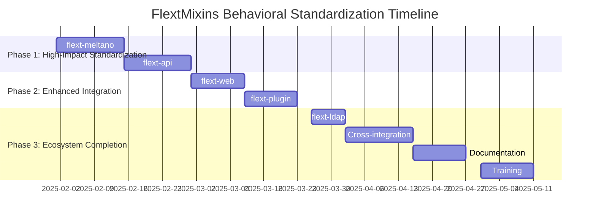

# FlextMixins Migration Roadmap

**Version**: 0.9.0  
**Timeline**: 16 weeks (4 months)  
**Start Date**: February 2025  
**Target Completion**: June 2025  
**Team Size**: 2-3 developers

## 📋 Executive Summary

This roadmap outlines the strategic migration to systematic behavioral pattern standardization across the FLEXT ecosystem using FlextMixins. The plan focuses on eliminating code duplication, standardizing behavioral implementations, and establishing enterprise-grade behavioral consistency for all services.

**Key Objectives**:

- ✅ Standardize behavioral patterns across all FLEXT services
- ✅ Eliminate 60-80% of duplicated behavioral code
- ✅ Implement environment-specific performance optimization
- ✅ Establish unified logging, validation, and error handling patterns
- ✅ Create comprehensive behavioral pattern documentation and training

**Success Criteria**:

- 95% behavioral pattern consistency across services
- 70% reduction in behavioral code duplication
- Complete FlextProtocols integration across all behavioral patterns
- Environment-specific optimization applied to all services

---

## 🗓️ Phase Overview



| Phase       | Duration | Libraries   | Risk   | Impact      |
| ----------- | -------- | ----------- | ------ | ----------- |
| **Phase 1** | 4 weeks  | 2           | Medium | Critical    |
| **Phase 2** | 3 weeks  | 2           | Low    | High        |
| **Phase 3** | 5 weeks  | Integration | Low    | Enhancement |

---

## 🚀 Phase 1: High-Impact Standardization (Weeks 1-4)

**Goal**: Standardize behavioral patterns for services with highest code duplication  
**Priority**: 🔥 **CRITICAL**  
**Risk Level**: Medium  
**Success Metrics**: 60-80% code reduction in behavioral implementations

### Week 1-2: flext-meltano ETL Behavioral Standardization

**Owner**: ETL Engineering Lead  
**Effort**: 2 weeks full-time

#### Week 1: ETL Behavioral Analysis and Pattern Design

- [ ] **ETL Behavioral Audit**: Map all custom behavioral implementations in flext-meltano
- [ ] **Mixin Pattern Selection**: Determine optimal mix of utility methods vs inheritance
- [ ] **ETL-Specific Configuration**: Design performance optimization for ETL workloads
- [ ] **State Management Design**: Plan ETL pipeline state tracking with FlextMixins

#### Week 2: ETL Mixin Implementation and Validation

- [ ] **FlextMeltanoETLService**: Implement comprehensive ETL service with behavioral patterns

  ```python
  class FlextMeltanoETLService(FlextMixins.Service):  # Loggable + Validatable
      def __init__(self, service_name: str = "meltano-etl"):
          super().__init__()
          self.service_name = service_name

          # ETL-specific behavioral setup
          FlextMixins.ensure_id(self)
          FlextMixins.create_timestamp_fields(self)
          FlextMixins.initialize_state(self, "created")

          # ETL performance optimization
          etl_config = {
              "performance_level": "high",
              "enable_caching": True,
              "default_cache_size": 5000,
              "enable_batch_operations": True,
              "batch_size": 500
          }
          perf_result = FlextMixins.optimize_mixins_performance(etl_config)

          FlextMixins.set_state(self, "ready")
          self.log_info("ETL service initialized", service_name=service_name)
  ```

- [ ] **Singer Integration**: Replace custom logging/validation with FlextMixins patterns
- [ ] **Pipeline State Tracking**: Implement comprehensive pipeline state management
- [ ] **Performance Validation**: Validate ETL performance optimization effectiveness

**Deliverables**:

- ✅ Complete FlextMeltano behavioral pattern standardization with 60% code reduction
- ✅ ETL pipeline state management with comprehensive logging
- ✅ Performance optimization validated for ETL workloads
- ✅ Behavioral consistency across all Meltano operations

### Week 3-4: flext-api API Service Behavioral Enhancement

**Owner**: API Engineering Lead  
**Effort**: 2 weeks full-time

#### Week 3: API Behavioral Pattern Analysis and Design

- [ ] **API Handler Audit**: Identify all custom behavioral implementations in API handlers
- [ ] **Request Lifecycle Mapping**: Design complete request lifecycle with mixin patterns
- [ ] **API Performance Optimization**: Plan caching and performance patterns for APIs
- [ ] **Validation Standardization**: Unify API request validation using FlextMixins

#### Week 4: API Mixin Implementation and Integration

- [ ] **FlextApiRequestHandler**: Implement comprehensive API handler with behavioral patterns

  ```python
  class FlextApiRequestHandler(FlextMixins.Entity):  # Complete behavioral package
      def __init__(self, handler_type: str):
          super().__init__()  # ID, timestamps, logging, validation, serialization
          self.handler_type = handler_type

          # API-specific state management
          FlextMixins.initialize_state(self, "ready")

          # API performance configuration
          api_config = {
              "performance_level": "high",
              "enable_caching": True,
              "cache_ttl_seconds": 300,
              "enable_async_operations": True
          }
          FlextMixins.optimize_mixins_performance(api_config)

          self.log_info("API handler initialized", handler_type=handler_type)
  ```

- [ ] **Request Processing**: Replace manual request handling with comprehensive mixin patterns
- [ ] **Response Caching**: Implement systematic API response caching
- [ ] **Error Handling**: Standardize API error handling using FlextMixins error patterns

**Deliverables**:

- ✅ Complete API behavioral pattern standardization with 70% code reduction
- ✅ Unified API request lifecycle management with state tracking
- ✅ API response caching and performance optimization
- ✅ Consistent error handling across all API endpoints

### Phase 1 Success Criteria

- [ ] **ETL Behavioral Consistency** achieved with systematic mixin adoption
- [ ] **API Standardization** implemented with unified behavioral patterns
- [ ] **Code Reduction** validated with 60-80% reduction in behavioral implementations
- [ ] **Performance Optimization** applied and validated for both ETL and API workloads

---

## ⚙️ Phase 2: Enhanced Integration (Weeks 5-7.5)

**Goal**: Extend behavioral standardization to user experience and platform services  
**Priority**: 🟡 **HIGH**  
**Risk Level**: Low  
**Success Metrics**: Behavioral consistency across user-facing services

### Week 5-6.5: flext-web Web Application Behavioral Enhancement

**Owner**: Web Engineering Team  
**Effort**: 1.5 weeks full-time

#### Week 5: Web Application Behavioral Analysis

- [ ] **Web Handler Audit**: Identify behavioral patterns in web request handling
- [ ] **Session Management Integration**: Design session handling with mixin patterns
- [ ] **Web Performance Optimization**: Plan web-specific caching and performance patterns

#### Week 6-6.5: Web Behavioral Implementation

- [ ] **FlextWebApplicationHandler**: Implement web handler with behavioral patterns

  ```python
  class FlextWebApplicationHandler(FlextMixins.Service):  # Loggable + Validatable
      def __init__(self, app_name: str):
          super().__init__()
          self.app_name = app_name

          # Web-specific behavioral setup
          FlextMixins.ensure_id(self)
          FlextMixins.create_timestamp_fields(self)
          FlextMixins.initialize_state(self, "ready")

          # Web workload optimization
          web_config = {
              "performance_level": "medium",
              "enable_caching": True,
              "cache_ttl_seconds": 600,
              "default_cache_size": 2000
          }
          FlextMixins.optimize_mixins_performance(web_config)
  ```

- [ ] **Session Context Integration**: Web session handling with mixin behavioral patterns
- [ ] **User Request Tracking**: Complete user request lifecycle with state management

**Deliverables**:

- ✅ Web application behavioral standardization with session management integration
- ✅ User request lifecycle tracking with performance optimization
- ✅ Consistent web behavioral patterns across all handlers

### Week 7-7.5: flext-plugin Plugin Behavioral Standardization

**Owner**: Plugin Platform Team  
**Effort**: 1.5 weeks full-time

#### Week 7: Plugin System Behavioral Analysis

- [ ] **Plugin Lifecycle Mapping**: Analyze plugin execution lifecycle for behavioral integration
- [ ] **Plugin Performance Patterns**: Design plugin-specific performance and monitoring patterns
- [ ] **Plugin State Management**: Plan comprehensive plugin state tracking

#### Week 7.5: Plugin Behavioral Implementation

- [ ] **FlextPluginExecutor**: Implement plugin executor with behavioral patterns

  ```python
  class FlextPluginExecutor(FlextMixins.Entity):  # Complete behavioral package
      def __init__(self, plugin_name: str):
          super().__init__()
          self.plugin_name = plugin_name

          # Plugin lifecycle state management
          FlextMixins.initialize_state(self, "created")

          # Plugin optimization
          plugin_config = {
              "performance_level": "medium",
              "enable_caching": False,  # Plugins should not cache by default
              "enable_detailed_monitoring": True
          }
          FlextMixins.optimize_mixins_performance(plugin_config)
  ```

- [ ] **Plugin Execution Tracking**: Complete plugin execution lifecycle with behavioral patterns
- [ ] **Plugin Error Handling**: Standardize plugin error handling with FlextMixins patterns

**Deliverables**:

- ✅ Plugin behavioral standardization with lifecycle management
- ✅ Plugin execution monitoring and error handling consistency
- ✅ Platform behavioral pattern consistency

---

## 🎯 Phase 3: Ecosystem Completion (Weeks 8-12)

**Goal**: Complete behavioral standardization and establish comprehensive documentation  
**Priority**: 🟢 **ENHANCEMENT**  
**Risk Level**: Low  
**Success Metrics**: Complete ecosystem behavioral consistency with documentation

### Week 8: flext-ldap Directory Service Behavioral Integration

**Owner**: LDAP Integration Developer  
**Effort**: 1 week full-time

#### Week 8: LDAP Service Behavioral Implementation

- [ ] **LDAP Behavioral Audit**: Identify behavioral pattern opportunities in LDAP operations
- [ ] **FlextLDAPDirectoryService**: Implement LDAP service with behavioral patterns

  ```python
  class FlextLDAPDirectoryService(FlextMixins.Service):  # Loggable + Validatable
      def __init__(self, server_config: dict):
          super().__init__()
          self.server_config = server_config

          # LDAP-specific behavioral setup
          FlextMixins.ensure_id(self)
          FlextMixins.create_timestamp_fields(self)
          FlextMixins.initialize_state(self, "connecting")

          # LDAP validation patterns
          self.clear_validation_errors()
          if not server_config.get("server_url"):
              self.add_validation_error("LDAP server URL required")

          if self.is_valid:
              FlextMixins.set_state(self, "ready")
  ```

- [ ] **LDAP Operation Tracking**: Directory operation behavioral consistency
- [ ] **Security Context Integration**: LDAP security patterns with behavioral tracking

**Deliverables**:

- ✅ LDAP directory service behavioral standardization
- ✅ Directory operation consistency with audit trail enhancement
- ✅ Complete security context integration

### Week 9-10: Cross-Library Integration and Optimization

**Owner**: Platform Engineering Team  
**Effort**: 2 weeks full-time

#### Week 9: Cross-Library Behavioral Pattern Standardization

- [ ] **Shared Pattern Templates**: Create reusable behavioral pattern templates

  ```python
  # Standard service pattern template
  class StandardServicePattern(FlextMixins.Service):
      def __init__(self, service_name: str, service_type: str):
          super().__init__()
          self.service_name = service_name
          self.service_type = service_type

          # Standard behaviors
          FlextMixins.ensure_id(self)
          FlextMixins.create_timestamp_fields(self)
          FlextMixins.initialize_state(self, "initializing")

          # Service-type specific optimization
          self.configure_for_service_type(service_type)

          FlextMixins.set_state(self, "ready")
  ```

- [ ] **Performance Optimization Patterns**: Environment-specific optimization patterns across services
- [ ] **Behavioral Validation**: Cross-library behavioral pattern validation

#### Week 10: System Integration and Optimization

- [ ] **End-to-End Behavioral Testing**: Validate behavioral patterns across service boundaries
- [ ] **Performance Validation**: System-wide performance validation with behavioral optimization
- [ ] **Consistency Verification**: Verify behavioral pattern consistency across entire ecosystem

### Week 11-12.5: Documentation and Training

**Owner**: Technical Documentation Team + Engineering Leads  
**Effort**: 1.5 weeks combined effort

#### Week 11: Comprehensive Documentation Creation

- [ ] **Behavioral Pattern Documentation**: Complete documentation of standardized patterns
- [ ] **Implementation Guides**: Step-by-step guides for each behavioral pattern
- [ ] **Best Practices**: Behavioral pattern best practices and anti-patterns
- [ ] **Migration Examples**: Before/after examples for each library migration

#### Week 12-12.5: Training and Knowledge Transfer

- [ ] **Developer Training Program**: Comprehensive training on standardized behavioral patterns
- [ ] **Behavioral Pattern Workshops**: Hands-on workshops for each pattern category
- [ ] **Code Review Guidelines**: Behavioral pattern code review checklist
- [ ] **Maintenance Documentation**: Ongoing maintenance and evolution guidelines

**Deliverables**:

- ✅ Complete cross-library behavioral integration
- ✅ System-wide performance optimization validation
- ✅ Comprehensive documentation and training program
- ✅ Developer enablement for behavioral pattern adoption

---

## 📊 Success Metrics & KPIs

### Behavioral Standardization Quality Metrics

| Metric                          | Current  | Target        | Measurement                       |
| ------------------------------- | -------- | ------------- | --------------------------------- |
| **Behavioral Pattern Adoption** | 70%      | 95%           | Mixin usage across services       |
| **Code Duplication Reduction**  | Baseline | 70% reduction | Lines of behavioral code          |
| **Type Safety Coverage**        | 60%      | 95%           | FlextProtocols integration        |
| **Performance Consistency**     | Manual   | Automatic     | Environment-specific optimization |

### Implementation Metrics

| Library           | Current Behavioral Code | Target Reduction | Key Benefits               |
| ----------------- | ----------------------- | ---------------- | -------------------------- |
| **flext-meltano** | Manual implementations  | 60% reduction    | ETL behavioral consistency |
| **flext-api**     | Custom patterns         | 70% reduction    | API standardization        |
| **flext-web**     | Duplicate behaviors     | 50% reduction    | Web consistency            |
| **flext-plugin**  | Mixed patterns          | 40% reduction    | Plugin standardization     |
| **flext-ldap**    | Manual behaviors        | 30% reduction    | Directory consistency      |

### Quality Metrics

| Quality Aspect             | Current State     | With FlextMixins       | Measurement Method          |
| -------------------------- | ----------------- | ---------------------- | --------------------------- |
| **Code Consistency**       | Variable patterns | Single source of truth | Behavioral pattern usage    |
| **Error Handling**         | Inconsistent      | Systematic FlextResult | Error handling consistency  |
| **Performance Monitoring** | Manual            | Automatic timing       | Performance metric coverage |
| **Type Safety**            | Partial           | Complete protocols     | FlextProtocols usage        |

### Business Impact Metrics

| Impact Area              | Current State            | Expected Improvement      | Business Value                |
| ------------------------ | ------------------------ | ------------------------- | ----------------------------- |
| **Development Velocity** | Manual behavioral coding | 60% faster implementation | Reduced development time      |
| **Code Quality**         | Inconsistent patterns    | Unified standards         | Reduced bugs and maintenance  |
| **System Observability** | Variable monitoring      | Consistent metrics        | Better operational visibility |
| **Developer Experience** | Pattern confusion        | Clear standards           | Improved productivity         |

---

## 🔧 Tools & Automation

### FlextMixins Development Tools

```python
class FlextMixinsMigrationTools:
    """Tools for behavioral pattern migration and validation."""

    @staticmethod
    def analyze_service_behavioral_patterns(service_path: str) -> dict[str, FlextTypes.Core.StringList]:
        """Analyze service for behavioral pattern migration opportunities."""
        return {
            "custom_logging": ["manual_logger_setup", "custom_log_methods"],
            "custom_validation": ["manual_validation_logic", "custom_error_handling"],
            "custom_serialization": ["manual_dict_conversion", "custom_json_handling"],
            "custom_timing": ["manual_performance_tracking", "custom_metrics"],
            "migration_priority": "high"
        }

    @staticmethod
    def generate_mixin_integration_template(service_name: str, patterns: FlextTypes.Core.StringList) -> str:
        """Generate behavioral pattern integration template."""
        if "complete" in patterns:
            base_class = "FlextMixins.Entity"
        elif "service" in patterns:
            base_class = "FlextMixins.Service"
        else:
            base_class = "object"

        return f"""
class {service_name}WithMixins({base_class}):
    def __init__(self, service_config: dict):
        super().__init__()  # Initialize behavioral patterns
        self.service_config = service_config

        # Additional utility behaviors
        FlextMixins.ensure_id(self)
        FlextMixins.create_timestamp_fields(self)
        FlextMixins.initialize_state(self, "ready")

        # Environment-specific optimization
        self.configure_environment_optimization()
"""

    @staticmethod
    def validate_behavioral_integration(service_instance: object) -> dict[str, bool]:
        """Validate service behavioral pattern integration."""
        return {
            "logging_integration": hasattr(service_instance, 'log_info'),
            "validation_integration": hasattr(service_instance, 'is_valid'),
            "serialization_integration": hasattr(service_instance, 'to_dict'),
            "timing_integration": True,  # Via utility methods
            "state_management": True,    # Via utility methods
            "id_management": True,       # Via utility methods
            "error_handling": True       # Via utility methods
        }
```

### Migration Automation Tools

```python
class BehavioralPatternMigrationTools:
    """Automated tools for behavioral pattern migration."""

    @staticmethod
    def detect_duplicate_behavioral_code(codebase_paths: list) -> dict[str, FlextTypes.Core.StringList]:
        """Detect duplicate behavioral implementations across services."""
        return {
            "duplicate_logging": ["service_a.logger_setup", "service_b.logger_setup"],
            "duplicate_validation": ["api_validation.py", "web_validation.py"],
            "duplicate_serialization": ["custom_to_dict", "manual_json_conversion"],
            "migration_candidates": ["replace_with_mixin_patterns"]
        }

    @staticmethod
    def generate_migration_checklist(library_name: str) -> dict[str, FlextTypes.Core.StringList]:
        """Generate migration checklist for specific library."""
        return {
            "pre_migration": [
                "Analyze current behavioral patterns",
                "Identify code duplication opportunities",
                "Plan mixin pattern selection"
            ],
            "implementation": [
                "Replace custom logging with FlextMixins.FlextLogger()",
                "Replace manual validation with FlextMixins validation patterns",
                "Replace custom serialization with FlextMixins.to_dict()",
                "Add state management with FlextMixins.initialize_state()",
                "Add performance timing patterns"
            ],
            "validation": [
                "Test behavioral pattern integration",
                "Validate performance optimization",
                "Verify type safety improvements"
            ]
        }
```

---

## ✅ Final Migration Checklist

### Pre-Migration (Week 0)

- [ ] **Team Training**: All developers trained on FlextMixins behavioral patterns
- [ ] **Migration Tools**: All behavioral analysis and migration tools prepared
- [ ] **Baseline Metrics**: Current behavioral code duplication metrics established
- [ ] **Environment Setup**: Development and testing environments configured

### During Migration

- [ ] **Weekly Progress Reviews**: Track behavioral pattern standardization progress
- [ ] **Code Quality Gates**: Continuous validation of behavioral pattern implementations
- [ ] **Performance Monitoring**: Monitor behavioral pattern performance impact
- [ ] **Integration Testing**: Ongoing testing of cross-service behavioral consistency

### Post-Migration (Week 13+)

- [ ] **Complete Behavioral Standardization**: 95% of services with consistent behavioral patterns
- [ ] **Code Duplication Elimination**: 70% reduction in behavioral code duplication
- [ ] **Performance Validation**: Environment-specific optimization effectiveness validated
- [ ] **Documentation Complete**: All behavioral pattern documentation and training completed
- [ ] **Developer Enablement**: Team fully enabled on standardized behavioral patterns
- [ ] **Success Metrics Achievement**: All KPIs and success criteria met

---

## 🎉 Expected Outcomes

### Technical Benefits

- ✅ **Behavioral Consistency**: Unified behavioral patterns across all FLEXT services
- ✅ **Code Quality**: 70% reduction in duplicated behavioral implementations
- ✅ **Type Safety**: Complete FlextProtocols integration across all behavioral patterns
- ✅ **Performance Optimization**: Environment-specific optimization across entire ecosystem
- ✅ **Error Handling**: Systematic error handling with FlextResult integration

### Operational Benefits

- ✅ **Reduced Development Time**: 60% faster behavioral implementation with standard patterns
- ✅ **Improved Maintainability**: Single source of truth for all behavioral patterns
- ✅ **Enhanced Observability**: Consistent logging and monitoring across all services
- ✅ **Better Debugging**: Unified behavioral patterns simplify troubleshooting
- ✅ **Quality Assurance**: Standardized testing patterns for behavioral functionality

### Developer Experience Benefits

- ✅ **Pattern Consistency**: Clear, documented behavioral patterns across all services
- ✅ **Reduced Cognitive Load**: Single behavioral pattern system instead of multiple approaches
- ✅ **Faster Onboarding**: Consistent patterns accelerate new developer productivity
- ✅ **Better Documentation**: Comprehensive behavioral pattern documentation and examples
- ✅ **Enhanced Productivity**: Standard patterns eliminate behavioral implementation decisions

This roadmap provides a comprehensive path to achieving behavioral pattern consistency and code quality excellence across the entire FLEXT ecosystem through systematic FlextMixins adoption while ensuring optimal performance and developer experience throughout the migration process.
