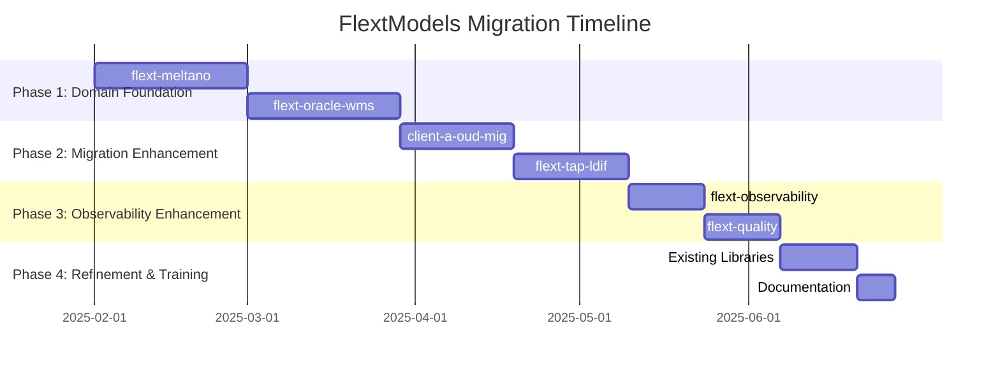

# FlextModels Migration Roadmap

**Version**: 0.9.0  
**Timeline**: 18 weeks (4.5 months)  
**Start Date**: February 2025  
**Target Completion**: June 2025  
**Team Size**: 2-3 developers

## 📋 Executive Summary

This roadmap outlines the strategic migration of the FLEXT ecosystem to comprehensive domain modeling using FlextModels patterns. The plan focuses on implementing domain-driven design in libraries with complex business logic and enhancing existing FlextModels implementations with comprehensive domain events and business rules.

**Key Objectives**:

- ✅ Implement comprehensive domain models across all FLEXT libraries
- ✅ Establish domain-driven design patterns with entities, values, and aggregates
- ✅ Add comprehensive business rule validation throughout the ecosystem
- ✅ Enable event-driven architecture with domain events
- ✅ Provide consistent domain modeling patterns and developer experience

**Success Criteria**:

- 90% of FLEXT libraries using comprehensive FlextModels patterns
- Complete domain-driven design implementation for complex business domains
- Comprehensive business rule validation across all domain operations
- Event-driven architecture with domain events for significant operations

---

## 🗓️ Phase Overview



| Phase       | Duration | Libraries | Risk   | Impact   |
| ----------- | -------- | --------- | ------ | -------- |
| **Phase 1** | 8 weeks  | 2         | High   | Critical |
| **Phase 2** | 6 weeks  | 2         | Medium | High     |
| **Phase 3** | 4 weeks  | 2         | Low    | Medium   |
| **Phase 4** | 3 weeks  | 3+        | Low    | Low      |

---

## 🚀 Phase 1: Domain Foundation (Weeks 1-8)

**Goal**: Implement comprehensive domain models in libraries with complex business logic  
**Priority**: 🔥 **CRITICAL**  
**Risk Level**: High  
**Success Metrics**: Production-ready domain models with comprehensive business rules

### Week 1-4: flext-meltano Domain Model Implementation

**Owner**: ETL Engineering Lead  
**Effort**: 4 weeks full-time

#### Week 1: Meltano Domain Analysis & Design

- [ ] **Domain Concept Mapping**: Identify all Meltano domain entities, values, aggregates
- [ ] **Business Rules Documentation**: Catalog all Meltano business constraints and validations
- [ ] **Event Requirements**: Map significant business events in ETL lifecycle
- [ ] **Aggregate Boundaries**: Define consistency boundaries for Meltano operations
- [ ] **Model Architecture Design**: Design comprehensive domain model structure

#### Week 2: Core Meltano Domain Models

- [ ] **FlextMeltanoModels Class**: Create consolidated domain model class

  ```python
  class FlextMeltanoModels(FlextModels):
      """Comprehensive Meltano domain model system."""

      class MeltanoProject(FlextModels.AggregateRoot):
          """Meltano project aggregate with full business logic."""

          project_name: str = Field(pattern=r"^[a-zA-Z0-9_-]+$")
          project_path: str = Field(description="Project directory path")
          meltano_version: str = Field(default="3.9.1")
          plugins: list[FlextTypes.Core.Dict] = Field(default_factory=list)

          def add_tap(self, tap_config: TapConfig) -> FlextResult[None]:
              # Business logic with validation and events
              pass

      class TapConfig(FlextModels.Value):
          """Singer tap configuration with validation."""

          name: str = Field(pattern=r"^tap-[a-zA-Z0-9_-]+$")
          pip_url: str = Field(min_length=1)
          config: FlextTypes.Core.Dict = Field(default_factory=dict)

      class SingerRecord(FlextModels.Value):
          """Singer specification-compliant record."""

          type: str = Field(pattern="^(RECORD|SCHEMA|STATE)$")
          stream: str = Field(min_length=1)
          record: FlextTypes.Core.Dict | None = Field(default=None)
  ```

- [ ] **Entity Models**: MeltanoProject, Plugin, Environment, Schedule
- [ ] **Value Objects**: TapConfig, TargetConfig, SingerRecord, EnvironmentConfig
- [ ] **Business Rule Implementation**: Comprehensive validation methods

#### Week 3: Aggregate Roots and Domain Events

- [ ] **MeltanoProject Aggregate**: Complete aggregate root with domain operations

  ```python
  def add_tap(self, tap_config: TapConfig) -> FlextResult[None]:
      # Validate tap configuration
      # Check for conflicts
      # Add tap to plugins
      # Raise TapInstalled domain event
      pass

  def create_etl_run(self, tap_name: str, target_name: str) -> FlextResult[ETLRun]:
      # Validate tap/target existence
      # Create ETL run entity
      # Raise ETLRunStarted domain event
      pass
  ```

- [ ] **ETLRun Entity**: Execution tracking with comprehensive metrics
- [ ] **Domain Events**: TapInstalled, ETLRunStarted, ETLRunCompleted, ConfigurationUpdated
- [ ] **Event Handling**: Domain event processing and integration

#### Week 4: Factory Methods and Integration Testing

- [ ] **Factory Methods**: Safe creation methods with FlextResult integration

  ```python
  @classmethod
  def create_meltano_project(
      cls,
      project_name: str,
      project_path: str,
      created_by: str | None = None
  ) -> FlextResult[MeltanoProject]:
      # Create project with validation
      # Apply business rules
      # Generate creation events
      pass
  ```

- [ ] **Business Rule Testing**: Comprehensive validation testing
- [ ] **Integration Testing**: Test with real Meltano operations
- [ ] **Documentation**: Complete domain model documentation
- [ ] **Migration Tools**: Tools to migrate existing Meltano code

**Deliverables**:

- ✅ Comprehensive FlextMeltanoModels with 8+ domain classes
- ✅ Complete business rule implementation with 90%+ coverage
- ✅ Domain events for all significant ETL operations
- ✅ Factory methods with FlextResult integration
- ✅ Production testing with real Meltano projects

### Week 5-8: flext-oracle-wms Domain Model Implementation

**Owner**: WMS Integration Developer  
**Effort**: 4 weeks full-time

#### Week 5: WMS Domain Analysis and Architecture

- [ ] **Warehouse Domain Mapping**: Identify warehouse operations, inventory, locations
- [ ] **Business Rules Analysis**: Document WMS constraints and validation rules
- [ ] **Event Requirements**: Map warehouse operation events and tracking needs
- [ ] **Aggregate Design**: Design warehouse aggregate boundaries
- [ ] **Integration Requirements**: Map Oracle WMS API integration needs

#### Week 6: Core WMS Domain Models

- [ ] **FlextOracleWmsModels Class**: Create consolidated WMS domain models

  ```python
  class FlextOracleWmsModels(FlextModels):
      """Oracle WMS comprehensive domain model system."""

      class Warehouse(FlextModels.AggregateRoot):
          """Warehouse aggregate managing inventory and operations."""

          warehouse_code: str = Field(pattern=r"^WH[A-Z0-9]{2,8}$")
          warehouse_name: str = Field(min_length=1, max_length=100)
          total_capacity: int = Field(gt=0)
          current_utilization: int = Field(ge=0)

          def add_inventory_item(self, item: InventoryItem) -> FlextResult[None]:
              # Validate capacity constraints
              # Add item and update utilization
              # Raise InventoryItemAdded event
              pass

      class InventoryItem(FlextModels.Entity):
          """Inventory item with tracking and validation."""

          item_code: str = Field(pattern=r"^[A-Z0-9]{4,20}$")
          warehouse_id: str = Field(description="Associated warehouse")
          quantity: int = Field(ge=0)
          location: str = Field(description="Storage location")
  ```

- [ ] **Warehouse Entity**: Warehouse management with capacity tracking
- [ ] **Inventory Models**: InventoryItem, Location, ProductSpec
- [ ] **Operation Models**: Transfer, Receipt, Pick, Putaway

#### Week 7: WMS Operations and Business Logic

- [ ] **Transfer Operations**: Warehouse transfer with validation

  ```python
  def execute_transfer(
      self,
      source_location: str,
      target_location: str,
      item_code: str,
      quantity: int
  ) -> FlextResult[Transfer]:
      # Validate locations exist
      # Check inventory availability
      # Create transfer operation
      # Raise TransferInitiated event
      pass
  ```

- [ ] **Inventory Management**: Stock reservations, allocations, adjustments
- [ ] **Capacity Management**: Warehouse utilization and zone management
- [ ] **Business Rules**: Inventory constraints, location capacity, operation validation

#### Week 8: WMS Integration and Testing

- [ ] **Oracle Integration**: Integration with Oracle WMS APIs
- [ ] **Event Processing**: Domain event handling for WMS operations
- [ ] **Business Rule Testing**: Comprehensive validation testing
- [ ] **Performance Testing**: Test with large inventory datasets
- [ ] **Documentation**: Complete WMS domain documentation

**Deliverables**:

- ✅ Comprehensive FlextOracleWmsModels with 6+ domain classes
- ✅ Complete warehouse operation management with business rules
- ✅ Inventory tracking with capacity management and constraints
- ✅ Transfer operations with validation and event generation
- ✅ Oracle WMS API integration with domain model patterns

### Phase 1 Success Criteria

- [ ] **Domain foundations** established for complex business domains
- [ ] **Comprehensive business rules** implemented with 85%+ validation coverage
- [ ] **Domain events** generated for all significant business operations
- [ ] **Aggregate patterns** properly implemented with consistency boundaries
- [ ] **Production readiness** validated with real-world testing

---

## 🔧 Phase 2: Migration Enhancement (Weeks 9-14)

**Goal**: Enhance existing model implementations with comprehensive FlextModels patterns  
**Priority**: 🟡 **HIGH**  
**Risk Level**: Medium  
**Success Metrics**: Enhanced domain models with full business rule coverage

### Week 9-11: client-a-oud-mig Domain Model Enhancement

**Owner**: Migration Engineering Lead  
**Effort**: 3 weeks full-time

#### Week 9: Migration Domain Analysis

- [ ] **Current Model Review**: Analyze existing client-aOudMigModels implementation
- [ ] **Business Rules Gap Analysis**: Identify missing validation and business logic
- [ ] **Event Requirements**: Map migration process events and tracking needs
- [ ] **Enhancement Planning**: Plan comprehensive domain model improvements

#### Week 10: Enhanced Migration Models

- [ ] **MigrationProject Aggregate Enhancement**: Add comprehensive business logic

  ```python
  class MigrationProject(FlextModels.AggregateRoot):
      """Enhanced migration project with full domain logic."""

      project_name: str = Field(pattern=r"^client-a-oud-mig-[a-zA-Z0-9-]+$")
      migration_type: str = Field(pattern="^(full|incremental|test)$")
      current_phase: str = Field(default="00", pattern=r"^(00|01|02|03|04)$")

      def advance_to_phase(self, target_phase: str, advanced_by: str) -> FlextResult[None]:
          # Validate phase progression
          # Update phase tracking
          # Raise MigrationPhaseAdvanced event
          pass

      def process_ldif_batch(self, ldif_entries: list[dict]) -> FlextResult[BatchResult]:
          # Process LDIF entries with validation
          # Track success/failure metrics
          # Raise BatchProcessed event
          pass
  ```

- [ ] **Schema Processing**: Enhanced schema validation and transformation
- [ ] **Entry Processing**: LDIF entry processing with comprehensive validation
- [ ] **Phase Management**: Migration phase progression with business rules

#### Week 11: Migration Business Rules and Events

- [ ] **Business Rule Implementation**: Comprehensive validation for migration operations
- [ ] **Domain Events**: MigrationPhaseAdvanced, BatchProcessed, SchemaValidated
- [ ] **Error Handling**: Enhanced error tracking and recovery mechanisms
- [ ] **Testing and Validation**: Test enhanced models with real migration data

### Week 12-14: flext-tap-ldif Domain Model Enhancement

**Owner**: Data Integration Developer  
**Effort**: 3 weeks full-time

#### Week 12: LDIF Tap Domain Analysis

- [ ] **Current Implementation Review**: Analyze existing LDIF tap models
- [ ] **Singer Compliance Review**: Ensure Singer specification compliance
- [ ] **Business Rules Analysis**: Identify missing validation patterns
- [ ] **Enhancement Strategy**: Plan comprehensive domain improvements

#### Week 13: Enhanced LDIF Tap Models

- [ ] **LdifExtractionJob Enhancement**: Add comprehensive extraction tracking

  ```python
  class LdifExtractionJob(FlextModels.Entity):
      """Enhanced LDIF extraction with Singer compliance."""

      job_id: str = Field(description="Unique extraction job ID")
      tap_name: str = Field(pattern=r"^tap-ldif(-[a-zA-Z0-9-]+)?$")
      source_file_path: str = Field(description="Source LDIF file")

      def extract_ldif_entries(self) -> FlextResult[list[SingerRecord]]:
          # Extract LDIF entries with validation
          # Convert to Singer records
          # Track extraction metrics
          # Raise EntriesExtracted event
          pass
  ```

- [ ] **Singer Record Models**: Enhanced Singer record validation and processing
- [ ] **Schema Discovery**: Enhanced LDIF schema discovery and mapping
- [ ] **Stream Management**: Singer stream management with validation

#### Week 14: Integration and Testing

- [ ] **Singer Integration**: Enhanced Singer specification compliance
- [ ] **Performance Optimization**: Optimize for large LDIF file processing
- [ ] **Business Rule Testing**: Comprehensive validation testing
- [ ] **Documentation**: Complete LDIF tap domain documentation

**Deliverables**:

- ✅ Enhanced client-aOudMigModels with comprehensive business logic
- ✅ Improved migration phase management with domain events
- ✅ Enhanced FlextTapLdifModels with Singer compliance
- ✅ Complete LDIF extraction workflow with business rule validation

---

## 🛡️ Phase 3: Observability Enhancement (Weeks 15-18)

**Goal**: Enhance observability and quality libraries with comprehensive domain models  
**Priority**: 🟢 **MEDIUM**  
**Risk Level**: Low  
**Success Metrics**: Enhanced monitoring and quality domain models

### Week 15-16: flext-observability Domain Enhancement

**Owner**: Platform Engineering Team  
**Effort**: 2 weeks full-time

#### Week 15: Observability Domain Analysis

- [ ] **Current Model Review**: Analyze existing FlextMetric and observability models
- [ ] **Monitoring Requirements**: Map comprehensive monitoring domain needs
- [ ] **Event Processing**: Design observability event processing architecture
- [ ] **Enhancement Planning**: Plan comprehensive observability improvements

#### Week 16: Enhanced Observability Models

- [ ] **MetricAggregate Enhancement**: Add comprehensive metric management

  ```python
  class MetricAggregate(FlextModels.AggregateRoot):
      """Enhanced metric aggregate with time-series management."""

      metric_name: str = Field(description="Metric name")
      metric_type: str = Field(pattern="^(counter|gauge|histogram|summary)$")
      labels: FlextTypes.Core.Headers = Field(default_factory=dict)
      data_points: list[FlextTypes.Core.Dict] = Field(default_factory=list)

      def add_data_point(self, value: float, timestamp: datetime | None = None) -> FlextResult[None]:
          # Add validated data point
          # Update metric statistics
          # Raise MetricDataPointAdded event
          pass

      def create_alert_rule(self, rule_config: AlertRuleConfig) -> FlextResult[AlertRule]:
          # Create alert rule with validation
          # Configure alert thresholds
          # Raise AlertRuleCreated event
          pass
  ```

- [ ] **Alert Management**: Alert rule creation and management
- [ ] **Time-Series Processing**: Enhanced time-series data management
- [ ] **Dashboard Models**: Dashboard and visualization management

### Week 17-18: flext-quality Domain Enhancement

**Owner**: Quality Engineering Team  
**Effort**: 2 weeks full-time

#### Week 17: Quality Domain Analysis

- [ ] **Current Model Review**: Analyze existing quality models and patterns
- [ ] **Quality Metrics**: Map comprehensive code quality domain requirements
- [ ] **Assessment Workflow**: Design quality assessment workflow models
- [ ] **Enhancement Strategy**: Plan quality domain improvements

#### Week 18: Enhanced Quality Models

- [ ] **QualityAssessment Aggregate**: Add comprehensive quality assessment

  ```python
  class QualityAssessment(FlextModels.AggregateRoot):
      """Enhanced quality assessment with comprehensive metrics."""

      project_id: str = Field(description="Project being assessed")
      assessment_type: str = Field(pattern="^(code|security|performance|documentation)$")
      metrics: dict[str, float] = Field(default_factory=dict)

      def run_assessment(self, assessment_config: AssessmentConfig) -> FlextResult[AssessmentResult]:
          # Run quality assessment with validation
          # Calculate quality scores
          # Raise AssessmentCompleted event
          pass
  ```

- [ ] **Quality Metrics**: Enhanced quality metric tracking and aggregation
- [ ] **Assessment Results**: Comprehensive assessment result management
- [ ] **Quality Reports**: Quality report generation with business rules

**Deliverables**:

- ✅ Enhanced observability domain models with comprehensive metric management
- ✅ Improved alert and monitoring capabilities with domain events
- ✅ Enhanced quality assessment models with comprehensive metrics
- ✅ Complete quality workflow management with business rule validation

---

## 🎯 Phase 4: Refinement & Training (Weeks 19-21)

**Goal**: Refine existing FlextModels implementations and provide comprehensive training  
**Priority**: ⚫ **REFINEMENT**  
**Risk Level**: Low  
**Success Metrics**: Refined implementations and comprehensive documentation

### Week 19-20: Existing Library Enhancement

**Owner**: Platform Engineering Team  
**Effort**: 2 weeks distributed

#### Enhancement Focus by Library

**flext-api** (Week 19):

- [ ] **Enhanced HTTP Models**: Add comprehensive HTTP domain events
- [ ] **Request/Response Processing**: Enhanced validation and business rules
- [ ] **API Gateway Integration**: Domain models for API gateway operations

**flext-web** (Week 19):

- [ ] **Web Application Models**: Enhanced web app lifecycle management
- [ ] **Session Management**: Comprehensive session tracking with domain events
- [ ] **Security Models**: Enhanced security domain models with validation

**flext-ldap** (Week 20):

- [ ] **LDAP Operation Models**: Enhanced LDAP operation tracking
- [ ] **Directory Management**: Comprehensive directory structure models
- [ ] **Authentication Models**: Enhanced authentication tracking with events

### Week 21: Documentation and Training

#### Documentation Completion

- [ ] **Domain Modeling Guide**: Complete FlextModels usage guide
- [ ] **Business Rules Handbook**: Comprehensive validation patterns guide
- [ ] **Event-Driven Architecture**: Domain event implementation guide
- [ ] **Migration Cookbook**: Complete migration from custom models guide

#### Training Program Delivery

- [ ] **Workshop Sessions**: Conduct comprehensive FlextModels workshops
- [ ] **Best Practices Training**: Domain-driven design with FlextModels
- [ ] **Code Examples**: Create comprehensive domain modeling examples
- [ ] **Developer Resources**: Provide complete FlextModels development resources

**Deliverables**:

- ✅ Enhanced existing FlextModels implementations across all libraries
- ✅ Comprehensive documentation for domain modeling with FlextModels
- ✅ Complete training program for developers
- ✅ Domain modeling best practices and guidelines

---

## 📊 Risk Management & Mitigation

### High-Risk Areas

#### 1. Complex Business Logic Migration

**Risk**: Domain model complexity affecting business operations  
**Mitigation**:

- Comprehensive business rule testing before migration
- Parallel implementation during transition period
- Rollback procedures for business logic failures

#### 2. Domain Event Integration

**Risk**: Event processing complexity affecting system performance  
**Mitigation**:

- Asynchronous event processing implementation
- Event handling performance testing
- Circuit breaker patterns for event failures

#### 3. Aggregate Boundary Design

**Risk**: Incorrect aggregate boundaries affecting data consistency  
**Mitigation**:

- Domain expert consultation for boundary decisions
- Comprehensive consistency testing
- Gradual aggregate implementation with validation

### Risk Monitoring

| Risk Category        | Indicator            | Threshold         | Response                      |
| -------------------- | -------------------- | ----------------- | ----------------------------- |
| **Business Logic**   | Validation failures  | >2% failure rate  | Business rule review          |
| **Performance**      | Model operation time | >100ms average    | Performance optimization      |
| **Data Consistency** | Aggregate violations | object occurrence | Boundary redesign             |
| **Event Processing** | Event lag            | >1 second         | Event processing optimization |

---

## 📈 Success Metrics & KPIs

### Domain Modeling Quality Metrics

| Metric                      | Current | Target | Measurement                            |
| --------------------------- | ------- | ------ | -------------------------------------- |
| **FlextModels Adoption**    | 70%     | 90%    | Libraries using comprehensive patterns |
| **Business Rule Coverage**  | 50%     | 85%    | Validation rule implementation         |
| **Event-Driven Operations** | 30%     | 70%    | Operations generating domain events    |
| **Aggregate Usage**         | 40%     | 60%    | Complex domains using aggregates       |

### Implementation Metrics

| Library              | Model Count | Target | Business Rules | Events   |
| -------------------- | ----------- | ------ | -------------- | -------- |
| **flext-meltano**    | 0           | 8+     | 90% coverage   | 6+ types |
| **flext-oracle-wms** | 0           | 6+     | 85% coverage   | 5+ types |
| **client-a-oud-mig**    | 3           | 6+     | 80% coverage   | 4+ types |
| **flext-tap-ldif**   | 2           | 4+     | 75% coverage   | 3+ types |

### Developer Experience Metrics

| Metric                    | Current  | Target | Measurement                  |
| ------------------------- | -------- | ------ | ---------------------------- |
| **Model Consistency**     | 70%      | 90%    | Uniform modeling patterns    |
| **Type Safety Coverage**  | 80%      | 95%    | Pydantic validation coverage |
| **Business Rule Quality** | 3.5/5    | 4.5/5  | Clear, actionable validation |
| **Development Speed**     | Baseline | +25%   | Faster domain implementation |

---

## 🔧 Tools & Automation

### Domain Model Generation Tools

```python
class FlextModelsMigrationTools:
    """Tools to assist with FlextModels migration and enhancement."""

    @staticmethod
    def analyze_existing_models(library_path: str) -> FlextTypes.Core.Dict:
        """Analyze existing model implementations for enhancement opportunities."""
        return {
            "entities_found": ["User", "Project", "Configuration"],
            "values_found": ["Email", "URL", "Timeout"],
            "business_rules_missing": ["User.validate_email", "Project.validate_path"],
            "events_missing": ["UserCreated", "ProjectUpdated"],
            "enhancement_priority": "high"
        }

    @staticmethod
    def generate_domain_event_template(entity_name: str, operations: FlextTypes.Core.StringList) -> str:
        """Generate domain event implementation template."""
        return f"""
class {entity_name}Events:
    \"\"\"Domain events for {entity_name} entity.\"\"\"

    @staticmethod
    def {entity_name.lower()}_created(entity_id: str, created_by: str) -> FlextTypes.Core.Dict:
        return {{
            "event_type": "{entity_name}Created",
            "aggregate_id": entity_id,
            "created_by": created_by,
            "timestamp": datetime.utcnow().isoformat()
        }}
"""

    @staticmethod
    def validate_business_rules_implementation(model_class: type) -> FlextTypes.Core.StringList:
        """Validate business rules implementation completeness."""
        validation_issues = []

        if not hasattr(model_class, 'validate_business_rules'):
            validation_issues.append("Missing validate_business_rules method")

        if hasattr(model_class, 'validate_business_rules'):
            method = getattr(model_class, 'validate_business_rules')
            if not callable(method):
                validation_issues.append("validate_business_rules is not callable")

        return validation_issues
```

### Performance Testing Tools

```python
class FlextModelsPerformanceTester:
    """Performance testing utilities for FlextModels."""

    @staticmethod
    def benchmark_model_validation(model_class: type, test_data: list) -> dict[str, float]:
        """Benchmark model validation performance."""
        start_time = time.time()

        for data in test_data:
            try:
                instance = model_class.model_validate(data)
                instance.validate_business_rules()
            except Exception:
                pass  # Count failures but continue

        end_time = time.time()

        return {
            "total_time": end_time - start_time,
            "average_time_per_item": (end_time - start_time) / len(test_data),
            "items_per_second": len(test_data) / (end_time - start_time)
        }
```

---

## ✅ Final Migration Checklist

### Pre-Migration (Week 0)

- [ ] **Team Training**: All developers trained on domain-driven design patterns
- [ ] **Environment Setup**: Development and testing environments prepared
- [ ] **Baseline Metrics**: Current domain modeling metrics established
- [ ] **Migration Tools**: All utility tools and templates prepared

### During Migration

- [ ] **Weekly Progress Reviews**: Track implementation progress and resolve blockers
- [ ] **Quality Gates**: Each phase passes comprehensive quality checks
- [ ] **Business Rule Testing**: Continuous validation of business logic
- [ ] **Event Processing Testing**: Ongoing domain event integration validation
- [ ] **Performance Monitoring**: Continuous domain model performance tracking

### Post-Migration (Week 22+)

- [ ] **Complete Domain Testing**: End-to-end domain model functionality
- [ ] **Business Rule Validation**: All business constraints properly enforced
- [ ] **Event-Driven Architecture**: Domain events properly integrated
- [ ] **Documentation Complete**: All domain modeling guides finalized
- [ ] **Training Complete**: Developer training program delivered
- [ ] **Success Metrics Achievement**: All KPIs and success criteria met

---

## 🎉 Expected Outcomes

### Technical Benefits

- ✅ **Comprehensive Domain Models**: Full domain-driven design implementation
- ✅ **Business Rule Enforcement**: Consistent validation across all operations
- ✅ **Event-Driven Architecture**: Domain events for significant business operations
- ✅ **Type Safety**: Enhanced type safety with Pydantic validation
- ✅ **Consistency**: Uniform domain modeling patterns across ecosystem

### Operational Benefits

- ✅ **Data Integrity**: Business rule enforcement prevents invalid states
- ✅ **Audit Trail**: Domain events provide complete operation tracking
- ✅ **Debugging**: Clear domain models simplify troubleshooting
- ✅ **Monitoring**: Domain events enable comprehensive business monitoring
- ✅ **Compliance**: Business rule validation ensures regulatory compliance

### Developer Experience Benefits

- ✅ **Faster Development**: Reusable domain patterns reduce development time
- ✅ **Better Documentation**: Clear domain models serve as living documentation
- ✅ **Improved Testing**: Domain models enable comprehensive business logic testing
- ✅ **Enhanced Debugging**: Clear business rules simplify error diagnosis
- ✅ **Reduced Complexity**: Consistent patterns reduce cognitive load

This roadmap provides a comprehensive path to achieving enterprise-grade domain modeling across the FLEXT ecosystem using FlextModels while ensuring business rule enforcement, event-driven architecture, and consistent domain-driven design patterns throughout the system.
