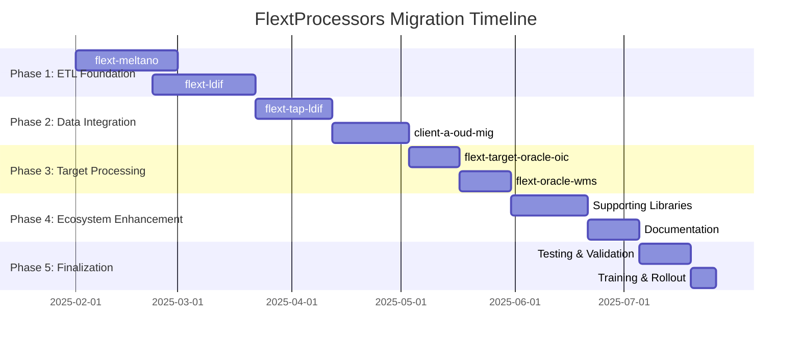

# FlextProcessors Migration Roadmap

**Version**: 0.9.0  
**Timeline**: 22 weeks (5.5 months)  
**Start Date**: February 2025  
**Target Completion**: July 2025  
**Team Size**: 2-3 developers

## 📋 Executive Summary

This roadmap outlines the strategic migration of the FLEXT ecosystem to standardize data processing using FlextProcessors patterns. The plan focuses on implementing comprehensive processing systems in libraries with complex data handling requirements and migrating existing custom processing patterns to use FlextProcessors.

**Key Objectives**:

- ✅ Standardize data processing across all FLEXT libraries
- ✅ Implement pipeline orchestration for complex data workflows
- ✅ Add comprehensive validation and error handling in processing
- ✅ Enable batch processing capabilities for high-volume operations
- ✅ Provide consistent processing patterns and developer experience

**Success Criteria**:

- 85% of FLEXT libraries using FlextProcessors patterns
- Complete pipeline orchestration for ETL and data processing workflows
- Zero custom processing implementations without FlextProcessors integration
- Comprehensive validation and error handling across all processing operations

---

## 🗓️ Phase Overview



| Phase       | Duration | Libraries | Risk   | Impact   |
| ----------- | -------- | --------- | ------ | -------- |
| **Phase 1** | 8 weeks  | 2         | High   | Critical |
| **Phase 2** | 6 weeks  | 2         | Medium | High     |
| **Phase 3** | 4 weeks  | 2         | Low    | Medium   |
| **Phase 4** | 5 weeks  | 3+        | Low    | Low      |
| **Phase 5** | 3 weeks  | All       | Low    | High     |

---

## 🚀 Phase 1: ETL Foundation (Weeks 1-8)

**Goal**: Implement FlextProcessors in core ETL and data processing libraries  
**Priority**: 🔥 **CRITICAL**  
**Risk Level**: High  
**Success Metrics**: Production-ready processing with pipeline orchestration

### Week 1-4: flext-meltano ETL Processing Implementation

**Owner**: ETL Engineering Lead  
**Effort**: 4 weeks full-time

#### Week 1: Meltano Processing Analysis & Architecture

- [ ] **ETL Workflow Analysis**: Document all Meltano processing workflows
- [ ] **Singer Protocol Integration**: Map Singer record processing requirements
- [ ] **Pipeline Design**: Design ETL pipeline using FlextProcessors
- [ ] **Performance Requirements**: Define throughput and latency requirements
- [ ] **Data Validation Strategy**: Plan Singer record validation approach

#### Week 2: Core Meltano Processor Implementation

- [ ] **FlextMeltanoETLProcessor**: Implement main ETL processor

  ```python
  class FlextMeltanoETLProcessor(FlextProcessors.BaseProcessor):
      def __init__(self, singer_config: dict):
          validator = FlextProcessors.EntryValidator()
          super().__init__(validator)
          self.singer_config = singer_config

      def process_data(self, entry: FlextProcessors.Entry) -> FlextResult[FlextTypes.Core.Dict]:
          # Singer record processing with validation
          # Schema transformation
          # ETL business rules application
          pass
  ```

- [ ] **Singer Record Validation**: Implement comprehensive Singer record validation
- [ ] **Schema Transformation**: ETL transformations using FlextProcessors patterns
- [ ] **Error Handling**: FlextResult integration for all ETL operations

#### Week 3: ETL Pipeline Orchestration

- [ ] **Pipeline Design**: Create multi-step ETL pipeline

  ```python
  class FlextMeltanoETLPipeline:
      def __init__(self, tap_config: dict, target_config: dict):
          self.etl_processor = FlextMeltanoETLProcessor(tap_config)
          self.pipeline = self._create_etl_pipeline()

      def _create_etl_pipeline(self):
          extraction_step = lambda entry: self._extract_data(entry)
          transformation_step = lambda entry: self.etl_processor.process_data(entry)
          loading_step = lambda data: self._load_data(data)

          pipeline_result = FlextProcessors.create_processing_pipeline(
              input_processor=extraction_step,
              output_processor=loading_step
          )
          pipeline.add_step(transformation_step)
          return pipeline
  ```

- [ ] **Batch Processing**: Implement high-volume batch processing capabilities
- [ ] **Performance Optimization**: Optimize for Meltano throughput requirements
- [ ] **Integration Testing**: Test with real Meltano taps and targets

#### Week 4: Meltano Integration Finalization

- [ ] **Production Testing**: Test with production-like Meltano workflows
- [ ] **Performance Validation**: Validate throughput and latency requirements
- [ ] **Error Recovery**: Implement robust error handling and recovery
- [ ] **Documentation**: Comprehensive Meltano processing documentation
- [ ] **Migration Tools**: Tools to migrate existing Meltano processing

**Deliverables**:

- ✅ FlextMeltanoETLProcessor with comprehensive Singer record processing
- ✅ Complete ETL pipeline orchestration with multi-step processing
- ✅ Batch processing capabilities for high-volume operations
- ✅ Production-grade error handling and recovery mechanisms
- ✅ Performance optimization meeting Meltano requirements

### Week 5-8: flext-ldif Data Processing Implementation

**Owner**: LDAP Integration Developer  
**Effort**: 4 weeks full-time

#### Week 5: LDIF Processing Architecture Analysis

- [ ] **LDIF Format Analysis**: Document LDIF parsing and validation requirements
- [ ] **Entry Processing**: Map LDIF entry processing workflows
- [ ] **Pattern Extraction**: Identify regex patterns for LDIF parsing
- [ ] **Batch Requirements**: Analyze large LDIF file processing needs
- [ ] **Integration Points**: Map integration with existing LDAP systems

#### Week 6: Core LDIF Processor Implementation

- [ ] **FlextLDIFEntryProcessor**: Implement main LDIF entry processor

  ```python
  class FlextLDIFEntryProcessor(FlextProcessors.BaseProcessor):
      def __init__(self, ldif_config: dict = None):
          validator = FlextProcessors.EntryValidator()
          super().__init__(validator)
          self.regex_processor = self._create_regex_processor()

      def process_data(self, entry: FlextProcessors.Entry) -> FlextResult[FlextTypes.Core.Dict]:
          # LDIF entry parsing and validation
          # Distinguished Name (DN) processing
          # Attribute parsing and normalization
          pass
  ```

- [ ] **Regex Processing**: Implement LDIF pattern extraction using FlextProcessors.RegexProcessor
- [ ] **DN Processing**: Distinguished Name parsing and validation
- [ ] **Attribute Normalization**: LDIF attribute processing and normalization

#### Week 7: LDIF Pipeline and Batch Processing

- [ ] **LDIF Pipeline**: Create processing pipeline for LDIF operations
- [ ] **Batch Processing**: Implement large LDIF file processing

  ```python
  class FlextLDIFBatchProcessor:
      def __init__(self, batch_size: int = 1000):
          self.ldif_processor = FlextLDIFEntryProcessor()

      def process_ldif_file(self, file_path: str) -> FlextResult[FlextTypes.Core.Dict]:
          # Read and split LDIF file
          # Process in batches
          # Aggregate results and errors
          pass
  ```

- [ ] **Performance Optimization**: Optimize for large LDIF dataset processing
- [ ] **Memory Management**: Efficient memory usage for large files

#### Week 8: LDIF Integration and Testing

- [ ] **Integration Testing**: Test with real LDIF files and LDAP systems
- [ ] **Performance Validation**: Validate batch processing performance
- [ ] **Error Scenarios**: Test error handling with malformed LDIF
- [ ] **Documentation**: Complete LDIF processing documentation
- [ ] **Migration Tools**: Tools to migrate existing LDIF processing

**Deliverables**:

- ✅ FlextLDIFEntryProcessor with comprehensive LDIF parsing
- ✅ Regex-based pattern extraction for LDIF elements
- ✅ Batch processing for large LDIF files
- ✅ DN processing and attribute normalization
- ✅ Production testing with real LDIF datasets

### Phase 1 Success Criteria

- [ ] **Core libraries** have comprehensive processing systems using FlextProcessors
- [ ] **Pipeline orchestration** implemented for complex workflows
- [ ] **Batch processing** capabilities for high-volume operations
- [ ] **Error handling** robust and consistent across all processing
- [ ] **Performance requirements** met for production workloads

---

## 🔧 Phase 2: Data Integration (Weeks 9-14)

**Goal**: Migrate data integration libraries to FlextProcessors patterns  
**Priority**: 🟡 **HIGH**  
**Risk Level**: Medium  
**Success Metrics**: Consistent processing patterns with data extraction/migration

### Week 9-11: flext-tap-ldif Processing Migration

**Owner**: Data Integration Developer  
**Effort**: 3 weeks full-time

#### Week 9: Tap LDIF Analysis and Planning

- [ ] **Current Processing Analysis**: Analyze existing LDIF tap processing
- [ ] **Singer Integration**: Map LDIF to Singer record transformation
- [ ] **FlextProcessors Integration**: Plan integration with flext-ldif processors
- [ ] **Data Flow Design**: Design LDIF extraction to Singer record pipeline

#### Week 10: Tap LDIF Processor Implementation

- [ ] **FlextTapLDIFProcessor**: Implement LDIF tap processor

  ```python
  class FlextTapLDIFProcessor(FlextProcessors.BaseProcessor):
      def __init__(self, tap_config: dict):
          validator = FlextProcessors.EntryValidator()
          super().__init__(validator)
          self.ldif_processor = FlextLDIFEntryProcessor(tap_config.get("ldif_config"))

      def process_data(self, entry: FlextProcessors.Entry) -> FlextResult[FlextTypes.Core.Dict]:
          # Process LDIF entry using flext-ldif processor
          # Generate Singer record from LDIF data
          # Apply tap-specific transformations
          pass
  ```

- [ ] **Singer Record Generation**: Transform LDIF entries to Singer records
- [ ] **Schema Generation**: Generate Singer schemas from LDIF structure
- [ ] **Integration with flext-ldif**: Leverage existing LDIF processing

#### Week 11: Testing and Documentation

- [ ] **Integration Testing**: Test LDIF tap with real data sources
- [ ] **Singer Compatibility**: Validate Singer specification compliance
- [ ] **Performance Testing**: Test extraction performance
- [ ] **Documentation**: Complete tap LDIF processing documentation

### Week 12-14: client-a-oud-mig Processing Migration

**Owner**: Migration Engineering Lead  
**Effort**: 3 weeks full-time

#### Week 12: Migration Processing Analysis

- [ ] **Current Analysis**: Analyze existing OUD migration processing
- [ ] **Schema Processing**: Map schema transformation requirements
- [ ] **Migration Phases**: Document phase-specific processing needs
- [ ] **FlextProcessors Integration**: Plan migration to FlextProcessors

#### Week 13: OUD Migration Processor Implementation

- [ ] **client-aOUDMigrationProcessor**: Implement migration processor

  ```python
  class client-aOUDMigrationProcessor(FlextProcessors.BaseProcessor):
      def __init__(self, migration_config: dict):
          allowed_schemas = migration_config.get("allowed_schemas", [])
          validator = FlextProcessors.EntryValidator(whitelist=allowed_schemas)
          super().__init__(validator)
          self.regex_processor = self._create_migration_regex_processor()

      def process_data(self, entry: FlextProcessors.Entry) -> FlextResult[FlextTypes.Core.Dict]:
          # Extract migration patterns using regex processor
          # Transform for OUD migration
          # Apply client-a-specific business rules
          pass
  ```

- [ ] **Migration Pattern Extraction**: Use regex processing for schema extraction
- [ ] **Business Rules**: Implement client-a-specific migration validation
- [ ] **Phase Processing**: Handle different migration phases

#### Week 14: Migration Testing and Integration

- [ ] **Migration Testing**: Test with real client-a migration data
- [ ] **Validation Testing**: Test business rule validation
- [ ] **Performance Testing**: Test batch migration processing
- [ ] **Documentation**: Complete migration processing documentation

**Deliverables**:

- ✅ FlextTapLDIFProcessor with Singer record generation
- ✅ client-aOUDMigrationProcessor with migration-specific processing
- ✅ Integration with existing specialized processors
- ✅ Comprehensive testing with real datasets
- ✅ Production-ready migration processing

---

## 🛡️ Phase 3: Target Processing (Weeks 15-18)

**Goal**: Implement FlextProcessors in target and data loading libraries  
**Priority**: 🟢 **MEDIUM**  
**Risk Level**: Low  
**Success Metrics**: Consistent target processing with validation

### Week 15-16: flext-target-oracle-oic Processing Enhancement

**Owner**: Oracle Integration Developer  
**Effort**: 2 weeks full-time

#### Week 15: Oracle OIC Processing Analysis

- [ ] **Current Processing Review**: Analyze existing Oracle OIC record processing
- [ ] **FlextProcessors Integration**: Plan integration with existing patterns
- [ ] **Schema Validation**: Map Oracle OIC schema validation requirements
- [ ] **Performance Requirements**: Define processing performance needs

#### Week 16: Oracle OIC Processor Implementation

- [ ] **FlextTargetOracleOICProcessor**: Implement OIC target processor

  ```python
  class FlextTargetOracleOICProcessor(FlextProcessors.BaseProcessor):
      def process_data(self, entry: FlextProcessors.Entry) -> FlextResult[FlextTypes.Core.Dict]:
          # Parse Singer record from entry
          # Transform for Oracle OIC format
          # Validate against OIC schema
          # Apply OIC-specific business rules
          pass
  ```

- [ ] **Schema Validation**: Implement comprehensive OIC schema validation
- [ ] **Record Transformation**: Transform Singer records for OIC
- [ ] **Integration Testing**: Test with Oracle OIC systems

### Week 17-18: flext-oracle-wms Processing Implementation

**Owner**: WMS Integration Developer  
**Effort**: 2 weeks full-time

#### Week 17: Oracle WMS Processing Design

- [ ] **WMS Operations Analysis**: Map WMS operation processing requirements
- [ ] **FlextProcessors Integration**: Design WMS data processing with FlextProcessors
- [ ] **Business Rules**: Define WMS-specific validation rules
- [ ] **Performance Requirements**: WMS operation processing performance needs

#### Week 18: Oracle WMS Processor Implementation

- [ ] **FlextOracleWMSProcessor**: Implement WMS data processor

  ```python
  class FlextOracleWMSProcessor(FlextProcessors.BaseProcessor):
      def process_data(self, entry: FlextProcessors.Entry) -> FlextResult[FlextTypes.Core.Dict]:
          # Parse WMS operation data
          # Transform for Oracle WMS format
          # Validate WMS business rules
          # Apply warehouse-specific processing
          pass
  ```

- [ ] **WMS Validation**: Implement WMS operation validation
- [ ] **Batch Processing**: WMS batch operation processing
- [ ] **Integration Testing**: Test with Oracle WMS systems

**Deliverables**:

- ✅ Enhanced Oracle OIC processing with FlextProcessors
- ✅ New Oracle WMS processing capabilities
- ✅ Consistent target processing patterns
- ✅ Comprehensive validation and error handling

---

## 🎯 Phase 4: Ecosystem Enhancement (Weeks 19-23)

**Goal**: Complete FlextProcessors adoption across supporting libraries  
**Priority**: ⚫ **LOW**  
**Risk Level**: Low  
**Success Metrics**: Complete ecosystem consistency

### Week 19-21: Supporting Libraries Enhancement

**Owner**: Platform Engineering Team  
**Effort**: 3 weeks distributed

#### Implementation Focus by Library

**flext-observability** (Week 19):

- [ ] **Metric Processing**: Implement FlextProcessors for metric data processing
- [ ] **Log Processing**: Standardize log entry processing with FlextProcessors
- [ ] **Alert Processing**: Use FlextProcessors for alert data validation

**flext-grpc** (Week 20):

- [ ] **Message Processing**: Implement gRPC message processing with FlextProcessors
- [ ] **Request Validation**: Use EntryValidator for gRPC request validation
- [ ] **Response Processing**: Standardize gRPC response processing

**flext-web** (Week 21):

- [ ] **Request Processing**: Implement web request processing pipeline
- [ ] **Form Validation**: Use FlextProcessors for form data validation
- [ ] **Session Processing**: Standardize session data processing

### Week 22-23: Documentation and Training

#### Week 22: Comprehensive Documentation

- [ ] **Processing Patterns Guide**: Complete guide for FlextProcessors usage
- [ ] **Migration Documentation**: Step-by-step migration instructions
- [ ] **Performance Guide**: Processing performance optimization guide
- [ ] **Error Handling Manual**: Comprehensive error handling patterns

#### Week 23: Developer Training and Knowledge Transfer

- [ ] **Training Materials**: Create FlextProcessors training materials
- [ ] **Workshop Sessions**: Conduct developer workshops
- [ ] **Best Practices**: Document processing best practices
- [ ] **Code Examples**: Create comprehensive processing examples

**Deliverables**:

- ✅ Complete FlextProcessors adoption across all libraries
- ✅ Comprehensive documentation and training materials
- ✅ Developer knowledge transfer complete
- ✅ Processing best practices established

---

## 📚 Phase 5: Finalization (Weeks 24-26)

**Goal**: Complete testing, validation, and production rollout  
**Priority**: 🔄 **FINALIZATION**  
**Risk Level**: Low  
**Success Metrics**: Production-ready ecosystem with comprehensive validation

### Week 24-25: Testing and Validation

- [ ] **End-to-End Testing**: Complete ecosystem processing testing
- [ ] **Performance Validation**: Processing performance across all libraries
- [ ] **Integration Testing**: Cross-library processing integration
- [ ] **Security Testing**: Processing security validation
- [ ] **Load Testing**: High-volume processing validation

### Week 26: Production Rollout

- [ ] **Production Deployment**: Deploy FlextProcessors across ecosystem
- [ ] **Monitoring Setup**: Processing monitoring and alerting
- [ ] **Performance Monitoring**: Real-time processing performance tracking
- [ ] **Success Validation**: Validate all success criteria met

---

## 📊 Risk Management & Mitigation

### High-Risk Areas

#### 1. flext-meltano ETL Performance Impact

**Risk**: Processing changes affecting ETL performance  
**Mitigation**:

- Comprehensive performance testing before deployment
- Parallel processing implementation during transition
- Rollback procedures for performance regression

#### 2. LDIF Processing Compatibility

**Risk**: FlextProcessors integration breaking existing LDIF processing  
**Mitigation**:

- Extensive compatibility testing
- Backward compatibility layer maintenance
- Gradual migration with feature flags

#### 3. Migration Data Integrity

**Risk**: Migration processing changes affecting data integrity  
**Mitigation**:

- Comprehensive validation testing
- Data integrity verification procedures
- Migration rollback capabilities

### Risk Monitoring

| Risk Category      | Indicator            | Threshold        | Response                           |
| ------------------ | -------------------- | ---------------- | ---------------------------------- |
| **Performance**    | Processing time      | >20% regression  | Immediate optimization             |
| **Data Integrity** | Processing errors    | >1% failure rate | Migration pause and investigation  |
| **Compatibility**  | API breaking changes | object           | Compatibility layer implementation |
| **Quality**        | Test coverage        | <90%             | Mandatory test completion          |

---

## 📈 Success Metrics & KPIs

### Processing Quality Metrics

| Metric                         | Current | Target | Measurement                     |
| ------------------------------ | ------- | ------ | ------------------------------- |
| **FlextProcessors Adoption**   | 25%     | 85%    | Libraries using FlextProcessors |
| **Processing Standardization** | 30%     | 90%    | Consistent processing patterns  |
| **Error Handling Coverage**    | 60%     | 95%    | FlextResult usage in processing |
| **Pipeline Integration**       | 20%     | 80%    | Pipeline orchestration usage    |

### Performance Metrics

| Library            | Processing Time | Target        | Batch Capacity |
| ------------------ | --------------- | ------------- | -------------- |
| **flext-meltano**  | Variable        | <100ms/record | 10,000 records |
| **flext-ldif**     | Variable        | <50ms/entry   | 5,000 entries  |
| **client-a-oud-mig**  | Variable        | <200ms/entry  | 1,000 entries  |
| **flext-tap-ldif** | Variable        | <75ms/record  | 2,000 records  |

### Developer Experience Metrics

| Metric                     | Current  | Target | Measurement                        |
| -------------------------- | -------- | ------ | ---------------------------------- |
| **Processing Consistency** | 25%      | 85%    | Uniform patterns across libraries  |
| **Error Message Quality**  | 3/5      | 4.5/5  | Clear, actionable error messages   |
| **Documentation Quality**  | 3/5      | 4.5/5  | Complete usage guides and examples |
| **Development Speed**      | Baseline | +30%   | Faster processing implementation   |

---

## 🔧 Tools & Automation

### Processing Migration Tools

```python
class FlextProcessorsMigrationTools:
    """Tools to assist with FlextProcessors migration."""

    @staticmethod
    def analyze_current_processing(library_path: str) -> FlextTypes.Core.Dict:
        """Analyze current processing patterns in a library."""
        return {
            "custom_processors": ["CustomDataProcessor", "CustomValidator"],
            "processing_complexity": "high",
            "migration_effort": "4 weeks",
            "risk_level": "medium"
        }

    @staticmethod
    def generate_processor_migration_plan(analysis: dict) -> str:
        """Generate migration plan based on analysis."""
        pass

    @staticmethod
    def validate_processor_implementation(processor_class: type) -> FlextTypes.Core.StringList:
        """Validate FlextProcessors implementation."""
        pass
```

### Processing Performance Testing

```python
class FlextProcessorsPerformanceTester:
    """Performance testing utilities for FlextProcessors."""

    @staticmethod
    def benchmark_processor_performance(processor, test_data: list) -> dict:
        """Benchmark processor performance with test data."""
        pass

    @staticmethod
    def compare_processing_performance(old_func, new_processor, test_data: list) -> dict:
        """Compare old vs new processing performance."""
        pass
```

---

## ✅ Final Migration Checklist

### Pre-Migration (Week 0)

- [ ] **Team Training**: All developers trained on FlextProcessors patterns
- [ ] **Environment Setup**: Development and testing environments prepared
- [ ] **Baseline Metrics**: Current processing performance metrics established
- [ ] **Migration Tools**: All utility tools and templates prepared

### During Migration

- [ ] **Weekly Progress Reviews**: Track implementation progress and blockers
- [ ] **Quality Gates**: Each phase passes comprehensive quality checks
- [ ] **Performance Monitoring**: Continuous processing performance tracking
- [ ] **Integration Testing**: Ongoing cross-library integration validation
- [ ] **Risk Mitigation**: Proactive risk monitoring and response

### Post-Migration (Week 27+)

- [ ] **Complete Ecosystem Testing**: End-to-end processing functionality
- [ ] **Performance Validation**: All performance targets achieved
- [ ] **Documentation Complete**: All usage guides and examples finalized
- [ ] **Training Complete**: Developer training materials delivered
- [ ] **Success Metrics Achievement**: All KPIs and success criteria met
- [ ] **Production Monitoring**: Processing monitoring and alerting active

---

## 🎉 Expected Outcomes

### Technical Benefits

- ✅ **Standardized Processing**: Uniform processing patterns across ecosystem
- ✅ **Pipeline Orchestration**: Multi-step processing workflows with error handling
- ✅ **Enhanced Validation**: Comprehensive data validation and business rules
- ✅ **Batch Processing**: High-volume data processing capabilities
- ✅ **Performance Optimization**: Optimized processing for production workloads

### Operational Benefits

- ✅ **Simplified Debugging**: Consistent error handling and logging
- ✅ **Enhanced Monitoring**: Processing metrics and performance tracking
- ✅ **Improved Reliability**: Robust error handling and recovery mechanisms
- ✅ **Better Maintainability**: Standardized processing patterns reduce complexity
- ✅ **Easier Troubleshooting**: Consistent processing patterns across ecosystem

### Developer Experience Benefits

- ✅ **Faster Development**: Reusable processing patterns reduce development time
- ✅ **Better Documentation**: Comprehensive processing guides and examples
- ✅ **Improved Testing**: Standardized processing testing utilities
- ✅ **Enhanced Debugging**: Clear validation messages and error handling
- ✅ **Reduced Complexity**: Consistent APIs reduce learning curve

This roadmap provides a comprehensive path to achieving standardized data processing across the FLEXT ecosystem using FlextProcessors while managing complexity, ensuring performance, and delivering significant operational and developer experience improvements.
