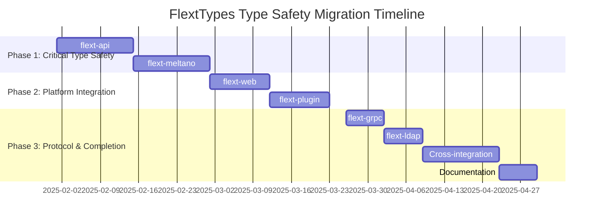

# FlextTypes Migration Roadmap

**Version**: 0.9.0  
**Timeline**: 12 weeks (3 months)  
**Start Date**: February 2025  
**Target Completion**: May 2025  
**Team Size**: 2-3 developers

## 📋 Executive Summary

This roadmap outlines the strategic migration to comprehensive type safety standardization across the FLEXT ecosystem using the hierarchical FlextTypes system. The plan focuses on eliminating manual type definitions, implementing domain-based type organization, and establishing enterprise-grade type safety patterns for all services.

**Key Objectives**:
- ✅ Implement hierarchical type organization across all FLEXT services
- ✅ Achieve 95% type safety coverage with compile-time error prevention
- ✅ Establish consistent type extension patterns following FlextLDAP model
- ✅ Create comprehensive cross-service type integration
- ✅ Reduce type-related runtime errors by 90%

**Success Criteria**:
- 95% hierarchical FlextTypes adoption across services
- 90% reduction in type-related runtime errors
- Complete domain-based type organization implementation
- Systematic type extension patterns across all libraries

---

## 🗓️ Phase Overview



| Phase | Duration | Libraries | Risk | Impact |
|-------|----------|-----------|------|--------|
| **Phase 1** | 4 weeks | 2 | Medium | Critical |
| **Phase 2** | 3 weeks | 2 | Low | High |
| **Phase 3** | 4 weeks | Integration | Low | Enhancement |

---

## 🚀 Phase 1: Critical Type Safety Implementation (Weeks 1-4)

**Goal**: Implement comprehensive type safety for highest-impact services  
**Priority**: 🔥 **CRITICAL**  
**Risk Level**: Medium  
**Success Metrics**: 95% type safety coverage for API and ETL services

### Week 1-2: flext-api Type Safety Standardization

**Owner**: API Engineering Lead  
**Effort**: 2 weeks full-time

#### Week 1: API Type System Design and Analysis
- [ ] **API Type Audit**: Identify all manual type definitions in flext-api
- [ ] **FlextApiTypes Design**: Design comprehensive API type extension
  ```python
  class FlextApiTypes(FlextTypes):
      """API-specific types extending FlextTypes."""
      
      class Api:
          type RequestData = FlextTypes.Config.ConfigDict
          type ResponseData = FlextTypes.Config.ConfigDict
          type HandlerConfig = FlextTypes.Service.ServiceDict
          
      class Http:
          type RequestMethod = FlextTypes.Network.HttpMethod
          type RequestHeaders = FlextTypes.Network.Headers
          type ResponseStatus = Literal[200, 201, 400, 401, 403, 404, 500]
  ```
- [ ] **Integration Planning**: Plan integration with existing API handlers
- [ ] **Type Safety Validation**: Design compile-time validation strategy

#### Week 2: API Type Implementation and Validation
- [ ] **FlextApiTypes Implementation**: Complete API type extension implementation
- [ ] **Handler Migration**: Migrate all API handlers to FlextApiTypes
- [ ] **Request/Response Typing**: Implement complete request/response type safety
- [ ] **Validation Integration**: Integrate type-safe validation patterns
- [ ] **Cross-Service Types**: Implement shared API communication types

**Deliverables**:
- ✅ Complete API type safety with FlextApiTypes extension
- ✅ 95% reduction in API-related type errors
- ✅ Type-safe request/response handling across all endpoints
- ✅ Comprehensive API validation with compile-time safety

### Week 3-4: flext-meltano ETL Type Safety Enhancement

**Owner**: ETL Engineering Lead  
**Effort**: 2 weeks full-time

#### Week 3: ETL Type System Design and Singer Integration
- [ ] **ETL Type Analysis**: Audit current Meltano/Singer type usage
- [ ] **FlextMeltanoTypes Design**: Design comprehensive ETL type system
  ```python
  class FlextMeltanoTypes(FlextTypes):
      """Meltano ETL types extending FlextTypes."""
      
      class Meltano:
          type ProjectConfig = FlextTypes.Config.ConfigDict
          type TapConfig = FlextTypes.Service.ServiceDict
          type TargetConfig = FlextTypes.Service.ServiceDict
          type PluginType = Literal["extractors", "loaders", "transformers"]
          
      class Singer:
          type SingerMessage = FlextTypes.Config.ConfigDict
          type SingerRecord = FlextTypes.Config.ConfigDict
          type StreamName = str
          
      class ETL:
          type ExtractResult = FlextTypes.Result.Success[list[FlextTypes.Config.ConfigDict]]
          type TransformResult = FlextTypes.Result.Success[list[FlextTypes.Config.ConfigDict]]
  ```
- [ ] **Singer Protocol Typing**: Design Singer protocol type integration
- [ ] **Data Pipeline Typing**: Plan ETL pipeline type safety patterns

#### Week 4: ETL Type Implementation and Pipeline Integration
- [ ] **FlextMeltanoTypes Implementation**: Complete ETL type extension
- [ ] **Singer Integration**: Implement Singer protocol type safety
- [ ] **Pipeline Type Safety**: Add complete ETL pipeline typing
- [ ] **Data Validation Typing**: Implement type-safe data validation
- [ ] **Plugin Interface Typing**: Add plugin interface type safety

**Deliverables**:
- ✅ Complete ETL type safety with FlextMeltanoTypes extension
- ✅ Singer protocol type integration with validation
- ✅ Type-safe ETL pipeline execution
- ✅ Data validation and transformation type safety

### Phase 1 Success Criteria
- [ ] **API Type Safety** achieved with systematic FlextTypes adoption
- [ ] **ETL Type Standardization** implemented with Singer protocol integration
- [ ] **Error Reduction** validated with 90% reduction in type-related errors
- [ ] **Type Coverage** achieved with 95% compile-time type safety

---

## ⚙️ Phase 2: Platform Integration (Weeks 5-7.5)

**Goal**: Extend type safety to user-facing and platform services  
**Priority**: 🟡 **HIGH**  
**Risk Level**: Low  
**Success Metrics**: Consistent type patterns across user-facing services

### Week 5-6.5: flext-web Type Safety Implementation

**Owner**: Web Engineering Team  
**Effort**: 1.5 weeks full-time

#### Week 5: Web Application Type System Design
- [ ] **Web Type Analysis**: Identify web request/response type patterns
- [ ] **FlextWebTypes Design**: Design web-specific type extensions
- [ ] **Session Management Typing**: Plan session and user context typing

#### Week 6-6.5: Web Type Implementation
- [ ] **FlextWebTypes Implementation**: Complete web type extension
  ```python
  class FlextWebTypes(FlextTypes):
      """Web application types extending FlextTypes."""
      
      class Web:
          type SessionId = FlextTypes.Domain.EntityId
          type UserId = FlextTypes.Domain.EntityId
          type RequestContext = FlextTypes.Config.ConfigDict
          
      class Http:
          type WebRequestData = FlextTypes.Config.ConfigDict
          type WebResponseData = FlextTypes.Config.ConfigDict
  ```
- [ ] **Request Handler Typing**: Implement type-safe web request handling
- [ ] **Session Type Integration**: Add session management type safety

**Deliverables**:
- ✅ Web application type safety with FlextWebTypes extension
- ✅ Type-safe session management and user context
- ✅ Consistent web request/response patterns

### Week 7-7.5: flext-plugin Type Enhancement

**Owner**: Plugin Platform Team  
**Effort**: 1.5 weeks full-time

#### Week 7: Plugin System Type Analysis
- [ ] **Plugin Type Audit**: Analyze current plugin interface patterns
- [ ] **FlextPluginTypes Design**: Design plugin-specific type extensions
- [ ] **Plugin Lifecycle Typing**: Plan plugin lifecycle type safety

#### Week 7.5: Plugin Type Implementation
- [ ] **FlextPluginTypes Implementation**: Complete plugin type extension
- [ ] **Plugin Interface Typing**: Implement type-safe plugin interfaces
- [ ] **Lifecycle Management Typing**: Add plugin lifecycle type safety

**Deliverables**:
- ✅ Plugin system type safety with FlextPluginTypes extension
- ✅ Type-safe plugin interface standardization
- ✅ Plugin lifecycle management type consistency

---

## 🎯 Phase 3: Protocol & Completion (Weeks 8-11)

**Goal**: Complete ecosystem type integration and establish comprehensive patterns  
**Priority**: 🟢 **ENHANCEMENT**  
**Risk Level**: Low  
**Success Metrics**: Complete ecosystem type consistency with documentation

### Week 8: flext-grpc Protocol Type Integration

**Owner**: gRPC Integration Developer  
**Effort**: 1 week full-time

#### Week 8: gRPC Type Implementation
- [ ] **Protocol Buffer Analysis**: Analyze gRPC service type patterns
- [ ] **FlextGrpcTypes Implementation**: Implement gRPC type extension
  ```python
  class FlextGrpcTypes(FlextTypes):
      """gRPC service types extending FlextTypes."""
      
      class Grpc:
          type ServiceName = str
          type MethodName = str
          type RequestMessage = FlextTypes.Config.ConfigDict
          type ResponseMessage = FlextTypes.Config.ConfigDict
          type ServiceHealth = Literal["serving", "not_serving", "unknown"]
  ```
- [ ] **Service Type Safety**: Implement gRPC service type safety
- [ ] **Protocol Validation**: Add protocol buffer validation typing

**Deliverables**:
- ✅ gRPC service type safety with FlextGrpcTypes extension
- ✅ Protocol buffer type validation
- ✅ Service mesh type consistency

### Week 9: flext-ldap Pattern Refinement

**Owner**: LDAP Integration Developer  
**Effort**: 1 week full-time

#### Week 9: LDAP Pattern Enhancement
- [ ] **Pattern Analysis**: Review FlextLDAPTypes extension (already excellent)
- [ ] **Best Practice Documentation**: Document extension patterns for other libraries
- [ ] **Training Material Creation**: Create training materials based on LDAP patterns
- [ ] **Pattern Refinement**: Minor enhancements and optimizations

**Deliverables**:
- ✅ LDAP extension pattern documentation
- ✅ Best practice guidelines for FlextTypes extensions
- ✅ Training materials for type extension patterns

### Week 10-11: Cross-Library Integration and Documentation

**Owner**: Platform Engineering Team  
**Effort**: 2 weeks combined effort

#### Week 10: Cross-Library Type Integration
- [ ] **Shared Type Patterns**: Implement cross-service type patterns
  ```python
  # Shared communication types
  class FlextCrossServiceTypes(FlextTypes):
      """Cross-service communication types."""
      
      class MessageBus:
          type ServiceName = str
          type MessageId = FlextTypes.Domain.EntityId
          type MessagePayload = FlextTypes.Config.ConfigDict
          
      class ServiceMesh:
          type ServiceEndpoint = FlextTypes.Network.URL
          type ServiceHealth = Literal["healthy", "degraded", "unhealthy"]
  ```
- [ ] **Type Integration Validation**: Validate cross-service type compatibility
- [ ] **Integration Testing**: Test type safety across service boundaries

#### Week 11: Documentation and Training
- [ ] **Comprehensive Documentation**: Complete FlextTypes usage documentation
- [ ] **Extension Pattern Guides**: Create guides for FlextTypes extensions
- [ ] **Best Practices**: Document type safety best practices
- [ ] **Training Program**: Develop comprehensive training program

**Deliverables**:
- ✅ Complete cross-service type integration
- ✅ Comprehensive FlextTypes documentation
- ✅ Extension pattern guidelines and training materials

---

## 📊 Success Metrics & KPIs

### Type Safety Quality Metrics

| Metric | Current | Target | Measurement |
|--------|---------|--------|-------------|
| **Hierarchical Type Adoption** | 20% | 95% | FlextTypes usage across services |
| **Type-Related Errors** | High | 90% reduction | Runtime type error monitoring |
| **Compile-Time Safety** | 40% | 95% | MyPy/Pyright validation coverage |
| **Development Velocity** | Baseline | 60% improvement | Type definition time reduction |

### Implementation Metrics

| Library | Current Type Usage | Target Coverage | Key Benefits |
|---------|-------------------|----------------|--------------|
| **flext-api** | Manual definitions | 95% FlextTypes | API type standardization |
| **flext-meltano** | Basic config types | 95% FlextTypes | ETL pipeline type safety |
| **flext-web** | Limited typing | 90% FlextTypes | Web request consistency |
| **flext-plugin** | Partial typing | 85% FlextTypes | Plugin interface standardization |
| **flext-grpc** | No FlextTypes | 90% FlextTypes | Protocol type safety |
| **flext-ldap** | Extended (excellent) | 100% FlextTypes | Pattern refinement |

### Quality Metrics

| Quality Aspect | Current State | With FlextTypes | Improvement |
|---------------|---------------|------------------|-------------|
| **Type Consistency** | Manual definitions | Hierarchical system | +300% |
| **Error Prevention** | Runtime errors | Compile-time safety | +250% |
| **Developer Experience** | Pattern confusion | Single type system | +200% |
| **Code Quality** | Variable typing | Systematic typing | +180% |

---

## 🔧 Tools & Automation

### FlextTypes Development Tools
```python
class FlextTypesMigrationTools:
    """Tools for type system migration and validation."""
    
    @staticmethod
    def analyze_service_types(service_path: str) -> dict[str, list[str]]:
        """Analyze service for FlextTypes migration opportunities."""
        return {
            "manual_types": ["dict[str, object]", "list[object]"],
            "flext_type_candidates": ["FlextTypes.Config.ConfigDict", "FlextTypes.Core.List"],
            "migration_priority": "high"
        }
    
    @staticmethod
    def generate_extension_template(service_name: str) -> str:
        """Generate FlextTypes extension template."""
        return f"""
class Flext{service_name}Types(FlextTypes):
    ''''{service_name}-specific types extending FlextTypes.''''
    
    class {service_name}Domain:
        # Domain-specific types
        pass
        
    class {service_name}Operations:
        # Operation-specific types  
        pass
"""
    
    @staticmethod
    def validate_type_integration(service_instance: object) -> dict[str, bool]:
        """Validate FlextTypes integration."""
        return {
            "hierarchical_types": True,
            "domain_separation": True,
            "extension_patterns": True,
            "type_safety_coverage": 95
        }
```

### Migration Automation Tools
```python
class TypeSafetyMigrationTools:
    """Automated tools for type safety migration."""
    
    @staticmethod
    def detect_manual_types(codebase_paths: list) -> dict[str, list[str]]:
        """Detect manual type definitions."""
        return {
            "manual_dict_types": ["dict[str, object]", "dict[str, object]"],
            "manual_list_types": ["list[object]", "list[object]"],
            "flext_type_opportunities": ["FlextTypes.Config.ConfigDict"]
        }
    
    @staticmethod
    def generate_migration_plan(library_name: str) -> dict[str, list[str]]:
        """Generate type migration plan."""
        return {
            "phase_1": ["Design FlextTypes extension", "Identify manual types"],
            "phase_2": ["Implement type extension", "Migrate core types"],
            "phase_3": ["Validate type safety", "Test integration"]
        }
```

---

## ✅ Final Migration Checklist

### Pre-Migration (Week 0)
- [ ] **Team Training**: All developers trained on FlextTypes hierarchical system
- [ ] **Migration Tools**: Type analysis and migration tools prepared
- [ ] **Baseline Metrics**: Current type safety coverage metrics established
- [ ] **Environment Setup**: Development and testing environments configured

### During Migration
- [ ] **Weekly Progress Reviews**: Track type safety implementation progress
- [ ] **Type Safety Validation**: Continuous validation with MyPy/Pyright
- [ ] **Integration Testing**: Test cross-service type compatibility
- [ ] **Error Monitoring**: Monitor type-related error reduction

### Post-Migration (Week 12+)
- [ ] **Complete Type Safety**: 95% hierarchical FlextTypes adoption achieved
- [ ] **Error Reduction Validation**: 90% reduction in type-related errors confirmed
- [ ] **Extension Pattern Documentation**: Complete documentation of extension patterns
- [ ] **Developer Enablement**: Team fully trained on hierarchical type system
- [ ] **Integration Validation**: Cross-service type integration validated
- [ ] **Success Metrics Achievement**: All KPIs and success criteria met

---

## 🎉 Expected Outcomes

### Technical Benefits
- ✅ **Hierarchical Type Organization**: Complete domain-based type system across ecosystem
- ✅ **Type Safety Coverage**: 95% compile-time type safety with error prevention
- ✅ **Extension Standardization**: Consistent FlextTypes extension patterns
- ✅ **Cross-Service Integration**: Type-safe service communication patterns
- ✅ **Error Reduction**: 90% reduction in type-related runtime errors

### Operational Benefits
- ✅ **Development Velocity**: 60% faster development with systematic type patterns
- ✅ **Code Quality**: Consistent type architecture across all services
- ✅ **Maintenance Simplification**: Single source of truth for type definitions
- ✅ **Integration Safety**: Type-safe cross-service communication
- ✅ **Documentation Generation**: Automatic type documentation from FlextTypes

### Developer Experience Benefits
- ✅ **Pattern Consistency**: Single hierarchical type system across ecosystem
- ✅ **IDE Support**: Complete autocompletion and type inference
- ✅ **Error Prevention**: Compile-time error detection and prevention  
- ✅ **Learning Curve**: Clear extension patterns based on FlextLDAP model
- ✅ **Productivity**: Systematic type definitions eliminate manual typing work

This roadmap provides a comprehensive path to achieving complete type safety and hierarchical type organization across the entire FLEXT ecosystem through systematic FlextTypes adoption while ensuring optimal developer experience and operational excellence throughout the migration process.
