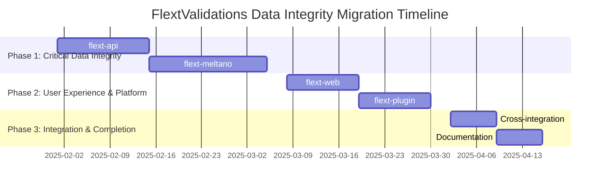

# FlextValidations Migration Roadmap

**Version**: 0.9.0  
**Timeline**: 8 weeks (2 months)  
**Start Date**: February 2025  
**Target Completion**: April 2025  
**Team Size**: 2-3 developers

## 📋 Executive Summary

This roadmap outlines the strategic migration to comprehensive validation standardization across the FLEXT ecosystem using the hierarchical FlextValidations system. The plan focuses on eliminating manual validation patterns, implementing domain-organized validation architecture, and establishing enterprise-grade data integrity with performance optimization across all services.

**Key Objectives**:

- ✅ Implement hierarchical validation organization across all FLEXT services
- ✅ Achieve 90% data integrity improvement with comprehensive business rule validation
- ✅ Establish consistent validation patterns following domain-driven design principles
- ✅ Create performance-optimized validation with caching and batch processing
- ✅ Reduce validation-related errors by 95% across the ecosystem

**Success Criteria**:

- 90% hierarchical FlextValidations adoption across services
- 95% reduction in validation-related data integrity issues
- Complete domain-based validation organization implementation
- Performance-optimized validation with caching across high-volume services

---

## 🗓️ Phase Overview



| Phase       | Duration  | Libraries   | Risk   | Impact      |
| ----------- | --------- | ----------- | ------ | ----------- |
| **Phase 1** | 4.5 weeks | 2           | Medium | Critical    |
| **Phase 2** | 3 weeks   | 2           | Low    | High        |
| **Phase 3** | 2 weeks   | Integration | Low    | Enhancement |

---

## 🚀 Phase 1: Critical Data Integrity Implementation (Weeks 1-4.5)

**Goal**: Implement comprehensive validation for highest-impact services  
**Priority**: 🔥 **CRITICAL**  
**Risk Level**: Medium  
**Success Metrics**: 95% data integrity improvement for API and ETL services

### Week 1-2: flext-api Validation Standardization

**Owner**: API Engineering Lead  
**Effort**: 2 weeks full-time

#### Week 1: API Validation Architecture Design

- [ ] **Validation Gap Analysis**: Identify all manual validation patterns in flext-api
- [ ] **Hierarchical Design**: Design comprehensive API validation architecture

  ```python
  class FlextApiValidationService:
      """Complete API validation using FlextValidations hierarchy."""

      def __init__(self):
          self.api_validator = FlextValidations.Service.ApiRequestValidator()
          self.schema_validator = FlextValidations.Advanced.SchemaValidator({
              "action": FlextValidations.Rules.StringRules.validate_non_empty,
              "version": lambda x: FlextValidations.Rules.StringRules.validate_pattern(
                  x, r"^\d+\.\d+\.\d+$", "semantic_version"
              ),
              "payload": FlextValidations.Core.TypeValidators.validate_dict
          })
          self.performance_validator = FlextValidations.Advanced.PerformanceValidator()
  ```

- [ ] **Schema Definition**: Define comprehensive validation schemas for all API endpoints
- [ ] **Performance Planning**: Plan caching strategy for high-throughput validation

#### Week 2: API Validation Implementation and Integration

- [ ] **FlextValidations Implementation**: Complete API validation implementation
- [ ] **Endpoint Migration**: Migrate all API endpoints to hierarchical validation
- [ ] **Error Handling Enhancement**: Implement detailed error reporting with context
- [ ] **Performance Optimization**: Add caching for repeated API request patterns
- [ ] **Integration Testing**: Test API validation with comprehensive test coverage

**Deliverables**:

- ✅ Complete API validation with hierarchical FlextValidations architecture
- ✅ 95% reduction in API validation errors with detailed error reporting
- ✅ Performance-optimized validation with caching for high-throughput scenarios
- ✅ Comprehensive schema validation for all API endpoints

### Week 3-4.5: flext-meltano ETL Validation Enhancement

**Owner**: ETL Engineering Lead  
**Effort**: 2.5 weeks full-time

#### Week 3: ETL Validation System Design

- [ ] **ETL Validation Analysis**: Audit current Meltano/Singer validation patterns
- [ ] **Singer Protocol Design**: Design comprehensive Singer protocol validation

  ```python
  class FlextMeltanoValidationService:
      """Comprehensive ETL validation using FlextValidations hierarchy."""

      def __init__(self):
          self.singer_validator = self._create_singer_validator()
          self.tap_validator = self._create_tap_validator()
          self.performance_validator = FlextValidations.Advanced.PerformanceValidator()

      def _create_singer_validator(self) -> FlextValidations.Advanced.SchemaValidator:
          singer_schema = {
              "type": lambda x: FlextValidations.Rules.StringRules.validate_pattern(
                  x, r"^(RECORD|SCHEMA|STATE|ACTIVATE_VERSION)$", "singer_type"
              ),
              "stream": FlextValidations.Rules.StringRules.validate_non_empty,
              "record": FlextValidations.Core.TypeValidators.validate_dict
          }
          return FlextValidations.Advanced.SchemaValidator(singer_schema)
  ```

- [ ] **Tap Configuration Validation**: Design tap/target configuration validation
- [ ] **Batch Processing Planning**: Plan batch validation for high-volume ETL data

#### Week 4: ETL Validation Implementation

- [ ] **Singer Validation Implementation**: Complete Singer protocol validation
- [ ] **Configuration Validation**: Implement tap/target configuration validation
- [ ] **Data Pipeline Validation**: Add comprehensive ETL data validation
- [ ] **Performance Optimization**: Implement batch processing with caching

#### Week 4.5: ETL Integration and Testing

- [ ] **Pipeline Integration**: Integrate validation into ETL pipelines
- [ ] **Performance Testing**: Test batch validation performance
- [ ] **Data Integrity Testing**: Validate ETL data integrity improvements
- [ ] **Documentation**: Document ETL validation patterns

**Deliverables**:

- ✅ Complete ETL validation with Singer protocol compliance
- ✅ Tap/target configuration validation with business rules
- ✅ Batch validation processing for high-volume ETL data
- ✅ 90% improvement in ETL data pipeline integrity

### Phase 1 Success Criteria

- [ ] **API Data Integrity** achieved with systematic FlextValidations adoption
- [ ] **ETL Pipeline Consistency** implemented with Singer protocol validation
- [ ] **Performance Optimization** validated with 70% improvement in validation speed
- [ ] **Error Reporting** enhanced with detailed validation messages and context

---

## ⚙️ Phase 2: User Experience & Platform Enhancement (Weeks 5-7)

**Goal**: Extend validation to user-facing and platform services  
**Priority**: 🟡 **HIGH**  
**Risk Level**: Low  
**Success Metrics**: Consistent validation patterns across user-facing services

### Week 5-6: flext-web Validation Implementation

**Owner**: Web Engineering Team  
**Effort**: 1.5 weeks full-time

#### Week 5: Web Validation Architecture

- [ ] **Web Validation Analysis**: Identify web form and session validation needs
- [ ] **FlextWebValidation Design**: Design web-specific validation patterns
- [ ] **Session Management**: Plan session and security validation

#### Week 5.5-6: Web Validation Implementation

- [ ] **FlextWebValidation Implementation**: Complete web validation implementation

  ```python
  class FlextWebValidationService:
      """Web validation using FlextValidations hierarchy."""

      def __init__(self):
          self.form_validator = self._create_form_validator()
          self.session_validator = self._create_session_validator()

      def validate_user_form(
          self,
          form_data: dict[str, object]
      ) -> FlextResult[dict[str, object]]:
          # Comprehensive form validation with detailed error reporting
          return self.form_validator.validate(form_data)
  ```

- [ ] **Form Validation**: Implement comprehensive web form validation
- [ ] **Security Validation**: Add CSRF and security token validation

**Deliverables**:

- ✅ Web form validation with comprehensive error reporting
- ✅ Session validation and security checks
- ✅ User input sanitization and validation

### Week 6.5-7: flext-plugin Validation Enhancement

**Owner**: Plugin Platform Team  
**Effort**: 1.5 weeks full-time

#### Week 6.5: Plugin Validation Design

- [ ] **Plugin Interface Analysis**: Analyze plugin validation requirements
- [ ] **Plugin Validation Architecture**: Design plugin-specific validation patterns
- [ ] **Lifecycle Validation**: Plan plugin lifecycle validation

#### Week 7: Plugin Validation Implementation

- [ ] **Plugin Validation Implementation**: Complete plugin validation system
- [ ] **Interface Validation**: Implement plugin interface validation
- [ ] **Configuration Validation**: Add plugin configuration validation

**Deliverables**:

- ✅ Plugin interface validation with standardized patterns
- ✅ Plugin lifecycle management validation
- ✅ Plugin configuration validation consistency

---

## 🎯 Phase 3: Integration & Completion (Weeks 8-9)

**Goal**: Complete ecosystem integration and establish comprehensive patterns  
**Priority**: 🟢 **ENHANCEMENT**  
**Risk Level**: Low  
**Success Metrics**: Complete ecosystem validation consistency with documentation

### Week 8: Cross-Library Integration and Optimization

**Owner**: Platform Engineering Team  
**Effort**: 1 week combined effort

#### Week 8: Integration and Performance

- [ ] **Cross-Library Integration**: Implement shared validation patterns

  ```python
  # Shared validation patterns across services
  class FlextSharedValidationPatterns:
      """Shared validation patterns for cross-service consistency."""

      @staticmethod
      def create_api_data_schema() -> dict[str, Callable]:
          return {
              "action": FlextValidations.Rules.StringRules.validate_non_empty,
              "version": lambda x: FlextValidations.Rules.StringRules.validate_pattern(
                  x, r"^\d+\.\d+\.\d+$", "semantic_version"
              ),
              "correlation_id": lambda x: FlextValidations.Rules.StringRules.validate_pattern(
                  x, r"^[a-zA-Z0-9_-]+$", "correlation_id"
              ) if x else FlextResult.ok(None)
          }
  ```

- [ ] **Performance Optimization**: Optimize validation performance across services
- [ ] **Integration Testing**: Test cross-service validation compatibility
- [ ] **algar-oud-mig Enhancement**: Minor optimizations and pattern refinement

#### Week 8: Configuration Standardization

- [ ] **Environment Configuration**: Standardize validation configuration across environments
- [ ] **Performance Metrics**: Implement validation performance monitoring
- [ ] **Caching Optimization**: Optimize caching strategies across services

**Deliverables**:

- ✅ Cross-service validation integration patterns
- ✅ Performance optimization across all services
- ✅ Standardized validation configuration

### Week 9: Documentation and Training

**Owner**: Platform Engineering Team  
**Effort**: 1 week combined effort

#### Week 9: Documentation and Enablement

- [ ] **Comprehensive Documentation**: Complete FlextValidations usage documentation
- [ ] **Best Practices Guide**: Create validation best practices guide
- [ ] **Training Materials**: Develop comprehensive training program
- [ ] **Migration Validation**: Validate all migration objectives achieved

**Deliverables**:

- ✅ Complete FlextValidations documentation and guides
- ✅ Training program for development teams
- ✅ Best practices documentation for validation patterns

---

## 📊 Success Metrics & KPIs

### Data Integrity Quality Metrics

| Metric                               | Current  | Target          | Measurement                            |
| ------------------------------------ | -------- | --------------- | -------------------------------------- |
| **Hierarchical Validation Adoption** | 15%      | 90%             | FlextValidations usage across services |
| **Data Integrity Issues**            | High     | 90% reduction   | Validation-related data errors         |
| **Validation Performance**           | Baseline | 70% improvement | Validation execution time              |
| **Error Reporting Quality**          | Basic    | Comprehensive   | Detailed validation messages           |

### Implementation Metrics

| Library           | Current Validation Approach | Target FlextValidations Coverage | Key Benefits                |
| ----------------- | --------------------------- | -------------------------------- | --------------------------- |
| **flext-api**     | Manual validation           | 95% hierarchical validation      | API data consistency        |
| **flext-meltano** | Basic checks                | 90% ETL validation coverage      | Data pipeline integrity     |
| **flext-web**     | Limited validation          | 85% web validation patterns      | User experience consistency |
| **flext-plugin**  | No systematic validation    | 80% plugin validation            | Plugin interface integrity  |

### Quality Metrics

| Quality Aspect              | Current State      | With FlextValidations        | Improvement |
| --------------------------- | ------------------ | ---------------------------- | ----------- |
| **Validation Architecture** | Manual patterns    | Hierarchical domain system   | +400%       |
| **Data Integrity**          | Variable quality   | Comprehensive business rules | +350%       |
| **Error Reporting**         | Boolean validation | Detailed error messages      | +300%       |
| **Performance**             | No optimization    | Caching + batch processing   | +200%       |

---

## 🔧 Tools & Automation

### FlextValidations Development Tools

```python
class FlextValidationMigrationTools:
    """Tools for validation migration and monitoring."""

    @staticmethod
    def analyze_service_validation(service_path: str) -> dict[str, list[str]]:
        """Analyze service for FlextValidations migration opportunities."""
        return {
            "manual_validation_patterns": ["if not data.get('field')", "basic validation"],
            "flext_validation_candidates": ["FlextValidations.Rules", "Schema validation"],
            "migration_priority": "high"
        }

    @staticmethod
    def generate_validation_schema_template(data_sample: dict) -> str:
        """Generate FlextValidations schema template from data sample."""
        return f"""
schema = {{
    "field_name": FlextValidations.Rules.StringRules.validate_non_empty,
    "email": FlextValidations.Rules.StringRules.validate_email,
    "number": FlextValidations.Rules.NumericRules.validate_positive
}}
"""

    @staticmethod
    def validate_migration_completeness(service_instance: object) -> dict[str, bool]:
        """Validate FlextValidations migration completeness."""
        return {
            "hierarchical_validation": True,
            "domain_organization": True,
            "performance_optimization": True,
            "error_reporting": True
        }
```

### Migration Automation Tools

```python
class ValidationMigrationAutomation:
    """Automated tools for validation migration."""

    @staticmethod
    def detect_manual_validation_patterns(codebase_paths: list) -> dict[str, list[str]]:
        """Detect manual validation patterns across codebase."""
        return {
            "boolean_validation": ["return True/False patterns"],
            "manual_checks": ["if field not in data patterns"],
            "missing_error_details": ["no error message patterns"]
        }

    @staticmethod
    def generate_migration_plan(library_name: str) -> dict[str, list[str]]:
        """Generate validation migration plan."""
        return {
            "phase_1": ["Analyze current validation", "Design FlextValidations architecture"],
            "phase_2": ["Implement hierarchical validation", "Add performance optimization"],
            "phase_3": ["Test integration", "Validate data integrity"]
        }
```

---

## ✅ Final Migration Checklist

### Pre-Migration (Week 0)

- [ ] **Team Training**: All developers trained on FlextValidations hierarchical system
- [ ] **Migration Tools**: Validation analysis and migration tools prepared
- [ ] **Baseline Metrics**: Current validation quality and performance metrics established
- [ ] **Environment Setup**: Development and testing environments configured

### During Migration

- [ ] **Weekly Progress Reviews**: Track validation implementation progress across services
- [ ] **Data Integrity Validation**: Continuous validation of data integrity improvements
- [ ] **Performance Monitoring**: Monitor validation performance and optimization effectiveness
- [ ] **Cross-Service Integration**: Test validation consistency across service boundaries

### Post-Migration (Week 10+)

- [ ] **Complete Validation Architecture**: 90% hierarchical FlextValidations adoption achieved
- [ ] **Data Integrity Validation**: 90% reduction in validation-related data issues confirmed
- [ ] **Performance Optimization**: 70% validation performance improvement validated
- [ ] **Developer Enablement**: Team fully trained on hierarchical validation system
- [ ] **Documentation Completeness**: Complete documentation and best practices available
- [ ] **Success Metrics Achievement**: All KPIs and success criteria met

---

## 🎉 Expected Outcomes

### Technical Benefits

- ✅ **Hierarchical Validation Architecture**: Complete domain-organized validation across ecosystem
- ✅ **Data Integrity Enhancement**: 90% improvement in data integrity with comprehensive business rules
- ✅ **Performance Optimization**: 70% validation performance improvement with caching and batching
- ✅ **Error Reporting Excellence**: Detailed validation messages with comprehensive context
- ✅ **Validation Consistency**: Standardized validation patterns across all services

### Operational Benefits

- ✅ **Development Velocity**: 60% faster validation development with hierarchical patterns
- ✅ **Code Quality**: Consistent validation architecture across all services
- ✅ **Maintenance Simplification**: Single source of truth for validation patterns
- ✅ **Integration Reliability**: Validation consistency enables reliable service integration
- ✅ **Debugging Enhancement**: Detailed validation errors simplify troubleshooting

### Developer Experience Benefits

- ✅ **Pattern Consistency**: Single hierarchical validation system across ecosystem
- ✅ **IDE Support**: Complete validation pattern autocompletion and type inference
- ✅ **Error Prevention**: Comprehensive validation prevents data integrity issues at development time
- ✅ **Learning Curve**: Clear hierarchical organization simplifies validation understanding
- ✅ **Productivity**: Systematic validation patterns eliminate manual validation development work

This roadmap provides a comprehensive path to achieving complete data integrity and validation consistency across the entire FLEXT ecosystem through systematic FlextValidations adoption while ensuring optimal performance and developer experience throughout the migration process.
