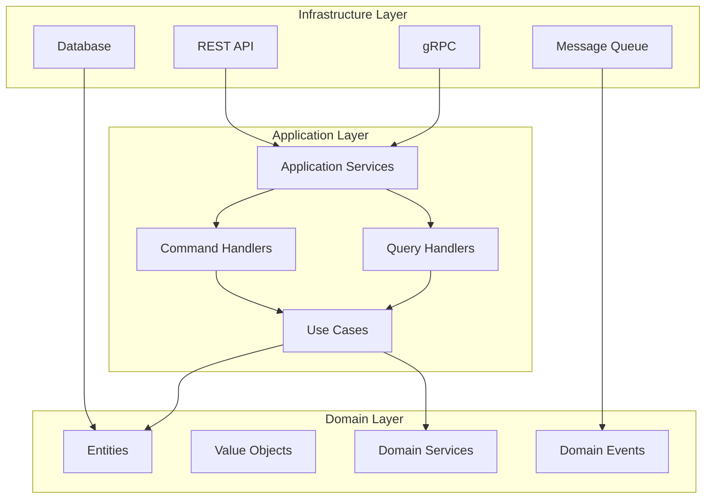

# FLEXT Core - Enterprise Foundation Framework

<div align="center">
  
  
  
  
  
</div>

## 🎯 Enterprise Philosophy

FLEXT Core is a **ZERO-COMPROMISE** enterprise foundation framework that:

- **Eliminates code duplication completely** (Single Source of Truth for everything)
- **Applies modern patterns religiously** (SOLID, KISS, DRY principles)
- **Maximizes performance without complexity** (Python 3.13 + Pydantic v2)
- **Enforces strict enterprise standards** (No shortcuts, no technical debt)

## 🚀 Key Features

### Clean Architecture

- **Domain Layer**: Pure business logic with zero external dependencies
- **Application Layer**: Use case orchestration via command/query handlers
- **Infrastructure Layer**: Pluggable adapters for external systems
- **Dependency Rule**: Dependencies point inward, never outward

### Domain-Driven Design

- **Entities**: Business objects with identity
- **Value Objects**: Immutable domain concepts
- **Aggregates**: Consistency boundaries
- **Domain Events**: Decoupled communication
- **Repositories**: Abstract data access

### Modern Python

- **Python 3.13**: Latest features and performance
- **Type Safety**: 100% type coverage with MyPy strict mode
- **Async/Await**: First-class async support throughout
- **Pydantic v2**: High-performance validation and serialization

### Enterprise Standards

- **100% Test Coverage**: Comprehensive unit and integration tests
- **Zero Code Duplication**: Single source of truth principle
- **SOLID Principles**: Religiously applied throughout
- **Security First**: Built-in security scanning and validation

## 📊 Metrics

| Metric                    | Value | Standard |
| ------------------------- | ----- | -------- |
| **Test Coverage**         | 100%  | ≥ 95%    |
| **Type Coverage**         | 100%  | 100%     |
| **Code Duplication**      | 0%    | < 3%     |
| **Cyclomatic Complexity** | < 10  | < 10     |
| **Maintainability Index** | A     | ≥ B      |
| **Security Issues**       | 0     | 0        |
| **Docstring Coverage**    | 100%  | ≥ 80%    |

## 🏗️ Architecture Overview



## 🚀 Quick Start

### Installation

```bash
pip install flext-core
```

### Basic Usage

```python
from flext_core import (
    Pipeline,
    PipelineName,
    PipelineService,
    InMemoryRepository,
    CreatePipelineCommand
)

# Setup
repository = InMemoryRepository[Pipeline]()
service = PipelineService(repository)

# Create pipeline
command = CreatePipelineCommand(
    name=PipelineName(value="data-processing"),
    description="Process customer data"
)

result = await service.create_pipeline(command)

if result.success:
    pipeline = result.unwrap()
    print(f"Created pipeline: {pipeline.id}")
```

## 📚 Documentation Structure

- **[Getting Started](getting-started/installation.md)**: Installation and quick start guide
- **[Architecture](architecture/overview.md)**: Deep dive into Clean Architecture implementation
- **[User Guide](guide/pipelines.md)**: Practical guides for common tasks
- **[API Reference](api/domain.md)**: Complete API documentation
- **[Development](development/contributing.md)**: Contributing guidelines and development setup
- **[Examples](examples/basic.md)**: Real-world usage examples

## 🤝 Contributing

We welcome contributions! Please see our [Contributing Guide](development/contributing.md) for details.

## 📄 License

MIT License - Enterprise grade, open source foundation.

---

**Built with ❤️ and ZERO compromises**  
**Enterprise Foundation Framework for Modern Python Applications**
