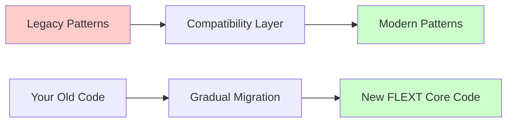

# Migration and Compatibility Guide

This guide helps you migrate existing applications to FLEXT Core and understand the compatibility strategy for legacy patterns.

## 🔄 Migration Strategy Overview

FLEXT Core maintains backward compatibility while providing a clear migration path to modern patterns. The library follows a **dual-track approach**:

1. **Modern Track**: New FlextXxx components with advanced features
2. **Legacy Track**: Deprecated components maintained for backward compatibility



## 📋 Migration Checklist

### Pre-Migration Assessment

- [ ] Identify current error handling patterns (exceptions vs results)
- [ ] List all dependency injection usage
- [ ] Catalog configuration management approaches
- [ ] Document current testing patterns
- [ ] Review domain model implementations

### Migration Phases

1. **Phase 1**: Install FLEXT Core and verify compatibility
2. **Phase 2**: Migrate error handling to FlextResult
3. **Phase 3**: Replace DI containers with FlextContainer
4. **Phase 4**: Modernize configuration with FlextCoreSettings
5. **Phase 5**: Adopt domain patterns (entities, value objects)
6. **Phase 6**: Implement command/handler patterns

## 🔧 Component Migration Guide

### Error Handling Migration

#### From Exceptions to FlextResult

**Before (Exception-based):**

```python
# Old exception-based approach
class UserService:
    def get_user(self, user_id: str) -> User:
        user = self.repository.find_by_id(user_id)
        if not user:
            raise UserNotFoundError(f"User {user_id} not found")
        if not user.is_active:
            raise InactiveUserError(f"User {user_id} is inactive")
        return user

    def create_user(self, data: dict) -> User:
        try:
            user = User(**data)
            self.repository.save(user)
            return user
        except ValidationError as e:
            raise InvalidUserDataError(f"Invalid user data: {e}")
        except DatabaseError as e:
            raise UserCreationError(f"Failed to create user: {e}")

# Usage with exception handling
try:
    user = user_service.get_user("123")
    print(f"Found user: {user.name}")
except UserNotFoundError:
    print("User not found")
except InactiveUserError:
    print("User is inactive")
```

**After (FlextResult-based):**

```python
from flext_core import FlextResult

class UserService:
    def get_user(self, user_id: str) -> FlextResult[User]:
        """Get user with type-safe error handling."""
        user_result = self.repository.find_by_id(user_id)
        if user_result.is_failure:
            return FlextResult.fail(f"Repository error: {user_result.error}")

        user = user_result.data
        if not user:
            return FlextResult.fail(f"User {user_id} not found")

        if not user.is_active:
            return FlextResult.fail(f"User {user_id} is inactive")

        return FlextResult.ok(user)

    def create_user(self, data: dict) -> FlextResult[User]:
        """Create user with comprehensive error handling."""
        # Validate input data
        validation_result = self._validate_user_data(data)
        if validation_result.is_failure:
            return FlextResult.fail(f"Validation error: {validation_result.error}")

        # Create user entity
        user_creation_result = User.create(data)
        if user_creation_result.is_failure:
            return FlextResult.fail(f"User creation error: {user_creation_result.error}")

        # Save to repository
        save_result = self.repository.save(user_creation_result.data)
        if save_result.is_failure:
            return FlextResult.fail(f"Database error: {save_result.error}")

        return FlextResult.ok(user_creation_result.data)

# Usage with functional composition
result = user_service.get_user("123")
if result.success:
    print(f"Found user: {result.data.name}")
else:
    print(f"Error: {result.error}")

# Or using functional patterns
user_service.get_user("123").map(
    lambda user: print(f"Found user: {user.name}")
).unwrap_or_else(
    lambda error: print(f"Error: {error}")
)
```

#### Migration Benefits

1. **Type Safety**: Errors are explicit in function signatures
2. **Composability**: Chain operations with map/flat_map
3. **No Silent Failures**: All errors must be handled explicitly
4. **Better Testing**: Easy to test both success and failure paths

### Dependency Injection Migration

#### From DIContainer to FlextContainer

**Before (Legacy DIContainer):**

```python
from flext_core.dependency_injection import DIContainer  # Deprecated

# Old approach
container = DIContainer()
container.wire(modules=["myapp.services"])

# Service registration (declarative)
class UserService:
    def __init__(self, repository: UserRepository = Provide["user_repository"]):
        self.repository = repository

# Usage
user_service = container.get("user_service")
```

**After (Modern FlextContainer):**

```python
from flext_core import FlextContainer, get_flext_container

# Modern approach with explicit registration
container = get_flext_container()

# Service registration (explicit and type-safe)
class UserService:
    def __init__(self, repository: UserRepository):
        self.repository = repository

# Explicit registration with error handling
def setup_services() -> FlextResult[None]:
    """Setup all application services."""
    container = get_flext_container()

    # Register repository
    repository = PostgreSQLUserRepository()
    repo_result = container.register("user_repository", repository)
    if repo_result.is_failure:
        return FlextResult.fail(f"Failed to register repository: {repo_result.error}")

    # Register service
    user_service = UserService(repository)
    service_result = container.register("user_service", user_service)
    if service_result.is_failure:
        return FlextResult.fail(f"Failed to register service: {service_result.error}")

    return FlextResult.ok(None)

# Usage with error handling
def get_user_service() -> FlextResult[UserService]:
    container = get_flext_container()
    return container.get("user_service")

# Functional usage
get_user_service().flat_map(
    lambda service: service.get_user("123")
).map(
    lambda user: print(f"User: {user.name}")
)
```

#### Migration Steps

1. **Replace imports**: Change from `dependency_injection` to `FlextContainer`
2. **Explicit registration**: Move from declarative to explicit service registration
3. **Error handling**: Add FlextResult handling to all container operations
4. **Type safety**: Use typed service retrieval

### Configuration Migration

#### From Manual Environment Variables to FlextCoreSettings

**Before (Manual configuration):**

```python
import os
from typing import Optional

class Config:
    def __init__(self):
        self.database_url = os.getenv("DATABASE_URL", "sqlite:///app.db")
        self.api_key = os.getenv("API_KEY")  # Might be None
        self.debug = os.getenv("DEBUG", "false").lower() == "true"
        self.port = int(os.getenv("PORT", "8000"))

        # Manual validation
        if not self.api_key:
            raise ValueError("API_KEY environment variable is required")

        if self.port < 1 or self.port > 65535:
            raise ValueError("PORT must be between 1 and 65535")

# Global configuration instance
config = Config()
```

**After (FlextCoreSettings with validation):**

```python
from flext_core.config import FlextCoreSettings
from flext_core.constants import FlextEnvironment
from pydantic import Field, SecretStr, field_validator

class AppSettings(FlextCoreSettings):
    """Type-safe application configuration."""

    # Database configuration
    database_url: str = Field(
        "sqlite:///app.db",
        description="Database connection URL"
    )

    # API configuration with secrets
    api_key: SecretStr = Field(
        ...,  # Required
        description="External API key"
    )

    # Server configuration
    port: int = Field(
        8000,
        ge=1,
        le=65535,
        description="Server port"
    )

    # Feature flags
    enable_metrics: bool = Field(
        False,
        description="Enable metrics collection"
    )

    @field_validator("database_url")
    @classmethod
    def validate_database_url(cls, v: str) -> str:
        """Validate database URL format."""
        if not v.startswith(("sqlite://", "postgresql://", "mysql://")):
            raise ValueError("Invalid database URL scheme")
        return v

    @property
    def is_production_ready(self) -> bool:
        """Check if configuration is production-ready."""
        return (
            self.environment == FlextEnvironment.PRODUCTION and
            not self.debug and
            self.database_url.startswith("postgresql://")
        )

    def get_database_config(self) -> dict[str, any]:
        """Get database configuration for SQLAlchemy."""
        return {
            "url": self.database_url,
            "pool_size": 20 if self.is_production_ready else 5,
            "echo": self.debug,
        }

# Usage with validation
try:
    settings = AppSettings()
    print(f"Server will run on port {settings.port}")
    print(f"Production ready: {settings.is_production_ready}")
except ValidationError as e:
    print(f"Configuration error: {e}")
```

#### Configuration Migration Benefits

1. **Type Safety**: Full IDE support and runtime validation
2. **Environment Awareness**: Automatic environment detection
3. **Secret Management**: Built-in secret masking
4. **Validation**: Comprehensive validation with clear error messages

### Domain Model Migration

#### From Anemic Models to Rich Domain Entities

**Before (Anemic domain models):**

```python
from dataclasses import dataclass
from datetime import datetime
from typing import Optional

@dataclass
class User:
    id: str
    name: str
    email: str
    created_at: datetime
    is_active: bool = True

class UserService:
    def activate_user(self, user: User) -> None:
        user.is_active = True
        self.repository.save(user)

    def deactivate_user(self, user: User) -> None:
        user.is_active = False
        self.repository.save(user)

    def change_email(self, user: User, new_email: str) -> None:
        # Business logic in service layer
        if "@" not in new_email:
            raise ValueError("Invalid email format")
        user.email = new_email
        self.repository.save(user)
```

**After (Rich domain entities):**

```python
from flext_core import FlextEntity, FlextResult, FlextDomainEvent
from flext_core.patterns import FlextBusinessRule
from pydantic import Field, field_validator
from datetime import datetime

class UserActivatedEvent(FlextDomainEvent):
    """Domain event for user activation."""
    user_id: str = Field(..., description="User ID")
    activated_at: datetime = Field(..., description="Activation timestamp")

class UserEmailChangedEvent(FlextDomainEvent):
    """Domain event for email change."""
    user_id: str = Field(..., description="User ID")
    old_email: str = Field(..., description="Previous email")
    new_email: str = Field(..., description="New email")

class ValidEmailRule(FlextBusinessRule):
    """Business rule for email validation."""

    def __init__(self, email: str):
        self.email = email

    def is_satisfied_by(self, _: any) -> bool:
        return "@" in self.email and "." in self.email.split("@")[1]

    def get_error_message(self) -> str:
        return f"Email '{self.email}' is not valid"

class User(FlextEntity):
    """Rich user domain entity with business logic."""

    name: str = Field(..., description="User full name")
    email: str = Field(..., description="User email address")
    is_active: bool = Field(True, description="User active status")

    @field_validator("email")
    @classmethod
    def validate_email_format(cls, v: str) -> str:
        """Basic email format validation."""
        if "@" not in v:
            raise ValueError("Email must contain @ symbol")
        return v

    def activate(self) -> FlextResult[None]:
        """Activate the user with domain logic."""
        if self.is_active:
            return FlextResult.fail("User is already active")

        self.is_active = True

        # Emit domain event
        event = UserActivatedEvent(
            user_id=self.id,
            activated_at=datetime.utcnow()
        )
        self.add_domain_event(event)

        return FlextResult.ok(None)

    def deactivate(self) -> FlextResult[None]:
        """Deactivate the user with domain logic."""
        if not self.is_active:
            return FlextResult.fail("User is already inactive")

        self.is_active = False
        return FlextResult.ok(None)

    def change_email(self, new_email: str) -> FlextResult[None]:
        """Change user email with business rules."""
        # Apply business rule
        email_rule = ValidEmailRule(new_email)
        if not email_rule.is_satisfied_by(None):
            return FlextResult.fail(email_rule.get_error_message())

        if self.email == new_email:
            return FlextResult.fail("New email is the same as current email")

        old_email = self.email
        self.email = new_email

        # Emit domain event
        event = UserEmailChangedEvent(
            user_id=self.id,
            old_email=old_email,
            new_email=new_email
        )
        self.add_domain_event(event)

        return FlextResult.ok(None)

    @classmethod
    def create(cls, name: str, email: str) -> FlextResult["User"]:
        """Factory method for creating users."""
        email_rule = ValidEmailRule(email)
        if not email_rule.is_satisfied_by(None):
            return FlextResult.fail(email_rule.get_error_message())

        user = cls(
            name=name,
            email=email,
            is_active=True
        )

        return FlextResult.ok(user)

# Usage with rich domain model
def create_and_activate_user(name: str, email: str) -> FlextResult[User]:
    """Create and activate a user with full error handling."""
    return User.create(name, email).flat_map(
        lambda user: user.activate().map(lambda _: user)
    )

# Functional composition
result = create_and_activate_user("John Doe", "john@example.com")
if result.success:
    user = result.data
    events = user.get_domain_events()
    print(f"Created user {user.name} with {len(events)} events")
else:
    print(f"Failed to create user: {result.error}")
```

## 🔄 Legacy Compatibility Layer

### Backward Compatibility Guarantees

FLEXT Core maintains backward compatibility through a compatibility layer:

```python
# Legacy imports still work (with deprecation warnings)
from flext_core.dependency_injection import DIContainer  # Deprecated but works
from flext_core.types import FlextResult  # Deprecated, use FlextResult

# Modern imports (recommended)
from flext_core import FlextResult, FlextContainer
```

### Deprecation Timeline

| Component               | Deprecated In | Removal Target | Migration Path           |
| ----------------------- | ------------- | -------------- | ------------------------ |
| `DIContainer`           | v0.8.0        | v1.0.0         | Use `FlextContainer`     |
| `FlextResult`           | v0.8.0        | v1.0.0         | Use `FlextResult`        |
| `types.py` legacy types | v0.8.0        | v1.0.0         | Use `constants.py` types |
| Manual config loading   | v0.8.0        | v1.0.0         | Use `FlextCoreSettings`  |

### Migration Warning System

```python
import warnings
from flext_core.dependency_injection import DIContainer

# This will show a deprecation warning
warnings.warn(
    "DIContainer is deprecated. Use FlextContainer instead.",
    DeprecationWarning,
    stacklevel=2
)
```

## 🧪 Testing During Migration

### Parallel Testing Strategy

```python
import pytest
from flext_core import FlextResult

class TestUserServiceMigration:
    """Test both old and new implementations during migration."""

    def test_old_implementation(self):
        """Test legacy exception-based implementation."""
        service = OldUserService()

        with pytest.raises(UserNotFoundError):
            service.get_user("nonexistent")

    def test_new_implementation(self):
        """Test new FlextResult-based implementation."""
        service = NewUserService()

        result = service.get_user("nonexistent")
        assert result.is_failure
        assert "not found" in result.error

    def test_behavioral_equivalence(self):
        """Ensure both implementations have equivalent behavior."""
        old_service = OldUserService()
        new_service = NewUserService()

        # Test success case
        old_user = old_service.get_user("existing_user")
        new_result = new_service.get_user("existing_user")

        assert new_result.success
        assert new_result.data.id == old_user.id
        assert new_result.data.name == old_user.name
```

### Integration Testing

```python
class TestMigrationIntegration:
    """Test integration during gradual migration."""

    def test_mixed_patterns(self):
        """Test that old and new patterns work together."""
        # Old container
        old_container = DIContainer()

        # New container
        new_container = get_flext_container()

        # Ensure they can coexist during migration
        old_service = old_container.get("legacy_service")
        new_result = new_container.get("modern_service")

        assert old_service is not None
        assert new_result.success
```

## 📊 Migration Progress Tracking

### Migration Checklist Template

```python
class MigrationProgress:
    """Track migration progress across application components."""

    def __init__(self):
        self.components = {
            "error_handling": {
                "total": 0,
                "migrated": 0,
                "files": []
            },
            "dependency_injection": {
                "total": 0,
                "migrated": 0,
                "files": []
            },
            "configuration": {
                "total": 0,
                "migrated": 0,
                "files": []
            },
            "domain_models": {
                "total": 0,
                "migrated": 0,
                "files": []
            }
        }

    def add_component(self, category: str, file_path: str, migrated: bool = False):
        """Track a component for migration."""
        self.components[category]["files"].append({
            "path": file_path,
            "migrated": migrated
        })
        self.components[category]["total"] += 1
        if migrated:
            self.components[category]["migrated"] += 1

    def get_progress_report(self) -> dict:
        """Get overall migration progress."""
        total_components = sum(c["total"] for c in self.components.values())
        total_migrated = sum(c["migrated"] for c in self.components.values())

        return {
            "overall_progress": (total_migrated / total_components * 100) if total_components > 0 else 0,
            "components": {
                name: {
                    "progress": (c["migrated"] / c["total"] * 100) if c["total"] > 0 else 0,
                    "migrated": c["migrated"],
                    "total": c["total"]
                }
                for name, c in self.components.items()
            }
        }

# Usage
progress = MigrationProgress()
progress.add_component("error_handling", "services/user_service.py", migrated=True)
progress.add_component("error_handling", "services/order_service.py", migrated=False)

report = progress.get_progress_report()
print(f"Migration progress: {report['overall_progress']:.1f}%")
```

## 🚀 Migration Best Practices

### 1. Gradual Migration Strategy

- **Start with leaf nodes**: Migrate components with no dependencies first
- **Work inward**: Move from infrastructure to domain layer
- **Test continuously**: Maintain test coverage throughout migration
- **Feature flags**: Use feature flags to switch between old and new implementations

### 2. Risk Mitigation

- **Parallel implementation**: Keep both old and new versions during transition
- **Rollback plan**: Ensure you can revert changes quickly
- **Monitoring**: Add extra monitoring during migration period
- **Staged deployment**: Deploy changes in stages, not all at once

### 3. Team Coordination

- **Documentation**: Keep migration documentation up to date
- **Training**: Ensure team understands new patterns
- **Code reviews**: Focus on migration correctness in reviews
- **Pair programming**: Use pairing for complex migrations

### 4. Performance Considerations

- **Benchmark**: Measure performance before and after migration
- **Memory usage**: Monitor memory usage with new patterns
- **Error handling overhead**: FlextResult has minimal overhead
- **Container performance**: FlextContainer is optimized for performance

## 🔍 Common Migration Issues and Solutions

### Issue: Circular Dependencies

**Problem**: Circular dependencies between services during DI migration.

**Solution**: Use factory pattern or lazy initialization.

```python
from typing import TYPE_CHECKING

if TYPE_CHECKING:
    from myapp.services import UserService

class OrderService:
    def __init__(self, get_user_service: Callable[[], "UserService"]):
        self._get_user_service = get_user_service

    @property
    def user_service(self) -> "UserService":
        return self._get_user_service()
```

### Issue: Error Propagation

**Problem**: Converting exception-based error handling to FlextResult.

**Solution**: Use flat_map for chaining operations.

```python
def complex_operation(user_id: str) -> FlextResult[ProcessedUser]:
    return (
        self.get_user(user_id)
        .flat_map(self.validate_user)
        .flat_map(self.process_user)
        .flat_map(self.save_processed_user)
    )
```

### Issue: Configuration Validation

**Problem**: Runtime configuration errors with Pydantic validation.

**Solution**: Validate early and provide clear error messages.

```python
def load_configuration() -> FlextResult[AppSettings]:
    try:
        settings = AppSettings()
        return FlextResult.ok(settings)
    except ValidationError as e:
        error_details = []
        for error in e.errors():
            field = " -> ".join(str(loc) for loc in error["loc"])
            message = error["msg"]
            error_details.append(f"{field}: {message}")

        return FlextResult.fail(
            f"Configuration validation failed:\n" + "\n".join(error_details)
        )
```

This migration guide provides a comprehensive path for transitioning to FLEXT Core while maintaining system stability and team productivity.
